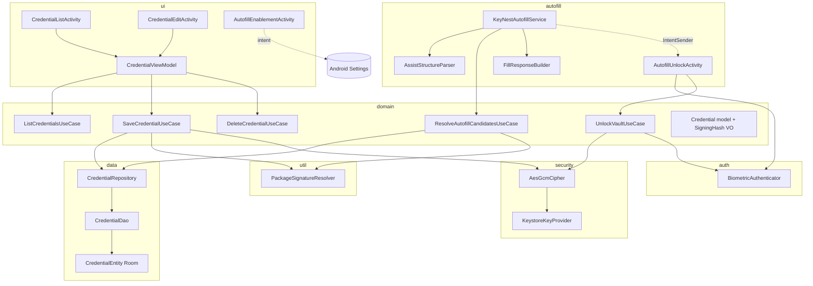

# Design Document

## Overview

**Purpose**: EasyKeyNest MVP は、Google アカウントや Google Password Manager に依存しない
パスワードマネージャ機能を業務端末利用者に提供する。アプリ内 UI から手動登録した credential を、
Android 公式 `AutofillService` 経由で対象アプリのログイン画面に候補として提示し、
ID/PW 手入力の負担を軽減する。

**Users**: Google アカウントを運用しない業務端末ユーザー、MDM Dedicated Device 利用者が、
(1) アプリ内 UI で credential を登録し、(2) 対象アプリのログイン画面で Autofill 候補を選択して
生体／端末認証後に入力する workflow で利用する。

**Impact**: 現状リポジトリは LICENSE と .gitignore のみが存在する空プロジェクトであり、
Android アプリケーション全体（Gradle 構成・Manifest・UI・データ層・AutofillService 実装）を
新規構築する。完全ローカル保存・Room + Android Keystore (AES-GCM) による暗号化・
package name + 署名 SHA-256 ハッシュ照合をアーキテクチャの中核とする。

### Goals

- Android 8.0 (API 26) 以上で動作する `AutofillService` を実装し、package name + 署名 SHA-256
  ハッシュが完全一致する credential のみを候補として提示する。
- credential の永続化に Room を採用し、password フィールドを Android Keystore で保護された
  AES-GCM 鍵により暗号化した状態で保存する。
- Autofill 候補選択時に BiometricPrompt（端末認証フォールバック付き）で Vault をアンロックし、
  認証成功後に復号済み credential を含む FillResponse を遅延返却する。
- `onFillRequest` 内でネットワーク I/O・ディスク全走査・ブロッキング暗号化を行わず、
  応答時間中央値 300ms 以内（NFR 2.1）を満たす設計とする。
- アプリ内導線から `Settings.ACTION_REQUEST_SET_AUTOFILL_SERVICE` を起動し、ユーザーに
  Autofill Service 有効化を案内する。

### Non-Goals

- Passkey 対応・Credential Manager Provider 対応（Android 14+ の将来拡張）
- Google Password Manager / クラウド / 複数端末同期
- Web サイト URL 連携 / Digital Asset Links / WebView 内フォーム高度対応
- `onSaveRequest` 自動保存提案（MVP スコープ外、人間判断により確定）
- OCR / Accessibility Service / 画面文字読取による強制入力
- パスワード生成・共有 Vault・チーム管理
- root 権限・Device Owner・MDM 管理 API 利用

## Architecture

### Existing Architecture Analysis

現リポジトリには Android アプリ実装が存在せず、`LICENSE` と `.gitignore` のみが置かれている
初期状態である。したがって既存パターンの尊重・technical debt の解消といった観点ではなく、
新規構築時点でクリーンなレイヤ分離を採用することを設計目標とする。

- **採用するクリーンアーキテクチャ的レイヤ**:
  - `ui` (Presentation): Activity / Fragment / ViewModel
  - `domain`: ユースケースと純粋ドメイン型（Android SDK 非依存）
  - `data`: Room エンティティ・DAO・Repository 実装
  - `security`: Keystore 鍵管理と AES-GCM 暗号／復号
  - `auth`: BiometricPrompt ラッパー
  - `autofill`: `AutofillService` 本体と AssistStructure 解析
  - `util`: PackageManager 経由の署名取得など共通ユーティリティ
- **依存方向**: `ui` → `domain` ← `data` / `security` / `auth` / `autofill`
  `domain` は外側に依存しない。`autofill` は `domain` と `security` を介して `data` を利用する。

### Architecture Pattern & Boundary Map



**Architecture Integration**:
- 採用パターン: クリーンアーキテクチャ風レイヤ分離 + Repository パターン + UseCase（Interactor）。
  Android Autofill Framework は `AutofillService` 起点でしか発火しないため、サービスから
  UseCase を呼び出すアプリケーション層を介して domain ロジックへアクセスする。
- ドメイン／機能境界: credential の永続化（data）、暗号化（security）、認証（auth）、
  AssistStructure 解析と FillResponse 構築（autofill）、UI 表示（ui）を分離。
  これにより `(P)` 並列実装が可能になる。
- 新規コンポーネントの根拠: `KeyNestAutofillService` は Android Framework との接合点として必須、
  `AutofillUnlockActivity` は Authentication IntentSender 受け取り先として必須、
  `PackageSignatureResolver` は SHA-256 ハッシュ計算ロジックを domain から切り離すために必須。

### Technology Stack

| Layer | Choice / Version | Role in Feature | Notes |
|-------|------------------|-----------------|-------|
| Frontend / UI | AndroidX Activity 1.9+, Fragment 1.8+, Material Components, ViewBinding | credential 登録 / 一覧 / 編集画面、Autofill 有効化導線 | Compose は採用しない（MVP 軽量化）。XML レイアウト + ViewBinding。 |
| Application | Kotlin 1.9+, Coroutines 1.8+ | UseCase 実装、非同期処理 | `Dispatchers.IO` をデータ／暗号処理に、`Dispatchers.Default` をパーサに割当。 |
| Data / Storage | Room 2.6+ (SQLite) | credential 永続化 | password は暗号化バイト列 + IV を別カラム保存。 |
| Security | Android Keystore (AES/GCM/NoPadding, 256bit), `javax.crypto.Cipher` | AES-GCM 鍵管理・暗号／復号 | 鍵は `setUserAuthenticationRequired(false)` で初期実装し、Vault アンロックはアプリ層 BiometricPrompt で実現（MVP 単純化）。 |
| Auth | AndroidX Biometric 1.2+ | BiometricPrompt + 端末認証フォールバック | `BIOMETRIC_STRONG OR DEVICE_CREDENTIAL` を要求。 |
| Autofill | `android.service.autofill.AutofillService` (API 26+) | onFillRequest 処理 | `AssistStructure` 走査は最大ノード数の guard を設ける。 |
| Build | AGP 8.5+, Gradle 8.7+, Kotlin DSL | プロジェクトビルド | minSdk 26, compileSdk/targetSdk 34。 |
| Test | JUnit 4, MockK, Robolectric (unit), AndroidX Test + Espresso (instrumented) | 単体 / 計装テスト | Room は `Room.inMemoryDatabaseBuilder` を使用。 |

## File Structure Plan

### Directory Structure

```
.
├── settings.gradle.kts                    # ルート設定（app モジュール宣言）
├── build.gradle.kts                       # ルートビルド（plugin バージョン管理）
├── gradle.properties                      # AndroidX / Kotlin JVM target
├── gradle/libs.versions.toml              # Version catalog
├── gradle/wrapper/                        # gradle wrapper
└── app/
    ├── build.gradle.kts                   # アプリモジュール（minSdk 26, targetSdk 34）
    ├── proguard-rules.pro
    └── src/
        ├── main/
        │   ├── AndroidManifest.xml        # AutofillService 宣言、permission、application
        │   ├── res/
        │   │   ├── layout/                # credential_list, credential_edit, autofill_enable, dataset_presentation
        │   │   ├── values/strings.xml
        │   │   ├── values/themes.xml
        │   │   └── xml/autofill_service_config.xml   # AutofillService metadata
        │   └── java/com/example/keynest/
        │       ├── KeyNestApp.kt          # Application class、DI 初期化
        │       ├── di/
        │       │   └── ServiceLocator.kt  # シンプル DI（Hilt 不採用：MVP軽量）
        │       ├── domain/
        │       │   ├── model/
        │       │   │   ├── Credential.kt          # ドメイン型（平文 password を保持しない不変表現）
        │       │   │   ├── PlaintextCredential.kt # 復号後の短命表現（メモリ即破棄前提）
        │       │   │   └── SigningHash.kt         # SHA-256 ハッシュ値オブジェクト
        │       │   ├── repository/
        │       │   │   └── CredentialRepository.kt # interface
        │       │   └── usecase/
        │       │       ├── SaveCredentialUseCase.kt
        │       │       ├── UpdateCredentialUseCase.kt
        │       │       ├── DeleteCredentialUseCase.kt
        │       │       ├── ListCredentialsUseCase.kt
        │       │       ├── ResolveAutofillCandidatesUseCase.kt
        │       │       └── UnlockVaultUseCase.kt
        │       ├── data/
        │       │   ├── KeyNestDatabase.kt
        │       │   ├── entity/
        │       │   │   └── CredentialEntity.kt    # Room エンティティ
        │       │   ├── dao/
        │       │   │   └── CredentialDao.kt
        │       │   └── repository/
        │       │       └── CredentialRepositoryImpl.kt
        │       ├── security/
        │       │   ├── KeystoreKeyProvider.kt     # alias "keynest_aead_v1" 管理
        │       │   ├── AesGcmCipher.kt            # encrypt / decrypt API
        │       │   └── EncryptedBlob.kt           # iv + ciphertext のシリアライズ
        │       ├── auth/
        │       │   └── BiometricAuthenticator.kt  # BiometricPrompt ラッパー
        │       ├── autofill/
        │       │   ├── KeyNestAutofillService.kt
        │       │   ├── parser/
        │       │   │   ├── AssistStructureParser.kt
        │       │   │   └── AutofillFieldHeuristics.kt
        │       │   ├── builder/
        │       │   │   ├── FillResponseBuilder.kt
        │       │   │   └── DatasetPresentationFactory.kt
        │       │   └── unlock/
        │       │       └── AutofillUnlockActivity.kt
        │       ├── ui/
        │       │   ├── list/
        │       │   │   ├── CredentialListActivity.kt
        │       │   │   ├── CredentialListAdapter.kt
        │       │   │   └── CredentialListViewModel.kt
        │       │   ├── edit/
        │       │   │   ├── CredentialEditActivity.kt
        │       │   │   ├── CredentialEditViewModel.kt
        │       │   │   └── PackagePickerBottomSheet.kt # 任意：インストール済アプリ一覧（Open Q 対応）
        │       │   └── enable/
        │       │       └── AutofillEnableActivity.kt
        │       └── util/
        │           ├── PackageSignatureResolver.kt    # PackageManager で SHA-256 取得
        │           ├── HexEncoding.kt
        │           └── SafeLogger.kt                  # password マスク保証ログラッパ
        ├── test/                          # JVM unit tests（Robolectric 含む）
        │   └── java/com/example/keynest/...
        └── androidTest/                   # 計装テスト
            └── java/com/example/keynest/...
```

### Modified Files

リポジトリ初期状態のため修正対象ファイルは無い。以下は新規追加のみ。

- `LICENSE`（既存）— 変更なし
- `.gitignore`（既存）— Android / Gradle / IDE 用エントリの追加が必要な場合はタスク T1 で対応

## Requirements Traceability

| Requirement | Summary | Components | Interfaces | Flows |
|-------------|---------|------------|------------|-------|
| 1.1 | credential 4 項目を 1 レコードとして永続化 | CredentialEditActivity, SaveCredentialUseCase, CredentialRepository, CredentialEntity | `save(input)` | Flow A |
| 1.2 | password を平文で永続化しない | SaveCredentialUseCase, AesGcmCipher, CredentialEntity | `encrypt(plaintext)` | Flow A |
| 1.3 | 不正 package name の保存中止 | CredentialEditViewModel, SaveCredentialUseCase | バリデーション | Flow A |
| 1.4 | 同一 package name に複数件許容 | CredentialDao（unique 制約なし） | `insert` | Flow A |
| 1.5 | 編集／削除を以降の Autofill に反映 | UpdateCredentialUseCase, DeleteCredentialUseCase, CredentialRepository | `update`, `delete` | Flow A |
| 2.1 | インストール済みアプリの SHA-256 を取得・保存 | PackageSignatureResolver, SaveCredentialUseCase | `resolveSha256(pkg)` | Flow A |
| 2.2 | 未インストール時はハッシュなしで保存し区別 | CredentialEntity (`signatureSha256: ByteArray?` + `signatureCapturedAt`), SaveCredentialUseCase | nullable field | Flow A |
| 2.3 | 再保存時に最新ハッシュを再取得 | UpdateCredentialUseCase, PackageSignatureResolver | re-resolve | Flow A |
| 3.1 | onFillRequest で package と credential を突合 | KeyNestAutofillService, ResolveAutofillCandidatesUseCase | `onFillRequest()` | Flow B |
| 3.2 | username/password 推定不能時に空 FillResponse | AssistStructureParser, KeyNestAutofillService | parser returns empty | Flow B |
| 3.3 | 候補を表示名付き Dataset で返す | FillResponseBuilder, DatasetPresentationFactory | `buildAuthentication(dataset)` | Flow B |
| 3.4 | 確定時に username / password を入力 | FillResponseBuilder, AutofillUnlockActivity | `Dataset.Builder.setValue` | Flow C |
| 3.5 | onFillRequest 内でネットワーク・長時間ブロッキングを行わない | KeyNestAutofillService, ResolveAutofillCandidatesUseCase | IO-bound 部分の事前ロード／キャッシュ | Flow B |
| 4.1 | 呼び出し元 package の現行 SHA-256 を取得し比較 | PackageSignatureResolver, ResolveAutofillCandidatesUseCase | `compare(stored, current)` | Flow B |
| 4.2 | 不一致 credential を候補に含めない | ResolveAutofillCandidatesUseCase | filter | Flow B |
| 4.3 | 署名未保存 credential を候補に含めない | ResolveAutofillCandidatesUseCase | filter | Flow B |
| 4.4 | 同一 package 内で一致したものだけ返す | ResolveAutofillCandidatesUseCase | per-record filter | Flow B |
| 5.1 | ロック中は Authentication Intent 付き placeholder のみ返す | KeyNestAutofillService, FillResponseBuilder | `setAuthentication(IntentSender)` | Flow B |
| 5.2 | 候補選択時 BiometricPrompt を起動 | AutofillUnlockActivity, BiometricAuthenticator | `authenticate()` | Flow C |
| 5.3 | 認証成功後に復号 credential を遅延返却 | AutofillUnlockActivity, UnlockVaultUseCase, AesGcmCipher | `setResult(EXTRA_AUTHENTICATION_RESULT)` | Flow C |
| 5.4 | 認証失敗時は credential を返さず失敗応答 | AutofillUnlockActivity | `setResult(RESULT_CANCELED)` | Flow C |
| 5.5 | 復号 credential を長時間メモリ保持しない | PlaintextCredential, AutofillUnlockActivity | `CharArray.fill('')` 等で zero-fill | Flow C |
| 6.1 | 未有効化時に案内画面を提示 | AutofillEnableActivity, AutofillManager.hasEnabledAutofillServices | check at onResume | Flow D |
| 6.2 | 設定画面へ遷移 | AutofillEnableActivity | `Settings.ACTION_REQUEST_SET_AUTOFILL_SERVICE` Intent | Flow D |
| 6.3 | 有効化済みなら必須表示しない | AutofillEnableActivity | status branching | Flow D |
| 7.1 | API 26 以上で動作 | build.gradle.kts (minSdk 26) | gradle 設定 | — |
| 7.2 | API 34 以上でも AutofillService が動作 | KeyNestAutofillService, AndroidManifest | targetSdk 34 検証 | — |
| 7.3 | Accessibility / OCR / DeviceOwner / root 非依存 | 全コンポーネント | manifest に Accessibility permission を含めない | — |
| NFR 1.1 | AES-GCM 暗号化保存 | AesGcmCipher, CredentialEntity | encrypt | Flow A |
| NFR 1.2 | 鍵は Keystore 内に保持 | KeystoreKeyProvider | `KeyStore.getInstance("AndroidKeyStore")` | — |
| NFR 1.3 | password 平文をログ・例外に出さない | SafeLogger, 全層 | exception wrapping | — |
| NFR 1.4 | ロック中 password を Autofill 応答に含めない | FillResponseBuilder | gate by lock state | Flow B |
| NFR 1.5 | ネットワーク送信なし | manifest（INTERNET 未宣言を推奨）／全層 | — | — |
| NFR 2.1 | onFillRequest 応答 300ms 中央値 | KeyNestAutofillService, ResolveAutofillCandidatesUseCase | in-memory cache | Flow B |
| NFR 2.2 | onFillRequest 内でネットワーク／全走査／ブロッキング暗号化なし | ResolveAutofillCandidatesUseCase | 暗号化処理は UnlockVaultUseCase 側 | Flow B |
| NFR 3.1 | AssistStructure 解析失敗で例外なく空応答 | AssistStructureParser, KeyNestAutofillService | try/catch + empty | Flow B |
| NFR 3.2 | credential 不在で例外なく空応答 | ResolveAutofillCandidatesUseCase | empty list | Flow B |
| NFR 4.1 | Accessibility 非依存 | — | — | — |
| NFR 4.2 | Google アカウント非前提 | — | — | — |
| NFR 4.3 | MDM / DeviceOwner / root 非前提 | — | — | — |
| NFR 5.1 | 診断ログに平文機微情報を出力しない | SafeLogger | wrapper API | — |

## Components and Interfaces

### Domain Layer

#### Credential / PlaintextCredential / SigningHash

| Field | Detail |
|-------|--------|
| Intent | credential のドメイン表現と署名ハッシュ値オブジェクト |
| Requirements | 1.1, 1.2, 1.4, 2.1, 2.2, 5.5 |

**Responsibilities & Constraints**
- `Credential`: id / packageName / username / label / signatureSha256?: ByteArray / signatureCapturedAt? の不変表現。password の平文は保持しない（暗号化バイト列のみ参照、もしくは保持しない）。
- `PlaintextCredential`: 復号後の短命表現。`password: CharArray` を保持し、`close()` で zero-fill する `AutoCloseable`。
- `SigningHash`: SHA-256 (32 bytes) の値オブジェクト。等価比較を `MessageDigest.isEqual` で行う。

**Dependencies**
- Inbound: UseCase 全般 (Critical)
- Outbound: なし
- External: なし

**Contracts**: Service [ ] / API [ ] / Event [ ] / Batch [ ] / State [x]

##### State Invariants

- `packageName` は非空かつ正規表現 `^[a-zA-Z][a-zA-Z0-9_]*(\.[a-zA-Z][a-zA-Z0-9_]*)+$` を満たす
- `signatureSha256` が null のとき `signatureCapturedAt` も null
- `PlaintextCredential.password` は使用後必ず zero-fill される

#### SaveCredentialUseCase / UpdateCredentialUseCase / DeleteCredentialUseCase / ListCredentialsUseCase

| Field | Detail |
|-------|--------|
| Intent | credential CRUD のオーケストレーション |
| Requirements | 1.1, 1.2, 1.3, 1.4, 1.5, 2.1, 2.2, 2.3 |

**Responsibilities & Constraints**
- 入力バリデーション（packageName 形式、必須項目）
- `PackageSignatureResolver` で SHA-256 を取得（未インストールなら null）
- `AesGcmCipher.encrypt(password)` で暗号化後に `CredentialRepository.save` を呼ぶ
- 例外メッセージに password を含めない

**Dependencies**
- Inbound: ViewModel 群 (Critical)
- Outbound: CredentialRepository, AesGcmCipher, PackageSignatureResolver (Critical)
- External: なし

**Contracts**: Service [x]

##### Service Interface

```kotlin
class SaveCredentialUseCase(
  private val repo: CredentialRepository,
  private val cipher: AesGcmCipher,
  private val sigResolver: PackageSignatureResolver,
) {
  suspend operator fun invoke(input: NewCredentialInput): Result<CredentialId>
}

data class NewCredentialInput(
  val packageName: String,
  val username: String,
  val password: CharArray,
  val label: String,
)
```

- Preconditions: `input.packageName` がドメイン形式、`input.password` は非空
- Postconditions: 永続化された credential は password 平文を保持しない。署名未取得時は `signatureSha256 = null`。
- Invariants: ストレージへの書き込み単位で暗号化済み

#### ResolveAutofillCandidatesUseCase

| Field | Detail |
|-------|--------|
| Intent | onFillRequest 時の候補抽出（復号は行わない） |
| Requirements | 3.1, 3.3, 3.5, 4.1, 4.2, 4.3, 4.4, NFR 2.1, NFR 2.2, NFR 3.2 |

**Responsibilities & Constraints**
- packageName で `CredentialEntity` を取得（暗号文のまま）
- 呼び出し元の現行 SHA-256 を `PackageSignatureResolver` で取得
- 署名 NULL / 不一致を除外
- 復号は行わない（NFR 2.2）。返却するのは ID / label / packageName / username のみのプロジェクション

**Dependencies**
- Inbound: KeyNestAutofillService (Critical)
- Outbound: CredentialRepository, PackageSignatureResolver (Critical)

**Contracts**: Service [x]

##### Service Interface

```kotlin
class ResolveAutofillCandidatesUseCase(
  private val repo: CredentialRepository,
  private val sigResolver: PackageSignatureResolver,
) {
  suspend operator fun invoke(callerPackage: String): List<AutofillCandidate>
}

data class AutofillCandidate(
  val id: CredentialId,
  val label: String,
  val username: String,
  val packageName: String,
)
```

- Postconditions: 戻り値の各要素は署名一致が確認済み

#### UnlockVaultUseCase

| Field | Detail |
|-------|--------|
| Intent | 認証成功後に該当 credential を復号する |
| Requirements | 5.3, 5.5, NFR 1.4 |

**Responsibilities & Constraints**
- 引数 `credentialId` で暗号文を取得し `AesGcmCipher.decrypt` を呼ぶ
- 戻り値 `PlaintextCredential` は `AutoCloseable`。呼び出し側で `use { }` 必須。

##### Service Interface

```kotlin
class UnlockVaultUseCase(
  private val repo: CredentialRepository,
  private val cipher: AesGcmCipher,
) {
  suspend operator fun invoke(id: CredentialId): Result<PlaintextCredential>
}
```

### Data Layer

#### CredentialEntity / CredentialDao / CredentialRepository(Impl)

| Field | Detail |
|-------|--------|
| Intent | Room を用いた credential 永続化 |
| Requirements | 1.1, 1.2, 1.4, 1.5, 2.1, 2.2, 2.3 |

**Responsibilities & Constraints**
- `password_ciphertext: ByteArray` と `password_iv: ByteArray` を別カラム保存（password 平文カラムは存在しない）
- `signature_sha256: ByteArray?`（nullable）と `signature_captured_at: Long?`
- Index: `package_name` に index（候補検索高速化、NFR 2.1）
- UNIQUE 制約なし（Req 1.4 で複数件許容）

**Contracts**: State [x]

##### Schema

```kotlin
@Entity(
  tableName = "credentials",
  indices = [Index(value = ["package_name"])]
)
data class CredentialEntity(
  @PrimaryKey(autoGenerate = true) val id: Long,
  @ColumnInfo(name = "package_name") val packageName: String,
  @ColumnInfo(name = "username") val username: String,
  @ColumnInfo(name = "label") val label: String,
  @ColumnInfo(name = "password_ciphertext") val passwordCiphertext: ByteArray,
  @ColumnInfo(name = "password_iv") val passwordIv: ByteArray,
  @ColumnInfo(name = "signature_sha256") val signatureSha256: ByteArray?,
  @ColumnInfo(name = "signature_captured_at") val signatureCapturedAt: Long?,
  @ColumnInfo(name = "created_at") val createdAt: Long,
  @ColumnInfo(name = "updated_at") val updatedAt: Long,
)
```

##### DAO Interface

```kotlin
@Dao
interface CredentialDao {
  @Insert suspend fun insert(entity: CredentialEntity): Long
  @Update suspend fun update(entity: CredentialEntity)
  @Delete suspend fun delete(entity: CredentialEntity)
  @Query("SELECT * FROM credentials WHERE package_name = :pkg")
  suspend fun findByPackage(pkg: String): List<CredentialEntity>
  @Query("SELECT * FROM credentials ORDER BY updated_at DESC")
  fun observeAll(): Flow<List<CredentialEntity>>
  @Query("SELECT * FROM credentials WHERE id = :id LIMIT 1")
  suspend fun findById(id: Long): CredentialEntity?
}
```

##### Repository Interface (domain)

```kotlin
interface CredentialRepository {
  suspend fun save(record: EncryptedCredentialRecord): CredentialId
  suspend fun update(record: EncryptedCredentialRecord)
  suspend fun delete(id: CredentialId)
  suspend fun findByPackage(pkg: String): List<EncryptedCredentialRecord>
  suspend fun findById(id: CredentialId): EncryptedCredentialRecord?
  fun observeAll(): Flow<List<Credential>>
}
```

### Security Layer

#### KeystoreKeyProvider / AesGcmCipher

| Field | Detail |
|-------|--------|
| Intent | Android Keystore で AES-256-GCM 鍵を生成・取得し、暗号／復号を提供 |
| Requirements | 1.2, NFR 1.1, NFR 1.2 |

**Responsibilities & Constraints**
- Key alias: `keynest_aead_v1`
- `KeyGenParameterSpec`: PURPOSE_ENCRYPT|DECRYPT、`AES`, 256bit, GCM, no padding, randomizedEncryption=true
- IV は `Cipher` 生成時の自動 IV（12byte）を取得し、暗号文と分けて永続化
- `setUserAuthenticationRequired(false)`（MVP 単純化。アンロックはアプリ層 BiometricPrompt で実現）
- 暗号化／復号はコルーチン上で IO Dispatcher 実行

**Contracts**: Service [x]

##### Service Interface

```kotlin
class AesGcmCipher(private val keyProvider: KeystoreKeyProvider) {
  fun encrypt(plaintext: ByteArray): EncryptedBlob   // returns iv + ciphertext + tag
  fun decrypt(blob: EncryptedBlob): ByteArray
}

data class EncryptedBlob(val iv: ByteArray, val ciphertext: ByteArray)
```

- Preconditions: Keystore alias が初期化済みであること（初回 `getOrCreate` で生成）
- Postconditions: 同一平文を複数回暗号化しても異なる ciphertext（randomizedEncryption）

### Auth Layer

#### BiometricAuthenticator

| Field | Detail |
|-------|--------|
| Intent | BiometricPrompt（端末認証フォールバック含む）の薄いラッパー |
| Requirements | 5.2, 5.3, 5.4 |

**Responsibilities & Constraints**
- `BiometricManager.Authenticators.BIOMETRIC_STRONG or DEVICE_CREDENTIAL` を要求
- Activity / Fragment 経由で `BiometricPrompt.authenticate(promptInfo)` を呼ぶ
- 結果を `AuthResult.Succeeded / Failed / Cancelled / Unavailable` の sealed class で返す

##### Service Interface

```kotlin
class BiometricAuthenticator(private val activity: FragmentActivity) {
  suspend fun authenticate(title: String, subtitle: String?): AuthResult
}

sealed class AuthResult {
  object Succeeded : AuthResult()
  data class Failed(val errorCode: Int, val message: String) : AuthResult()
  object Cancelled : AuthResult()
  object Unavailable : AuthResult()
}
```

### Autofill Layer

#### KeyNestAutofillService

| Field | Detail |
|-------|--------|
| Intent | `android.service.autofill.AutofillService` の実装本体 |
| Requirements | 3.1, 3.2, 3.3, 3.5, 4.1, 4.2, 4.3, 4.4, 5.1, 7.2, NFR 2.1, NFR 2.2, NFR 3.1, NFR 3.2 |

**Responsibilities & Constraints**
- `onFillRequest(request, cancellationSignal, callback)`:
  1. 直近の `AssistStructure` を取り出し、`AutofillFieldHeuristics` で username/password 候補ノードを抽出
  2. ノード抽出失敗時は `callback.onSuccess(null)`（NFR 3.1 / Req 3.2）
  3. 呼び出し元 packageName を `AssistStructure.activityComponent` または `clientState` から取得
  4. `ResolveAutofillCandidatesUseCase` を呼び、署名一致 credential を取得
  5. 0 件なら `onSuccess(null)`
  6. 1 件以上なら、各 credential に対し Authentication Intent（`AutofillUnlockActivity`）付き Dataset を生成し、`FillResponse` を構築
  7. `onSaveRequest` は **空実装**（MVP スコープ外、Req `onSaveRequest` 非実装）
- `cancellationSignal` を尊重し、キャンセル時は callback を呼ばない

##### Manifest 宣言

```xml
<service
    android:name=".autofill.KeyNestAutofillService"
    android:exported="true"
    android:permission="android.permission.BIND_AUTOFILL_SERVICE">
  <intent-filter>
    <action android:name="android.service.autofill.AutofillService"/>
  </intent-filter>
  <meta-data
      android:name="android.autofill"
      android:resource="@xml/autofill_service_config"/>
</service>
```

#### AssistStructureParser / AutofillFieldHeuristics

| Field | Detail |
|-------|--------|
| Intent | AssistStructure を走査し username / password 入力欄を推定 |
| Requirements | 3.1, 3.2, NFR 3.1 |

**Responsibilities & Constraints**
- 推定ロジック優先順位:
  1. `autofillHints` に `AUTOFILL_HINT_USERNAME` / `AUTOFILL_HINT_PASSWORD` / `AUTOFILL_HINT_EMAIL_ADDRESS` がある
  2. `inputType` が `TYPE_TEXT_VARIATION_PASSWORD` / `TYPE_TEXT_VARIATION_WEB_PASSWORD` / `TYPE_NUMBER_VARIATION_PASSWORD` → password
  3. `inputType` が `TYPE_TEXT_VARIATION_EMAIL_ADDRESS` → username
  4. `idEntry` / `hint` テキストに `user`, `email`, `id`, `account`, `pass`, `pwd` を含む（小文字一致）
- ノード走査の最大深さ・最大ノード数を guard（例: 500 ノード）
- 戻り値: `ParsedFields(usernameNode: AutofillId?, passwordNode: AutofillId?)`、両方 null も許容

#### FillResponseBuilder / DatasetPresentationFactory

| Field | Detail |
|-------|--------|
| Intent | Dataset / FillResponse の構築と認証 Intent の埋め込み |
| Requirements | 3.3, 3.4, 5.1, 5.3 |

**Responsibilities & Constraints**
- ロック中：各候補ごとに Dataset を作り、`setAuthentication(intentSender, presentation)` で `AutofillUnlockActivity` を起動するように設定
- 認証成功後の遅延返却：`AutofillUnlockActivity` 側で復号済み Dataset を `EXTRA_AUTHENTICATION_RESULT` にセット
- API 30 未満は `RemoteViews` ベース presentation、API 30+ は `Presentations` を併用

#### AutofillUnlockActivity

| Field | Detail |
|-------|--------|
| Intent | Dataset Authentication Intent の受け取り先 |
| Requirements | 5.2, 5.3, 5.4, 5.5 |

**Responsibilities & Constraints**
- `onCreate` で extra から `credentialId` と対象 `AutofillId` ペアを取得
- `BiometricAuthenticator.authenticate` を起動
- 成功時: `UnlockVaultUseCase` で復号し、Dataset を組み立て `EXTRA_AUTHENTICATION_RESULT` にセットして `setResult(RESULT_OK)`
- 失敗／キャンセル時: `setResult(RESULT_CANCELED)` → Autofill UI に失敗応答
- finish 直後に `PlaintextCredential.close()` を呼び CharArray を zero-fill（Req 5.5）

##### Manifest 宣言

```xml
<activity
    android:name=".autofill.unlock.AutofillUnlockActivity"
    android:theme="@style/Theme.KeyNest.Translucent"
    android:exported="false"
    android:excludeFromRecents="true"/>
```

### UI Layer

#### CredentialListActivity / CredentialListViewModel

| Field | Detail |
|-------|--------|
| Intent | 登録済み credential の一覧と編集／削除導線 |
| Requirements | 1.5, 6.1 |

#### CredentialEditActivity / CredentialEditViewModel / PackagePickerBottomSheet

| Field | Detail |
|-------|--------|
| Intent | credential 新規作成・編集画面、package 入力 UX |
| Requirements | 1.1, 1.3, 1.4, 1.5, 2.1, 2.2, 2.3 |

**Responsibilities & Constraints**
- package 入力は手入力テキストフィールド + 「インストール済みアプリから選択」ボタン両対応（Open Q-1 への回答）
- 「選択」を押下すると `PackagePickerBottomSheet` を表示し `PackageManager.getInstalledApplications` の結果を提示
- password 入力は `TextInputEditText` (passwordToggleEnabled)、Submit 時は `CharArray` で保持し ViewModel へ渡す

#### AutofillEnableActivity

| Field | Detail |
|-------|--------|
| Intent | Autofill Service 有効化案内 |
| Requirements | 6.1, 6.2, 6.3 |

**Responsibilities & Constraints**
- `onResume` で `AutofillManager.hasEnabledAutofillServices()` をチェックし、状態に応じて UI を出し分け
- 「有効化する」ボタンで `Intent(Settings.ACTION_REQUEST_SET_AUTOFILL_SERVICE).setData(Uri.parse("package:..."))` を起動
- 起動時アプリ初回チェックは `KeyNestApp` 起動から `CredentialListActivity` への遷移時に行う（Open Q-5 への回答：初回未有効化のときのみ自動提示、それ以降は設定画面から到達）

### Util Layer

#### PackageSignatureResolver

| Field | Detail |
|-------|--------|
| Intent | 指定 package の SHA-256 ハッシュを取得 |
| Requirements | 2.1, 2.3, 4.1 |

**Responsibilities & Constraints**
- API 28+ : `PackageManager.getPackageInfo(pkg, GET_SIGNING_CERTIFICATES)` → `SigningInfo.signingCertificateHistory` / `apkContentsSigners` を SHA-256
- API 26–27 : `getPackageInfo(pkg, GET_SIGNATURES)` → `signatures[0]` を SHA-256
- 複数署名がある場合は **全署名のソート済みハッシュリスト** を結合した SHA-256 を採用（順序非依存）
- 未インストール例外 `NameNotFoundException` → `null` を返す

##### Service Interface

```kotlin
class PackageSignatureResolver(private val pm: PackageManager) {
  fun resolveSha256(packageName: String): SigningHash?
}
```

## Data Models

### Domain Model

- アグリゲートルート: `Credential`（id + packageName + username + label + signatureSha256? + 暗号文参照）
- 値オブジェクト: `SigningHash`（32byte ByteArray, value equality）
- 短命型: `PlaintextCredential`（AutoCloseable, 復号直後の password を保持）
- リポジトリ境界: `CredentialRepository` 1 つ。トランザクションは Room の `@Transaction` を必要な場合のみ使用（複合操作は MVP では発生しない見込み）
- ドメインイベント: なし（MVP ではイベントソーシング不要）

### Logical Data Model

- `credentials` テーブル（前述 schema 参照）
- migration バージョン: 1 開始。MVP ではマイグレーションスクリプト不要。

### Physical Data Model

- SQLite (Room) 単一 DB ファイル `keynest.db`
- 暗号化はカラムレベル（password_ciphertext / password_iv）。DB ファイル自体の暗号化（SQLCipher）は採用しない（要件確定事項）

## Error Handling

### Error Strategy

- 例外は **境界（UseCase 戻り値 / AutofillService callback）** で `Result` / sealed class に変換する
- `AutofillService` 側はすべての例外をキャッチし、callback に空応答 (`onSuccess(null)`) を返す（NFR 3.1 / 3.2）
- 例外メッセージに password / 復号後 credential / 完全な署名 hex を含めない（SafeLogger でラップ）

### Error Categories and Responses

- **User Errors (4xx相当, UI 層)**:
  - packageName 形式不正 (Req 1.3) → `CredentialEditViewModel` がバリデーションエラーを `LiveData` で UI に通知
  - password 空 → 入力欄エラー表示
  - 重複 credential（同一 packageName + username）→ MVP では許容（Req 1.4）、警告のみ
- **System Errors (5xx相当)**:
  - Keystore 初期化失敗 → 起動時にエラー画面を提示、ログは `SafeLogger.error` で例外型のみ記録
  - Room 書き込み失敗 → UseCase が `Result.failure(StorageException)` を返却、UI が Snackbar で通知
  - PackageManager 例外 → `null` 扱いで継続（署名なし credential として記録）
- **Business Logic Errors**:
  - 署名照合失敗 → Autofill 候補から除外、ユーザー向け表示なし（攻撃検知ログとして件数のみ記録）
  - Vault アンロック失敗（生体認証キャンセル）→ Autofill 失敗応答、ユーザーへの追加メッセージなし

## Testing Strategy

### Unit Tests (JVM / Robolectric)

1. `SaveCredentialUseCase`: password が平文で永続化されないこと（CredentialEntity のすべての String フィールドに input password が含まれないことを assertion） — Req 1.2, NFR 1.1
2. `ResolveAutofillCandidatesUseCase`: 署名一致／不一致／NULL の混在ケースで一致 credential のみが返ること — Req 4.2, 4.3, 4.4
3. `AssistStructureParser`: autofillHints / inputType / hint テキストヒューリスティクスの各経路でフィールドが抽出されること、推定不能ケースで両方 null が返ること — Req 3.2, NFR 3.1
4. `AesGcmCipher`: 同一平文を 2 回暗号化すると異なる ciphertext、復号で元に戻ること — NFR 1.1
5. `PackageSignatureResolver`: API 28+ / 26–27 両分岐、複数署名、未インストール（NameNotFoundException）の各ケース — Req 2.1, 2.2, 2.3

### Integration Tests (Robolectric + Room in-memory)

1. credential 登録 → DB 読み出し → 復号で元の password が取得できること
2. credential 編集 → 更新時刻と署名ハッシュが更新されること（Req 1.5, 2.3）
3. `KeyNestAutofillService.onFillRequest` 模擬呼び出し: ロック中は Authentication 付き Dataset のみが返ること（復号結果を含まない）（Req 5.1, NFR 1.4）
4. ロック中の `FillResponse` バイト列に元 password 文字列が含まれないことを assertion
5. credential 削除後の `onFillRequest` で該当候補が出ないこと（Req 1.5）

### E2E / Instrumented Tests (AndroidX Test)

1. credential 一覧画面から新規作成 → 保存 → 一覧に反映（Req 1.1）
2. Autofill Service 有効化画面から `Settings.ACTION_REQUEST_SET_AUTOFILL_SERVICE` Intent が発火すること（Req 6.2）
3. テスト用 dummy アプリのログイン画面で候補が表示され、BiometricPrompt 模擬通過後に username/password が入力されること（Req 3.4, 5.3）
4. 同一 package で別署名のアプリでは候補が出ないこと（Req 4.2）— Robolectric で署名差し替えを模倣

### Performance Tests

1. credential 100 件登録状態で `onFillRequest` 〜 FillResponse 構築までを 50 回計測、中央値 300ms 以内（NFR 2.1）
2. `onFillRequest` 内で復号処理が走らないこと（プロファイラで `AesGcmCipher.decrypt` 呼び出しゼロ）（NFR 2.2）

## Security Considerations

- Android Keystore alias `keynest_aead_v1`、AES-256-GCM、`setRandomizedEncryptionRequired(true)`、IV は Cipher が自動生成（毎回ユニーク）
- 鍵は Keystore 外に書き出さない（NFR 1.2）。バックアップから除外するため `android:allowBackup="false"` を Manifest で指定
- 復号済み password は `CharArray` で扱い、利用後 `Arrays.fill(arr, '')` で zero-fill（Req 5.5）
- `SafeLogger` で password / 復号 credential / 完全署名 hex のログ出力を禁止（NFR 1.3, NFR 5.1）。BuildConfig.DEBUG 限定でも出力しない
- `android.permission.INTERNET` を AndroidManifest で **宣言しない**（NFR 1.5 を機械的に保証）
- ProGuard / R8 で domain.model package のフィールド名難読化を許容（Room エンティティは `@Keep` で保護）

## Performance & Scalability

- credential 数の想定上限は 1,000 件以内（MVP）。`findByPackage` は `package_name` インデックスにより O(log N)
- `onFillRequest` 内では DAO クエリ 1 回 + 署名取得 1 回 + メモリ上フィルタのみ
- `AssistStructureParser` はノード走査最大 500 ノードで打ち切り、深さ最大 50

## Open Questions の決定結果

要件側に残った 6 項目について、本設計で以下のとおり判断する。

| # | Open Question | 設計判断 |
|---|---------------|----------|
| OQ-1 | package name 手入力 / インストール済み一覧選択 | **両対応**。`CredentialEditActivity` に手入力テキストフィールドを設け、「インストール済みアプリから選択」ボタンで `PackagePickerBottomSheet` を表示する。未インストール package も手入力で登録可能（Req 2.2 と整合）。 |
| OQ-2 | AssistStructure 推定ロジック詳細 | `AutofillFieldHeuristics` に 4 段優先順位（autofillHints → inputType password 系 → inputType email → idEntry/hint テキスト一致）。username/password 双方が特定できる場合のみ候補返却。推定不能時は空応答（Req 3.2 / NFR 3.1）。 |
| OQ-3 | 同一 packageName 複数 credential の表示順 | `updated_at DESC` を採用。同点時は label 昇順。MVP では絞り込み UI を提供しない。 |
| OQ-4 | Vault アンロック有効期間 | **候補選択ごとに毎回認証**。MVP ではセッションキャッシュを設けない（Req 5.5 を厳格化）。将来オプションとして拡張可能な設計（`UnlockVaultUseCase` 単位で完結）。 |
| OQ-5 | Autofill Service 有効化導線 UX | アプリ初回起動かつ未有効化のときに `AutofillEnableActivity` を自動提示。それ以降は `CredentialListActivity` のオーバーフローメニュー「Autofill 設定」から到達。 |
| OQ-6 | NFR 2.1 計測手段とリリース判定 | パフォーマンステスト T9.1 で Robolectric 上の 50 回計測中央値で判定。リリース判定基準は中央値 ≤ 300ms かつ p95 ≤ 600ms。本基準を CI に組み込む。 |

## リスクと既知の限界

- **複数署名スキーム / 署名ローテーション**: Android v3 署名ローテーション環境では `signingCertificateHistory` の扱いに揺れがある。MVP では「現行 `apkContentsSigners` のソート済みハッシュ結合」で照合し、ローテーション後は credential が候補に出なくなる（ユーザー側で再保存が必要）。受容可。
- **AssistStructure 推定限界**: WebView 内フォーム、Compose の `Modifier.semantics` で autofill を未設定なケース、独自カスタム View は推定不能になり得る。空応答で graceful degrade（NFR 3.1）。
- **BiometricPrompt 不在端末**: 生体／端末認証がいずれも未設定の端末では `BiometricManager.canAuthenticate` が `ERROR_NONE_ENROLLED` を返す。Vault アンロック不能となるため、`AutofillEnableActivity` でも事前警告を出す。
- **API 26–27 の `GET_SIGNATURES`**: 署名スプーフィングへの耐性が API 28+ より弱い。本 MVP は API 28+ では `GET_SIGNING_CERTIFICATES` を優先することでリスクを軽減。
- **Vault アンロック中の memory dump**: `PlaintextCredential.password` を `CharArray` で持ち zero-fill するが、`String` を経由する Android Framework API（`AutofillValue.forText` は `CharSequence`）で短時間 GC まで残存する可能性がある。MVP では受容、将来 native memory に置換の余地あり。
- **`onSaveRequest` 未実装**: ユーザーが対象アプリで初回ログイン時、自動保存提案は出ない。アプリ内 UI で手動登録する必要がある（要件確定事項）。
