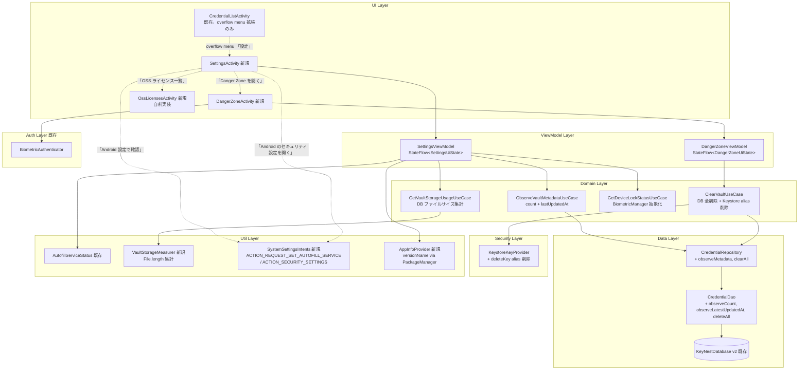
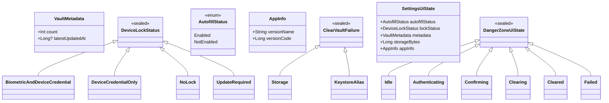
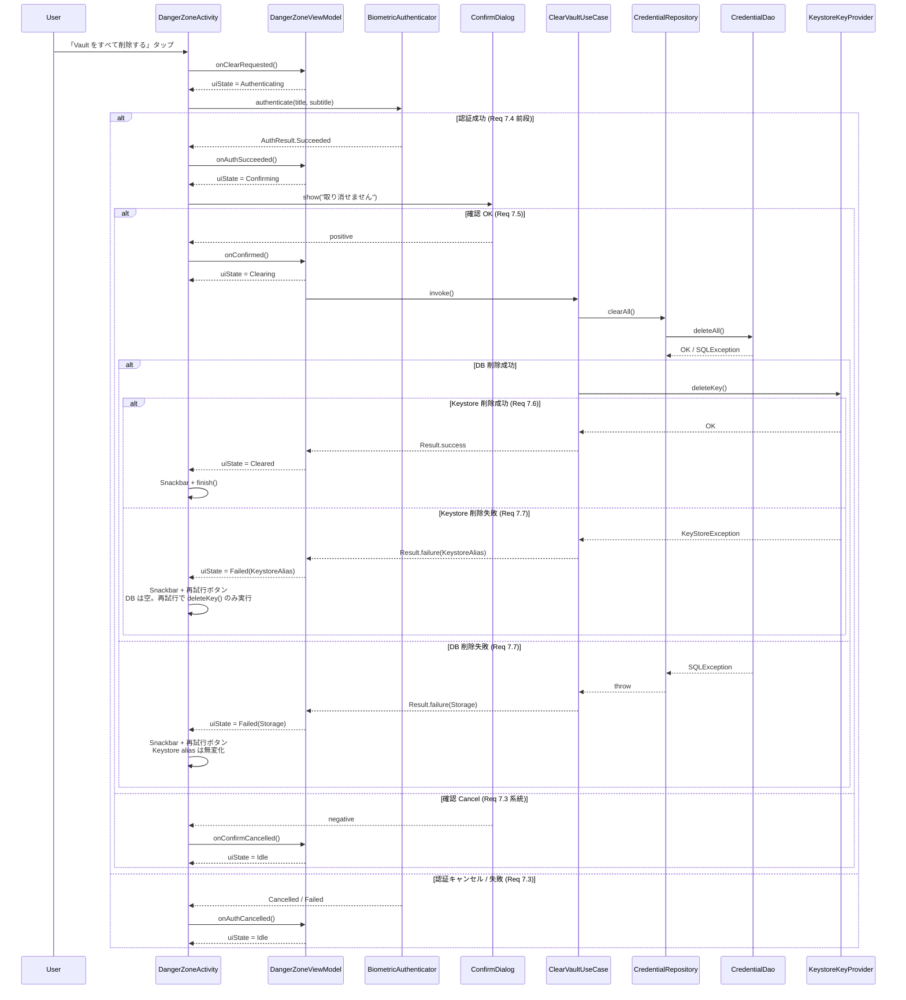

# Design Document

## Overview

**Purpose**: `CredentialListActivity` の overflow メニューから到達可能な Settings 画面を新設し、(1) Autofill サービス有効化状態の表示と Android 設定への遷移、(2) 端末ロック方式の参照表示と Android Security 設定への遷移、(3) Vault メタ情報（件数 / 直近更新時刻 / storage 使用量）、(4) アプリ情報（バージョン / OSS ライセンス）、(5) 不可逆な Vault 一括クリアを担う Danger Zone 画面への導線、をユーザに提供する。Settings 画面自体は不可逆操作を一切含まず、破壊的操作はすべて Danger Zone 画面に隔離する。

**Users**: KeyNest を業務端末で運用するユーザー（Autofill が動かない原因の自己切り分け、Vault の棚卸し、端末譲渡時の確実消去）。Settings 画面は overflow メニュー直下に 1 回タップで到達でき、参照系の操作で完結する。Danger Zone は Settings からの明示的遷移を経て、再認証 + 確認ダイアログを通過したときのみ動作する。

**Impact**: 現状の `CredentialListActivity` には overflow メニュー上の「Autofill 設定」項目（`menu_open_autofill_settings`、`AutofillEnableActivity` への遷移のみ）しか存在しない。本機能は (a) overflow メニューに「設定」項目を追加し、(b) 新規 Activity 2 つ（`SettingsActivity` / `DangerZoneActivity`）と対応 ViewModel / Repository を追加し、(c) `CredentialRepository` に Vault メタ情報の集計クエリ（件数 / 直近更新時刻）を追加し、(d) Vault 一括クリア用の DAO / use-case / Keystore alias 削除ロジックを追加する。MVP（#1）／#9 で確立した既存動線・Room schema・Autofill 経路は一切変更しない（Req 1.4 / 5.1 / 5.2）。

### Goals

- overflow → Settings → Danger Zone の 3 階層導線を新設し、Settings は参照系のみ、Danger Zone は破壊操作専用に責務を分離する（Req 1, 6）
- Autofill 状態 / ロック方式 / Vault メタ情報 / バージョン / OSS ライセンスを 1 画面で確認可能にする（Req 2, 3, 4, 5）
- Vault 一括クリアを「Danger Zone 遷移 → BiometricPrompt → 確認ダイアログ → 実行」の 3 段ゲートで保護し、再認証なしでは破壊操作を一切行わない（Req 7、NFR 1.3）
- 完全ローカル動作（Vault メタ情報の集計・OSS ライセンス一覧・一括クリアすべてネットワーク非依存）（Req 4.6, 7.8、NFR 1.1, 1.2）
- 既存 MVP / #9 の credential 登録・編集・削除・autofill 経路を一切変更しない（Req 1.4, 5.1, 5.2）

### Non-Goals

- ロック方式（生体 / PIN / パターン等）のアプリ内**変更 UI**（Req 3.2、確定事項）
- credential エクスポート / インポート / 暗号化バックアップ（Req 8、確定事項）
- アンロック保持時間の変更 UI（モックの `SettingRow label="アンロック保持時間"` は本要件で扱わない、Out of Scope）
- 署名照合の厳密性トグル（モックの `SettingRow label="署名照合の厳密性"` は MVP で常時厳密と確定済み、Out of Scope）
- Settings / Danger Zone 画面の状態（スクロール位置等）の永続化（Activity ライフサイクル内のみ、Out of Scope）
- Vault の部分クリア / カテゴリ単位クリア（全件消去のみ、Req 7.1）
- 一括クリア後の自動エクスポート・自動バックアップ（完全ローカルかつ復元手段を提供しない、Req 7.5）

## Architecture

### Existing Architecture Analysis

現リポジトリは MVP（#1）+ #9 で確立した Clean Architecture 風 3 層 + 軽量 DI（`ServiceLocator`）構成:

- **data 層**: `KeyNestDatabase`（Room v2 = `last_used_at` カラム追加済み）、`CredentialDao`（既存 `observeAll` / `observeByXxx` / `observeRecentlyUsed` / `updateLastUsedAt`）、`CredentialRepositoryImpl`
- **domain 層**: `CredentialRepository` IF（既存 7 メソッド）、use-case 群（`Save/Update/Delete/List/ResolveAutofillCandidates/UnlockVault/MarkCredentialUsed/Duplicate`）、`Credential` / `EncryptedCredentialRecord` / `SigningHash` 等のドメイン型
- **security 層**: `KeystoreKeyProvider`（alias `keynest_aead_v1`、`open` で test 差し替え可）、`AesGcmCipher`
- **auth 層**: `BiometricAuthenticator`（`BIOMETRIC_STRONG | DEVICE_CREDENTIAL` で `AuthResult.{Succeeded,Cancelled,Failed,Unavailable}` を返す sealed class）
- **autofill 層**: `KeyNestAutofillService` / `AutofillUnlockActivity` — Settings 画面からは触らない
- **ui 層**: `CredentialListActivity` / `CredentialEditActivity` / `AutofillEnableActivity` — overflow メニューは `credential_list_menu.xml`、画面間遷移は `Intent` ベース、ViewModel は `androidx.lifecycle.ViewModel + StateFlow`
- **util 層**: `AutofillServiceStatus`（既存。`AutofillManager.hasEnabledAutofillServices() OR Settings.Secure("autofill_service")` の OR 判定。Settings 画面はこの既存ヘルパを**そのまま再利用**して Req 2.2 を満たす）、`SafeLogger`（Redacted パターン）

尊重すべき制約:

- **domain は plaintext を見ない**: 一括クリアは ciphertext / iv ごと全行削除する純粋な行削除なので、復号経路を踏まない（NFR 1.2 / 1.4 と整合）
- **`fallbackToDestructiveMigration` 禁止**: 本機能で Room schema 変更は無いため migration 追加なし
- **UI は XML + RecyclerView + viewBinding**: Compose は未導入。既存 stack を維持する
- **`AutofillServiceStatus` 経由規約**: `AutofillManager.hasEnabledAutofillServices()` を直接呼ばない（cold-start race を避けるため、既存規約）
- **`SafeLogger` のみで logging**: credential の username / label / packageName / password / 署名 SHA-256 平文は log / analytics / network に出さない（NFR 1.1, 1.2）
- **`android.permission.INTERNET` を AndroidManifest で宣言しない**: 既存 NFR 1.5 を継承し、Settings / Danger Zone 経路も完全ローカルで動作する

解消・回避する technical debt:

- なし。本機能は既存資産を素直に拡張する範囲に閉じる

### Architecture Pattern & Boundary Map

採用パターン: **既存 layered (Activity → ViewModel → UseCase → Repository → DAO) を維持**しつつ、Settings 画面と Danger Zone 画面それぞれに固有の ViewModel と use-case を追加する。Vault メタ情報の集計クエリは DAO に `@Query("SELECT COUNT(*) ...")` 等で**集計値のみを返す**メソッドを追加（行を返さないので NFR 1.2 平文露出問題を回避）。



**Architecture Integration**:

- 採用パターン: 既存の **layered + use-case-per-action** をそのまま継承する。Settings は read-only な集計表示のため `combine` で複数 Flow を合成、Danger Zone は破壊操作の状態機械（Idle → Authenticating → Confirming → Clearing → Cleared / Failed）を `StateFlow` で表現する
- ドメイン／機能境界:
  - **Settings 系（read-only）と Danger Zone 系（破壊操作）の責務を Activity / ViewModel 単位で分離**（誤タップを画面分離で物理的に阻止する、Req 6.1）
  - **Vault メタ情報の集計は domain 層に閉じる**（count / max(updated_at) は `Flow` で reactive 監視する。Settings 画面表示中に他経路で件数変動があれば自動反映）
  - **storage 使用量は util 層に閉じる**（Room API ではなく `Context.getDatabasePath()` ベースの `File.length()` 集計。DAO に measure メソッドを足さない）
  - **Keystore alias 削除は security 層**（`KeystoreKeyProvider.deleteKey()` を追加。`ClearVaultUseCase` は Repository と KeyProvider の両方をオーケストレーション）
  - **BiometricPrompt は既存 `BiometricAuthenticator` をそのまま再利用**（autofill 経路と同じ実装、`AuthResult` sealed class でハンドル）
- 既存パターンの維持:
  - `ServiceLocator` への use-case 登録（lazy）
  - `Result<T, Failure>` 返却（一括クリア・複製と同パターン）
  - `SafeLogger` の使用（NFR 1.2: credential 平文を含めない、Redacted パターン）
  - XML + viewBinding + ScrollView ベース UI（Compose を導入しない）
  - `AutofillServiceStatus.isCurrentService()` を直接呼ぶ（cold-start race 回避規約継承）
- 新規コンポーネントの根拠:
  - `SettingsActivity` / `DangerZoneActivity`: Activity 単位の隔離で誤タップを構造的に阻止（Req 6.1）。Fragment 分割ではなく Activity 分割を採用する理由は (a) Danger Zone の Back / 状態保存ライフサイクルを Settings から独立させたい、(b) Fragment 内 Dialog の挙動より Activity finish の挙動の方が確実に Snackbar 表示と整合する（既存 `CredentialEditActivity` と同パターン）
  - `OssLicensesActivity`（自前実装）: モックの「OSS ライセンス一覧」項目を Play Services 非搭載端末（MDM 管理端末を想定する Req NFR 4.3 と整合）でも動作させる必要があるため、`OssLicensesMenuActivity`（`com.google.android.gms:play-services-oss-licenses`）には**依存しない**。代わりに `app/src/main/assets/oss_licenses.json` を build 時に同梱し、自前 RecyclerView で一覧表示する（生成方法は File Structure Plan 参照）
  - `VaultStorageMeasurer`: DAO に measure メソッドを足すと「クエリ実行で巨大な Cursor を流す」誤解を招く。`Context.getDatabasePath("keynest.db").length() + WAL + shm` の単純な File 操作なので util 層に置く
  - `SystemSettingsIntents`: `Intent` 生成ロジックと `resolveActivity` / `ActivityNotFoundException` ハンドリングを 1 か所に集約（Req 2.6, 3.6, 5.4 の「Intent 解決失敗時の graceful degrade」を共通化）
  - `AppInfoProvider`: `PackageManager.getPackageInfo(pkg, 0).versionName` を Context から取り出すだけのラッパー。Activity に直書きしないことでテスト容易性を確保

### Technology Stack

| Layer | Choice / Version | Role in Feature | Notes |
|-------|------------------|-----------------|-------|
| UI | Android View System + viewBinding + `ScrollView`（既存 `Theme.KeyNest`） | Settings / Danger Zone / OSS ライセンス画面 | 既存と同 stack。Compose 不採用 |
| UI components | `com.google.android.material:material` の `MaterialToolbar` / `MaterialCardView` / `MaterialAlertDialogBuilder` / `Snackbar` | AppBar の Back / セクションカード / 確認ダイアログ / 結果通知 | 既存 dep |
| State holder | `androidx.lifecycle.ViewModel` + `kotlinx.coroutines.flow.StateFlow` | Settings UI state / Danger Zone state machine | 既存 ViewModel パターン継承 |
| Domain / use case | Kotlin coroutines + `Flow.combine` / `Flow.map` | Vault メタ情報の reactive 集計、Danger Zone 状態遷移 | 既存パターン継承 |
| Data / persistence | Room 2.6.1（既存 v2 schema） | `COUNT(*)` / `MAX(updated_at)` / `DELETE FROM` クエリ追加 | schema 変更なし、migration 追加なし |
| Security | 既存 `KeystoreKeyProvider` に `deleteKey()` を追加（`KeyStore.deleteEntry(alias)`） | Vault クリア時の Keystore alias 削除 | `open` 維持で test 差し替え可能 |
| Auth | 既存 `BiometricAuthenticator` をそのまま使用 | Danger Zone 削除実行時の再認証（Req 7.2） | 変更なし |
| App info | `PackageManager.getPackageInfo(pkg, 0).versionName` | Req 5.1 |  |
| Intent dispatch | `Settings.ACTION_REQUEST_SET_AUTOFILL_SERVICE` / `Settings.ACTION_SECURITY_SETTINGS` | Req 2.4 / 3.4 | 既存 `AutofillEnableActivity` と同パターン |
| OSS licenses | 自前 JSON（`app/src/main/assets/oss_licenses.json`） | Req 5.3 の代替実装 | Play Services 非依存。生成は手動メンテで先行投入し、自動化は別 PR で検討 |
| Testing | JUnit4 + Truth + MockK + Robolectric + Espresso | unit / Robolectric / Espresso | 既存 stack 継承 |

## File Structure Plan

### New Files

```
app/src/main/java/com/example/keynest/
├── domain/
│   ├── model/
│   │   ├── VaultMetadata.kt              # data class: count: Int, latestUpdatedAt: Long?
│   │   ├── DeviceLockStatus.kt           # sealed: BiometricAndDeviceCredential / DeviceCredentialOnly / NoLock / UpdateRequired
│   │   ├── AutofillStatus.kt             # enum: Enabled / NotEnabled
│   │   ├── AppInfo.kt                    # data class: versionName: String, versionCode: Long
│   │   └── ClearVaultFailure.kt          # sealed: Storage(reason) / KeystoreAlias(reason)
│   └── usecase/
│       ├── ObserveVaultMetadataUseCase.kt  # combine(dao.observeCount(), dao.observeLatestUpdatedAt())
│       ├── GetVaultStorageUsageUseCase.kt  # VaultStorageMeasurer 経由で総バイト数を返す
│       ├── GetDeviceLockStatusUseCase.kt   # BiometricManager.canAuthenticate を 4 値に正規化
│       └── ClearVaultUseCase.kt            # repo.clearAll() → keystoreKeyProvider.deleteKey() の順、Result で返す
├── ui/
│   ├── settings/
│   │   ├── SettingsActivity.kt           # 設定画面本体（render 関数を内部 private で持つ）
│   │   ├── SettingsViewModel.kt          # uiState を combine で構築、refresh() 公開
│   │   └── SettingsUiState.kt            # data class: autofillStatus / lockStatus / metadata / storageBytes / appInfo
│   ├── danger/
│   │   ├── DangerZoneActivity.kt         # 危険操作画面（BiometricPrompt 起動・確認ダイアログ・進捗表示）
│   │   ├── DangerZoneViewModel.kt        # 状態機械 (Idle/Authenticating/Confirming/Clearing/Cleared/Failed)
│   │   └── DangerZoneUiState.kt          # sealed: 各 phase
│   └── oss/
│       ├── OssLicensesActivity.kt        # assets の JSON を読んで RecyclerView 表示
│       ├── OssLicensesAdapter.kt         # ListAdapter<OssEntry, ...>
│       └── OssEntry.kt                   # data class: name / license / url / text
└── util/
    ├── VaultStorageMeasurer.kt           # ctx.getDatabasePath("keynest.db") + -wal + -shm の File.length() 集計
    ├── SystemSettingsIntents.kt          # ACTION_REQUEST_SET_AUTOFILL_SERVICE / ACTION_SECURITY_SETTINGS の Intent 構築 + resolve
    └── AppInfoProvider.kt                # PackageManager.getPackageInfo(...).versionName ラッパ

app/src/main/res/
├── layout/
│   ├── settings_activity.xml             # AppBar + ScrollView。Autofill カード / セキュリティセクション / Vault セクション / About セクション / Danger Zone 遷移ボタン
│   ├── danger_zone_activity.xml          # AppBar + ScrollView。説明テキスト + 「Vault をすべて削除する」ボタン + 進捗 ProgressBar + 再試行ボタン
│   ├── oss_licenses_activity.xml         # AppBar + RecyclerView
│   └── oss_licenses_item.xml             # ライブラリ名 + ライセンス名 + URL（タップで `ACTION_VIEW` ※端末ブラウザに委ねる）

app/src/main/assets/
└── oss_licenses.json                     # ライブラリ名 + ライセンス名 + URL + ライセンス本文。手動メンテで先行投入し、CI で `libs.versions.toml` との差分検出は将来対応

app/src/test/java/com/example/keynest/
├── domain/usecase/
│   ├── ObserveVaultMetadataUseCaseTest.kt
│   ├── GetDeviceLockStatusUseCaseTest.kt
│   └── ClearVaultUseCaseTest.kt          # 成功 / DB 失敗 / Keystore 失敗の 3 ケース
├── ui/settings/
│   └── SettingsViewModelTest.kt          # combine で uiState 構築、Autofill 状態切替で再計算
├── ui/danger/
│   └── DangerZoneViewModelTest.kt        # 状態機械の各遷移
├── ui/oss/
│   └── OssLicensesParserTest.kt          # JSON parse のスキーマ確認
└── util/
    ├── VaultStorageMeasurerTest.kt       # tmp File に書き込んで size を確認
    ├── SystemSettingsIntentsTest.kt      # Intent action / data の組み立て
    └── AppInfoProviderTest.kt

app/src/androidTest/java/com/example/keynest/
└── ui/
    ├── settings/SettingsActivityTest.kt   # Espresso: Autofill バッジ / カード表示 / Danger Zone 遷移 / Android 設定遷移失敗時の Snackbar
    └── danger/DangerZoneActivityTest.kt   # Espresso: 削除 → BiometricPrompt → 確認 → 削除 → Snackbar → finish
```

### Modified Files

- `app/src/main/AndroidManifest.xml`
  - `SettingsActivity` / `DangerZoneActivity` / `OssLicensesActivity` の 3 つを追加（いずれも `android:exported="false"`、`parentActivityName` で Up 遷移を提供）
- `app/src/main/java/com/example/keynest/ui/list/CredentialListActivity.kt`
  - `onOptionsItemSelected` に `R.id.action_open_settings` ケースを追加し `SettingsActivity.newIntent(this)` を起動
- `app/src/main/res/menu/credential_list_menu.xml`
  - 新規 `<item android:id="@+id/action_open_settings" android:title="@string/menu_open_settings" />` を既存 Autofill メニュー項目の前に追加
- `app/src/main/java/com/example/keynest/data/dao/CredentialDao.kt`
  - 追加: `@Query("SELECT COUNT(*) FROM credentials") fun observeCount(): Flow<Int>`
  - 追加: `@Query("SELECT MAX(updated_at) FROM credentials") fun observeLatestUpdatedAt(): Flow<Long?>`
  - 追加: `@Query("DELETE FROM credentials") suspend fun deleteAll()`
- `app/src/main/java/com/example/keynest/domain/repository/CredentialRepository.kt`
  - 追加: `fun observeMetadata(): Flow<VaultMetadata>`（DAO の `observeCount` / `observeLatestUpdatedAt` を `combine` で合成）
  - 追加: `suspend fun clearAll()`（DAO の `deleteAll()` を委譲）
- `app/src/main/java/com/example/keynest/data/repository/CredentialRepositoryImpl.kt`
  - 上記 2 メソッドの実装を追加
- `app/src/test/java/com/example/keynest/domain/usecase/FakeCredentialRepository.kt`（テストヘルパ）
  - `observeMetadata` / `clearAll` を実装し、`tick` の bump を踏襲
- `app/src/test/java/com/example/keynest/data/CredentialDaoTest.kt`
  - 3 query（`observeCount` / `observeLatestUpdatedAt` / `deleteAll`）のテストを追加
- `app/src/main/java/com/example/keynest/security/KeystoreKeyProvider.kt`
  - 追加: `open fun deleteKey()`（`KeyStore.getInstance(provider).load(null); keyStore.deleteEntry(alias)`、alias 不在時は silent）
  - 追加: `open fun hasKey(): Boolean`（テスト assertion 用、`keyStore.containsAlias(alias)`）
- `app/src/main/java/com/example/keynest/di/ServiceLocator.kt`
  - 追加: `observeVaultMetadataUseCase` / `getVaultStorageUsageUseCase` / `getDeviceLockStatusUseCase` / `clearVaultUseCase` / `vaultStorageMeasurer` / `appInfoProvider` の lazy 公開
- `app/src/main/res/values/strings.xml`
  - 既存ファイルに新規文言（後述「Localizable Strings」リスト）を追加

### Untouched Files (明示)

- `KeyNestAutofillService.kt` / `AutofillUnlockActivity.kt` / `AutofillEnableActivity.kt`: 本機能では一切変更しない（Req 1.4 / 5.1 / 5.2）
- `SaveCredentialUseCase` / `UpdateCredentialUseCase` / `DeleteCredentialUseCase` / `ListCredentialsUseCase` / `ResolveAutofillCandidatesUseCase` / `UnlockVaultUseCase` / `MarkCredentialUsedUseCase` / `DuplicateCredentialUseCase`: 変更しない
- `KeyNestDatabase.kt` / `CredentialEntity.kt` / `Migration_1_2.kt`: schema 変更なし（migration 追加なし）
- `AutofillServiceStatus.kt`: 既存ロジックをそのまま再利用（Req 2.2 の判定責務を共通化済み）

### Localizable Strings（追加分）

`strings.xml` に追加する文言（NFR 4.1 / 4.2）:

| Key | 用途 |
|---|---|
| `menu_open_settings` | overflow メニュー「設定」 |
| `settings_title` | 画面タイトル |
| `settings_section_autofill_title` | セクション「Autofill サービス」 |
| `settings_autofill_badge_enabled` / `_not_enabled` | Autofill バッジ（Req 2.1） |
| `settings_autofill_open_settings_action` | 「Android 設定で確認」（Req 2.3） |
| `settings_section_security_title` | セクション「セキュリティ」 |
| `settings_lock_status_biometric_and_device` / `_device_only` / `_none` / `_update_required` | ロック方式表示の 4 値（Req 3.1） |
| `settings_lock_open_security_settings_action` | 「Android のセキュリティ設定を開く」（Req 3.3） |
| `settings_section_vault_title` | セクション「Vault」 |
| `settings_vault_count_label` | 「クレデンシャル数」（Req 4.1） |
| `settings_vault_latest_updated_label` | 「直近の更新時刻」（Req 4.2） |
| `settings_vault_latest_updated_empty` | 未登録時 placeholder「—」（Req 4.3） |
| `settings_vault_storage_label` | 「Storage 使用量」（Req 4.4） |
| `settings_section_about_title` | セクション「About」 |
| `settings_about_version_label` / `settings_about_version_format` | バージョン表示（Req 5.1） |
| `settings_about_oss_licenses_label` | 「OSS ライセンス一覧」（Req 5.2） |
| `settings_section_danger_title` | セクション「Danger Zone」 |
| `settings_danger_open_action` | Danger Zone 遷移ボタン（Req 6.2 / 6.4、警告色） |
| `settings_intent_unavailable` | Intent 解決失敗時 Snackbar（Req 2.6 / 3.6 / 5.4） |
| `danger_zone_title` | 画面タイトル |
| `danger_zone_description` | 説明文（不可逆性の明示、NFR 3.3） |
| `danger_zone_clear_action` | 「Vault をすべて削除する」ボタン |
| `danger_zone_confirm_title` / `_message` / `_positive` / `_negative` | 確認ダイアログ（Req 7.4） |
| `danger_zone_biometric_title` / `_subtitle` | BiometricPrompt 文言（Req 7.2） |
| `danger_zone_clearing` | 削除中の進捗文言 |
| `danger_zone_cleared_message` | 完了 Snackbar（Req 7.6） |
| `danger_zone_failed_message` | 失敗 Snackbar（Req 7.7） |
| `oss_licenses_title` | 画面タイトル |

## Requirements Traceability

| Req ID | Summary | Components / Files | Interfaces / Flows |
|--------|---------|---------------------|--------------------|
| 1.1 | overflow に「設定」項目 | `credential_list_menu.xml` (`action_open_settings`) | XML menu |
| 1.2 | 設定タップで Settings 画面起動 | `CredentialListActivity.onOptionsItemSelected` | `SettingsActivity.newIntent` |
| 1.3 | Settings に Back アイコン、戻るで一覧復帰 | `SettingsActivity` + `MaterialToolbar.setNavigationOnClickListener { finish() }` | AppCompat 戻る挙動 |
| 1.4 | MVP / #9 動線を変更しない | 既存 Activity / UseCase に変更を加えず、新規 Activity と DAO 追加のみで構成 | 構造的に副作用なし |
| 2.1 | Autofill 有効化状態の識別可能表示 | `SettingsViewModel.uiState.autofillStatus` + `SettingsActivity` のバッジ View | `AutofillStatus.{Enabled, NotEnabled}` を文言と色で表示 |
| 2.2 | MVP Req 6 と同じ判定ロジック | `util.AutofillServiceStatus.isCurrentService(context)` を ViewModel 起動／再描画時に呼ぶ（既存ヘルパ） | binder + `Settings.Secure` の OR |
| 2.3 | 状態表示近傍に「Android 設定で確認」 | `settings_activity.xml` の `MaterialButton` | `R.string.settings_autofill_open_settings_action` |
| 2.4 | `ACTION_REQUEST_SET_AUTOFILL_SERVICE` を起動 | `SystemSettingsIntents.openAutofillServiceChooser(activity)` | `Intent(Settings.ACTION_REQUEST_SET_AUTOFILL_SERVICE).setData(Uri.parse("package:..."))`（既存 `AutofillEnableActivity` と同パターン） |
| 2.5 | 戻るで最新状態に更新 | `SettingsActivity.onResume → viewModel.refresh()` で再 read | UiState を `Lifecycle.STARTED` で再 collect |
| 2.6 | Intent 解決失敗時に失敗提示、画面維持 | `SystemSettingsIntents.openAutofillServiceChooser` が `ActivityNotFoundException` を `Result.failure` で返し、Activity が Snackbar 表示 | `R.string.settings_intent_unavailable` |
| 3.1 | ロック方式の読み取り専用表示 | `SettingsViewModel.uiState.lockStatus` + `SettingsActivity` の表示行 | `DeviceLockStatus` sealed の 4 値（後述） |
| 3.2 | アプリ内で変更 UI を持たない | XML レイアウト上に trigger を**配置しない**（Switch / Toggle が無いことが構造的保証） | 確認テストで XML 検査 |
| 3.3 | 「Android のセキュリティ設定を開く」配置 | `settings_activity.xml` の `MaterialButton` | `R.string.settings_lock_open_security_settings_action` |
| 3.4 | `ACTION_SECURITY_SETTINGS` を起動 | `SystemSettingsIntents.openSecuritySettings(activity)` | `Intent(Settings.ACTION_SECURITY_SETTINGS)` |
| 3.5 | 戻るで最新状態に更新 | `onResume → viewModel.refresh()` | `GetDeviceLockStatusUseCase` を再呼び |
| 3.6 | Intent 解決失敗時に失敗提示、画面維持 | `SystemSettingsIntents.openSecuritySettings` が `Result.failure` で返し Snackbar 表示 | (2.6 と共通) |
| 4.1 | 件数の整数表示 | `SettingsViewModel.uiState.metadata.count` + 表示行 | `dao.observeCount(): Flow<Int>` |
| 4.2 | 直近更新時刻の読み取り可能表示（ローカル TZ） | `AdvancedDetailsFormatter.formatTimestamp(epochMillis)` を流用 | `MAX(updated_at)` の値を整形 |
| 4.3 | 0 件時の placeholder「—」 | `SettingsActivity` で `metadata.latestUpdatedAt == null` 分岐 | `R.string.settings_vault_latest_updated_empty` |
| 4.4 | 総 storage 使用量の人間可読表示 | `GetVaultStorageUsageUseCase` + `Formatter.formatShortFileSize` | `VaultStorageMeasurer` で `keynest.db + -wal + -shm` を集計 |
| 4.5 | 個別 credential を露出しない | DAO は `COUNT(*)` / `MAX(updated_at)` の集計値のみを返す（行を select しない）。Measurer は File API のみで credential 内容を扱わない | NFR 1.2 を構造的に満たす |
| 4.6 | 完全ローカル | DAO / File / PackageManager / BiometricManager のみ。Manifest に `INTERNET` 非宣言の既存 NFR を継承 | 構造的に network 経路なし |
| 5.1 | バージョン表示 | `AppInfoProvider.get().versionName` | `PackageManager.getPackageInfo(pkg, 0).versionName` |
| 5.2 | 「OSS ライセンス一覧」項目 | `settings_activity.xml` の項目 + `OssLicensesActivity.newIntent(context)` | クリックで遷移 |
| 5.3 | OSS ライセンス一覧画面起動 | `OssLicensesActivity`（**自前実装**、Play Services 非依存） | `assets/oss_licenses.json` を読み込み RecyclerView で表示 |
| 5.4 | 失敗時に失敗提示、画面維持 | `OssLicensesActivity` 内で JSON parse 失敗または起動失敗を Snackbar 表示、`Settings` 側でも `try/catch` | `R.string.settings_intent_unavailable` |
| 6.1 | Settings に破壊操作を直接配置しない | `settings_activity.xml` に「削除」ボタンを置かない（Danger Zone 遷移ボタンのみ） | 構造的保証 |
| 6.2 | Danger Zone 遷移メニュー項目 | `settings_activity.xml` の Danger Zone セクション「Vault をすべて削除する画面へ」ボタン | `DangerZoneActivity.newIntent(this)` |
| 6.3 | タップで Danger Zone Screen を起動 | `SettingsActivity` の onClick | `startActivity(DangerZoneActivity.newIntent(this))`（Open Question 「画面遷移時の追加認証」は **不要**で確定。理由は本セクション末尾の「設計判断」参照） |
| 6.4 | 視覚的に区別（警告色） | `settings_activity.xml` の Danger Zone セクションの `MaterialCardView` を `?attr/colorErrorContainer`、ボタンを `?attr/colorError` で着色、ラベルに `accessibilityHeading="true"` を付与 | NFR 3.3 と整合 |
| 7.1 | 「Vault をすべて削除する」が唯一の破壊アクション | `danger_zone_activity.xml` に他の破壊 trigger なし | 構造的保証 |
| 7.2 | BiometricPrompt を起動 | `DangerZoneActivity` 内で `BiometricAuthenticator.authenticate` を呼ぶ（既存ラッパ）。`AUTHENTICATORS = BIOMETRIC_STRONG or DEVICE_CREDENTIAL` で端末認証フォールバック | `AuthResult` sealed |
| 7.3 | キャンセル / 失敗で破壊操作なし | `DangerZoneViewModel` の状態機械が `Authenticating → Idle` に戻る | UI は元の Idle 表示 |
| 7.4 | 認証成功後に確認ダイアログ | `MaterialAlertDialogBuilder` で「取り消せません」ダイアログ表示、最終確認ボタンタップで `ClearVaultUseCase` を呼ぶ | Req 7.5 の前段ゲート |
| 7.5 | 永続化 + Keystore alias 削除 | `ClearVaultUseCase`: (1) `repo.clearAll()` → (2) `keystoreKeyProvider.deleteKey()` の順 | 処理順とアトミック性は「Data Models」セクションで詳述 |
| 7.6 | 完了通知 + 自動戻り + 空状態再描画 | `DangerZoneActivity` finish → 呼び出し元 `SettingsActivity` も finish → `CredentialListActivity` に復帰、`onResume` で uiState 再 collect → 空状態 | Activity stack 巻き戻し |
| 7.7 | 失敗時に失敗提示と再試行 | `ClearVaultFailure.{Storage, KeystoreAlias}` を `DangerZoneUiState.Failed(reason)` にマップ、再試行ボタン表示 | Snackbar + ボタン |
| 7.8 | 完全ローカル | `repo.clearAll()` / `deleteKey()` のみ。network 呼び出しなし | 構造的保証 |
| 7.9 | クリア後 Autofill 候補に返却され得ない | `KeyNestAutofillService.onFillRequest` は `ResolveAutofillCandidatesUseCase` を呼び、DAO が空 → 候補 0 件 → `onSuccess(null)`（NFR 3.2 既存挙動） | DB 行が無いので候補抽出が空になる |
| 8.1 | 「エクスポート」項目を配置しない | `settings_activity.xml` に該当 item を置かない | 構造的保証 |
| 8.2 | エクスポート文言を表示しない | `strings.xml` に「エクスポート」「暗号化バックアップ」相当文言を**追加しない** | 構造的保証 |
| 8.3 | エクスポート操作をいかなる導線からも提供しない | 共有 Intent / ファイル出力 / クリップボードコピー機能を実装しない（コード変更なし） | 構造的保証 |
| NFR 1.1 | 設定／メタ情報を外部送信しない | `INTERNET` 権限なし、analytics SDK 未導入 | 構造的保証 |
| NFR 1.2 | 平文を log / 表示・診断に出さない | `SafeLogger` のみで logging、credential 個別行は Settings 画面で touch しない（集計値と File size のみ） | (4.5 と共通) |
| NFR 1.3 | 削除実行前に再認証必須 | `DangerZoneViewModel` の状態機械が `Authenticating` を経由しないと `Clearing` に遷移しない | 状態機械の不変条件 |
| NFR 1.4 | クリア後 plaintext をプロセスに保持しない | `ClearVaultUseCase` は plaintext を一切扱わない（ciphertext 列ごと DELETE） | 構造的保証 |
| NFR 2.1 | Autofill `onFillRequest` 応答時間を阻害しない | Settings / Danger Zone は別 Activity / 別タスク。Autofill 経路を一切触らない | 構造的保証 |
| NFR 2.2 | Settings 初期描画 500ms 中央値（500 件規模） | `combine` で初回 emit を `flowOn(Dispatchers.IO)` 上で実行、`stateIn(SharingStarted.WhileSubscribed)` でキャッシュ。`VaultStorageMeasurer.size()` も `Dispatchers.IO` で実行 | 計測は performance test で確認 |
| NFR 3.1 | a11y ラベル | バッジ / ボタン / 行 / ダイアログに `contentDescription` を付与（`@string` リソース） | 文言は strings.xml で提供 |
| NFR 3.2 | 48dp タップ領域 | `MaterialButton` / `ImageButton` に `minWidth/minHeight=48dp` | layout XML で保証 |
| NFR 3.3 | Danger Zone のスクリーンリーダー識別 | 警告色 + `accessibilityHeading="true"` + 確認ダイアログのポジティブボタンを「危険」相当ラベルにする | NFR 3.1 と整合 |
| NFR 4.1 | Settings 文言をリソース化 | `strings.xml` に追加（前述リスト） | NFR 4.2 と共通 |
| NFR 4.2 | Danger Zone 文言をリソース化 | (NFR 4.1 と共通) | |
| NFR 5.1 | 既存挙動を変更しない | 既存 Activity / UseCase / DAO 関数を**呼び出すだけ**で改変しない。menu に項目 1 個追加 + DAO に集計関数 3 個追加 | 構造的に副作用なし |
| NFR 5.2 | `onFillRequest` 応答に副作用を与えない | autofill 経路は一切変更しない | (NFR 2.1 と共通) |

**設計判断（Open Questions への回答）**:

- **「総 storage 使用量」の計測対象範囲（Req 4.4）**: `Context.getDatabasePath("keynest.db")` 本体 + `-wal` + `-shm` の 3 ファイルの `File.length()` を加算する。Keystore メタデータ / SharedPreferences はそれぞれ (a) 公開 API で size を取得できない、(b) 本機能で何も保存しないため 0 バイト相当、なので除外する。`Formatter.formatShortFileSize(context, bytes)` で人間可読形式（"123 kB" 等）に整形する
- **「ロック方式」表示の具体的な記述粒度（Req 3.1）**: `DeviceLockStatus` sealed 型で **4 値**に正規化する: `BiometricAndDeviceCredential` / `DeviceCredentialOnly` / `NoLock` / `UpdateRequired`。判定は `BiometricManager.canAuthenticate(BIOMETRIC_STRONG)` と `canAuthenticate(DEVICE_CREDENTIAL)` の 2 回呼びで分岐する（`BiometricAuthenticator.availability()` の判定と整合させる）
- **Danger Zone 画面遷移時の追加認証要否（Req 6.3）**: **不要**（認証なしで遷移可）。理由: (a) 要件 7.2 で削除実行時の再認証が必須化されており、画面を開いただけでは破壊操作は不可能、(b) Req 7.4 の確認ダイアログがさらに 1 段ゲートとして機能する、(c) 画面遷移時の認証を入れると「Settings 画面から戻って入り直したら毎回認証」となり UX が悪化する。3 段ゲート（画面遷移 → BiometricPrompt → 確認ダイアログ）のうち 2 段で防御を担保する
- **OSS ライセンス一覧画面の生成手段（Req 5.3）**: **自前実装を採用**（`OssLicensesMenuActivity` は不採用）。`com.google.android.gms:play-services-oss-licenses` は Play Services 非搭載端末（MDM 管理端末を想定する NFR 4.3 と整合）で動作しないため、依存を増やさない方針。代わりに `app/src/main/assets/oss_licenses.json` に手動メンテで「ライブラリ名 / ライセンス名 / URL / ライセンス本文」を埋め込み、`OssLicensesActivity` で RecyclerView 表示する。今後 `oss-licenses-plugin` 等の自動生成 task を導入することは別 PR で検討する

## Components and Interfaces

### Domain Layer

#### `VaultMetadata` / `DeviceLockStatus` / `AutofillStatus` / `AppInfo` / `ClearVaultFailure`

| Field | Detail |
|-------|--------|
| Intent | Settings / Danger Zone の表示値および ClearVault のエラーカテゴリの型表現 |
| Requirements | 2.1, 3.1, 4.1, 4.2, 4.3, 5.1, 7.7 |

```kotlin
data class VaultMetadata(val count: Int, val latestUpdatedAt: Long?)

sealed interface DeviceLockStatus {
    data object BiometricAndDeviceCredential : DeviceLockStatus  // 生体 + PIN/パターン/パスワード
    data object DeviceCredentialOnly : DeviceLockStatus           // PIN/パターン/パスワードのみ
    data object NoLock : DeviceLockStatus                          // ロック未設定（warn 相当）
    data object UpdateRequired : DeviceLockStatus                  // BIOMETRIC_ERROR_SECURITY_UPDATE_REQUIRED 等
}

enum class AutofillStatus { Enabled, NotEnabled }

data class AppInfo(val versionName: String, val versionCode: Long)

sealed interface ClearVaultFailure {
    data class Storage(val reason: String) : ClearVaultFailure       // Room DELETE 失敗（reason は class name）
    data class KeystoreAlias(val reason: String) : ClearVaultFailure // KeyStore.deleteEntry 失敗
}
```

**Responsibilities & Constraints**
- `VaultMetadata.latestUpdatedAt` は `null` のときに UI 側で「未登録」placeholder を表示する（Req 4.3）
- `DeviceLockStatus` の選別ロジックは `GetDeviceLockStatusUseCase` 内に閉じ、UI 側は sealed の when 網羅で文言を引く（NFR 4.1）
- `ClearVaultFailure.reason` は exception class name のみ（NFR 1.2: stack trace / message を含めない、`SafeLogger.warn` の Redacted パターン継承）

#### `ObserveVaultMetadataUseCase`

```kotlin
class ObserveVaultMetadataUseCase(private val repo: CredentialRepository) {
    operator fun invoke(): Flow<VaultMetadata> = repo.observeMetadata()
}
```

| Field | Detail |
|-------|--------|
| Intent | Settings 画面の Vault セクション（件数 + 直近更新時刻）を reactive に観測 |
| Requirements | 4.1, 4.2, 4.3, 4.5, 4.6 |

**Postconditions**: `VaultMetadata.count >= 0`、`count == 0 ⇒ latestUpdatedAt == null`（DAO の `MAX(updated_at)` は空テーブルで NULL を返す）

#### `GetVaultStorageUsageUseCase`

```kotlin
class GetVaultStorageUsageUseCase(private val measurer: VaultStorageMeasurer) {
    suspend operator fun invoke(): Long  // bytes, IO Dispatcher 上で実行
}
```

| Field | Detail |
|-------|--------|
| Intent | Vault DB の総 storage 使用量を集計（人間可読化は UI 側で実施） |
| Requirements | 4.4, 4.5, 4.6 |

**Preconditions**: なし（DB ファイル未生成のときは 0 を返す）
**Postconditions**: `keynest.db + -wal + -shm` 3 ファイルの合計バイト数。それ以外のファイルは数えない

#### `GetDeviceLockStatusUseCase`

```kotlin
class GetDeviceLockStatusUseCase(private val biometricManager: BiometricManager) {
    operator fun invoke(): DeviceLockStatus
}
```

| Field | Detail |
|-------|--------|
| Intent | `BiometricManager.canAuthenticate` の戻り値を 4 値の `DeviceLockStatus` に正規化 |
| Requirements | 3.1, 3.5 |

**判定ロジック**:
- `canAuthenticate(BIOMETRIC_STRONG)` が `BIOMETRIC_SUCCESS` かつ `canAuthenticate(DEVICE_CREDENTIAL)` が `BIOMETRIC_SUCCESS` → `BiometricAndDeviceCredential`
- 生体は SUCCESS でないが `canAuthenticate(DEVICE_CREDENTIAL)` が `BIOMETRIC_SUCCESS` → `DeviceCredentialOnly`
- いずれも `BIOMETRIC_ERROR_NONE_ENROLLED` → `NoLock`
- いずれかが `BIOMETRIC_ERROR_SECURITY_UPDATE_REQUIRED` → `UpdateRequired`
- それ以外（NO_HARDWARE / HW_UNAVAILABLE 等） → `DeviceCredentialOnly` を fallback（PIN は基本的に存在する想定）

**注**: `Context.getSystemService(BiometricManager::class.java)` ではなく `BiometricManager.from(context)`（既存 `BiometricAuthenticator.availability()` と同パターン）を使う

#### `ClearVaultUseCase`

```kotlin
class ClearVaultUseCase(
    private val repo: CredentialRepository,
    private val keystoreKeyProvider: KeystoreKeyProvider,
) {
    suspend operator fun invoke(): Result<Unit>
        // 失敗 cause は ClearVaultFailure.{Storage, KeystoreAlias} に詰める
}
```

| Field | Detail |
|-------|--------|
| Intent | Vault 一括クリア: (1) Room の全行削除 → (2) Keystore alias 削除 を順次実行 |
| Requirements | 7.5, 7.7, 7.8, NFR 1.3, NFR 1.4 |

**処理順**（重要：「Data Models」セクションで詳述）:

1. `repo.clearAll()` — Room の `DELETE FROM credentials` を実行。Room のトランザクション境界内で 1 つの SQL で全行削除なのでアトミック
2. `keystoreKeyProvider.deleteKey()` — `KeyStore.getInstance("AndroidKeyStore").deleteEntry("keynest_aead_v1")`。alias 不在は silent

**失敗時の振る舞い**:

- (1) で失敗 → `Result.failure(<wrapping ClearVaultFailure.Storage(reason)>)`、Keystore alias は触らない
- (1) 成功 (2) 失敗 → `Result.failure(<wrapping ClearVaultFailure.KeystoreAlias(reason)>)`。DB は既に空。**この状態でも機能上の整合性は保たれる**（復号対象が無いので孤立した key alias は無害。次回保存時に `KeystoreKeyProvider.getOrCreateKey()` が同 alias の既存 key を返すか、test では `deleteKey` リトライが可能）

**Postconditions**: 成功時は DB 空 + alias 不在。失敗時は (1) で止まれば変更なし、(2) で止まれば DB のみ空

### Data Layer

#### `CredentialDao` (modified)

##### Service Interface (added methods)

```kotlin
@Query("SELECT COUNT(*) FROM credentials")
fun observeCount(): Flow<Int>

@Query("SELECT MAX(updated_at) FROM credentials")
fun observeLatestUpdatedAt(): Flow<Long?>

@Query("DELETE FROM credentials")
suspend fun deleteAll()
```

**Preconditions**: なし
**Postconditions**:
- `observeCount` は新規 insert / delete で reactive に再 emit
- `observeLatestUpdatedAt` は空テーブルで `null` を emit
- `deleteAll` は SQLite の `DELETE` で全行削除。`AUTOINCREMENT` 利用していないため `sqlite_sequence` には影響しない（Room の auto-generate id は `AUTOINCREMENT` 無しの ROWID）

#### `CredentialRepository` (modified)

```kotlin
interface CredentialRepository {
    // ... 既存メソッド ...
    fun observeMetadata(): Flow<VaultMetadata>
    suspend fun clearAll()
}
```

**`observeMetadata` の合成**:

```kotlin
override fun observeMetadata(): Flow<VaultMetadata> =
    combine(dao.observeCount(), dao.observeLatestUpdatedAt()) { count, latest ->
        VaultMetadata(count = count, latestUpdatedAt = latest)
    }
```

**`clearAll` の実装**: `dao.deleteAll()` を委譲するのみ。トランザクション境界は Room の `DELETE` 文 1 個で完結

### Security Layer

#### `KeystoreKeyProvider` (modified)

##### Added methods

```kotlin
open fun hasKey(): Boolean {
    val keyStore = KeyStore.getInstance(keystoreProvider).apply { load(null) }
    return keyStore.containsAlias(keyAlias)
}

open fun deleteKey() {
    val keyStore = KeyStore.getInstance(keystoreProvider).apply { load(null) }
    if (keyStore.containsAlias(keyAlias)) {
        keyStore.deleteEntry(keyAlias)
    }
    // 不在時は silent（idempotent）
}
```

**Preconditions**: `keystoreProvider` が利用可能（Android Keystore は常に利用可能、JVM unit test では Robolectric で代替）
**Postconditions**: `deleteKey` 呼び出し後 `hasKey() == false`。alias 不在時は no-op
**Failure model**: `KeyStoreException` が起きうる → 呼び出し側 (`ClearVaultUseCase`) で catch して `ClearVaultFailure.KeystoreAlias` に詰める

### UI Layer

#### `SettingsActivity` / `SettingsViewModel` / `SettingsUiState`

| Field | Detail |
|-------|--------|
| Intent | 設定画面本体（参照のみ） |
| Requirements | 1.1, 1.2, 1.3, 2.x, 3.x, 4.x, 5.x, 6.x, 8.x, NFR 3.x, NFR 4.1 |

##### Service Interface

```kotlin
data class SettingsUiState(
    val autofillStatus: AutofillStatus,
    val lockStatus: DeviceLockStatus,
    val metadata: VaultMetadata,
    val storageBytes: Long,
    val appInfo: AppInfo,
)

class SettingsViewModel(
    private val context: Context,                            // Application Context (autofill / storage 判定で必要)
    private val observeMetadata: ObserveVaultMetadataUseCase,
    private val getStorage: GetVaultStorageUsageUseCase,
    private val getLockStatus: GetDeviceLockStatusUseCase,
    private val appInfoProvider: AppInfoProvider,
) : ViewModel() {
    val uiState: StateFlow<SettingsUiState>
    fun refresh()  // onResume で呼び、Autofill / Lock / Storage を再 read
}
```

**State flow composition**:

```kotlin
// pseudo
private val refreshTick = MutableStateFlow(0)
val uiState: StateFlow<SettingsUiState> = combine(
    observeMetadata(),
    refreshTick.map { withContext(Dispatchers.IO) { getStorage() } },
    refreshTick.map { getLockStatus() },
    refreshTick.map { AutofillServiceStatus.isCurrentService(context).let { if (it) Enabled else NotEnabled } },
) { metadata, storage, lock, autofill -> SettingsUiState(autofill, lock, metadata, storage, appInfoProvider.get()) }
    .stateIn(viewModelScope, SharingStarted.WhileSubscribed(5000), initialValue = ...)

fun refresh() { refreshTick.value = refreshTick.value + 1 }
```

**Activity responsibilities**:
- `MaterialToolbar.setNavigationOnClickListener { finish() }` で Back（Req 1.3）
- `lifecycleScope.launch { repeatOnLifecycle(STARTED) { viewModel.uiState.collect { state -> bind(state) } } }`
- `onResume` で `viewModel.refresh()` を呼ぶ（Req 2.5 / 3.5）
- 「Android 設定で確認」ボタン → `SystemSettingsIntents.openAutofillServiceChooser(this).onFailure { showSnackbar(R.string.settings_intent_unavailable) }`
- 「Android のセキュリティ設定を開く」ボタン → `SystemSettingsIntents.openSecuritySettings(this).onFailure { showSnackbar(...) }`
- 「OSS ライセンス一覧」項目 → `startActivity(OssLicensesActivity.newIntent(this))`
- 「Danger Zone を開く」ボタン → `startActivity(DangerZoneActivity.newIntent(this))`（Req 6.3、認証なし）
- View ↔ UiState の bind ロジックは `SettingsActivity` 内部の private 関数群に閉じる（別ファイル切り出しはしない）

**注**: Activity / ViewModel の constructor で `Application` Context を渡すために、`SettingsViewModel.Factory(application, ...)` パターンを採用（既存 `CredentialListViewModel.Factory` と同形）

#### `DangerZoneActivity` / `DangerZoneViewModel` / `DangerZoneUiState`

| Field | Detail |
|-------|--------|
| Intent | Vault 一括クリア専用画面 |
| Requirements | 7.1, 7.2, 7.3, 7.4, 7.5, 7.6, 7.7, NFR 1.3, NFR 3.3 |

##### State machine

```kotlin
sealed interface DangerZoneUiState {
    data object Idle : DangerZoneUiState              // 初期 / 認証キャンセル後
    data object Authenticating : DangerZoneUiState    // BiometricPrompt 表示中
    data object Confirming : DangerZoneUiState        // 確認ダイアログ表示中（auth 成功後）
    data object Clearing : DangerZoneUiState          // ClearVaultUseCase 実行中
    data object Cleared : DangerZoneUiState           // 完了 → Snackbar + finish
    data class Failed(val reason: ClearVaultFailure) : DangerZoneUiState  // 失敗 → 再試行ボタン
}
```

##### Service Interface

```kotlin
class DangerZoneViewModel(
    private val clearVault: ClearVaultUseCase,
) : ViewModel() {
    val uiState: StateFlow<DangerZoneUiState>
    fun onClearRequested()           // ボタンタップ: Idle/Failed → Authenticating（BiometricPrompt は Activity 側で起動）
    fun onAuthSucceeded()             // Activity から callback: Authenticating → Confirming
    fun onAuthCancelled()             // Authenticating → Idle (Req 7.3)
    fun onConfirmed()                  // 確認ダイアログ OK: Confirming → Clearing → Cleared/Failed
    fun onConfirmCancelled()           // 確認ダイアログ Cancel: Confirming → Idle
    fun dismissFailure()               // Failed → Idle
}
```

**Activity responsibilities**:
- `viewModel.uiState.collect { state -> bind(state) }` で状態に応じた表示切り替え
- `state == Authenticating` のときに `BiometricAuthenticator(this).authenticate(...)` を起動し、結果を `onAuthSucceeded` / `onAuthCancelled` に伝える
- `state == Confirming` のときに `MaterialAlertDialogBuilder` で確認ダイアログを 1 回だけ show（既に表示中なら再 show しない）
- `state == Cleared` のときに Snackbar 表示 → `finish()`（Req 7.6 で `CredentialListActivity` まで戻る = stack 巻き戻し）
- `state == Failed` のときに Snackbar + 再試行ボタン（`onClearRequested` を再度呼び直す）（Req 7.7）

**注**: BiometricPrompt は Activity ライフサイクルに紐付くため、ViewModel から直接起動しない。`Authenticating` 状態の購読を Activity 側で処理する

#### `OssLicensesActivity` / `OssLicensesAdapter` / `OssEntry`

| Field | Detail |
|-------|--------|
| Intent | OSS ライセンス一覧を assets JSON から読んで RecyclerView 表示 |
| Requirements | 5.2, 5.3, 5.4 |

```kotlin
data class OssEntry(
    val name: String,        // ライブラリ名
    val license: String,     // ライセンス名 (e.g. "Apache 2.0")
    val url: String?,        // ライブラリのリポジトリ URL（タップで ACTION_VIEW）
    val text: String,        // ライセンス全文（折りたたみ表示）
)
```

`OssLicensesActivity`:
- `onCreate` で `assets.open("oss_licenses.json").bufferedReader().use { ... }` を `Dispatchers.IO` で読み、`org.json.JSONArray` で `List<OssEntry>` に parse
- parse 失敗 → Snackbar + `finish()`（Req 5.4 の「失敗時に画面維持」は Settings 側で受ける = Settings の onResume で何も問題なし）
- RecyclerView の item タップで全文展開（`isExpanded` フラグで accordion 動作）
- `url` がある場合は外部リンクボタン → `Intent(ACTION_VIEW, Uri.parse(url))` を try/catch `ActivityNotFoundException`

### Util Layer

#### `VaultStorageMeasurer`

```kotlin
class VaultStorageMeasurer(private val context: Context) {
    suspend fun measureBytes(): Long = withContext(Dispatchers.IO) {
        val dbFile = context.getDatabasePath(KeyNestDatabase.DB_NAME)
        val walFile = File(dbFile.parentFile, "${KeyNestDatabase.DB_NAME}-wal")
        val shmFile = File(dbFile.parentFile, "${KeyNestDatabase.DB_NAME}-shm")
        listOf(dbFile, walFile, shmFile).sumOf { if (it.exists()) it.length() else 0L }
    }
}
```

| Field | Detail |
|-------|--------|
| Intent | DB ファイルサイズ集計（credential 個別行を touch しない） |
| Requirements | 4.4, 4.5 |

#### `SystemSettingsIntents`

```kotlin
object SystemSettingsIntents {
    fun openAutofillServiceChooser(activity: Activity): Result<Unit>
    fun openSecuritySettings(activity: Activity): Result<Unit>
}
```

| Field | Detail |
|-------|--------|
| Intent | Android 設定画面への Intent 起動とエラーハンドリング集約 |
| Requirements | 2.4, 2.6, 3.4, 3.6 |

**実装方針**:
- `openAutofillServiceChooser`: `Intent(Settings.ACTION_REQUEST_SET_AUTOFILL_SERVICE).setData(Uri.parse("package:${activity.packageName}"))` を `activity.startActivity` で起動、`ActivityNotFoundException` を catch して `Result.failure` を返す（既存 `AutofillEnableActivity.launchSettings` と同パターン）
- `openSecuritySettings`: `Intent(Settings.ACTION_SECURITY_SETTINGS)` を起動、同じく `ActivityNotFoundException` を catch
- API 26 未満は両方 unavailable とする（既存 minSdk 26 なので不要だが防御的に）

#### `AppInfoProvider`

```kotlin
class AppInfoProvider(private val context: Context) {
    fun get(): AppInfo {
        val info = context.packageManager.getPackageInfo(context.packageName, 0)
        val versionCode = if (Build.VERSION.SDK_INT >= Build.VERSION_CODES.P) info.longVersionCode
                          else @Suppress("DEPRECATION") info.versionCode.toLong()
        return AppInfo(versionName = info.versionName ?: "", versionCode = versionCode)
    }
}
```

| Field | Detail |
|-------|--------|
| Intent | `versionName` / `versionCode` の取得を Activity から切り出し |
| Requirements | 5.1 |

## Data Models

### Domain Model



### Vault Clear Sequence

Vault 一括クリアの処理順とアトミック性、および各段階での失敗時の状態を以下に整理する:



**処理順の根拠**:

- **DB 削除 → Keystore alias 削除**の順を採用する理由:
  - 復号できる暗号文を「鍵が消えた後も DB に残す」状態を作らない（鍵紛失 = 復号不能の credential が DB に居続ける、UX 上 confuse する）
  - 逆順（Keystore alias → DB）にすると、alias 削除成功 + DB 削除失敗で「鍵が無いのに暗号文がある」未復号 credential が残る。この状態は次回 Save 時に `getOrCreateKey` が新 alias を作っても、過去の DB 行は復号不能のまま放置される
- **(2) Keystore 失敗時の挙動**:
  - DB は既に空なので「クリア機能の目的（端末譲渡時の確実消去）」は達成済み
  - 孤立した key alias は無害（復号対象が無いので）
  - 再試行ボタンで `deleteKey()` のみ再実行する設計を選択（UseCase 側で「DB 空 + alias 残存」状態を検出して deleteKey のみ実行する分岐を入れるか、単純に毎回 (1)(2) 両方実行するかは実装判断。後者でも `dao.deleteAll()` は空テーブルに対して no-op なので安全）

### Logical / Physical Data Model

本機能で Room schema 変更は無い（既存 v2 をそのまま利用）。本機能で扱う「データ」は以下:

- **読み取り**: `COUNT(*)` / `MAX(updated_at)` / DB ファイルサイズ — credential の中身（label / username / packageName / password / 署名）には一切触れない
- **削除**: `DELETE FROM credentials` で全行 + Keystore alias `keynest_aead_v1`
- **assets**: `app/src/main/assets/oss_licenses.json` — build 時 APK に同梱、読み取り専用

## Error Handling

### Error Strategy

- 例外は **境界（UseCase 戻り値 / Activity event）** で `Result` / sealed class に変換する（既存規約継承）
- `SafeLogger` のみで logging。credential 平文を含むメッセージは出力しない（NFR 1.2）
- Intent 解決失敗、JSON parse 失敗、DB 削除失敗、Keystore 削除失敗の 4 シナリオを Snackbar で graceful degrade

### Error Categories and Responses

- **User Errors (4xx 相当)**:
  - 該当なし（Settings 画面は読み取り専用、Danger Zone は破壊操作のみ）
- **System Errors (5xx 相当)**:
  - **Intent 解決失敗** (`ActivityNotFoundException`、Req 2.6 / 3.6 / 5.4): Snackbar 表示、画面維持
  - **OSS JSON parse 失敗** (Req 5.4): Snackbar 表示後、`OssLicensesActivity` を `finish()`。Settings 画面の表示状態は維持される（Req 5.4 と整合）
  - **DB 削除失敗** (Req 7.7): `ClearVaultFailure.Storage(reason)` → `DangerZoneUiState.Failed` → Snackbar + 再試行ボタン
  - **Keystore 削除失敗** (Req 7.7): `ClearVaultFailure.KeystoreAlias(reason)` → `DangerZoneUiState.Failed` → Snackbar + 再試行ボタン（DB は既に空）
- **Business Logic Errors (422 相当)**:
  - **認証キャンセル / 失敗** (Req 7.3): `AuthResult.{Cancelled, Failed, Unavailable}` → `DangerZoneUiState.Idle` に戻す、Snackbar なし（ユーザの能動的キャンセル）
  - **確認ダイアログ Cancel**: `DangerZoneUiState.Idle` に戻す、Snackbar なし

### Failure Mode Matrix (Vault Clear)

| Phase | 失敗状況 | UI 状態 | DB 状態 | Keystore 状態 | 再試行可否 |
|---|---|---|---|---|---|
| Authenticating | ユーザキャンセル | Idle | 不変 | 不変 | 可（ボタン再タップ） |
| Authenticating | 認証失敗 | Idle | 不変 | 不変 | 可 |
| Confirming | ダイアログ Cancel | Idle | 不変 | 不変 | 可 |
| Clearing | `deleteAll()` 失敗 | Failed(Storage) | 不変 | 不変 | 可（再認証から） |
| Clearing | `deleteKey()` 失敗 | Failed(KeystoreAlias) | **空** | 既存 | 可（DB 空のまま deleteKey のみリトライで OK） |

## Testing Strategy

### Unit Tests (JVM / Robolectric)

1. `ObserveVaultMetadataUseCaseTest`: Fake repo で 0 件 / 3 件 / 直近更新時刻あり/なしのケースで正しく `VaultMetadata` を emit すること
2. `GetDeviceLockStatusUseCaseTest`: MockK で `BiometricManager.canAuthenticate` をスタブし、4 値（BiometricAndDeviceCredential / DeviceCredentialOnly / NoLock / UpdateRequired）への分岐を全て確認
3. `ClearVaultUseCaseTest`: (a) 成功ケース（DB 削除成功 + Keystore 削除成功）、(b) DB 削除失敗ケース（Storage Failure を返し Keystore は呼ばれない）、(c) Keystore 削除失敗ケース（KeystoreAlias Failure を返す、DB は既に空）の 3 ケース
4. `SettingsViewModelTest`: combine で uiState 構築、`refresh()` で Autofill / Lock / Storage の 3 ソースが再 read されること、metadata 変動で uiState が再 emit されること
5. `DangerZoneViewModelTest`: 状態機械の各遷移（Idle → Authenticating → Confirming → Clearing → Cleared / Failed、Cancel 経路で Idle 復帰）

### Integration Tests (Robolectric + Room in-memory)

1. `CredentialDaoTest`（既存に追加）: `observeCount` が insert / delete に応じて再 emit、`observeLatestUpdatedAt` が空テーブルで null、`deleteAll` で全行消えて `observeCount` が 0 emit
2. `VaultStorageMeasurerTest`: tmp ディレクトリに `keynest.db` / `-wal` / `-shm` の dummy file を作り、`measureBytes` が合計サイズを返す。ファイル不在時は 0
3. `SystemSettingsIntentsTest`: Robolectric の `ShadowApplication.setNextStartedActivity` 等で起動先 Intent action / data を確認、`ActivityNotFoundException` 発生時に `Result.failure` を返す
4. `AppInfoProviderTest`: Robolectric の `ApplicationProvider.getApplicationContext` で `versionName` を読み、test 用の値（`gradle.kts` の `versionName = "0.1.0"`）と一致

### E2E / UI Tests (Espresso)

1. **Settings 画面起動**: `CredentialListActivity` の overflow menu「設定」タップで `SettingsActivity` が表示されること（Req 1.1 / 1.2）
2. **Back 戻り**: Toolbar の Back アイコンタップで `CredentialListActivity` に復帰（Req 1.3）
3. **Autofill バッジ表示**: Autofill 未有効化状態で「未設定」バッジ、有効化状態（test では `AutofillServiceStatus` を stub）で「有効」バッジ表示（Req 2.1）
4. **Android 設定遷移失敗**: `SystemSettingsIntents` を test double で常に `Result.failure` にして、Snackbar が表示されること（Req 2.6 / 3.6）
5. **Danger Zone 遷移**: Settings の Danger Zone ボタンタップで `DangerZoneActivity` が表示（Req 6.3）
6. **Vault クリア完全フロー** (`DangerZoneActivityTest`):
   - 「Vault をすべて削除する」タップ → BiometricPrompt 表示（test では `BiometricAuthenticator` を test double）→ 認証成功 → 確認ダイアログ → OK → `ClearVaultUseCase` 実行（test double で OK）→ 完了 Snackbar → Activity finish
   - 認証キャンセルで Idle に戻り、削除されていないことを DAO で確認（Req 7.3）
   - DB クリア後の `observeCount` が 0、すなわち削除後の `CredentialListActivity` が空状態（Req 7.6）

### Performance Tests

1. `SettingsViewModelPerformanceTest`: 500 件 fixture を Fake repo に流し、`uiState` の初回 emit までの所要時間を計測（NFR 2.2: JVM 上 50ms 以内 = 実機 500ms 中央値の代替指標）

## Security Considerations

- **再認証ゲート（Req 7.2、NFR 1.3）**: Vault クリア実行前に必ず `BiometricAuthenticator.authenticate(BIOMETRIC_STRONG | DEVICE_CREDENTIAL)` を通過させる。test double 以外で迂回経路を作らない
- **Keystore alias 削除**: `keynest_aead_v1` を `KeyStore.deleteEntry()` で削除する。alias 削除は user_authentication 不要（key spec で `setUserAuthenticationRequired(false)` を指定しているため）
- **平文露出禁止**: Settings / Danger Zone は credential 個別行を一切 select しない。集計値（count / max(updated_at) / file size）と Keystore alias 操作のみ。`SafeLogger` 経由のログにも credential 平文を含めない（NFR 1.2）
- **`android.permission.INTERNET` 未宣言**: 既存 MVP NFR 1.5 を継承。OSS ライセンス JSON は assets 同梱のためネットワーク不要
- **OSS ライセンス画面の URL タップ**: `Intent(ACTION_VIEW, Uri)` を起動する経路は端末ブラウザに委ねるため、KeyNest 側でネットワーク I/O は発生しない。URL の悪意がないかは手動メンテで担保

## Performance & Scalability

- **Vault メタ情報の reactive 集計**: `Flow.combine` で `observeCount` / `observeLatestUpdatedAt` を合成。Room が SQLite の trigger / invalidation を発火する都度再 emit するため、Settings 画面表示中の他経路（autofill 経路の `markUsed` 等）からの DB 変動も自動反映される（実装コスト 0、Settings の能動的 polling 不要）
- **初期描画 500ms 中央値（NFR 2.2）**: 500 件規模で `COUNT(*) / MAX(updated_at) / File.length()` は SQLite / ファイルシステム上 1ms オーダー、`Dispatchers.IO` 上で実行するため UI スレッド阻害なし。`SharingStarted.WhileSubscribed(5000)` で view 再生成時にキャッシュを 5 秒保持
- **Autofill `onFillRequest` への影響なし（NFR 2.1 / 5.2）**: Settings / Danger Zone は別 Activity / 別画面表示。`onFillRequest` は触れないため、MVP の 300ms 中央値挙動は影響を受けない

## Migration Strategy

本機能で Room schema 変更なし、データ移行なし。新規 Activity / DAO 関数の追加のみのため、既存ユーザは KeyNest を update した瞬間から overflow メニューに「設定」が追加され、Settings 画面が空ではない値（既存 credential の集計）で初期描画される。

OSS ライセンス JSON（`assets/oss_licenses.json`）の初期コンテンツは Issue #10 実装 PR で手動投入する。将来的に `oss-licenses-plugin` 等で自動生成する場合は別 PR で対応。
