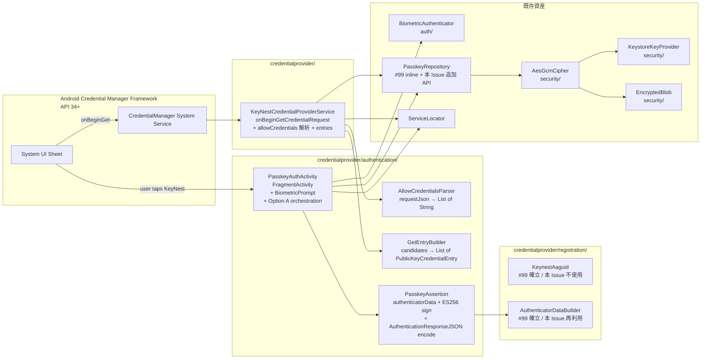
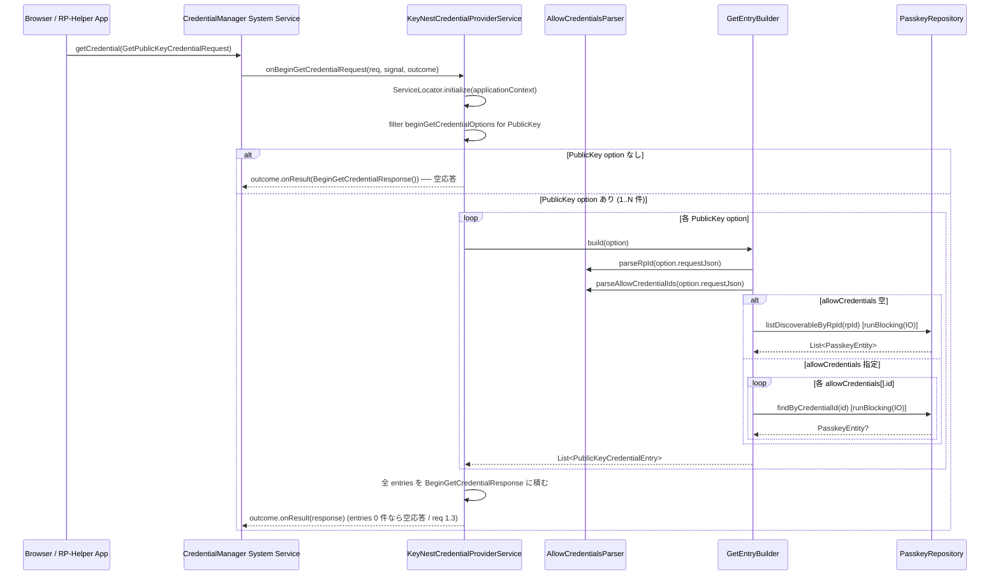
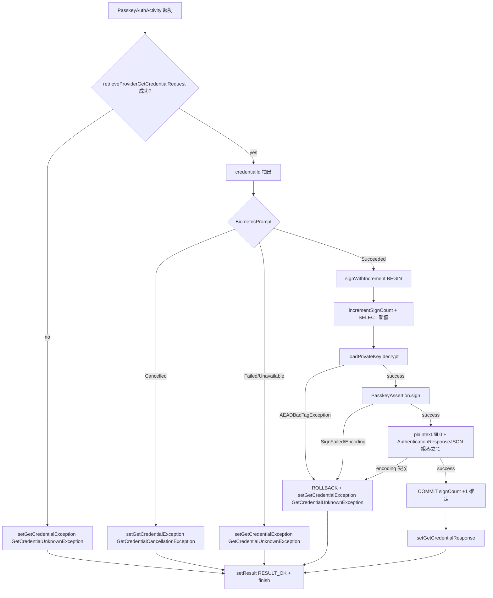

# Design Document — Issue #100 / feat(passkey): 認証セレモニー (onBeginGetCredentialRequest) 実装

> 関連: `requirements.md`（本ディレクトリ）
>
> 関連 Issue:
> - **Parent (umbrella)**: #89 (Android Credential Manager 経由の PassKey プロバイダ対応)
> - **依存 (Phase 1〜2, merged)**:
>   - #90 `CredentialProviderService` の Manifest 登録と最小骨組み (本 Issue が差し替える `onBeginGetCredentialRequest` の空応答スケルトンを提供)
>   - #91 Room migration + `PasskeyEntity` / `PasskeyDao` (本 Issue が `findByCredentialId` / `listDiscoverableByRpId` / `incrementSignCount` を呼ぶ)
>   - #99 登録セレモニー (`onBeginCreateCredentialRequest` 実装 / `PasskeyCreator` / `PasskeyCreateActivity` / `KeynestAaguid` / Repository alias `keynest_passkey_<credentialId>` を確立済)
> - **後続予定**: 一覧 UI (#89 分割案 5) / 個別管理 (#89 分割案 6) / 設定画面 (#89 分割案 7) / README / Privacy docs (#89 分割案 8)
> - **carve-out**: caBLE / Hybrid transport / WebAuthn extensions / attestation 検証 (umbrella #89 Out of Scope)

## 1. 概要 / 全体像

### Purpose

#90 / #99 のあとも空応答スタブのまま残っている `KeyNestCredentialProviderService.onBeginGetCredentialRequest` を本実装に置き換え、WebAuthn `navigator.credentials.get()` 由来の `BeginGetCredentialRequest` から PassKey 候補を抽出し、`PublicKeyCredentialEntry` を OS Credential Manager UI に提示し、ユーザー選択後に新規 `PasskeyAuthActivity` で BiometricPrompt + ES256 署名 + signCount Option A 更新を行い、`AuthenticationResponseJSON` を OS に返却するところまでを 1 PR の到達点とする。

### Aim 3-4 行で

- `credentialprovider/authentication/` package を新設し、登録側 `credentialprovider/registration/` (#99) と並列に置く。`PasskeyAssertion` (pure-Kotlin / `authenticatorData` 組み立て + ES256 署名 + AuthenticationResponseJSON 組み立て) と `PasskeyAuthActivity` (BiometricPrompt 起動 + signCount Option A orchestration + PendingIntent 応答) を分離して unit-test 可能にする。
- `KeyNestCredentialProviderService.onBeginGetCredentialRequest` 本体は **重い処理を行わず**、`allowCredentials` 解析 + `findByCredentialId` / `listDiscoverableByRpId` の候補抽出 + `PublicKeyCredentialEntry` 構築 + `outcome.onResult(...)` だけを行う (NFR 5.1)。
- signCount は **Option A** (署名前インクリメント + 失敗時ロールバック / #100 人間確定) で運用。Repository に `signWithIncrement(credentialId, signer)` 高階関数 API を追加し、`incrementSignCount` → `signer` 呼出 → 失敗時自動ロールバックを Room transaction 境界で原子化する (未解決事項 2 案 C を採用)。
- 既存 `auth/BiometricAuthenticator` / `security/AesGcmCipher` / `security/KeystoreKeyProvider` / `security/EncryptedBlob` は **#99 と同じ呼び出しパターンで再利用** し、新規ヘルパは作らない。

### アーキテクチャ図



## 2. モジュール構成 / package 配置

### 2.1 配置方針

`credentialprovider/authentication/` を新規追加し、#99 の `credentialprovider/registration/` と並列に置く。`KeyNestCredentialProviderService` 本体は `credentialprovider/` 直下に置いたまま (#90 で確定)、本 Issue では `onBeginGetCredentialRequest` メソッド本体だけを差し替える。

| Component | Path | Status |
|-----------|------|--------|
| `AllowCredentialsParser` | `app/src/main/java/.../credentialprovider/authentication/AllowCredentialsParser.kt` | 新規 |
| `GetEntryBuilder` | `app/src/main/java/.../credentialprovider/authentication/GetEntryBuilder.kt` | 新規 |
| `PasskeyAssertion` | `app/src/main/java/.../credentialprovider/authentication/PasskeyAssertion.kt` | 新規 |
| `PasskeyAssertionInput` / `PasskeyAssertionResult` (internal DTO) | `app/src/main/java/.../credentialprovider/authentication/PasskeyAssertionTypes.kt` | 新規 |
| `PasskeyAuthActivity` | `app/src/main/java/.../credentialprovider/authentication/PasskeyAuthActivity.kt` | 新規 (`AppCompatActivity` 派生 — #99 と同様) |
| `KeyNestCredentialProviderService` | `app/src/main/java/.../credentialprovider/KeyNestCredentialProviderService.kt` | 既存・`onBeginGetCredentialRequest` 差し替えのみ |
| `AndroidManifest.xml` | `app/src/main/AndroidManifest.xml` | 既存・`<activity>` 1 件追加 (`<service>` / `PasskeyCreateActivity` 不変) |
| `ServiceLocator.kt` | `app/src/main/java/.../di/ServiceLocator.kt` | 既存・`passkeyAssertion` / `getEntryBuilder` / `allowCredentialsParser` lazy singleton 追記 |
| `PasskeyRepository` (interface) | `app/src/main/java/.../domain/repository/PasskeyRepository.kt` | 既存・**3 メソッド追加** (`listDiscoverableByRpId` / `loadPrivateKey` / `signWithIncrement`) |
| `PasskeyRepositoryImpl` | `app/src/main/java/.../data/repository/PasskeyRepositoryImpl.kt` | 既存・**3 メソッド実装追加** + Room transaction wiring |

### 2.2 後続 Issue との分離点

| 後続 Issue (#89 分割案) | 本 Issue で確定する不変条件 | 後続 Issue で追加 / 変更するもの |
|-----------------------|-------------------------|--------------------------------|
| 5: 一覧 UI / 6: 個別管理 UI | 本 Service / Activity の動作は UI 側から不可視。`PasskeyRepository.listDiscoverableByRpId` / `loadPrivateKey` / `signWithIncrement` の追加は backward compatible | `CredentialListActivity` の PassKey 表示 / rename / 削除 UI |
| 7: 設定画面 | `<activity>` / `<service>` 配置は本 Issue で確定 | OS 設定への導線 |
| 8: README / docs | 本 Issue は docs 更新しない | README / Privacy / Support 更新 |
| caBLE / extensions / attestation 検証 | `clientExtensionResults = {}` (空) / `BS = BE = 0` / `authenticatorData` に extension data なし (req 決定 2 継承) | 別 Issue |

### 2.3 既存 `credentialprovider/` package 内資産との関係

- `KeyNestCredentialProviderService` (#90 / #99): メソッド本体差し替え対象 (`onBeginGetCredentialRequest` のみ)。`onBeginCreateCredentialRequest` (#99 で実装済) / `onClearCredentialStateRequest` (#90 stub) は **本 Issue では一切触らない**。
- `res/xml/credential_provider.xml` (#90): `TYPE_PUBLIC_KEY_CREDENTIAL` 既宣言済みのため触らない。
- `credentialprovider/registration/AuthenticatorDataBuilder` (#99): assertion 用 `authenticatorData` でも `rpIdHash` / `flags` / `signCount` 部分のレイアウト/コードが完全に共通なので **再利用** する (§4.4)。
- `credentialprovider/registration/KeynestAaguid` (#99): assertion セレモニーでは `attestedCredentialData` を含めない (AT=0) ため **本 Issue では参照しない**。

## 3. データモデル / 状態

### 3.1 OS framework 由来の型 (androidx.credentials)

| 型 | 役割 | 出所 |
|----|------|------|
| `BeginGetCredentialRequest` | OS から受け取る取得要求の上位型 (複数の `credentialOptions` を持つ) | `androidx.credentials.provider.BeginGetCredentialRequest` |
| `BeginGetPublicKeyCredentialOption` | publicKey 用 option。`requestJson` (`PublicKeyCredentialRequestOptionsJSON` 文字列) と `clientDataHash` (rp が `setOrigin` ありの場合 OS が事前計算) を持つ | 同 sub-class |
| `BeginGetPasswordOption` | password 用 option。**本 Issue では無視** (空応答, req 1.5) | 同 sub-class |
| `PublicKeyCredentialEntry` | OS Credential Manager UI に「KeyNest 内の PassKey で署名」候補として表示される行。`username` / `displayName` / `pendingIntent` / `beginGetPublicKeyCredentialOption` を持つ | `androidx.credentials.provider.PublicKeyCredentialEntry` |
| `BeginGetCredentialResponse` | OS に返す候補レスポンス。`Builder().addCredentialEntry(...).build()` で複数 entry | `androidx.credentials.provider.BeginGetCredentialResponse` |
| `ProviderGetCredentialRequest` | `PasskeyAuthActivity` が `PendingIntentHandler.retrieveProviderGetCredentialRequest(intent)` で取り出す本体要求 (option list + callingAppInfo) | `androidx.credentials.provider.ProviderGetCredentialRequest` |
| `GetCredentialResponse` | OS に返却するレスポンス。`PublicKeyCredential(authenticationResponseJson)` でラップ | `androidx.credentials.GetCredentialResponse` |
| `PublicKeyCredential` | `androidx.credentials.PublicKeyCredential(authenticationResponseJson)` | 同 package |
| `PendingIntentHandler` | `setGetCredentialResponse` / `setGetCredentialException` を `resultIntent` に詰める helper | `androidx.credentials.provider.PendingIntentHandler` |
| `GetCredentialException` | 認証セレモニー失敗を OS に返す例外 sealed 上位型 | `androidx.credentials.exceptions.GetCredentialException` |
| `NoCredentialException` | 候補 0 件返却用 — 本 Issue では `BeginGetCredentialResponse.Builder().build()` の空応答経路で表現するため **送出しない** (§9.1) | `androidx.credentials.exceptions.NoCredentialException` |
| `GetCredentialCancellationException` | ユーザーキャンセル | `androidx.credentials.exceptions.GetCredentialCancellationException` |
| `GetCredentialUnknownException` | 復号 / 署名失敗等の汎用フォールバック | `androidx.credentials.exceptions.GetCredentialUnknownException` |

### 3.2 本 Issue 新規 domain 型

```kotlin
// credentialprovider/authentication/PasskeyAssertionTypes.kt
internal data class PasskeyAssertionInput(
    val rpId: String,
    val clientDataJson: String,             // RP / OS が組み立てた JSON (KeyNest は parse しない)
    val signCount: Long,                    // incrementSignCount で得た新値
    val privateKeyPkcs8: ByteArray,         // 復号後の平文 PKCS#8。呼び出し側が wipe 責務
)

internal data class PasskeyAssertionResult(
    val authenticatorData: ByteArray,       // 37 byte (rpIdHash 32 + flags 1 + signCount 4)
    val signature: ByteArray,               // ASN.1 DER の ES256 署名
)
```

- いずれも `internal` で本 Issue 範囲外には公開しない。
- `PasskeyAssertion.sign(...)` の戻り値として組み立て、`PasskeyAuthActivity` が `AuthenticationResponseJSON` への encode と OS 返却を担う。

### 3.3 PasskeyAssertion 内部定数

```kotlin
internal object PasskeyAssertion {
    /** UP(0x01) | UV(0x04). AT/ED/BE/BS = 0. 決定 1 / 決定 2. */
    internal const val FLAGS_UP_UV: Byte = 0x05

    /** rpIdHash(32) + flags(1) + signCount(4). 決定 2 (extensions なし). */
    internal const val AUTHENTICATOR_DATA_LENGTH: Int = 37

    /** ES256 = ECDSA-P256-SHA256, JCE 名称. */
    internal const val SIGNATURE_ALGORITHM: String = "SHA256withECDSA"

    /** PKCS#8 から ECPrivateKey 復元時の鍵アルゴ名. */
    internal const val EC_KEY_ALGORITHM: String = "EC"
}
```

`FLAGS_UP_UV` / `AUTHENTICATOR_DATA_LENGTH` は `PasskeyAssertionTest` から `@VisibleForTesting` 参照する。

### 3.4 状態保持 (Activity / Service)

- `KeyNestCredentialProviderService` は引き続き stateless (#90 / #99 と同じ)。`onBeginGetCredentialRequest` が呼ばれるたびに Repository に候補抽出を依頼するだけ。
- `PasskeyAuthActivity` は `lifecycleScope` 内で `BiometricAuthenticator` / `PasskeyRepository` / `PasskeyAssertion` を呼ぶが、自身は process kill 耐性を持たない。Option A ロールバックは Repository の `signWithIncrement(credentialId, signer)` 高階関数 API に閉じ込めるため、Activity が `onDestroy` した場合でも DB transaction 境界で必ず rollback される (§5.3 / §6)。

## 4. 公開 IF / シグネチャ

### 4.1 `KeyNestCredentialProviderService.onBeginGetCredentialRequest` 差し替え後

```kotlin
@RequiresApi(Build.VERSION_CODES.UPSIDE_DOWN_CAKE)
override fun onBeginGetCredentialRequest(
    request: BeginGetCredentialRequest,
    cancellationSignal: CancellationSignal,
    callback: OutcomeReceiver<BeginGetCredentialResponse, GetCredentialException>,
) {
    // (a) Defensive ServiceLocator init (#99 と同パターン)
    ServiceLocator.initialize(applicationContext)

    // (b) PublicKey option を抽出。password / 他 type は本 Issue では無視 (req 1.5)
    val publicKeyOptions: List<BeginGetPublicKeyCredentialOption> =
        request.beginGetCredentialOptions.filterIsInstance<BeginGetPublicKeyCredentialOption>()
    if (publicKeyOptions.isEmpty()) {
        callback.onResult(BeginGetCredentialResponse.Builder().build())
        return
    }

    // (c) 各 option について候補を抽出して PublicKeyCredentialEntry を組み立て
    val entries: List<PublicKeyCredentialEntry> = publicKeyOptions.flatMap { option ->
        ServiceLocator.getEntryBuilder.build(option)   // Repository を blocking で呼ぶ (NFR 5.1 / §4.5)
    }

    // (d) 候補 0 件 → 空応答 (req 1.3、OS シートに KeyNest を出さない)
    val responseBuilder = BeginGetCredentialResponse.Builder()
    entries.forEach(responseBuilder::addCredentialEntry)
    callback.onResult(responseBuilder.build())
}
```

#### 4.1.1 `getEntryBuilder` の取得

- `ServiceLocator.getEntryBuilder` から都度取得する。本 Service は `lateinit` field を持たない (#90 / #99 と同じ流儀)。
- Service callback 内で Room point lookup (`findByCredentialId` × N) / `listDiscoverableByRpId(rpId)` を `runBlocking(Dispatchers.IO)` で同期実行する (§4.5 / NFR 5.1 / #99 同方針)。N は通常 0〜数件で ms オーダー。

### 4.2 `PasskeyAssertion` (authenticatorData + ES256 sign)

```kotlin
// credentialprovider/authentication/PasskeyAssertion.kt
internal object PasskeyAssertion {

    /**
     * WebAuthn Level 2 §6.1 / §6.3.3 に従う `authenticatorData` と ES256 署名を組み立てる。
     *
     * 入力契約:
     *  - [input.privateKeyPkcs8] は呼び出し側 (`PasskeyAuthActivity`) が wipe 責務を負う。
     *    本関数は内部で `KeyFactory.generatePrivate(PKCS8EncodedKeySpec(...))` 経由で
     *    `ECPrivateKey` を復元するが、`ECPrivateKey` インスタンス自体は GC 任せ。
     *  - [input.signCount] は `PasskeyRepository.signWithIncrement` で得た **新値**。
     *
     * 出力契約:
     *  - `authenticatorData` = `rpIdHash(32) || flags(1=0x05) || signCount(4 big-endian)`.
     *    全長 37 byte 固定 (決定 1 / 決定 2).
     *  - `signature` = `Signature.getInstance("SHA256withECDSA").sign()` の戻り値 (ASN.1 DER).
     *    署名対象は `authenticatorData || SHA-256(clientDataJSON)` (WebAuthn §6.3.3 step 23).
     *
     * @throws PasskeyAssertionException.Encoding rpIdHash / signCount encoding 失敗時
     * @throws PasskeyAssertionException.SignFailed ES256 署名失敗時
     */
    fun sign(input: PasskeyAssertionInput): PasskeyAssertionResult
}

internal sealed class PasskeyAssertionException(message: String, cause: Throwable?) :
    Exception(message, cause) {
    class Encoding(cause: Throwable) :
        PasskeyAssertionException("authenticatorData encoding failed", cause)
    class SignFailed(cause: Throwable) :
        PasskeyAssertionException("ES256 signature failed", cause)
}
```

実装メモ:
- `authenticatorData` は #99 で確立した `AuthenticatorDataBuilder.build(rpIdHash, flags, signCount, attestedCredentialData = null, extensions = null)` を **再利用** する (`flags = 0x05` を渡し、`attestedCredentialData = null` で AT ビットを抜く)。これにより encoding の bytewise が #99 と同一 helper で保証され、`AuthenticatorDataTest` (#99) の `build_withoutAttestedCredentialData_omitsItAndAtFlag` で既に検証済の経路を踏む。
- `signCount` は Long(>= 0) を 4 byte big-endian に変換 (上位 4 byte は WebAuthn 仕様で 0 固定。`signCount.toInt()` で安全変換 — `Long.toInt()` の overflow 検知は別途 `require(signCount in 0..UInt.MAX_VALUE.toLong())`)。
- `ECPrivateKey` 復元: `KeyFactory.getInstance("EC").generatePrivate(PKCS8EncodedKeySpec(input.privateKeyPkcs8))`。これは登録 (#99) で `KeyPairGenerator.getInstance("EC")` (JCE default = AndroidOpenSSL) が出力した PKCS#8 と対称 (#99 design §6.5 と整合)。
- 署名: `Signature.getInstance("SHA256withECDSA").apply { initSign(priv); update(authenticatorData); update(clientDataHash); }.sign()`。JCE 標準で ASN.1 DER 形式が返る (req 3.5 / WebAuthn §6.3.3 step 23)。
- `clientDataHash` = `MessageDigest.getInstance("SHA-256").digest(clientDataJson.toByteArray(UTF_8))`。

### 4.3 `AllowCredentialsParser`

```kotlin
// credentialprovider/authentication/AllowCredentialsParser.kt
internal object AllowCredentialsParser {

    /**
     * `PublicKeyCredentialRequestOptionsJSON.allowCredentials[].id` (base64url 文字列)
     * の list を返す。JSON parse 失敗 / `allowCredentials` 不在 / 空配列のいずれも
     * **空 list** を返す (defensive、req 未解決事項 3 確定)。
     *
     * @param requestJson `BeginGetPublicKeyCredentialOption.requestJson` の中身
     */
    fun parseAllowCredentialIds(requestJson: String): List<String>

    /** `PublicKeyCredentialRequestOptionsJSON.rpId` を返す。欠落時は `IllegalArgumentException`. */
    fun parseRpId(requestJson: String): String
}
```

実装メモ:
- `kotlinx.serialization.json.Json` (#99 / #100 既存依存) で parse。`Json { ignoreUnknownKeys = true; isLenient = true }`。
- #99 `KeyNestCredentialProviderService.extractExcludeCredentialIds` と対の責務。コードベース上の重複を避けるため `AllowCredentialsParser` に集約し、`extractExcludeCredentialIds` も将来 `AllowCredentialsParser.parseExcludeCredentialIds` へ寄せる選択肢があるが、**本 Issue では #99 既存コードに触らない** ことを優先する (NFR 2.4)。

### 4.4 `GetEntryBuilder`

```kotlin
// credentialprovider/authentication/GetEntryBuilder.kt
@RequiresApi(Build.VERSION_CODES.UPSIDE_DOWN_CAKE)
internal class GetEntryBuilder(
    private val context: Context,
    private val repository: PasskeyRepository,
    private val secureRandom: SecureRandom = SecureRandom(),
) {

    /**
     * 1 つの [BeginGetPublicKeyCredentialOption] に対して 0..N 件の
     * [PublicKeyCredentialEntry] を返す。`allowCredentials` 指定時は
     * `findByCredentialId(id)` の戻り値 non-null のみ、空 / 省略時は
     * `listDiscoverableByRpId(rpId)` の全件を entry 化する (req 1.1 / 1.2)。
     *
     * Service callback 内で呼ばれる前提のため `runBlocking(Dispatchers.IO)` で
     * 同期実行する (§4.5 / NFR 5.1)。
     */
    fun build(option: BeginGetPublicKeyCredentialOption): List<PublicKeyCredentialEntry>
}
```

実装メモ:
- `rpId` 抽出: `AllowCredentialsParser.parseRpId(option.requestJson)` で取得。
- `allowCredentials` 抽出: `AllowCredentialsParser.parseAllowCredentialIds(option.requestJson)`。
- 分岐:
  - 空 → `runBlocking(IO) { repository.listDiscoverableByRpId(rpId) }` で `PasskeyEntity` 列を取得。
  - 非空 → 各 id について `runBlocking(IO) { repository.findByCredentialId(id) }` を loop で呼び、戻り値 non-null かつ `rpId` が一致するもののみ採用 (rpId 不一致は防御的に除外)。
- 各 `PasskeyEntity` → `PublicKeyCredentialEntry` 変換:
  - `accountName` = `entity.userDisplayName ?: entity.userName ?: entity.rpId` (req 1.6 / 未解決事項 4 確定)
  - `displayName` = `entity.rpDisplayName ?: entity.rpId`
  - `pendingIntent` = `PasskeyAuthActivity.pendingIntent(context, credentialId)` — 各 entry につき per-credentialId のユニーク token を入れる (`PendingIntent.FLAG_IMMUTABLE or FLAG_UPDATE_CURRENT`、#99 `CreateEntryBuilder` と同パターン)
  - `beginGetPublicKeyCredentialOption` = 引数 `option` をそのまま渡す (OS framework が後段で `PendingIntentHandler.retrieveProviderGetCredentialRequest(intent)` 経由で復元するために必要)
- credentialId は `PasskeyAuthActivity` の Intent data Uri (`keynest://passkey/auth/<credentialId>`) に乗せる (§4.7 同様)。

### 4.5 Repository 公開 IF への変更 (本 Issue 追加分)

#### 4.5.1 `PasskeyRepository` interface 追加メソッド (3 本)

```kotlin
// domain/repository/PasskeyRepository.kt (本 Issue で追記)
interface PasskeyRepository {
    // ... 既存 (save / findByCredentialId / findByRpIdAndUserHandle / delete) ...

    /**
     * Discoverable PassKey の一覧を rpId で抽出する (usernameless login 経路 / req 1.1).
     * 並び順は DAO の `listDiscoverableByRpId` の契約 (lastUsedAt DESC nulls last, createdAt DESC) に従う.
     */
    suspend fun listDiscoverableByRpId(rpId: String): List<PasskeyEntity>

    /**
     * `(privateKeyIv, encryptedPrivateKey)` を `keynest_passkey_<credentialId>` alias の
     * `KeystoreKeyProvider` + `AesGcmCipher` で AES-GCM 復号して **平文 PKCS#8** byte 配列を返す.
     *
     * 呼び出し側 (`PasskeyAuthActivity`) は使用直後に `ByteArray.fill(0)` で wipe する責務を負う (NFR 1.1).
     *
     * @throws IllegalStateException 該当 credentialId が存在しない場合
     * @throws javax.crypto.AEADBadTagException ciphertext / IV の改竄を GCM auth tag が検出した場合
     */
    suspend fun loadPrivateKey(credentialId: String): ByteArray

    /**
     * Option A (req 決定 3) を **Repository 内で原子化** するための高階関数 API.
     *
     * フロー:
     *  1. Room transaction を開始する.
     *  2. DAO の `incrementSignCount(credentialId, nowMillis())` を呼んで signCount を +1.
     *  3. 新 signCount を SELECT で取得し [signer] に渡す.
     *  4. [signer] が assertion bytes を返したら transaction を commit してそれを返す.
     *  5. [signer] が throw したら transaction を rollback して例外を伝播する (signCount は元値に戻る).
     *
     * 失敗時ロールバックを呼び出し側で書き忘れるリスクをなくすため、本 Issue requirements 推奨の
     * 案 C (高階関数 API) を採用する (req 未解決事項 2 / design §6.1).
     *
     * @param signer 新 signCount を受け取って assertion bytes (`authenticatorData || signature`
     *               など任意の戻り値) を生成するブロック.
     * @return [signer] の戻り値. 例外時は [signer] が投げた例外をそのまま伝播.
     */
    suspend fun <T> signWithIncrement(
        credentialId: String,
        signer: suspend (newSignCount: Long) -> T,
    ): T
}
```

#### 4.5.2 `PasskeyRepositoryImpl` 実装メモ

- `listDiscoverableByRpId(rpId)` = `dao.listDiscoverableByRpId(rpId)` をそのまま委譲。
- `loadPrivateKey(credentialId)`:

  ```kotlin
  override suspend fun loadPrivateKey(credentialId: String): ByteArray {
      val entity = dao.findByCredentialId(credentialId)
          ?: error("PasskeyEntity not found for credentialId=$credentialId")
      val alias = aliasFor(credentialId)
      val cipher = cipherFactory(keyProviderFactory(alias))
      val blob = EncryptedBlob(iv = entity.privateKeyIv, ciphertext = entity.encryptedPrivateKey)
      return cipher.decrypt(blob)   // 平文 PKCS#8. 呼び出し側 wipe 責務.
  }
  ```

- `signWithIncrement(credentialId, signer)`:

  ```kotlin
  override suspend fun <T> signWithIncrement(
      credentialId: String,
      signer: suspend (newSignCount: Long) -> T,
  ): T {
      // KeyNestDatabase は Room の RoomDatabase. withTransaction を使う.
      // database 参照を Repository に注入する (T-02 で ServiceLocator 経由の wiring 変更).
      return database.withTransaction {
          val now = nowMillisProvider()
          dao.incrementSignCount(credentialId, now)
          val newSignCount = dao.findByCredentialId(credentialId)?.signCount
              ?: error("PasskeyEntity disappeared mid-transaction: credentialId=$credentialId")
          signer(newSignCount)
          // withTransaction は signer が throw した場合に自動 rollback してくれる
          // (= incrementSignCount も undo される).
      }
  }
  ```

  Room の `withTransaction` (`androidx.room:room-ktx`) は suspend lambda 内で例外が伝播すると **自動 rollback** する。`incrementSignCount` UPDATE と続く SELECT を同 transaction で原子化することで、`signer` が throw した時に DB 上の signCount が元値に戻る (req 決定 3 / R3.4)。

- Repository 実装に **`KeyNestDatabase` (RoomDatabase) 参照** を持たせる必要がある。現実装は `PasskeyDao` のみ受け取る形なので、本 Issue で **constructor 引数に `database: KeyNestDatabase` を追加** する (backward compatible — 既存 ServiceLocator 配線を 1 行追記、§4.6)。

#### 4.5.3 `PasskeyRepositoryImpl` constructor 拡張 (本 Issue 確定)

```kotlin
class PasskeyRepositoryImpl(
    private val dao: PasskeyDao,
    private val database: KeyNestDatabase,                         // 本 Issue で追加
    private val keyProviderFactory: (String) -> KeystoreKeyProvider = { ... },
    private val cipherFactory: (KeystoreKeyProvider) -> AesGcmCipher = { ... },
    private val keyStoreLoader: () -> KeyStore = { ... },
    private val nowMillisProvider: () -> Long = { System.currentTimeMillis() },  // 本 Issue で追加
) : PasskeyRepository { ... }
```

ServiceLocator 側:

```kotlin
val passkeyRepository: PasskeyRepository by lazy {
    PasskeyRepositoryImpl(database.passkeyDao(), database)
}
```

既存 `PasskeyRepositoryTest` (#99 で導入) は default arg のみ採用しているため backward compatible (NFR 2.3、ただし test 側で in-memory `KeyNestDatabase` を渡せる test seam が必要なので test fixture を 1 行追記する)。

### 4.6 `PasskeyAuthActivity`

```kotlin
@RequiresApi(Build.VERSION_CODES.UPSIDE_DOWN_CAKE)
class PasskeyAuthActivity : AppCompatActivity() {

    override fun onCreate(savedInstanceState: Bundle?) { ... }

    companion object {
        internal const val INTENT_DATA_SCHEME = "keynest"
        internal const val INTENT_DATA_AUTHORITY = "passkey"
        internal const val INTENT_DATA_PATH_PREFIX = "/auth/"

        /**
         * pending intent 用の Intent を組み立てる. credentialId を data Uri に乗せて
         * `PasskeyAuthActivity.onCreate` が後段で復元できるようにする (#99 と同パターン).
         */
        @VisibleForTesting
        internal fun intent(context: Context, credentialId: String): Intent

        /** [GetEntryBuilder] から呼ばれる pendingIntent factory. */
        @VisibleForTesting
        internal fun pendingIntent(context: Context, credentialId: String): PendingIntent
    }
}
```

実装メモ (§5.2 / §9.3 を参照):
- `onCreate` で `ServiceLocator.initialize(applicationContext)` defensively (#99 と同パターン)。
- `PendingIntentHandler.retrieveProviderGetCredentialRequest(intent)` で OS 要求 (`ProviderGetCredentialRequest`) を取得 / null なら `GetCredentialUnknownException`。
- credentialId は Intent data Uri (`keynest://passkey/auth/<credentialId>`) から抽出 (path suffix を `decode` するだけ)。
- 確認画面は **#99 と異なり省略可** とする。理由: OS Credential Manager UI 側で「KeyNest で署名しますか?」相当の UI が既に表示済 + ユーザーが entry をタップしている時点で意図は明確なので、本 Issue では **BiometricPrompt を直接起動** する (一覧 UI / 個別管理 Issue 範囲外)。layout xml は追加せず、Activity 自体は透過テーマ (`Theme.KeyNest.Translucent`) のみで表示する。

### 4.7 Intent extras 規約

`PasskeyAuthActivity` は外部から直接起動されない (`exported=false`)。`PublicKeyCredentialEntry.pendingIntent` 経由でのみ起動される。OS framework が provider get request を `PendingIntentHandler.retrieveProviderGetCredentialRequest(intent)` で取り出す API を提供するため独自 extras は基本不要。ただし credentialId 識別のため Intent data Uri (`keynest://passkey/auth/<credentialId>`) を乗せる (`PendingIntent.FLAG_UPDATE_CURRENT` で同一性破り)。

### 4.8 ServiceLocator への追加

```kotlin
// di/ServiceLocator.kt に追加 (#99 既存 passkeyCreator 等の隣)
@get:RequiresApi(Build.VERSION_CODES.UPSIDE_DOWN_CAKE)
@delegate:SuppressLint("NewApi")
internal val getEntryBuilder: GetEntryBuilder by lazy {
    GetEntryBuilder(requireAppContext(), passkeyRepository)
}

// PasskeyAssertion は object なので Service Locator は経由しない. PasskeyAuthActivity から直接参照.
```

`AllowCredentialsParser` も `object` なので Service Locator 配線不要。

## 5. 処理フロー

### 5.1 OS → Service onBeginGetCredentialRequest



### 5.2 ユーザー選択 → PasskeyAuthActivity → assertion 返却

```mermaid
sequenceDiagram
    actor User
    participant OS as OS Credential Manager UI
    participant ACT as PasskeyAuthActivity
    participant PIH as PendingIntentHandler
    participant BIO as BiometricAuthenticator
    participant Repo as PasskeyRepository
    participant DB as Room (passkeys)
    participant Cipher as AesGcmCipher (alias=keynest_passkey_X)
    participant ASS as PasskeyAssertion

    User->>OS: タップ PublicKeyCredentialEntry (KeyNest)
    OS->>ACT: entry.pendingIntent.send()
    ACT->>PIH: retrieveProviderGetCredentialRequest(intent)
    PIH-->>ACT: ProviderGetCredentialRequest (option list + callingAppInfo)
    ACT->>ACT: Intent data Uri から credentialId を抽出

    ACT->>BIO: authenticate(title, subtitle)
    alt AuthResult.Succeeded
        BIO-->>ACT: Succeeded
        ACT->>Repo: signWithIncrement(credentialId) { newSignCount -> ... }
        Repo->>DB: BEGIN TRANSACTION
        Repo->>DB: UPDATE passkeys SET signCount = signCount + 1, lastUsedAt = now
        Repo->>DB: SELECT signCount WHERE credentialId = X
        DB-->>Repo: newSignCount
        Repo->>ACT: signer(newSignCount) を呼ぶ
        ACT->>Repo: loadPrivateKey(credentialId)
        Repo->>Cipher: decrypt(EncryptedBlob(iv, ct))
        Cipher-->>Repo: plaintextPkcs8
        Repo-->>ACT: plaintextPkcs8
        ACT->>ASS: sign(PasskeyAssertionInput(rpId, clientDataJson, newSignCount, plaintextPkcs8))
        ASS->>ASS: authenticatorData = AuthenticatorDataBuilder.build(...)
        ASS->>ASS: clientDataHash = SHA-256(clientDataJson)
        ASS->>ASS: signature = Signature.sign(authenticatorData || clientDataHash)
        ASS-->>ACT: PasskeyAssertionResult(authenticatorData, signature)
        ACT->>ACT: plaintextPkcs8.fill(0)   ← NFR 1.1 wipe
        ACT->>ACT: AuthenticationResponseJSON を組み立て
        Note over ACT,Repo: signer block 成功 → transaction commit (signCount +1 確定)
        Repo-->>ACT: signer の戻り値
        ACT->>PIH: setGetCredentialResponse(resultIntent, GetCredentialResponse(PublicKeyCredential(authResponseJson)))
        ACT->>OS: setResult(RESULT_OK, resultIntent); finish()
    else AuthResult.Cancelled
        ACT->>PIH: setGetCredentialException(resultIntent, GetCredentialCancellationException)
        ACT->>OS: setResult(RESULT_OK, resultIntent); finish()
        Note over ACT,Repo: signWithIncrement 未呼出 → DB 不変
    else AuthResult.Failed / Unavailable
        ACT->>PIH: setGetCredentialException(resultIntent, GetCredentialUnknownException)
        ACT->>OS: setResult(RESULT_OK, resultIntent); finish()
        Note over ACT,Repo: 同上
    end
    OS-->>User: ログイン完了 / エラー
```

### 5.3 例外パスと Option A ロールバック



#### 5.3.1 Activity 異常終了 (onDestroy / process kill) の扱い

- BiometricPrompt 表示中に Activity が `onDestroy` した場合、`suspendCancellableCoroutine` の `invokeOnCancellation` で `prompt.cancelAuthentication()` が走る (既存 `BiometricAuthenticator` 実装)。`signWithIncrement` には到達しないので **DB は不変**。
- `signWithIncrement` block 内で Activity が `onDestroy` した場合、`lifecycleScope` の cancellation で `signer` block が `CancellationException` を throw、`withTransaction` が rollback する。DB / Keystore 上の signCount は元値に戻る (req 3.4 / 決定 3)。
- `setResult` も `setGetCredentialResponse` も発火しなかった場合、OS framework が pending intent タイムアウトを管理する (Android Credential Manager の運用方針 / #99 §5.3.1 と同方針)。

#### 5.3.2 平文 private key の wipe 責務

- `Repo.loadPrivateKey(...)` 戻り値の `ByteArray` 平文は **`PasskeyAuthActivity` が `try { ... } finally { wipeQueue.forEach { it.fill(0) }; ... }` で wipe する** (NFR 1.1)。
- `PasskeyAssertion` 内では `ECPrivateKey` を `KeyFactory.generatePrivate` で復元するが、`PKCS8EncodedKeySpec` は **内部で defensive copy しない可能性** がある (JCE provider 依存)。安全側に倒すため、`PasskeyAssertion.sign` の呼び出し前に `wipeQueue` に登録 → 呼び出し直後ではなく `finally` で wipe を実行する (`PasskeyAssertion` 戻り値 build 中の例外でも確実に wipe される)。

## 6. Repository / Room トランザクション戦略

### 6.1 Option A の実装方針 (高階関数 API = 案 C 採用)

req 未解決事項 2 の 3 案のうち、**案 C (`signWithIncrement(credentialId, signer)`)** を本 design で確定する。

判断根拠:
- 失敗時ロールバックを呼び出し側で書き忘れるリスクをなくす (req 未解決事項 2 推奨理由と一致)。
- `withTransaction { ... }` で suspend lambda が例外を throw した場合に自動 rollback する Room ktx の標準パターンに乗る。これは `incrementSignCount` (UPDATE) と `findByCredentialId` (SELECT) を 1 transaction にまとめる以上、副作用境界として最も自然。
- 呼び出し側 (`PasskeyAuthActivity`) のフローが「block 内で復号 → 署名 → encoding → wipe → 戻り値」と一つの suspend block に閉じる。block が `Throwable` を投げると DB rollback、戻り値が完成すれば commit。

不採用バージョン (記録):
- **案 A (`setSignCount(credentialId, value)` で絶対値書き戻し)**: 呼び出し側で旧値の保持 + try/catch + rollback 呼び出しを書く必要があり、ロールバック忘れの retention が高い。
- **案 B (`decrementSignCount(credentialId, expectedValue)` = compare-and-swap)**: 並行 transaction との競合検知ができるが、本 Issue 範囲では同一 credentialId に対する並行 assertion 経路は想定しない (`PasskeyAuthActivity` は OS から 1 リクエスト = 1 Activity)。CAS の付加価値が低い。

### 6.2 `signWithIncrement` の suspend / dispatcher 契約

- `withTransaction` は `RoomDatabase.invoke` 経由で内部的に `Dispatchers.IO` 相当の executor に切り替える (Room ktx の `withTransaction` 実装)。呼び出し側 (`PasskeyAuthActivity.lifecycleScope.launch { ... }`) は `Dispatchers.Main` 起点で良い (UI thread blocking 回避は Room ktx が責任)。
- `signer` lambda 内の `loadPrivateKey(credentialId)` も同 transaction context で suspend するため、復号 + 署名処理を同一 IO スレッド上で実行できる。

### 6.3 `loadPrivateKey` の transaction 外実行を許容するか

本 Issue では **`signWithIncrement` block 内で `loadPrivateKey` を呼ぶ** ことを推奨する (§5.2 シーケンス図)。理由:
- `loadPrivateKey` 失敗 (`AEADBadTagException` 等) で signCount をロールバックすべきという req 3.4 要件を満たすため、`loadPrivateKey` を transaction 外に置くと rollback 経路が分断される。
- ただし `loadPrivateKey` は Room transaction を必要としない (`findByCredentialId` SELECT 1 回 + 暗号 decrypt のみ)。`withTransaction` 内で呼んでも単に SELECT が同 transaction に乗るだけで正常動作する (Room transaction は read consistency を強化するだけで decrypt の正当性に影響しない)。

## 7. AuthenticatorData / AuthenticationResponseJSON の bytewise 仕様

### 7.1 authenticatorData (WebAuthn Level 2 §6.1)

| Field | Offset | Length | Value (認証セレモニー) |
|-------|--------|--------|---------------------|
| `rpIdHash` | 0 | 32 | `SHA-256(rpId.toByteArray(UTF_8))` |
| `flags` | 32 | 1 | **`0x05`** = UP(0x01) \| UV(0x04). AT/ED/BE/BS = 0 (決定 1 / 決定 2) |
| `signCount` | 33 | 4 | `incrementSignCount` で得た新値の 4 byte big-endian |
| `attestedCredentialData` | (省略) | 0 | なし (AT=0) |
| `extensions` | (省略) | 0 | なし (ED=0 / 決定 2) |

**全長**: `32 + 1 + 4 = 37 byte` 固定。

#### 7.1.1 flag bits の bytewise (LSB 順)

| Bit | Mask | 認証時 | 登録時 (#99 ref) | 意味 |
|-----|------|--------|------------------|------|
| 0 | 0x01 | 1 | 1 | UP (User Presence) |
| 1 | 0x02 | 0 | 0 | RFU |
| 2 | 0x04 | 1 | 1 | UV (User Verified) |
| 3 | 0x08 | 0 | 0 | BE (Backup Eligibility) — KeyNest は cloud sync なし |
| 4 | 0x10 | 0 | 0 | BS (Backup State) — KeyNest は cloud sync なし |
| 5 | 0x20 | 0 | 0 | RFU |
| 6 | 0x40 | **0** | 1 | AT (attestedCredentialData present) — 認証時は不要 |
| 7 | 0x80 | 0 | 0 | ED (extensionData present) — 決定 2 |

### 7.2 ES256 署名入力 (WebAuthn Level 2 §6.3.3 step 23)

```
signatureInput = authenticatorData || clientDataHash
clientDataHash = SHA-256(clientDataJSON.toByteArray(UTF_8))
signature      = Signature.getInstance("SHA256withECDSA").sign()  // ASN.1 DER 形式
```

- JCE の `SHA256withECDSA` は標準で **ASN.1 DER** 形式の出力を返す (WebAuthn 要求と一致 / req 3.5 / req 8 未解決事項クローズ)。
- 入力連結は `Signature.update(authenticatorData)` → `Signature.update(clientDataHash)` の 2 段で行う (内部で連結 + ハッシュが走るため一発で組み立てる必要はない)。

### 7.3 AuthenticationResponseJSON (WebAuthn Level 2 §5.1.4)

```json
{
  "id": "<base64url-without-padding(credentialId)>",
  "rawId": "<base64url-without-padding(credentialId)>",
  "type": "public-key",
  "authenticatorAttachment": "platform",
  "response": {
    "clientDataJSON": "<base64url-without-padding(clientDataJSON UTF-8)>",
    "authenticatorData": "<base64url-without-padding(authenticatorData)>",
    "signature": "<base64url-without-padding(signature)>",
    "userHandle": "<base64url-without-padding(userHandle)>"
  },
  "clientExtensionResults": {}
}
```

実装メモ:
- base64url encoding は **unpadded** (`Base64.URL_SAFE or Base64.NO_PADDING or Base64.NO_WRAP`、req 7 未解決事項クローズ / WebAuthn Level 2 §5.1.4 + AOSP CredentialManager 慣行)。
- `userHandle` は `PasskeyEntity.userHandle: ByteArray` (BLOB, 1..64 byte) を base64url encode。常に含める方針 (req 3.7 + req 7 未解決事項クローズ)。
- JSON 組み立ては #99 `PasskeyCreator.buildRegistrationResponseJson` と同じ手書き `StringBuilder` 方式で行う (新規 ライブラリ依存なし、NFR 4.x 整合)。field 順序は WebAuthn 仕様の例示順 (`id` / `rawId` / `type` / `authenticatorAttachment` / `response` / `clientExtensionResults`)。

### 7.4 clientDataJSON の扱い

req 3.7 / NFR 1.5 のとおり、本 Issue は **authenticator 側で clientDataJSON の妥当性検証を行わない**。`ProviderGetCredentialRequest.credentialOptions[i].clientDataHash` (OS framework が事前計算して渡してくれる場合) や `requestJson` の field をそのまま使う。

実装上の判断:
- Android Credential Manager の `GetPublicKeyCredentialOption` は `clientDataHash` を引数として持つことがあるが (`setOrigin` 付き request)、**本 Issue では `requestJson` 内の `challenge` を含めてクライアントが組み立てた clientDataJSON を Activity が再構築するのではなく、`ProviderGetCredentialRequest.callingRequest as? GetPublicKeyCredentialOption` の `clientDataHash` をそのまま署名対象として使う**。
- ただし `AuthenticationResponseJSON.response.clientDataJSON` field には RP に返す clientDataJSON 文字列が必要なので、`PendingIntentHandler.retrieveProviderGetCredentialRequest` 経由で取れる `GetPublicKeyCredentialOption.requestJson` を **そのまま** base64url encode して載せる (RP 側で再ハッシュして検証する想定)。

> **未解決事項 7 のクローズ補足**: AOSP CredentialManager は `GetPublicKeyCredentialOption` の `clientDataHash` を Activity 側に直接渡すケースと、`requestJson` の中に含めるケースの両方が存在する。本 Issue の `PasskeyAuthActivity` 実装は最初に `option.clientDataHash != null` を確認し、null の場合のみ `SHA-256(requestJson)` を fallback で計算する (defensive)。最終確認は実装フェーズ最初の動作確認で行う (§12 PR 確認事項候補)。

## 8. 生体認証 (BiometricAuthenticator) 設計

### 8.1 既存 `auth/BiometricAuthenticator` を流用する設計

**新規ヘルパは作らない**。既存 `auth/BiometricAuthenticator` をそのまま `PasskeyAuthActivity` から呼ぶ (#99 §8.1 と同方針)。

判断根拠:
- 既存 `BiometricAuthenticator(activity: FragmentActivity)` が `BIOMETRIC_STRONG or DEVICE_CREDENTIAL` を採用済 (req 2.1 / 2.2 一致)。
- `AuthResult` sealed class が `Succeeded` / `Cancelled` / `Failed(errorCode, message)` / `Unavailable(availability)` の 4 分岐で十分 (req 2.3 一致)。
- `suspendCancellableCoroutine` ベースで `lifecycleScope` から直接 await 可能。

### 8.2 BiometricPrompt 引数の確定

```kotlin
val authResult = BiometricAuthenticator(this as FragmentActivity).authenticate(
    title = getString(R.string.passkey_auth_prompt_title),       // 例: "PassKey で認証"
    subtitle = getString(R.string.passkey_auth_prompt_subtitle), // 例: "<RP>" or null
)
```

新規 string resources (#99 と同様、両 locale で「PassKey」表記固定):
- `passkey_auth_prompt_title` — 例: "PassKey で認証"
- `passkey_auth_prompt_subtitle` — 例: "本人確認をしてください"

`subtitle` には `ProviderGetCredentialRequest` から抽出可能なら `rpId` を渡す。最終文言は実装フェーズで Developer 確定 (本 design では key 名のみ固定)。

### 8.3 失敗時の例外マッピング (req 2.3)

| AuthResult | OS への返却 |
|-----------|------------|
| `Succeeded` | 後続処理 (`signWithIncrement`) に進む |
| `Cancelled` | `GetCredentialCancellationException("biometric prompt cancelled by user")` |
| `Failed(code, message)` | `GetCredentialUnknownException("biometric auth failed (code=$code)")`. `message` は logcat に出さない (NFR 1.3) |
| `Unavailable(availability)` | `GetCredentialUnknownException("biometric unavailable: ${availability.name}")` |

## 9. エラーハンドリング / 例外マッピング表

### 9.1 全例外の OS 返却マッピング

| 発生箇所 | 例外型 | OS への返却 | Requirement 対応 |
|--------|-------|-----------|----------------|
| `filterIsInstance<BeginGetPublicKeyCredentialOption>().isEmpty()` | (例外無し) | `outcome.onResult(BeginGetCredentialResponse())` (空応答 / req 1.5) | R1.5 |
| 候補 0 件 | (例外無し) | `outcome.onResult(BeginGetCredentialResponse())` (空応答 / req 1.3) | R1.3 |
| `AllowCredentialsParser.parseRpId` / `parseAllowCredentialIds` JSON parse 失敗 | (catch して空 list 扱い / parseRpId は IllegalArgumentException) | rpId 不在 → 該当 option を skip (option 単位で空応答相当) | R1.x / req 未解決事項 3 |
| `repository.listDiscoverableByRpId` / `findByCredentialId` SQLiteException | `SQLiteException` (catch なし) | callback で `outcome.onError(GetCredentialUnknownException(cause = ex))` (Service 全体を try-catch) | NFR 1.4 |
| `PasskeyAuthActivity.onCreate` で retrieve request 失敗 | (`null` 戻り値 or throw) | `setGetCredentialException(resultIntent, GetCredentialUnknownException)` + `setResult(RESULT_OK)` + `finish()` | 防御層 |
| BiometricPrompt: `AuthResult.Cancelled` | (例外無し) | `setGetCredentialException(... GetCredentialCancellationException)` | R2.3 |
| BiometricPrompt: `AuthResult.Failed / Unavailable` | (例外無し) | `setGetCredentialException(... GetCredentialUnknownException)` | R2.3 |
| `loadPrivateKey` で `AEADBadTagException` / `IllegalStateException` (entity 不在等) | (catch して `signWithIncrement` block 内 throw) | `withTransaction` rollback + `setGetCredentialException(... GetCredentialUnknownException)` | R3.4 / NFR 1.4 |
| `PasskeyAssertion.sign` で `PasskeyAssertionException.Encoding/SignFailed` | (catch して block 内 throw) | rollback + `setGetCredentialException(... GetCredentialUnknownException)` | R3.4 / NFR 1.4 |
| AuthenticationResponseJSON encoding 失敗 (理論上発生しない) | (catch して throw) | rollback + `setGetCredentialException(... GetCredentialUnknownException)` | R3.4 |
| Activity `onDestroy` (process kill 中断) | (例外無し / coroutine CancellationException) | `withTransaction` rollback / OS タイムアウト (本 Issue 範囲外) | §5.3.1 |

### 9.2 logcat への raw 値非出力 (NFR 1.3)

- `SafeLogger.info / warn / error` で出力時に **`credentialId` raw / `userHandle` raw / `privateKey` byte / `clientDataHash` raw / `signature` byte / RP 名 / userName / userDisplayName / challenge** を含めない。
- debug レベルでも raw を出さない。サイズ表記のみ (`"credentialId=<32 byte>"` 等)。
- BiometricPrompt 失敗時の `Failed(code, message)` の `message` は OS / framework 由来文字列だが、念のため logcat には `errorCode=$code` のみ出力 (#99 と同方針)。

### 9.3 例外消費の集約パターン (`runAuthenticationFlow` skeleton)

`PasskeyAuthActivity.runAuthenticationFlow()` は #99 `runRegistrationFlow` と同様に大くくり `try { ... } catch (e: Throwable) { ... }` で保護し、未捕捉の `Throwable` を `GetCredentialUnknownException` に変換して OS に返す (silent fail 禁止 / NFR 1.4)。

```kotlin
lifecycleScope.launch {
    val wipeQueue = mutableListOf<ByteArray>()
    val resultIntent = Intent()
    try {
        val authResult = BiometricAuthenticator(this@PasskeyAuthActivity).authenticate(...)
        when (authResult) {
            AuthResult.Succeeded -> Unit
            AuthResult.Cancelled -> throw GetCredentialCancellationException("Biometric prompt cancelled")
            is AuthResult.Failed -> throw GetCredentialUnknownException(
                "Biometric auth failed (code=${authResult.errorCode})",
            )
            is AuthResult.Unavailable -> throw GetCredentialUnknownException(
                "Biometric unavailable: ${authResult.availability.name}",
            )
        }

        val responseJson = ServiceLocator.passkeyRepository.signWithIncrement(credentialId) { newSignCount ->
            val plaintext = ServiceLocator.passkeyRepository.loadPrivateKey(credentialId)
            wipeQueue.add(plaintext)
            val assertionResult = PasskeyAssertion.sign(
                PasskeyAssertionInput(
                    rpId = parsedRpId,
                    clientDataJson = clientDataJsonString,
                    signCount = newSignCount,
                    privateKeyPkcs8 = plaintext,
                ),
            )
            buildAuthenticationResponseJson(
                credentialId = credentialId,
                clientDataJson = clientDataJsonString,
                userHandle = userHandle,
                assertion = assertionResult,
            )
        }

        PendingIntentHandler.setGetCredentialResponse(
            resultIntent,
            GetCredentialResponse(PublicKeyCredential(responseJson)),
        )
        setResult(RESULT_OK, resultIntent)
    } catch (e: GetCredentialException) {
        PendingIntentHandler.setGetCredentialException(resultIntent, e)
        setResult(RESULT_OK, resultIntent)
    } catch (t: Throwable) {
        SafeLogger.error(tag = TAG, message = "passkey assertion failed", throwable = t)
        PendingIntentHandler.setGetCredentialException(
            resultIntent,
            GetCredentialUnknownException("PassKey assertion failed: ${t.javaClass.simpleName}"),
        )
        setResult(RESULT_OK, resultIntent)
    } finally {
        wipeQueue.forEach { it.fill(0) }
        wipeQueue.clear()
        finish()
    }
}
```

## 10. テスト戦略

### 10.1 Unit Test (Robolectric / 純 JVM)

| File | 種別 | SDK | 検証ポイント | 要件対応 |
|------|----|-----|------------|--------|
| `PasskeyAssertionTest` (純 JVM) | unit | — | (a) `authenticatorData` の rpIdHash 32 byte が `MessageDigest.SHA-256(rpId UTF-8)` と完全一致 / (b) flags = `0x05` (UP\|UV、AT=0、ED=0、決定 1 / 2) / (c) signCount 4 byte big-endian (0x00000001 / 0x00000002 / `Int.MAX_VALUE` 等で境界検証) / (d) 全長 37 byte (決定 2 / extensions なし) / (e) ES256 (P-256) 署名が **同テストで生成した public key** で `Signature.getInstance("SHA256withECDSA").verify(sig)` を `true` で通る (ASN.1 DER 形式) / (f) 署名対象が `authenticatorData || SHA-256(clientDataJson)` であること (clientDataJson を変えると signature も変わる回帰) | R3.2 / R4.1 / R4.2 / 決定 1〜2 |
| `AllowCredentialsParserTest` (純 JVM) | unit | — | (a) `allowCredentials = []` で空 list / (b) `allowCredentials = [{id:"a"},{id:"b"}]` で `["a","b"]` / (c) `allowCredentials` 不在で空 list / (d) malformed JSON で空 list (defensive) / (e) `parseRpId` で正常値抽出 / `rpId` 欠落で `IllegalArgumentException` | R1.x / req 未解決事項 3 |
| `GetEntryBuilderTest` (Robolectric, sdk 34) | unit | 34 | (a) `allowCredentials` 空 → `repository.listDiscoverableByRpId` を 1 回呼び、返ってきた entity 数の `PublicKeyCredentialEntry` を返す / (b) `allowCredentials = [id1, id2, id3]` (うち id1 / id3 が repository に存在) → `findByCredentialId` を 3 回呼び、存在する 2 件分の entry を返す / (c) 候補 0 件 → 空 list / (d) entity の `userDisplayName` / `userName` / `rpDisplayName` から accountName / displayName が組み立てられる / (e) pendingIntent が `PasskeyAuthActivity` を target (data Uri に credentialId が含まれる) | R1.1 / R1.2 / R1.3 / R1.6 |
| `KeyNestCredentialProviderServiceTest` (#90/#99 既存テスト拡張 / Robolectric, sdk 34) | unit | 34 | 既存テスト (#99 の `onBeginCreateCredentialRequest` / 空応答ケース) を **削除せず維持** + (a) `onBeginGetCredentialRequest` で `allowCredentials = 空` の publicKey option → `GetEntryBuilder.build()` の戻り値数の entry を含む `BeginGetCredentialResponse` を返す / (b) `allowCredentials = [id1, id2, id3]` (id1, id3 が存在) → 2 件分の entry / (c) 候補 0 件 → 空 `BeginGetCredentialResponse` / (d) password option のみ → 空応答 / `GetEntryBuilder.build` を呼ばない | R1.x / R4.3 / R4.6 |
| `PasskeyAuthActivityTest` (Robolectric, sdk 34) | unit | 34 | (a) BiometricPrompt succeed → `signWithIncrement` ブロック実行 / signCount +1 + assertion 完成 + `setGetCredentialResponse` 呼出 / (b) BiometricPrompt cancel → `signWithIncrement` 未呼出 / `setGetCredentialException(GetCredentialCancellationException)` / (c) BiometricPrompt failed → 同上で `GetCredentialUnknownException` / (d) `PasskeyAssertion.sign` 注入失敗 → DB の signCount が元値に戻る (`signWithIncrement` rollback) + `setGetCredentialException(GetCredentialUnknownException)` / (e) `loadPrivateKey` 注入失敗 (`AEADBadTagException`) → 同上 / (f) 同じ credentialId で 2 回 succeed → DB の signCount が **+2** | R2.x / R3.3 / R3.4 / R4.4 / R4.5 |
| `PasskeyRepositoryTest` (#99 既存テスト拡張 / 純 JVM + in-memory Room) | unit | — | (a) `listDiscoverableByRpId` が DAO に委譲される / (b) `loadPrivateKey` が `(privateKeyIv, encryptedPrivateKey)` を AES-GCM 復号した平文 PKCS#8 を返す (`KeyFactory.getInstance("EC").generatePrivate(PKCS8EncodedKeySpec)` で復元可能) / (c) `loadPrivateKey` が entity 不在で `IllegalStateException` / (d) `signWithIncrement` が `incrementSignCount` を 1 回呼んで `signer(newSignCount)` を実行 / (e) `signer` が return → commit / `signer` が throw → rollback (signCount が元値に戻る) / (f) 同じ credentialId で 2 回呼ぶと signCount が **+2** | R3.1 / R3.3 / R3.4 / R4.4 / R4.5 / NFR 2.3 |

### 10.2 Instrumentation Test (`app/src/androidTest/`)

- 本 Issue では `PasskeyAuthActivityInstrumentationTest` の **placeholder のみ配置** (`@Ignore("API 34 emulator が CI に揃うまで手動実行")`, `@SdkSuppress(minSdkVersion = 34)`)。#90 / #99 と同方針。
- `CredentialProviderServiceManifestTest` / `CredentialProviderXmlTest` (#90) は本 Issue で `<activity>` 1 件追加後も pass 維持 (Req 4.8)。本 Issue では touch しない。

### 10.3 既存テスト非破壊 (req 4.6 / 4.7 / 4.8 / NFR 2)

- `Migration_4_5_Test` / `PasskeyDaoTest` (#91): DAO / schema に touch しないため pass 維持。
- `PasskeyRepositoryTest` (#99): 既存 9 ケースは Repository 公開 IF の追加メソッドにより影響を受けない (backward compatible / NFR 2.3)。constructor に `database: KeyNestDatabase` を追加するため、`PasskeyRepositoryTest` のセットアップで in-memory `KeyNestDatabase` を 1 行追加するだけで pass 復旧する。
- `KeyNestCredentialProviderServiceTest` (#99): `onBeginCreateCredentialRequest` 既存ケースは触らない。`onBeginGetCredentialRequest_stillReturnsEmptyResponse` (空応答ケース) は本 Issue で **拡張** (削除ではなく、PublicKey option 不在ケースに rename + 維持)。
- `PasskeyCreatorTest` / `AuthenticatorDataBuilderTest` / `AttestationObjectBuilderTest` / `CoseKeyEncoderTest` / `CborWriterTest` / `KeynestAaguidTest` / `CreateEntryBuilderTest` (#99): 本 Issue は `credentialprovider/registration/` 配下を touch しないため pass 維持 (Req 4.7)。`AuthenticatorDataBuilder` は本 Issue から **読み取り専用で再利用** するだけ (call site が増えるだけで挙動変化なし)。
- `InternetPermissionAbsenceTest` / `OnBackInvokedCallbackEnabledTest`: `INTERNET` を追加しない / `enableOnBackInvokedCallback` を触らないため影響なし (NFR 4.1)。
- 既存 `KeyNestAutofillService` 関連テスト: autofill 経路を touch しないため pass 維持 (NFR 2.1)。

### 10.4 WebAuthn テストベクタの出典

- W3C WebAuthn Level 2 §6.1 "Authenticator Data" — authenticatorData の bytewise (rpIdHash / flags / signCount / attestedCredentialData なしの場合)
- W3C WebAuthn Level 2 §6.3.3 step 23 — assertion 入力順序 (`authenticatorData || clientDataHash`) + ASN.1 DER 要求
- W3C WebAuthn Level 2 §5.1.4 — AuthenticationResponseJSON のフィールド定義
- RFC 8949 §3 — CBOR 整数 encoding (本 Issue では assertion で CBOR を使わないが、`clientExtensionResults = {}` 空オブジェクト出力時の確認用)

## 11. 後続 Issue との接合点 / 不変条件

### 11.1 一覧 UI / 個別管理 Issue (#89 分割案 5 / 6) との接合点

| 本 Issue で確定する不変条件 | 後続 Issue で再利用 |
|---------------------------|-------------------|
| `PasskeyRepository.listDiscoverableByRpId(rpId)` / `loadPrivateKey(credentialId)` / `signWithIncrement(credentialId, signer)` 公開 API | 一覧 UI は `dao.listAllByRpId(rpId)` を経由するため `loadPrivateKey` / `signWithIncrement` を直接は呼ばない。個別管理 UI も同様 |
| `keynest_passkey_<credentialId>` alias 命名 (#99 確定) | rename / 削除 UI でも `Repository.delete(credentialId)` 経由で alias 削除 |
| `PasskeyAuthActivity` の package / class 名 | UI 側からは不可視 |
| AuthenticationResponseJSON のフィールド順序 / base64url-without-padding | RP / WebAuthn server 側仕様 |

### 11.2 認証経路 (本 Issue) と登録経路 (#99) の対称性

| 項目 | 登録 (#99) | 認証 (本 Issue) |
|------|------------|---------------|
| Service callback | `onBeginCreateCredentialRequest` (#99 で差し替え済) | `onBeginGetCredentialRequest` (本 Issue で差し替え) |
| Activity | `PasskeyCreateActivity` | `PasskeyAuthActivity` |
| Entry type | `CreateEntry` | `PublicKeyCredentialEntry` |
| Repository | `save(SavePasskeyRequest)` | `loadPrivateKey` + `signWithIncrement` |
| KeyPair 取り扱い | `KeyPairGenerator.getInstance("EC")` で生成 → PKCS#8 → AES-GCM 暗号化 → 保存 | DB から `EncryptedBlob` 読み出し → AES-GCM 復号 → PKCS#8 → `KeyFactory.generatePrivate` → ES256 sign |
| authenticatorData flags | `0x45` (UP\|UV\|AT) | **`0x05`** (UP\|UV) |
| attestedCredentialData | あり (AAGUID + credId + COSE public key) | なし |
| 平文 wipe | `PasskeyCreateActivity.runRegistrationFlow.finally` | `PasskeyAuthActivity.runAuthenticationFlow.finally` |
| 例外型 | `CreateCredentialException` サブクラス | `GetCredentialException` サブクラス |
| OS 返却 helper | `PendingIntentHandler.setCreateCredentialResponse/Exception` | `PendingIntentHandler.setGetCredentialResponse/Exception` |

### 11.3 不変条件 (本 Issue 完了後は変更しない)

- `credentialprovider/authentication/` package 配置 / クラス名 / public 関数シグネチャ
- `PasskeyAssertion.FLAGS_UP_UV = 0x05` / `AUTHENTICATOR_DATA_LENGTH = 37`
- `PasskeyRepository.signWithIncrement(credentialId, signer)` の高階関数シグネチャと「block throw → rollback」契約
- AndroidManifest `<activity android:name=".credentialprovider.authentication.PasskeyAuthActivity">` の package + class 名
- AuthenticationResponseJSON の field 順序 / base64url-without-padding

## 12. リスク・代替案・確認事項

### 12.1 決定済み事項 (本 design で確定 / requirements 未解決事項のクローズ)

1. **`PasskeyRepository.incrementSignCount` の戻り値仕様 (requirements 未解決事項 1)**: `incrementSignCount` 単体は **公開せず**、`signWithIncrement(credentialId, signer)` 高階関数 API に統合する。新 signCount は signWithIncrement 内部で `findByCredentialId(credentialId).signCount` SELECT で取得し block に渡す (§4.5 / §6.1)。
2. **signCount ロールバック API の最終形 (requirements 未解決事項 2)**: **案 C (`signWithIncrement` 高階関数)** を採用 (§6.1)。
3. **`AllowCredentialsParser` の `requestJson` 解析詳細 (requirements 未解決事項 3)**: `kotlinx.serialization.json.Json { ignoreUnknownKeys = true; isLenient = true }` で parse。`allowCredentials` の type ミスマッチ / 不在 / malformed は **空 list** で扱う (defensive、#99 `extractExcludeCredentialIds` と同じ方針)。`rpId` 欠落のみ `IllegalArgumentException` を投げ、`GetEntryBuilder.build` が catch して該当 option を skip (§4.4)。
4. **`PublicKeyCredentialEntry` displayName / accountName (requirements 未解決事項 4)**: `accountName = userDisplayName ?: userName ?: rpId`, `displayName = rpDisplayName ?: rpId` の優先順位 (§4.4)。最終文言 (string resource) は本 Issue では key 名のみ追加し、実装フェーズで Developer 確定 (#99 と同方針)。`PassKey` 表記は固定。
5. **`androidx.credentials` バージョン互換性 (requirements 未解決事項 5)**: `libs.versions.toml` で **1.3.0** が宣言されている (#99 確定済)。`PublicKeyCredentialEntry` / `PendingIntentHandler.retrieveProviderGetCredentialRequest` / `setGetCredentialResponse` / `setGetCredentialException` / `GetCredentialCancellationException` / `GetCredentialUnknownException` / `BeginGetPublicKeyCredentialOption` はすべて 1.3.0 で stable 提供されている (AOSP doc 確認)。万一 1.3.0 で API 不足が判明したら `needs-decisions` でエスカレーション (§12.2)。
6. **`PasskeyAuthActivity` の lifecycle と Service の outcome receiver 連携 (requirements 未解決事項 6)**: `outcome` は Service callback 完了時点で解決 (#99 と同じ前提)。Activity 起動 → 結果返却は **`PublicKeyCredentialEntry.pendingIntent` → `PendingIntentHandler.setGetCredentialResponse(...)` → `setResult(RESULT_OK)` → `finish()`** 経路で別経由となる。`outcome` は Service callback で使う場面なし。Activity 異常終了 (`onDestroy` 中断) 時は **`signWithIncrement` 内部の `withTransaction` が coroutine cancellation で rollback** する (§5.3.1)。
7. **AuthenticationResponseJSON encoding 細部 (requirements 未解決事項 7)**: **base64url unpadded** (`Base64.URL_SAFE or Base64.NO_PADDING or Base64.NO_WRAP`) を採用 (#99 確定の credentialId と同方針)。field 順序は WebAuthn 仕様の例示順。`userHandle` は KeyNest が両モード (discoverable / non-discoverable) で保管しているため **常に含める** (req 3.7)。
8. **ES256 署名フォーマット (requirements 未解決事項 8)**: JCE `Signature.getInstance("SHA256withECDSA")` は標準で **ASN.1 DER** 形式を返す (WebAuthn §6.3.3 要求と一致)。`PasskeyAssertionTest` の verify 経路で標準 JCE が ASN.1 DER をそのまま受理することを確認する (回帰テスト)。
9. **`AuthenticatorDataBuilder` の再利用範囲**: #99 で導入した helper を **assertion 側でもそのまま再利用** する (§4.2)。`flags = 0x05` / `attestedCredentialData = null` を渡すだけで認証用 authenticatorData が組み立てられる (#99 T-04 テスト `build_withoutAttestedCredentialData_omitsItAndAtFlag` で検証済)。
10. **clientDataJSON の取り扱い (要件 3.7 + 未解決事項 7 補足)**: KeyNest 側で内容検証はせず、`PendingIntentHandler.retrieveProviderGetCredentialRequest` 経由で取得した `requestJson` (の clientDataJSON 部分) または `clientDataHash` 引数を **そのまま署名対象 / 返却**。妥当性検証は RP 側責務 (NFR 1.5)。

### 12.2 想定外事項 (発生時のエスカレーション)

- **`androidx.credentials:credentials:1.3.0` で本 Issue 必要 API が欠落**: `PublicKeyCredentialEntry` / `BeginGetPublicKeyCredentialOption.clientDataHash` getter / `retrieveProviderGetCredentialRequest` のいずれかが 1.3.0 で internal 扱いになっていた場合、1.5.0 への bump を `needs-decisions` でエスカレーション。
- **`KeyFactory.getInstance("EC").generatePrivate(PKCS8EncodedKeySpec(...))` の provider 解決が AndroidKeyStore に流れて `InvalidKeySpecException`**: 通常は AndroidOpenSSL が解決するが、provider 設定が偏った端末で発生し得る。`KeyFactory.getInstance("EC", "AndroidOpenSSL")` 等の明示指定を seam で挿入可能にし、`PasskeyAssertionTest` で algorithm/provider を assert (#99 T-06 と同方針)。
- **WebAuthn テストベクタとの bytewise 一致が取れない (authenticatorData / AuthenticationResponseJSON)**: テストベクタ複写ミス / 仕様読み違いの両面で確認。`needs-decisions` でエスカレーション。
- **`Room.withTransaction` の suspend 内 `CancellationException` が rollback されない端末/環境**: Room ktx 2.6.1 の挙動として suspend cancellation で rollback する仕様だが、ライブラリバグの可能性を考慮し、`PasskeyAuthActivityTest` で「block 内で `CancellationException` を inject → signCount 元値」をアサート (10.1 (d) と隣接ケース)。

### 12.3 リスク

| Risk | 影響 | 緩和策 |
|------|------|--------|
| `androidx.credentials` 1.3.0 で `setGetCredentialException(...)` 等の API が **internal** にとどまっている可能性 | Activity 側で OS にエラーを返却できない | 実装フェーズ最初に API 存在確認。1.5.0 への bump で対応 (§12.2) |
| `KeyFactory.getInstance("EC")` が AndroidKeyStore に解決される端末で `generatePrivate(PKCS8EncodedKeySpec)` が `InvalidKeySpecException` | assertion 署名が走らず認証失敗 | `PasskeyAssertion` の constructor で provider 指定可能な seam を持つ (`KeyFactory.getInstance("EC", "AndroidOpenSSL")` 等を inject)。テストで provider 名 assert |
| `signCount` が `Int.MAX_VALUE` を超える長期運用 PassKey | 4 byte big-endian の overflow で WebAuthn unsigned 32-bit を逸脱 | `PasskeyAssertion.sign` 内で `require(signCount in 0..0xFFFF_FFFFL)`。境界超過は `PasskeyAssertionException.Encoding` で OS に `GetCredentialUnknownException`。実運用で 4G 回のログインは現実的でないが防御的に |
| `Room.withTransaction` 内で `loadPrivateKey` の長時間 IO (Keystore 操作) が他の transaction を block | 並行 PassKey 操作の待ち合わせ | KeyNest は同時に 1 PassKey 操作しか想定しない (User UX として OS シートが 1 つ表示中は他がブロック)。実害なし |
| OS Credential Manager UI が `PublicKeyCredentialEntry` を最大 N 件しか表示しない端末 | candidate が多い場合の UX 劣化 | 本 Issue 範囲外。一覧 UI Issue (#89 分割案 5) で順序 / 上位 N 件選別の方針を確定 |
| `allowCredentials` 経路で `findByCredentialId(id)` が見つかっても **rpId が一致しない** ケース | RP がスプーフィングを試みる場合の防御 | `GetEntryBuilder.build` 内で `entity.rpId == parsedRpId` を defensive にチェック (§4.4)。一致しないものは entry に含めない |

### 12.4 本 Issue から carve out された案件 (再掲)

| 案件 | 行き先 | 本 Issue (#100) への影響 |
|------|-------|-----------------------|
| WebAuthn extensions (`hmac-secret` / `prf` / `largeBlob` / `appid` 等) | 別 Issue (umbrella #89 Out of Scope) | 本 Issue では `clientExtensionResults = {}` / `authenticatorData.flags` の ED ビット = 0 (req 決定 2) |
| caBLE / Hybrid transport | 別 Issue (umbrella #89 Out of Scope) | 本 Issue は端末ローカルの PassKey のみ |
| attestation の検証 (RP 側) | RP 側責務 | 本 Issue は signature のみ返却 |
| 一覧 UI への PassKey 表示 | #89 分割案 5 | 本 Issue では UI 側に何も追加しない |
| 個別管理 UI (rename / 削除) | #89 分割案 6 | 同上 |
| 設定画面 / OS 設定導線 | #89 分割案 7 | 同上 |
| README / Privacy / Support docs 更新 | #89 分割案 8 | 同上 |
| Touch-less silent assertion (UV=0 / UP=0 バリエーション) | 別 Issue | 本 Issue では UP=UV=1 固定 (req 決定 1) |
| 端末復元 / 別端末との signCount 整合 | caBLE 不対応と一体で別 Issue | 本 Issue ではローカル DB の signCount のみ管理 |

### 12.5 PR 確認事項候補

PR description の確認事項セクションに転記する候補:

1. **`signWithIncrement` 高階関数 API の採用**: requirements 未解決事項 2 の案 C を本 design で確定したが、`PasskeyRepository` 公開 IF に suspend 高階関数を追加する形が後続 Issue (一覧 / 個別管理 UI) から見て扱いやすいか、human reviewer に確認してもらう。
2. **`PasskeyRepositoryImpl` constructor 拡張**: `database: KeyNestDatabase` を constructor 引数に追加する変更が、#99 既存 `PasskeyRepositoryTest` のセットアップに 1 行追加するだけで pass 復旧する想定の正当性を確認してもらう。
3. **clientDataJSON / clientDataHash 取得経路**: `GetPublicKeyCredentialOption.clientDataHash` が常に non-null で渡るか、`requestJson` 内の clientDataJSON 文字列を fallback で SHA-256 する必要があるかを、実装フェーズ最初の動作確認で確定する (§7.4 / requirements 未解決事項 7)。
4. **`AuthenticatorDataBuilder` の再利用**: assertion 側で AT ビットを抜くために `flags = 0x05` / `attestedCredentialData = null` を呼び出し側が組み立てる契約が、#99 既存テスト `build_withoutAttestedCredentialData_omitsItAndAtFlag` で十分カバーされていることを確認 (本 Issue では同 helper の追加テストは不要)。
5. **`androidx.credentials` 1.3.0 維持**: 1.3.0 で十分か、1.5.0 への bump が必要か、実装中に判明した場合は本 PR 内で `libs.versions.toml` を更新してよいか。

## 13. 参照 / 出典

- **WebAuthn Level 2 仕様** (W3C Recommendation, 2021-04-08):
  - §5.1.4 `AuthenticationResponseJSON` (§7.3)
  - §6.1 `authenticatorData` 構造 (§7.1)
  - §6.3.3 step 21 / step 23 — signCount 検証 / assertion 入力 / ASN.1 DER (§6 / §7.2)
  - URL: https://www.w3.org/TR/webauthn-2/
- **RFC 8152** (COSE) §13.1 ES256 — JCE `SHA256withECDSA` の出力形式
- **Android Credential Manager Provider docs**:
  - https://developer.android.com/training/sign-in/credential-provider
  - `androidx.credentials.provider` API reference (1.3.0)
- **AndroidKeyStore docs**:
  - https://developer.android.com/training/articles/keystore
- **関連 Issue / PR**:
  - Parent: #89 (umbrella)
  - 依存: #90 (`KeyNestCredentialProviderService` skeleton), #91 (data layer), #99 (registration ceremony)
  - 本 Issue: #100
- **既存コード参照**:
  - `app/src/main/java/io/github/hitoshiichikawa/keynest/auth/BiometricAuthenticator.kt`
  - `app/src/main/java/io/github/hitoshiichikawa/keynest/security/AesGcmCipher.kt`
  - `app/src/main/java/io/github/hitoshiichikawa/keynest/security/KeystoreKeyProvider.kt`
  - `app/src/main/java/io/github/hitoshiichikawa/keynest/security/EncryptedBlob.kt`
  - `app/src/main/java/io/github/hitoshiichikawa/keynest/credentialprovider/KeyNestCredentialProviderService.kt` (#90 / #99)
  - `app/src/main/java/io/github/hitoshiichikawa/keynest/credentialprovider/registration/AuthenticatorDataBuilder.kt` (#99 / 本 Issue 再利用)
  - `app/src/main/java/io/github/hitoshiichikawa/keynest/credentialprovider/registration/PasskeyCreateActivity.kt` (#99 / pattern reference)
  - `app/src/main/java/io/github/hitoshiichikawa/keynest/data/dao/PasskeyDao.kt` (#91)
  - `app/src/main/java/io/github/hitoshiichikawa/keynest/data/entity/PasskeyEntity.kt` (#91)
  - `app/src/main/java/io/github/hitoshiichikawa/keynest/domain/repository/PasskeyRepository.kt` (#99 inline / 本 Issue で 3 メソッド追加)
  - `app/src/main/java/io/github/hitoshiichikawa/keynest/data/repository/PasskeyRepositoryImpl.kt` (#99 inline / 本 Issue で 3 メソッド実装追加 + constructor 拡張)
  - `app/src/main/java/io/github/hitoshiichikawa/keynest/di/ServiceLocator.kt`
  - `app/src/main/AndroidManifest.xml`
- **既存 design ドキュメント参照** (本 Issue の style 踏襲先):
  - `docs/specs/99-feat-passkey-onbegincreatecredentialrequ/design.md` (登録セレモニーの同位対)
  - `docs/specs/91-feat-passkey-room-migration-passkeyentit/design.md` (Repository / DAO 既存 API)
  - `docs/specs/90-feat-passkey-credentialproviderservice-m/design.md` (Service 骨格)
