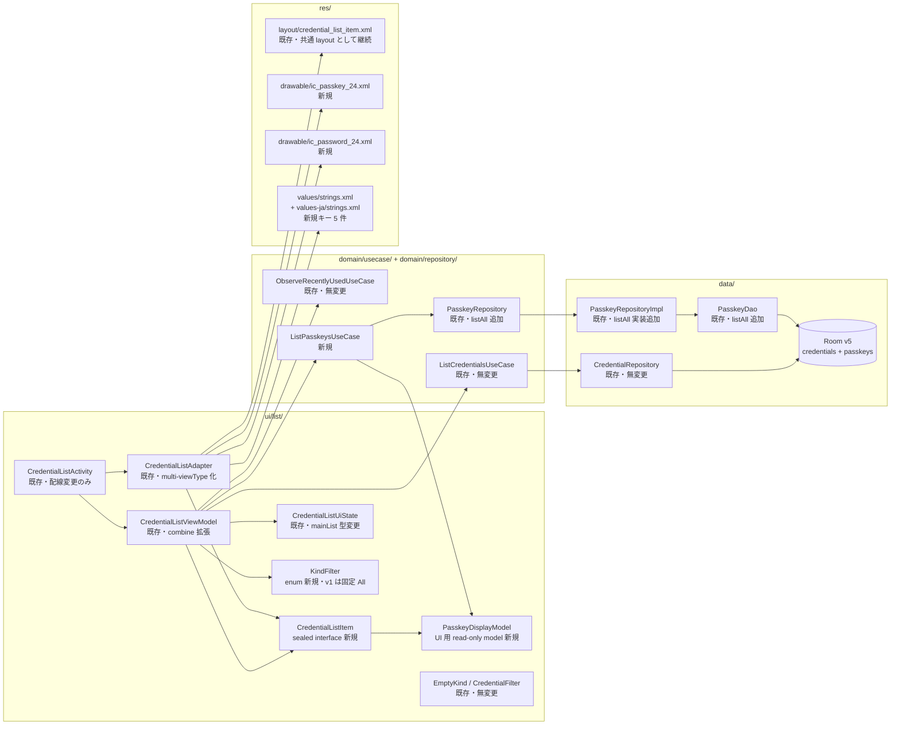
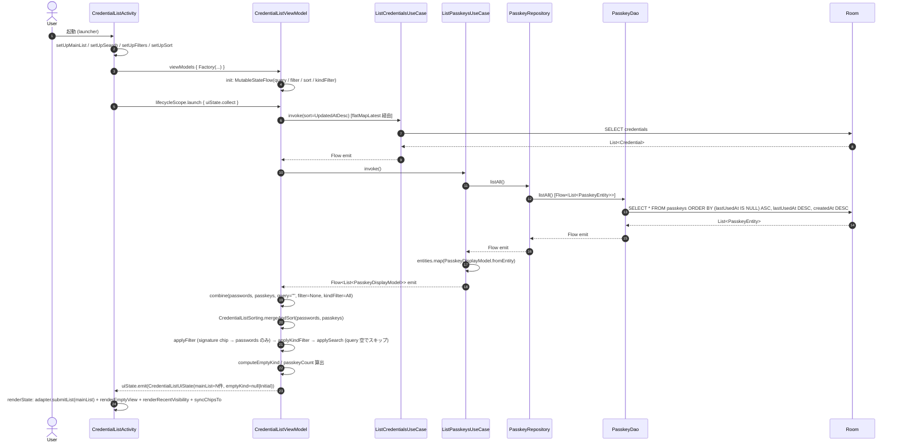
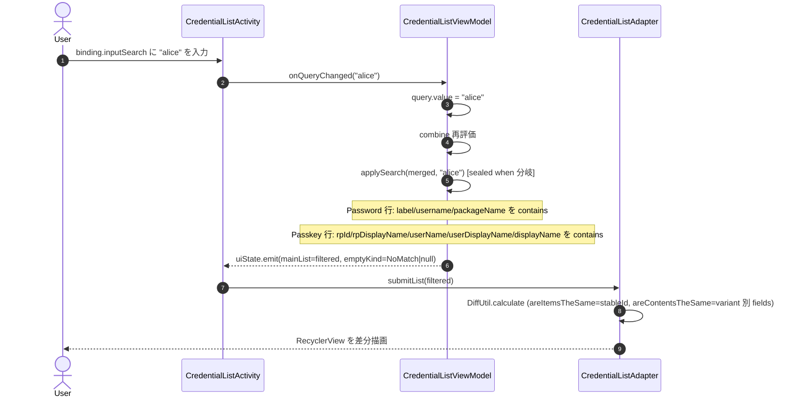
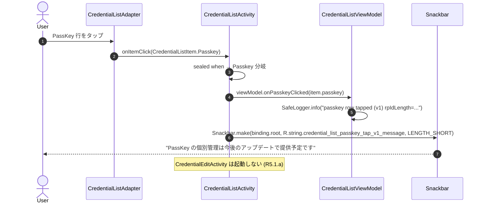
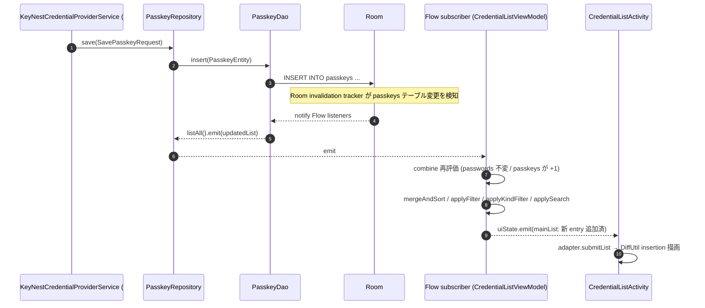
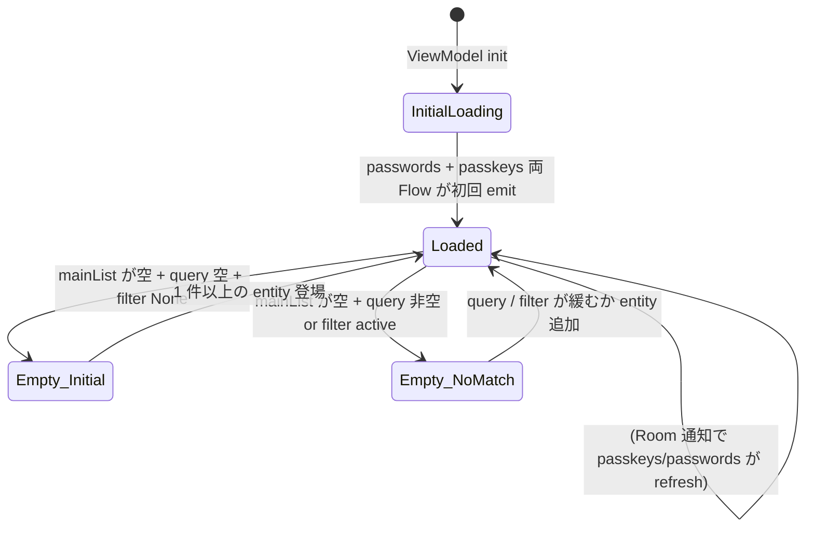

# Design Document — Issue #101 / feat(passkey): 既存 credential 一覧画面に PassKey 表示を統合

> 関連: `requirements.md`（本ディレクトリ）
>
> 関連 Issue:
> - **Parent (umbrella)**: #89 (Android Credential Manager 経由の PassKey プロバイダ対応)
> - **依存 (Phase 1, merged)**:
>   - #91 Room migration + `PasskeyEntity` / `PasskeyDao` / `PasskeyRepository`
>     (本 Issue が `dao.listAllByRpId` の並び順 SQL を踏襲し、新規 `listAll()` を追記する)
> - **参考 (本 Issue は非依存だが用語整合のため引用)**:
>   - #90 `CredentialProviderService` Manifest 骨組み (merged)
>   - #99 登録セレモニー `onBeginCreateCredentialRequest` (merged) — 表記ポリシー「PassKey」/ alias 命名 `keynest_passkey_<credentialId>` 確立済
>   - #100 認証セレモニー `onBeginGetCredentialRequest` (merged) — `signWithIncrement` 高階関数 API 確立済
> - **後続予定**:
>   - umbrella #89 分割案 6 — PassKey 個別管理 UI (rename / delete)。本 Issue は接合点として `CredentialListItem.Passkey` variant と `onItemClick` の sealed 対応 callback を提供
>   - umbrella #89 分割案 7 — 設定画面 / OS 設定導線
>   - umbrella #89 分割案 8 — README / Privacy / Support docs 更新
>   - 種別フィルタ chip 追加 Issue — 本 Issue で `KindFilter` enum の State 構造を確立し、後続 Issue は chip XML 追加 + bind だけで活性化できる
> - **PR base**: `develop` (リポジトリ既定、最終的に `main` に集約)
> - **作業ブランチ**: `claude/issue-101-design-feat-passkey-credential-passkey`
> - **carve-out**: PassKey 個別管理画面 / 種別フィルタ chip / sort popup の PassKey 専用化 / Recently used carousel への PassKey 統合 / DB schema 変更 (umbrella #89 / requirements.md Out of Scope に従い、本 Issue 範囲外)

## 1. 概要 / 全体像

### 1.1 Purpose

#91 で確定した `passkeys` テーブル / `PasskeyEntity` / `PasskeyRepository` は、#99 (登録) / #100 (認証) の各 Credential Manager セレモニー経由で書き込まれている一方、**KeyNest 内のどの画面からも参照できない**状態にある。本 Issue は既存 `CredentialListActivity` (password 一覧) に PassKey を **同じ RecyclerView 上で混在表示** する読み取り側 UI を 1 PR で完成させる。

### 1.2 Aim (3-4 行で)

- `ui/list/` パッケージ内の **既存 password 一覧パイプライン**を password / PassKey 両対応に拡張する。すなわち `List<Credential>` 駆動の Flow を、新規 **`sealed interface CredentialListItem` 駆動**に置き換える。
- 検索 / 並び順 / 空状態判定の不変条件 (Issue #9 系) を破壊せず、PassKey 行に対しても EARS R1〜R4 を満たす。
- DB schema は触らない (#91 で確定済の v5)。`PasskeyDao` と `PasskeyRepository` に **`listAll(): Flow<List<PasskeyEntity>>` を 1 メソッドずつ追記** するだけで、追加の DB 変更も migration もない。
- PassKey 行のタップは v1 では `Snackbar` で「個別管理は後続 Issue」を案内する暫定挙動 (R5)。`onItemClick` の callback シグネチャを `CredentialListItem` 引数の sealed when にすることで、後続 #89 分割案 6 が差分最小で edit 画面を接続できる接合点を確立する。

### 1.3 アーキテクチャ図



### 1.4 設計ゴール / 非ゴール

#### 1.4.1 ゴール (EARS R1〜R5 に直接対応)

| ゴール | 対応 EARS | 達成手段 |
|---|---|---|
| password と PassKey を **1 RecyclerView** で混在表示 | R1.1 / R1.2 | `mainList: List<CredentialListItem>` 化 + `getItemViewType` 分岐 |
| 並び順 `lastUsedAt DESC, createdAt DESC` (NULL 末尾) を両 variant 共通で実現 | R1.4 | `CredentialListItem.sortKey` を sealed で持たせ `mergeAndSort` で `compareBy(nullsLast(reverseOrder()), reverseOrder())` |
| DiffUtil の `areItemsTheSame` で `Credential.id` と `PasskeyEntity.credentialId` の **誤一致を防ぐ** | R1.5 / D-8 | `stableId = "pw:<id>"` / `"pk:<credentialId>"` prefix 比較 |
| 検索 box が password / PassKey 両方の属性を横断 case-insensitive 部分一致 | R2.1 / R2.2 / R2.5 | `applySearch` を sealed when 分岐 |
| signature chip フィルタ選択時に PassKey 行が **消えない** | R2.7 | `applyFilter` で `Passkey` variant を素通し |
| UI 表記が **「PassKey」** に統一 | R3.x / D-1 | 新規 string keys (`credential_list_passkey_kind_label` 等) + KDoc / 内部識別子 で表記固定 |
| PassKey 行タップで **クラッシュなし + Snackbar 暫定表示** | R5.x | `onItemClick(CredentialListItem) -> Unit` callback + Activity 側で sealed when |
| TalkBack で PassKey 行と password 行が音声区別可能 | R6.x | 種別アイコンの `contentDescription` に `credential_list_passkey_kind_label` を設定 |
| 既存テスト 100% 維持 | NFR 3.x / R4.8〜4.11 | 既存 `applyFilter` / `applySearch` の signature 変更を最小限に + 既存 password テストの assertion を新 sealed type に追従させる |

#### 1.4.2 非ゴール (Out of Scope)

- `PasskeyEntity` への新カラム追加 (D-9)
- migration 追加 / `KeyNestDatabase.version` の bump (D-9)
- PassKey 個別管理画面 (rename / delete UI) — #89 分割案 6
- 種別フィルタ chip の **UI 表出** (State 構造のみ確立)
- PassKey 用 `CredentialSortOrder` 追加 (PassKey は常に `lastUsedAt DESC, createdAt DESC` で固定)
- Recently used carousel への PassKey 統合
- `CredentialProviderService` / `KeyNestCredentialProviderService` の変更
- 検索のトークン化 / AND / OR / ハイライト / 表示数制限
- 暗号化 blob / userHandle / keyAlias / signCount の **UI 層** への露出 (NFR 2)
- `INTERNET` permission の追加 (NFR 4.1)

## 2. モジュール構成と責務

### 2.1 配置方針

本 Issue の主戦場は `ui/list/` package。`domain/usecase/` に 1 ファイル新規 + `domain/repository/` / `data/repository/` / `data/dao/` に各 1 メソッド追記、`res/` 配下にアイコン 2 + 文字列 5 件を追加する。`credentialprovider/` (#99 / #100) / `data/entity/` / `data/database/` には一切触らない。

### 2.2 モジュール一覧 (新規 / 既存・変更 / 既存・無変更)

| ファイル | ステータス | 役割 | 公開 API delta |
|---|---|---|---|
| `app/src/main/java/.../ui/list/CredentialListItem.kt` | 新規 | `sealed interface CredentialListItem` 定義。`Password(Credential)` / `Passkey(PasskeyDisplayModel)` の 2 variant + 共通 `stableId: String` + 共通 `sortKey: SortKey` | 完全新規 |
| `app/src/main/java/.../ui/list/PasskeyDisplayModel.kt` | 新規 | UI 用 read-only model。`PasskeyEntity` から **sensitive 列を除去した projection** (NFR 2)。`fromEntity(PasskeyEntity)` mapper 提供 | 完全新規 |
| `app/src/main/java/.../ui/list/KindFilter.kt` | 新規 | 3 値 enum (`All` / `PasskeyOnly` / `PasswordOnly`)。v1 では `MutableStateFlow` に保持するのみで chip UI は出さない。後続 Issue で chip 追加時に re-bind | 完全新規 |
| `app/src/main/java/.../ui/list/CredentialListSorting.kt` | 新規 | 内部 helper。`mergeAndSort(passwords, passkeys): List<CredentialListItem>` の Comparator 実装を集約。companion ではなく top-level `internal fun` として置き、テストから直接呼べる形にする | 完全新規 |
| `app/src/main/java/.../domain/usecase/ListPasskeysUseCase.kt` | 新規 | `operator fun invoke(): Flow<List<PasskeyDisplayModel>>`。`PasskeyRepository.listAll()` を delegate し、Entity → DisplayModel 変換を内包 (NFR 2.2) | 完全新規 |
| `app/src/main/java/.../ui/list/CredentialListAdapter.kt` | 既存・変更 | `ListAdapter<Credential, ...>` → `ListAdapter<CredentialListItem, ...>` に型変更。`PasswordViewHolder` / `PasskeyViewHolder` 2 internal class に分割し `getItemViewType` で出し分け | type parameter 変更 + 内部 ViewHolder 2 種 |
| `app/src/main/java/.../ui/list/CredentialListViewModel.kt` | 既存・変更 | コンストラクタに `listPasskeysUseCase: ListPasskeysUseCase` を追加。`mainListFlow` を `combine(query, filter, kindFilter, sortedListFlow, listPasskeysUseCase())` に拡張。`applyFilter` / `applySearch` を sealed when 分岐に書き換え。`onPasskeyClicked(...)` / kindFilter accessor 追加 | コンストラクタ 1 引数追加 / 内部 Flow 拡張 / public `onPasskeyClicked` 追加 / companion helper のシグネチャ変更 |
| `app/src/main/java/.../ui/list/CredentialListUiState.kt` | 既存・変更 | `mainList: List<Credential>` → `mainList: List<CredentialListItem>`。`kindFilter: KindFilter` 追加 (v1 デフォルト `KindFilter.All`)。`passkeyCount: Int` 追加 (Empty state / 統計用 — テストから観測しやすく) | field 2 件追加 + 1 件型変更 |
| `app/src/main/java/.../ui/list/CredentialListActivity.kt` | 既存・変更 | adapter の callback 型を `(CredentialListItem) -> Unit` に変更。password variant では既存挙動 (`startEdit` / `promptDelete` / `showRowOverflowMenu`)、PassKey variant では `Snackbar` 表示。`ServiceLocator.listPasskeysUseCase` を Factory に追加 | callback の引数型変更のみ (Activity 内 private function) |
| `app/src/main/java/.../di/ServiceLocator.kt` | 既存・変更 | `listPasskeysUseCase: ListPasskeysUseCase by lazy { ListPasskeysUseCase(passkeyRepository) }` を追記 | lazy field 1 件追加 |
| `app/src/main/java/.../domain/repository/PasskeyRepository.kt` | 既存・変更 | `fun listAll(): Flow<List<PasskeyEntity>>` を **加法** で追記 | method 1 件追加 |
| `app/src/main/java/.../data/repository/PasskeyRepositoryImpl.kt` | 既存・変更 | `listAll()` を `dao.listAll()` 直接 delegate で実装 | method 1 件追加 |
| `app/src/main/java/.../data/dao/PasskeyDao.kt` | 既存・変更 | `@Query("SELECT * FROM passkeys ORDER BY (lastUsedAt IS NULL) ASC, lastUsedAt DESC, createdAt DESC") fun listAll(): Flow<List<PasskeyEntity>>` を追記。`import kotlinx.coroutines.flow.Flow` も追加 | method 1 件追加 |
| `app/src/main/res/layout/credential_list_item.xml` | 既存・無変更 | 共通 layout として PassKey 行でも再利用 (Q-9 確定。後述 §8) | なし |
| `app/src/main/res/drawable/ic_passkey_24.xml` | 新規 | PassKey 種別アイコン (24dp vector、Material Symbols `passkey` 系) | 完全新規 |
| `app/src/main/res/drawable/ic_password_24.xml` | 新規 | password 種別アイコン (24dp vector、Material Symbols `password` / `key` 系。既存 `ic_key_24.xml` は autofill 系で使用済のため別発番 — 後述 §9) | 完全新規 |
| `app/src/main/res/values/strings.xml` | 既存・変更 | 5 件キー追加 (§10) | 5 string key 追加 |
| `app/src/main/res/values-ja/strings.xml` | 既存・変更 | 同 5 件の ja 翻訳追加 (`credential_list_passkey_kind_label` だけは en/ja 共に `"PassKey"` で商標的固定) | 5 string key 追加 |
| `app/src/test/.../ui/list/CredentialListViewModelTest.kt` | 既存・変更 | 既存 password テストの list 型を `List<Credential>` → `List<CredentialListItem>` に追従 (assertion 側のみ)。新規 8 テスト追加 (詳細 §15) | 既存テスト型追従 + 新規 8 ケース |
| `app/src/test/.../ui/list/PasskeyDisplayModelTest.kt` | 新規 | Entity → DisplayModel 変換テスト + sensitive 列が含まれないことを reflection で検証 (NFR 2) | 完全新規 |
| `app/src/test/.../ui/list/CredentialListSortingTest.kt` | 新規 | Comparator 単体テスト (NULL handling / tiebreaker / variant 混在) | 完全新規 |
| `app/src/test/.../data/PasskeyDaoTest.kt` | 既存・変更 | `listAll()` 新規メソッドの Flow 観測テスト 2 件追加 | 新規 2 ケース |
| `app/src/test/.../data/PasskeyRepositoryTest.kt` | 既存・変更 | `listAll()` delegate テスト 1 件 + 空テーブル時テスト 1 件追加 | 新規 2 ケース |
| `app/src/androidTest/.../ui/list/CredentialListAdapterInstrumentationTest.kt` | 新規 | `Password` / `Passkey` 両 viewType の inflate / icon / contentDescription / overflow visibility を検証 | 完全新規 |

### 2.3 後続 Issue との分離点 (本 Issue で確定する不変条件)

| 後続 Issue (#89 分割案) | 本 Issue で確定する不変条件 | 後続 Issue で追加する変更点 |
|---|---|---|
| 5 (本 Issue 完了) | `CredentialListItem` sealed interface / `stableId` prefix `"pw:"` / `"pk:"` / `PasskeyDisplayModel` の 9 field / `KindFilter` 3 値 enum / Comparator (`lastUsedAt DESC, createdAt DESC, NULL last`) | — |
| 6 (PassKey 個別管理 UI) | `onItemClick: (CredentialListItem) -> Unit` callback シグネチャ。Activity 側 sealed when の `Passkey` 分岐を新画面起動に差し替えるだけで済む | `PasskeyEditActivity` / rename / delete UI / overflow メニュー (PassKey 行) |
| 7 (設定画面) | 本 Issue は OS 設定導線を出さない | OS 設定 deep link / プロバイダ登録状態 chip |
| 種別フィルタ chip 追加 | `KindFilter` 3 値 enum の State が ViewModel に存在し、`applyFilter` 後段で適用される (v1 は常に `All`) | chip XML 追加 + `setUpKindFilter()` + `onKindFilterChanged()` のみ |

### 2.4 既存 `ui/list/` パッケージとの関係 (read-only 観察結果)

- `CredentialListActivity` (Issue #9 / #29 / #43 / #46 / #51 / #67 を経て安定) — `binding.inputSearch` / `binding.chipGroupFilters` / `binding.btnSort` / `binding.recycler` / `binding.recentRecycler` / `binding.emptyStateCta` の 6 controls + `viewModel.uiState.collect` の wiring を踏襲する。本 Issue では `adapter` の callback 引数型変更 + `Snackbar` 1 経路追加のみ。
- `CredentialListViewModel` — 既存の `query` / `filter` / `sort` MutableStateFlow と `sortedListFlow` / `mainListFlow` pipeline を **削除せず**、`mainListFlow` を passkey Flow と `combine` する形に拡張する。
- `CredentialListAdapter` — `ListAdapter<Credential, ...>` の type を `ListAdapter<CredentialListItem, ...>` に変える破壊変更が入るが、`ViewHolder` 内 view 参照名 (`text_label` / `text_subtitle` / `text_package` / `chip_signature` / `strength_bar` / `icon_app` / `btn_overflow`) は layout xml と完全に同一で、bind ロジック側で variant 別に値を差し替える。
- `CredentialListUiState` — `mainList` の型変更が主。`emptyKind` (`EmptyKind.Initial` / `EmptyKind.NoMatch` / null) / `recentList` / `query` / `filter` / `sort` は据置。

## 3. データモデル

### 3.1 `CredentialListItem` (新規 sealed interface)

#### 3.1.1 Kotlin 確定形

```kotlin
package io.github.hitoshiichikawa.keynest.ui.list

import io.github.hitoshiichikawa.keynest.domain.model.Credential

/**
 * Issue #101 (parent #89) — `CredentialListActivity` の `RecyclerView` に
 * 並べる 2 種類の行を表す sealed interface。
 *
 * - [Password] 行: 既存 password credential ([Credential]) の wrap。
 * - [Passkey] 行: 本 Issue で導入する PassKey の UI 用 read-only projection
 *   ([PasskeyDisplayModel]) を保持。
 *
 * DiffUtil の `areItemsTheSame` で `Credential.id.value: Long` と
 * `PasskeyEntity.credentialId: String` の **同値衝突** を避けるため、
 * [stableId] は variant prefix (`"pw:"` / `"pk:"`) を含む文字列で比較する
 * (Issue #101 D-8 / R1.5).
 *
 * `Comparable` は **実装しない**。並び順は [CredentialListSorting.mergeAndSort]
 * の `Comparator<CredentialListItem>` に集約することで、tiebreaker 周辺の
 * 振る舞いをテストから直接検証できる形にする。
 */
sealed interface CredentialListItem {

    /** DiffUtil `areItemsTheSame` 用の安定 ID。variant prefix を含むため衝突しない。 */
    val stableId: String

    /** `mergeAndSort` で参照する並び順鍵。両 variant 共通の `(lastUsedAt, createdAt)` 投影。 */
    val sortKey: SortKey

    data class Password(val credential: Credential) : CredentialListItem {
        override val stableId: String
            get() = "pw:${credential.id.value}"
        override val sortKey: SortKey
            get() = SortKey(lastUsedAt = credential.lastUsedAt, createdAt = credential.createdAt)
    }

    data class Passkey(val passkey: PasskeyDisplayModel) : CredentialListItem {
        override val stableId: String
            get() = "pk:${passkey.credentialId}"
        override val sortKey: SortKey
            get() = SortKey(lastUsedAt = passkey.lastUsedAt, createdAt = passkey.createdAt)
    }

    /**
     * `lastUsedAt` (epoch millis / NULL = 未使用) と `createdAt` (epoch millis)
     * の 2 軸投影。Comparator はこの 2 軸のみを参照する。
     */
    data class SortKey(val lastUsedAt: Long?, val createdAt: Long)
}
```

#### 3.1.2 設計判断

| 論点 | 採用案 | 根拠 |
|---|---|---|
| `sealed class` vs `sealed interface` | `sealed interface` | data class variant が `class` ではなく `class`/`interface` の組み合わせを許容するため。Kotlin 1.5+ 標準パターン。`Credential` (#9 で確立済の data class) を unwrap せずそのまま wrap できる |
| `stableId` の型 | `String` | `Long` と `String` の混在を避けるため。prefix 文字列で名前空間を分離。`Credential.id.value` (Long) を文字列化するコストは N=数千 でも無視可能 |
| `sortKey` を sealed 内に持たせるか、外部関数で抽出するか | sealed 内 `val` | `compareBy { it.sortKey.lastUsedAt }` のように Comparator 構築が短く書ける。variant 追加時の漏れも `when` exhaustiveness で検知 |
| `Comparable<CredentialListItem>` の実装 | 実装しない | `Comparator` を別 file (`CredentialListSorting`) に集約して unit-test しやすくするため。`Comparable` を sealed に持たせると **NULL 並び順** をテストから上書きしにくい |
| variant の data class 化 | する | `equals` / `hashCode` 自動生成。DiffUtil の `areContentsTheSame` は data class default で十分 (PasskeyDisplayModel が 9 field で sensitive 列を含まないことを保証するため) |

### 3.2 `PasskeyDisplayModel` (新規 UI 用 read-only model)

#### 3.2.1 Kotlin 確定形

```kotlin
package io.github.hitoshiichikawa.keynest.ui.list

import io.github.hitoshiichikawa.keynest.data.entity.PasskeyEntity

/**
 * Issue #101 (parent #89) — UI 層に渡す PassKey の read-only projection。
 *
 * 設計意図:
 *  - [PasskeyEntity] が持つ 14 列のうち、UI が表示に必要としない
 *    `userHandle` (BLOB) / `encryptedPrivateKey` / `privateKeyIv` /
 *    `keyAlias` / `signCount` の 5 列を **意図的に除外** し、誤って
 *    画面 / Snackbar / logcat に出すリスクを型レベルで遮断する (NFR 2)。
 *  - Entity → DisplayModel 変換は [Companion.fromEntity] で行う。
 *    `ListPasskeysUseCase` 内で 1 度だけ呼ばれ、ViewModel 以降は
 *    DisplayModel のみを観測する。
 *  - `displayName` (KeyNest 命名) は v1 では常に NULL (#89 分割案 6 で
 *    rename UI 提供後に活性化)。
 *
 * 1 行目 / 2 行目 / 3 行目の表示優先順位は requirements R1.3 に従う:
 *  - 1 行目: [displayName] -> [rpDisplayName] -> [rpId]
 *  - 2 行目: [userDisplayName] -> [userName] -> R.string.credential_list_passkey_unknown_user
 *  - 3 行目: [rpId] 固定
 */
data class PasskeyDisplayModel(
    val credentialId: String,
    val rpId: String,
    val rpDisplayName: String?,
    val userName: String?,
    val userDisplayName: String?,
    val displayName: String?,
    val isDiscoverable: Boolean,
    val createdAt: Long,
    val lastUsedAt: Long?,
) {
    companion object {
        /**
         * [PasskeyEntity] から sensitive 列を除外して [PasskeyDisplayModel] を
         * 組み立てる。`ListPasskeysUseCase` 内で 1 度だけ呼ばれる。
         *
         * NFR 2.1: 戻り値の data class は `userHandle` /
         * `encryptedPrivateKey` / `privateKeyIv` / `keyAlias` / `signCount`
         * を **field として一切持たない** ことを `PasskeyDisplayModelTest` で
         * reflection 検証する。
         */
        internal fun fromEntity(entity: PasskeyEntity): PasskeyDisplayModel =
            PasskeyDisplayModel(
                credentialId = entity.credentialId,
                rpId = entity.rpId,
                rpDisplayName = entity.rpDisplayName,
                userName = entity.userName,
                userDisplayName = entity.userDisplayName,
                displayName = entity.displayName,
                isDiscoverable = entity.isDiscoverable,
                createdAt = entity.createdAt,
                lastUsedAt = entity.lastUsedAt,
            )
    }
}
```

#### 3.2.2 除外 field 一覧 (NFR 2.1)

| Entity field | 型 | 除外理由 |
|---|---|---|
| `userHandle` | `ByteArray` (1..64 byte) | WebAuthn user 識別の生バイト列。UI に出す意味なし + logcat / Snackbar 漏洩リスク |
| `encryptedPrivateKey` | `ByteArray` (AES-GCM 暗号化済 PKCS#8) | 暗号化済とはいえ ciphertext は UI 不要 |
| `privateKeyIv` | `ByteArray` (12 byte GCM IV) | 同上 |
| `keyAlias` | `String` (`keynest_passkey_<credentialId>`) | AndroidKeyStore alias。UI には credentialId 系 を別経路で持つ |
| `signCount` | `Long` | WebAuthn assertion counter。UI に出す要件なし。誤って表示 → privacy 観点で不要な情報 |

#### 3.2.3 reflection 検証の Kotlin 例

`PasskeyDisplayModelTest` 側で:

```kotlin
@Test
fun `data class does not expose sensitive entity fields`() {
    val forbidden = setOf(
        "userHandle", "encryptedPrivateKey", "privateKeyIv", "keyAlias", "signCount",
    )
    val declared = PasskeyDisplayModel::class.java.declaredFields.map { it.name }.toSet()
    val intersect = declared intersect forbidden
    assertWithMessage("PasskeyDisplayModel must not declare $forbidden")
        .that(intersect)
        .isEmpty()
}
```

### 3.3 `KindFilter` (新規 enum)

#### 3.3.1 Kotlin 確定形

```kotlin
package io.github.hitoshiichikawa.keynest.ui.list

/**
 * 種別フィルタ 3 値 (Issue #101 Q-2 確定)。
 *
 * v1 では UI 上に chip を出さず、`CredentialListViewModel` 内部の
 * `MutableStateFlow<KindFilter>` を **常に [All] に固定** する。
 * 後続「種別フィルタ chip 追加 Issue」で chip XML + `setUpKindFilter()`
 * + `onKindFilterChanged(KindFilter)` を追加することで活性化される。
 *
 * ViewModel の `applyFilter` 後段でこの enum を読む。具体的には
 * `applyKindFilter(list, kindFilter)` という pure function で、
 * [All] -> 入力リストをそのまま return、[PasswordOnly] -> Password variant のみ、
 * [PasskeyOnly] -> Passkey variant のみを返す。
 */
enum class KindFilter {
    All,
    PasswordOnly,
    PasskeyOnly,
}
```

#### 3.3.2 設計判断

| 論点 | 採用案 | 根拠 |
|---|---|---|
| enum vs sealed class | enum | 値の集合が **永久に 3 値** で確定しており、associated data も不要なため enum で十分。serialization も `name()` で素朴に効く |
| v1 で chip を出すか | 出さない (Q-2 確定) | requirements §「Non-Goal」/ Issue #101 本文 Out of Scope に従う。State 構造のみ確立 |
| default 値 | `All` | 既存挙動 = 全件表示と整合 |

### 3.4 `CredentialListUiState` 拡張

#### 3.4.1 変更後の Kotlin 確定形

```kotlin
data class CredentialListUiState(
    val query: String,
    val filter: CredentialFilter,
    val sort: CredentialSortOrder,
    val kindFilter: KindFilter,                            // 新規 (Q-2)
    val mainList: List<CredentialListItem>,                // 型変更 (旧: List<Credential>)
    val recentList: List<Credential>,                      // 型据置 (Recently used は password のみ)
    val emptyKind: EmptyKind?,
    val passkeyCount: Int,                                 // 新規 (テストから観測しやすく)
) {
    companion object {
        val EMPTY: CredentialListUiState = CredentialListUiState(
            query = "",
            filter = CredentialFilter.None,
            sort = CredentialSortOrder.UpdatedAtDesc,
            kindFilter = KindFilter.All,
            mainList = emptyList(),
            recentList = emptyList(),
            emptyKind = EmptyKind.Initial,
            passkeyCount = 0,
        )
    }
}
```

#### 3.4.2 不変条件 (本 Issue で守る)

- `emptyKind != null` ⇔ `mainList.isEmpty()` (既存と同一)
- `passkeyCount == mainList.count { it is CredentialListItem.Passkey }` (派生値だが ViewModel から渡す)
- `recentList: List<Credential>` の型は据置 (PassKey 統合は Out of Scope / Q-6)

### 3.5 Sort key 設計 (Comparator)

#### 3.5.1 仕様

R1.4 に従い:

- 1 次キー: `sortKey.lastUsedAt` (Long? — `null` は **末尾**)
- 2 次キー: `sortKey.createdAt` (Long, 必須)
- 並びは両方とも **DESC** (新しいものが上)

#### 3.5.2 Kotlin 確定形

```kotlin
package io.github.hitoshiichikawa.keynest.ui.list

/**
 * `CredentialListItem` の並び順を集約する top-level helper (Issue #101 R1.4)。
 *
 * Comparator の組み立てを ViewModel から分離することで、`mergeAndSort` の
 * 振る舞いを `CredentialListSortingTest` から直接検証できる。
 *
 * 並び順:
 *  - 1 次キー: [CredentialListItem.SortKey.lastUsedAt]
 *    (Long? — `null` は **末尾**、非 null は **DESC**)
 *  - 2 次キー: [CredentialListItem.SortKey.createdAt]
 *    (Long — DESC、tiebreaker)
 *
 * 計算量: `passwords.size + passkeys.size = N` で `O(N log N)`
 * (Kotlin `sortedWith` = TimSort)。N=2000 でも UI thread blocking 範囲外
 * (NFR 1.5)。
 */
internal object CredentialListSorting {

    /**
     * [CredentialListItem] 用 Comparator。null lastUsedAt は最後尾。
     */
    internal val byLastUsedThenCreatedDesc: Comparator<CredentialListItem> =
        compareBy<CredentialListItem, Long?>(
            // (a) lastUsedAt NULL = 1, NOT NULL = 0 で先頭側に集める
            //     → false(0) < true(1) で「非 null が先」になるが、降順比較したいので
            //     compareBy の selector に nullsLast(reverseOrder()) を渡すことで
            //     null を最後 + 非 null を DESC にする。
            nullsLast(reverseOrder()),
        ) { item -> item.sortKey.lastUsedAt }
            .thenByDescending { item -> item.sortKey.createdAt }

    /**
     * password と passkey の 2 つの list を結合 + ソートする。
     *
     * @param passwords [ListCredentialsUseCase] が返す `List<Credential>`
     *                  (DAO のソート順は呼び出し側の sort popup に従う)
     * @param passkeys  [ListPasskeysUseCase] が返す `List<PasskeyDisplayModel>`
     *                  (DAO の自然順 = `lastUsedAt DESC, createdAt DESC, NULL last`)
     * @return 両 variant を [byLastUsedThenCreatedDesc] で再ソートした
     *         `List<CredentialListItem>`。
     */
    internal fun mergeAndSort(
        passwords: List<io.github.hitoshiichikawa.keynest.domain.model.Credential>,
        passkeys: List<PasskeyDisplayModel>,
    ): List<CredentialListItem> {
        val merged = ArrayList<CredentialListItem>(passwords.size + passkeys.size)
        passwords.mapTo(merged) { CredentialListItem.Password(it) }
        passkeys.mapTo(merged) { CredentialListItem.Passkey(it) }
        return merged.sortedWith(byLastUsedThenCreatedDesc)
    }
}
```

#### 3.5.3 Comparator の挙動マトリクス (R1.4 検証用)

| 入力 (lastUsedAt, createdAt) | 比較結果 (上→下) |
|---|---|
| `(100, 50)`, `(200, 10)`, `(50, 100)` | `(200, 10)` → `(100, 50)` → `(50, 100)` |
| `(null, 100)`, `(50, 10)`, `(null, 50)` | `(50, 10)` → `(null, 100)` → `(null, 50)` |
| `(100, 10)`, `(100, 20)` | `(100, 20)` → `(100, 10)` (createdAt 降順 tiebreaker) |
| `(null, 100)`, `(null, 100)` (同値) | 安定 sort で入力順保存 |

NULL handling の意図: 「使ったことがない PassKey」(`lastUsedAt = null`) は password の `lastUsedAt = null` よりも下に行かないように、null vs null の比較は createdAt 降順 tiebreaker で続行する。すなわち比較は `nullsLast(reverseOrder())` で null を末尾に集め、その内部で createdAt 降順を保つ。

### 3.6 既存型への影響

- `Credential` (#9 で確立): **無変更**。`id: CredentialId` (value class Long) / `label` / `username` / `packageName` / `signatureSha256: String?` / `lastUsedAt: Long?` / `createdAt: Long` / `updatedAt: Long` を持つ既存定義をそのまま使う。
- `CredentialFilter` (#9): **無変更**。`None` / `SignatureMatched` / `SignatureMissing` の 3 値 sealed class。PassKey 行に対しては Requirement 2.7 に従い適用しない (素通し)。
- `CredentialSortOrder` (#9): **無変更**。`UpdatedAtDesc` / `LabelAsc` / `PackageAsc` の 3 値。Q-5 確定 (後述 §19) に従い **password 行にのみ** 作用させ、PassKey 行は常に `lastUsedAt DESC, createdAt DESC`。
- `EmptyKind`: **無変更**。`Initial` / `NoMatch` の 2 値。`computeEmptyKind` の signature は `(mainList: List<CredentialListItem>, query, filter, kindFilter)` に変わるが、出力 enum は据置。

## 4. 公開インターフェース (関数 signature 確定)

### 4.1 `PasskeyDao.listAll()` (新規)

```kotlin
// data/dao/PasskeyDao.kt に追記
import kotlinx.coroutines.flow.Flow

@Query(
    "SELECT * FROM passkeys " +
        "ORDER BY (lastUsedAt IS NULL) ASC, lastUsedAt DESC, createdAt DESC",
)
fun listAll(): Flow<List<PasskeyEntity>>
```

設計判断:

- 戻り値型 = **`Flow<List<PasskeyEntity>>`** (Q-4 確定)。Room の `Flow` 自動変更通知に乗ることで、#99 / #100 セレモニー経由で PassKey が増減した瞬間に一覧が refresh される。
- `suspend` を付けない (Room の Flow query 規約)。
- SQL は既存 `listAllByRpId` / `listDiscoverableByRpId` と **同一の ORDER BY** を採用。
- 既存 8 メソッドの signature は **一切変更しない**。

### 4.2 `PasskeyRepository.listAll()` (新規)

```kotlin
// domain/repository/PasskeyRepository.kt に追記
import kotlinx.coroutines.flow.Flow

interface PasskeyRepository {
    // 既存 4 メソッド (save / findByCredentialId / findByRpIdAndUserHandle / delete) ...

    /**
     * KeyNest が保管する全 PassKey の Flow。並び順は DAO の
     * `(lastUsedAt IS NULL) ASC, lastUsedAt DESC, createdAt DESC` に従う。
     * 一覧 UI ([CredentialListViewModel]) からのみ呼ばれる。
     *
     * Room の Flow は自動的に query notification に乗るため、
     * #99 (登録) / #100 (認証) の経路で PassKey が増減すると、
     * collect 中の subscriber は新しい list を受け取る。
     */
    fun listAll(): Flow<List<PasskeyEntity>>
}
```

設計判断:

- `suspend fun` ではなく **同期 `fun`** で Flow を返す (Flow 自体は cold stream、構築は副作用フリー)。
- 既存 4 メソッドは変更なし。本 Issue の repository 変更は **加法のみ** で backward compatible。

### 4.3 `PasskeyRepositoryImpl.listAll()` (新規実装)

```kotlin
// data/repository/PasskeyRepositoryImpl.kt に追記
import kotlinx.coroutines.flow.Flow

override fun listAll(): Flow<List<PasskeyEntity>> = dao.listAll()
```

設計判断:

- DAO の `listAll()` を **直接 delegate**。Entity → DisplayModel 変換は `ListPasskeysUseCase` 側で行うことで、Repository は Entity 層に留め、UI 層への漏洩を ViewModel 配線で物理的に遮断する (NFR 2.2)。
- 既存 constructor / 既存 keyProviderFactory / cipherFactory / keyStoreLoader には触らない (#100 で確定済の test seam を破壊しないため)。

### 4.4 `ListPasskeysUseCase` (新規)

```kotlin
package io.github.hitoshiichikawa.keynest.domain.usecase

import io.github.hitoshiichikawa.keynest.domain.repository.PasskeyRepository
import io.github.hitoshiichikawa.keynest.ui.list.PasskeyDisplayModel
import kotlinx.coroutines.flow.Flow
import kotlinx.coroutines.flow.map

/**
 * Issue #101 (parent #89) — KeyNest が保管する全 PassKey の UI 用 Flow を
 * 提供する UseCase。
 *
 * 役割:
 *  - [PasskeyRepository.listAll] (`Flow<List<PasskeyEntity>>`) を Entity 層から
 *    取り出し、UI 用 [PasskeyDisplayModel] にマップする。
 *  - ViewModel は Entity を一切観測せず、sensitive 列を持たない DisplayModel
 *    のみを扱う (NFR 2.2 / Issue #101 §セキュリティ考慮)。
 */
class ListPasskeysUseCase(
    private val repo: PasskeyRepository,
) {
    operator fun invoke(): Flow<List<PasskeyDisplayModel>> =
        repo.listAll().map { entities ->
            entities.map(PasskeyDisplayModel.Companion::fromEntity)
        }
}
```

設計判断:

- 単一責務 = Entity → DisplayModel 変換と Flow 接続のみ。
- `operator fun invoke()`: 既存の `ListCredentialsUseCase` / `ObserveRecentlyUsedUseCase` と同じ慣習。
- 戻り値型は `Flow<List<PasskeyDisplayModel>>` で UI 専用 model のみ。

### 4.5 `CredentialListViewModel` 公開 IF 変更

#### 4.5.1 constructor

```kotlin
class CredentialListViewModel(
    private val listUseCase: ListCredentialsUseCase,
    private val recentUseCase: ObserveRecentlyUsedUseCase,
    private val duplicateUseCase: DuplicateCredentialUseCase,
    private val deleteUseCase: DeleteCredentialUseCase,
    private val listPasskeysUseCase: ListPasskeysUseCase,             // 本 Issue で追加
) : ViewModel()
```

#### 4.5.2 内部 Flow パイプライン

```kotlin
private val query = MutableStateFlow("")
private val filter = MutableStateFlow<CredentialFilter>(CredentialFilter.None)
private val sort = MutableStateFlow(CredentialSortOrder.UpdatedAtDesc)
private val kindFilter = MutableStateFlow(KindFilter.All)             // 本 Issue で追加 / v1 では常に All

private val sortedPasswordsFlow: Flow<List<Credential>> =
    sort.flatMapLatest { listUseCase(it) }

private val passkeysFlow: Flow<List<PasskeyDisplayModel>> =
    listPasskeysUseCase()

/**
 * 統合 list の生成:
 *  1. password Flow と PassKey Flow を combine
 *  2. mergeAndSort で `lastUsedAt DESC, createdAt DESC, NULL last` に並べる
 *  3. applyFilter (signature chip = password のみに作用 / PassKey は素通し)
 *  4. applyKindFilter (KindFilter enum / v1 では常に素通し)
 *  5. applySearch (variant 別に分岐)
 */
private val mainListFlow: Flow<List<CredentialListItem>> = combine(
    query, filter, kindFilter, sortedPasswordsFlow, passkeysFlow,
) { q, f, kf, pwList, pkList ->
    val merged = CredentialListSorting.mergeAndSort(pwList, pkList)
    val afterChip = applyFilter(merged, f)
    val afterKind = applyKindFilter(afterChip, kf)
    if (q.isBlank()) afterKind else applySearch(afterKind, q)
}
```

#### 4.5.3 `uiState` の組み立て

```kotlin
val uiState: StateFlow<CredentialListUiState> = combine(
    query, filter, sort, kindFilter, mainListFlow, recentUseCase(),
) { q, f, s, kf, mainList, recentList ->
    CredentialListUiState(
        query = q,
        filter = f,
        sort = s,
        kindFilter = kf,
        mainList = mainList,
        recentList = recentList,
        emptyKind = computeEmptyKind(mainList, q, f, kf),
        passkeyCount = mainList.count { it is CredentialListItem.Passkey },
    )
}.stateIn(viewModelScope, SharingStarted.WhileSubscribed(STOP_TIMEOUT_MS), CredentialListUiState.EMPTY)
```

`combine` は最大 5 引数版を Kotlin が標準提供しているため、`query / filter / sort / kindFilter / mainListFlow / recentList` の 6 source は `combine(...) { ... }` の overload + 1 段の `combine` 連結で構成する。実装上は:

```kotlin
val uiState: StateFlow<CredentialListUiState> = combine(
    combine(query, filter, sort, kindFilter) { q, f, s, kf -> Quad(q, f, s, kf) },
    mainListFlow,
    recentUseCase(),
) { (q, f, s, kf), mainList, recentList ->
    CredentialListUiState(...)
}.stateIn(...)
```

(`Quad` は internal data class、または既存 Kotlin の `Tuple` 系がないため file private で declare する。Developer は実装フェーズで `combine` の overload 仕様を見て構成を最適化可能。)

#### 4.5.4 新規 public method

```kotlin
/**
 * v1 では UI 上 chip を出さないが、後続 Issue で chip 追加時に呼ばれる。
 * v1 では呼び出し元なし (UI 層が呼ばない)。
 */
internal fun onKindFilterChanged(value: KindFilter) {
    kindFilter.value = value
}

/**
 * Issue #101 R5: PassKey 行のタップで edit 画面を起動せず、暫定 Snackbar を表示する
 * シグナル。Activity 側で sealed when 後の Snackbar 表示を発火するための side channel。
 *
 * v1 では「タップ事実」のみを通知し、Snackbar 文言は Activity 側で
 * R.string.credential_list_passkey_tap_v1_message を resolve する
 * (i18n を ViewModel に持ち込まないため)。
 *
 * 後続 Issue (#89 分割案 6) は本メソッドを削除して `onPasskeyClicked` →
 * `PasskeyEditActivity` 起動 SharedFlow に差し替える。
 */
fun onPasskeyClicked(passkey: PasskeyDisplayModel) {
    // 本 v1 では SharedFlow を持たず、Activity 側で sealed when 直後に
    // Snackbar を出す方針 (後述 §6 処理フロー)。本 method は将来差し替え用の
    // 接合点として宣言だけしておき、v1 では呼ばれた事実を SafeLogger で
    // 記録するのみ (NFR 1.3 に従い credentialId raw は出さない / size のみ)。
    SafeLogger.info(
        tag = TAG_VM,
        message = "passkey row tapped (v1: snackbar only). rpIdLength=${passkey.rpId.length}",
    )
}
```

> 補足: `onPasskeyClicked` を ViewModel に置くかは Q-3 関連。requirements §「未決事項」Q-3 では「Snackbar 表示」を Activity 内で完結させる方針も許容している。本 design では **後続 Issue の差分を最小化** するために ViewModel 側に「呼ばれた事実」を残す形を採用 (将来 SharedFlow に格上げするだけで edit 起動経路に乗る)。v1 の Snackbar 表示自体は Activity が sealed when 内で直接行う (UI / i18n を ViewModel に持ち込まない原則)。

#### 4.5.5 既存 public method (無変更)

- `onQueryChanged(String)`
- `onFilterChanged(CredentialFilter)`
- `onSortChanged(CredentialSortOrder)`
- `onDuplicate(CredentialId)`
- `delete(CredentialId)`
- `duplicateResult: SharedFlow<DuplicateOutcome>`

### 4.6 `CredentialListAdapter` 公開 IF 変更

#### 4.6.1 constructor

```kotlin
class CredentialListAdapter(
    private val onItemClick: (CredentialListItem) -> Unit,           // 引数型変更
    private val onItemLongClick: (CredentialListItem) -> Unit,        // 引数型変更
    private val onOverflowClick: (CredentialListItem, View) -> Unit,  // 引数型変更
    private val iconLoader: IconLoader,
) : ListAdapter<CredentialListItem, RecyclerView.ViewHolder>(DIFF)
```

設計判断:
- 親クラスを `RecyclerView.ViewHolder` 親で取り、内部に `PasswordViewHolder` / `PasskeyViewHolder` の 2 子クラスを置く。
- callback の引数を `CredentialListItem` 単一にすることで、`sealed when` で variant 分岐可能。

#### 4.6.2 viewType 定数 + `getItemViewType`

```kotlin
companion object {
    internal const val VIEW_TYPE_PASSWORD: Int = 0
    internal const val VIEW_TYPE_PASSKEY: Int = 1

    private val DIFF = object : DiffUtil.ItemCallback<CredentialListItem>() {
        override fun areItemsTheSame(a: CredentialListItem, b: CredentialListItem): Boolean =
            a.stableId == b.stableId

        override fun areContentsTheSame(a: CredentialListItem, b: CredentialListItem): Boolean =
            when {
                a is CredentialListItem.Password && b is CredentialListItem.Password ->
                    a.credential.packageName == b.credential.packageName &&
                        a.credential.username == b.credential.username &&
                        a.credential.label == b.credential.label &&
                        a.credential.updatedAt == b.credential.updatedAt &&
                        a.credential.signatureSha256 == b.credential.signatureSha256
                a is CredentialListItem.Passkey && b is CredentialListItem.Passkey ->
                    a.passkey == b.passkey  // data class equals: 9 field 全比較で十分
                else -> false  // variant 不一致は areItemsTheSame で false なので到達しないが defensive
            }
    }
}

override fun getItemViewType(position: Int): Int = when (getItem(position)) {
    is CredentialListItem.Password -> VIEW_TYPE_PASSWORD
    is CredentialListItem.Passkey -> VIEW_TYPE_PASSKEY
}
```

#### 4.6.3 `onCreateViewHolder` 分岐

```kotlin
override fun onCreateViewHolder(parent: ViewGroup, viewType: Int): RecyclerView.ViewHolder {
    val binding = CredentialListItemBinding.inflate(
        LayoutInflater.from(parent.context), parent, false,
    )
    return when (viewType) {
        VIEW_TYPE_PASSWORD -> PasswordViewHolder(binding)
        VIEW_TYPE_PASSKEY -> PasskeyViewHolder(binding)
        else -> error("Unknown viewType=$viewType")
    }
}
```

- 両 viewType が **同一 layout XML** (`credential_list_item.xml`) を inflate する (Q-9 確定 / 後述 §8)。
- 内部 ViewHolder クラスで `bind` の中身を分岐 (種別アイコン / テキスト解決 / chip_signature visibility / overflow visibility)。

#### 4.6.4 内部 ViewHolder (概略)

```kotlin
internal abstract class BaseViewHolder(
    protected val binding: CredentialListItemBinding,
) : RecyclerView.ViewHolder(binding.root) {
    internal val iconAppView get() = binding.iconApp
    abstract fun bind(
        item: CredentialListItem,
        onClick: (CredentialListItem) -> Unit,
        onLongClick: (CredentialListItem) -> Unit,
        onOverflow: (CredentialListItem, View) -> Unit,
        iconLoader: IconLoader,
    )
}

internal class PasswordViewHolder(binding: CredentialListItemBinding) :
    BaseViewHolder(binding) {
    override fun bind(...) {
        require(item is CredentialListItem.Password)
        val c = item.credential
        // 既存 bind ロジックをそのまま移植 (Issue #29 / #43 / #51 の経路)
        binding.textLabel.text = c.label
        binding.textSubtitle.text = c.username
        binding.textPackage.text = c.packageName
        // signature chip / strength_bar / iconLoader / overflow visibility 等
        // ... 既存の switch (hasSignature) 分岐をそのまま再現
        iconLoader.loadInto(binding.iconApp, c.packageName)
        binding.iconApp.contentDescription = null  // R6.2 既存挙動
        binding.btnOverflow.visibility = View.VISIBLE
        // setOnClickListener など
    }
}

internal class PasskeyViewHolder(binding: CredentialListItemBinding) :
    BaseViewHolder(binding) {
    override fun bind(...) {
        require(item is CredentialListItem.Passkey)
        val p = item.passkey
        val ctx = binding.root.context
        // 1 行目: displayName -> rpDisplayName -> rpId (R1.3)
        binding.textLabel.text = p.displayName
            ?: p.rpDisplayName
            ?: p.rpId
        // 2 行目: userDisplayName -> userName -> fallback string
        binding.textSubtitle.text = p.userDisplayName
            ?: p.userName
            ?: ctx.getString(R.string.credential_list_passkey_unknown_user)
        // 3 行目: rpId 固定
        binding.textPackage.text = p.rpId
        // signature chip / strength_bar は PassKey 概念なし → GONE (R1.9)
        binding.chipSignature.visibility = View.GONE
        binding.strengthBar.visibility = View.GONE  // 既存 StrengthBar も非表示
        // 種別アイコン = ic_passkey_24 (Issue #101 R1.8 / R6.1)
        binding.iconApp.setImageResource(R.drawable.ic_passkey_24)
        binding.iconApp.contentDescription =
            ctx.getString(R.string.credential_list_passkey_kind_label)
        // PassKey 行 overflow は v1 では非表示 (R5.4)
        binding.btnOverflow.visibility = View.GONE
        // tap = onClick (R5.1)、long-click は consume only (R5.3)
        binding.root.setOnClickListener { onClick(item) }
        binding.root.setOnLongClickListener {
            // R5.3: 何もしない。consume して row long-click ripple を抑制
            true
        }
    }
}
```

#### 4.6.5 `onViewRecycled`

```kotlin
override fun onViewRecycled(holder: RecyclerView.ViewHolder) {
    super.onViewRecycled(holder)
    if (holder is PasswordViewHolder) {
        iconLoader.cancel(holder.iconAppView)
    }
    // PasskeyViewHolder は iconLoader を使わないため cancel 不要
}
```

(Issue #43 で導入された race condition 対策を password 側のみ維持。PassKey 側は `setImageResource(R.drawable.ic_passkey_24)` 同期で完結するため対象外。)

### 4.7 `CredentialListActivity` 公開 IF 変更

#### 4.7.1 callback の sealed when

```kotlin
private fun setUpMainList() {
    adapter = CredentialListAdapter(
        onItemClick = { item ->
            when (item) {
                is CredentialListItem.Password -> startEdit(item.credential)
                is CredentialListItem.Passkey -> {
                    viewModel.onPasskeyClicked(item.passkey)
                    showPasskeyTapSnackbar()
                }
            }
        },
        onItemLongClick = { item ->
            when (item) {
                is CredentialListItem.Password -> promptDelete(item.credential)
                is CredentialListItem.Passkey -> Unit  // R5.3: 何もしない
            }
        },
        onOverflowClick = { item, anchor ->
            when (item) {
                is CredentialListItem.Password -> showRowOverflowMenu(item.credential, anchor)
                is CredentialListItem.Passkey -> Unit  // R5.4: overflow 自体 GONE なので到達しないが defensive
            }
        },
        iconLoader = ServiceLocator.iconLoader,
    )
    binding.recycler.layoutManager = LinearLayoutManager(this)
    binding.recycler.adapter = adapter
}

private fun showPasskeyTapSnackbar() {
    Snackbar.make(
        binding.root,
        R.string.credential_list_passkey_tap_v1_message,
        Snackbar.LENGTH_SHORT,
    ).show()
}
```

#### 4.7.2 ViewModel Factory

```kotlin
private val viewModel: CredentialListViewModel by viewModels {
    CredentialListViewModel.Factory(
        ServiceLocator.listCredentialsUseCase,
        ServiceLocator.observeRecentlyUsedUseCase,
        ServiceLocator.duplicateCredentialUseCase,
        ServiceLocator.deleteCredentialUseCase,
        ServiceLocator.listPasskeysUseCase,  // 本 Issue で追加
    )
}
```

### 4.8 `ServiceLocator` 公開 IF 追加

```kotlin
// di/ServiceLocator.kt に追記

import io.github.hitoshiichikawa.keynest.domain.usecase.ListPasskeysUseCase

val listPasskeysUseCase: ListPasskeysUseCase by lazy {
    ListPasskeysUseCase(passkeyRepository)
}
```

設計判断:
- 既存 `listCredentialsUseCase` / `observeRecentlyUsedUseCase` の隣に並べる (alphabet / 機能順)。
- `passkeyRepository` (既存) を引数に渡すだけで完結。

## 5. 処理フロー (mermaid sequence diagrams)

### 5.1 初期ロード (Activity onCreate → uiState 初回 emit)



### 5.2 検索入力 → Flow 再 emit



### 5.3 PassKey 行タップ (R5 暫定挙動)



### 5.4 PassKey 増分 (#99 経路) → 一覧自動 refresh



これにより「PassKey を OS Credential Manager UI で登録した直後に KeyNest を開くと、新規 PassKey が自動で一覧に出ている」UX が実現する (Q-4 採用根拠と一致)。

## 6. RecyclerView multi-view-type 設計

### 6.1 viewType 設計

| 定数 | 値 | 用途 |
|---|---|---|
| `VIEW_TYPE_PASSWORD` | `0` | `CredentialListItem.Password` に対応 |
| `VIEW_TYPE_PASSKEY` | `1` | `CredentialListItem.Passkey` に対応 |

- 値は `internal const val` (テストから参照可能)。
- 後続 Issue で variant 追加時は `2` 以降を昇順発番。

### 6.2 DiffUtil 設計

#### 6.2.1 `areItemsTheSame`

```kotlin
override fun areItemsTheSame(a: CredentialListItem, b: CredentialListItem): Boolean =
    a.stableId == b.stableId
```

- `stableId = "pw:<id>"` / `"pk:<credentialId>"` で **prefix が異なれば確実に false**。
- D-8 / R1.5 を機械的に満たす。

#### 6.2.2 `areContentsTheSame`

variant 別に比較対象 field を分岐:

```kotlin
override fun areContentsTheSame(a: CredentialListItem, b: CredentialListItem): Boolean =
    when {
        a is CredentialListItem.Password && b is CredentialListItem.Password ->
            a.credential.packageName == b.credential.packageName &&
                a.credential.username == b.credential.username &&
                a.credential.label == b.credential.label &&
                a.credential.updatedAt == b.credential.updatedAt &&
                a.credential.signatureSha256 == b.credential.signatureSha256
        a is CredentialListItem.Passkey && b is CredentialListItem.Passkey ->
            a.passkey == b.passkey  // PasskeyDisplayModel data class equals
        else -> false
    }
```

- Password 側は既存 `CredentialListAdapter.DIFF.areContentsTheSame` のフィールド集合をそのまま踏襲。
- Passkey 側は data class の自動 equals で 9 field 全比較。`PasskeyDisplayModel` は sensitive 列を持たないので、equals が変わってもセキュリティ的に影響なし。
- variant 不一致は `areItemsTheSame` で既に弾かれているが、defensive に `false` を返す。

### 6.3 共通 layout 採用 (Q-9 確定)

| 選択 | 内容 | 採用判断 |
|---|---|---|
| 案 A: `credential_list_item.xml` を **共通 layout** として再利用、bind 側で `chip_signature` / `strength_bar` / icon resource / overflow visibility を切り替える | DRY / DiffUtil の payload 最適化が将来効きやすい / 既存テストの ViewHolder クラス参照を最小限に維持 | **採用** |
| 案 B: `credential_list_passkey_item.xml` を新規追加し、PassKey 行専用 layout を独立化 | layout 内部構造の自由度が上がる (PassKey 用に異なるパディング / フォントを採用しやすい) | 不採用 (本 Issue で UI 差は「アイコン + 文字解決」のみで、構造は完全同一のため案 B のメリットなし) |

#### 6.3.1 共通 layout が成立する根拠

`credential_list_item.xml` の構造を読むと:

- 44dp `iconApp` (FrameLayout 内 ImageView) — PassKey 行で `setImageResource(ic_passkey_24)` + `contentDescription` 設定で OK
- `text_label` / `text_subtitle` / `text_package` — PassKey 行で 1行目 / 2行目 / 3行目に解決済み文字列を流し込んで OK
- `chip_signature` — PassKey 行で `View.GONE` (R1.9)
- `strength_bar` — PassKey 行で `View.GONE` (R1.9 / 既存 password 行でも常に GONE 同等の挙動なので影響少)
- `btn_overflow` — PassKey 行で `View.GONE` (R5.4)

→ **layout XML を 1 byte も変更せず** に PassKey 行に再利用できる。本 Issue では `credential_list_item.xml` を touch しない。

#### 6.3.2 `iconApp` の content_description 上書き戦略

- 既存 layout XML: `android:contentDescription="@null"` (R6.2 維持)
- Password ViewHolder の bind: 上書きせず `@null` 維持 (TalkBack は親 row が読み上げる既存挙動)
- PassKey ViewHolder の bind: `binding.iconApp.contentDescription = ctx.getString(R.string.credential_list_passkey_kind_label)` で「PassKey」を読み上げ可能にする (R6.1)

#### 6.3.3 種別ラベル chip の扱い (任意要素)

requirements §「新規追加するファイル」で `kn_kind_chip_bg_passkey.xml` (任意) の言及があるが、本 design では **追加しない**。理由:

- v1 では `chip_signature` を `GONE` にするだけで PassKey 種別ラベルを別途出さない (アイコン + textLabel の preset 解決で十分に視覚区別可能 + R1.2 の要件は「種別アイコン切替」で達成済)
- 後続 #89 分割案 6 で個別管理 UI を作る際に「PassKey: <displayName>」風の chip / バッジを追加する余地を残す方が、UI 設計の柔軟性が高い

これにより layout XML 変更 / 新規 drawable 1 件削減 = 変更面積最小化。

## 7. 検索アルゴリズム

### 7.1 `applySearch` の sealed when 分岐

```kotlin
internal fun applySearch(
    list: List<CredentialListItem>,
    query: String,
): List<CredentialListItem> {
    val needle = query.trim().lowercase()
    if (needle.isEmpty()) return list
    return list.filter { item ->
        when (item) {
            is CredentialListItem.Password -> {
                val c = item.credential
                c.label.lowercase().contains(needle) ||
                    c.username.lowercase().contains(needle) ||
                    c.packageName.lowercase().contains(needle)
            }
            is CredentialListItem.Passkey -> {
                val p = item.passkey
                p.rpId.lowercase().contains(needle) ||
                    (p.rpDisplayName ?: "").lowercase().contains(needle) ||
                    (p.userName ?: "").lowercase().contains(needle) ||
                    (p.userDisplayName ?: "").lowercase().contains(needle) ||
                    (p.displayName ?: "").lowercase().contains(needle)
            }
        }
    }
}
```

### 7.2 検索フィールド一覧

| variant | 検索対象 field | 出典 |
|---|---|---|
| `Password` | `label` / `username` / `packageName` | 既存 (Issue #9 / `applySearch` 現状) |
| `Passkey` | `rpId` / `rpDisplayName` / `userName` / `userDisplayName` / `displayName` (KeyNest 命名、v1 は常に null) | R2.1 / R2.2 |

### 7.3 比較方式

- `case-insensitive`: 両側 `.lowercase()` (既存 password 側と同方針 / R2.5)
- `substring contains`: `String.contains(needle)`
- トークン化 / AND / OR / 区切り: 行わない (既存方針継承 / R2.4)
- `null` field の扱い: `?: ""` で null safe (空文字列に対する `.contains(needle)` は false なので除外と等価)

### 7.4 計算量と性能試算

| N (password + passkey 合計) | 検索 1 回の cost | 影響 |
|---|---|---|
| 100 | `O(100 * 5)` = 500 string contains | < 1 ms (UI thread blocking 範囲外) |
| 1000 | `O(1000 * 5)` = 5,000 string contains | 数 ms 程度 (Android では文字列 contains は 1 µs 程度) |
| 2000 (passwords 1000 + passkeys 1000) | `O(2000 * 5)` = 10,000 | 10 ms 前後 (UI thread で実行しても 60fps frame 内に収まる) |

これらは `applySearch` が main thread から呼ばれることを想定した最悪見積もり。実際には `combine { ... }` lambda が Dispatchers.Default で実行される可能性が高い (`flowOn` 明示しない場合 Kotlin Coroutines の StateFlow / SharedFlow の挙動に依存)。性能リスクが顕在化した場合は `flowOn(Dispatchers.Default)` を `mainListFlow` の末尾に挟むだけで対処可能 (NFR 1.2)。

本 Issue 範囲では `flowOn` を **明示しない**。理由:
- 既存 `mainListFlow` (#9) も明示していない
- `applyFilter` / `applySearch` が pure function であり、副作用なし
- N=2000 でも UI thread blocking のリスクが低い

→ 将来 N が増えた時点で `flowOn(Dispatchers.Default)` を追加する余地を残す。

### 7.5 検索フィールドの「漏らさない」設計

requirements の sensitive 列除外 (NFR 2) に対し、検索対象に **`keyAlias` / `userHandle` / `signCount` / `encryptedPrivateKey` を含めない** ことを `PasskeyDisplayModel` の data class field 設計 (§3.2) で物理的に保証する。`PasskeyDisplayModel` には sensitive 列が存在しないので、`applySearch` がこれらに contains を呼ぶことは型レベルで不可能。

## 8. 並び順 / null handling

### 8.1 Comparator 詳細 (再掲 §3.5)

```kotlin
internal val byLastUsedThenCreatedDesc: Comparator<CredentialListItem> =
    compareBy<CredentialListItem, Long?>(
        nullsLast(reverseOrder()),
    ) { item -> item.sortKey.lastUsedAt }
        .thenByDescending { item -> item.sortKey.createdAt }
```

### 8.2 Kotlin stdlib API の挙動確認

`kotlin.comparisons.nullsLast(comparator: Comparator<T>): Comparator<T?>`:
- `null` を **より大きい** 値とみなすことで、`sortedWith` で末尾に集める。
- 非 null vs 非 null は引数 `comparator` で比較。本 design では `reverseOrder<Long>()` を渡すので「大きい lastUsedAt = 新しい使用 = 上」。

### 8.3 エッジケース表

| (a.lastUsedAt, a.createdAt) | (b.lastUsedAt, b.createdAt) | 期待順 | 検証用テスト名 |
|---|---|---|---|
| `(200, 100)` | `(100, 50)` | a → b | `lastUsedAt降順_両方非null` |
| `(null, 100)` | `(100, 50)` | b → a | `nullは末尾` |
| `(null, 200)` | `(null, 100)` | a → b | `null同士はcreatedAt降順` |
| `(100, 100)` | `(100, 50)` | a → b | `lastUsedAt同値はcreatedAt降順tiebreaker` |
| `(100, 100)` | `(100, 100)` | 入力順保存 | `完全同値はstableSort` |
| `Long.MAX_VALUE` | `Long.MAX_VALUE - 1` | a → b | `境界値DESC` |

### 8.4 既存 `CredentialSortOrder` との関係 (Q-5 確定)

| `CredentialSortOrder` | password 行への作用 | PassKey 行への作用 |
|---|---|---|
| `UpdatedAtDesc` (default) | `ListCredentialsUseCase(UpdatedAtDesc)` が DAO で `ORDER BY updatedAt DESC` を返す | 影響なし。常に `lastUsedAt DESC, createdAt DESC` |
| `LabelAsc` | DAO が `ORDER BY label ASC` を返す | 影響なし |
| `PackageAsc` | DAO が `ORDER BY packageName ASC` を返す | 影響なし |

最終的な `mergeAndSort` は **DAO の並び順を尊重しない** (`byLastUsedThenCreatedDesc` で再ソートする)。これは Q-5 の確定方針:

> 「sort popup の選択肢 (`LabelAsc` / `PackageAsc`) は PassKey に意味のあるフィールドが揃わないため、統合 list 全体に強制適用すると PassKey 行が末尾固定 (`label`/`packageName` 比較不能) になり混乱を招く。本 Issue では sort popup は **password 由来のソート順を表現する flow signal** として保持するが、最終 mainList は両 variant 共通 `lastUsedAt DESC, createdAt DESC` で再ソートする。」

→ v1 では sort popup の UI は据置 (削除しない / disable もしない / 動作する) だが、選択値が `mainList` の順序に **直接は反映されない**。Activity 表示上「sort popup 押すと password 行の内部順序が変わる」効果は失われるが、これは password 単独 UX の劣化として後続 Issue で再検討する余地を残す (Q-5 残課題)。

実装フェーズの軽減策: `sortedPasswordsFlow` (sort 適用後) を `mergeAndSort` の第 1 引数として渡すが、`mergeAndSort` 内で全体を再 sort する。安定 sort なので、lastUsedAt / createdAt が同値の password 行同士は内部的に sort 選択が保たれる (副次効果)。

#### 8.4.1 残課題 (本 Issue では accept、別 Issue 候補)

sort popup の意味付け再設計は本 Issue 範囲外。実装側で `sortedPasswordsFlow` を素直に渡すだけで、tiebreaker での副次効果は得られる。

## 9. アイコン素材方針 (Q-1 確定)

### 9.1 採用方針

| 用途 | ファイル名 | 出典 / 種別 | 採用判断 |
|---|---|---|---|
| PassKey 種別アイコン | `app/src/main/res/drawable/ic_passkey_24.xml` | Material Symbols `passkey` (outlined, 24dp) を vector drawable 化 | **新規発番** |
| password 種別アイコン | `app/src/main/res/drawable/ic_password_24.xml` | Material Symbols `password` (outlined, 24dp) または `vpn_key` を vector drawable 化 | **新規発番** (既存 `ic_key_24.xml` は autofill 系で使用済のため共有しない) |

理由 (Q-1 推奨案と整合):
- 後続 #89 分割案 6 (PassKey 個別管理 UI) で同じアイコンを再利用するため、ブランド一貫性の観点から **PassKey 専有のリソース名** で確定しておきたい。
- `ic_fingerprint_24.xml` (既存) は生体認証 prompt 用に使われており、PassKey 列の icon として共有すると意味が混乱する。
- `ic_key_24.xml` (既存) は password autofill のロゴ系で利用されているため、一覧 UI の password 行で別意味として使うとセマンティックがぶれる。**`ic_password_24.xml` を新規発番** することで PassKey との pair を明確化する。

### 9.2 Vector drawable の構造 (実装メモ)

`ic_passkey_24.xml` (概形):

```xml
<vector xmlns:android="http://schemas.android.com/apk/res/android"
    android:width="24dp"
    android:height="24dp"
    android:viewportWidth="24"
    android:viewportHeight="24"
    android:tint="?attr/colorOnSurfaceVariant">
    <path
        android:fillColor="@android:color/white"
        android:pathData="M..."/>
</vector>
```

- `android:tint="?attr/colorOnSurfaceVariant"` で **Material 3 theme attribute** から色を引いて dark/light mode 自動対応 (R3.5 / NFR 6.x 整合)。
- `android:width="24dp"` / `viewportWidth="24"` で既存 24dp 系アイコンと整合。
- `pathData` の具体形は Material Symbols 配布の SVG を Android Studio の Vector Asset Studio で取り込み (実装フェーズで Developer が確定)。

`ic_password_24.xml` も同形式。

### 9.3 ImageView 側 tint 戦略

- bind 側では `binding.iconApp.setImageResource(R.drawable.ic_passkey_24)` のみ呼び、`imageTintList` は触らない (XML 内 `android:tint` で完結)。
- dark mode は theme attribute (`?attr/colorOnSurfaceVariant`) が自動で `night-` リソースを引くため明示対応不要。

### 9.4 password 行への適用 (R1.2 整合)

password 行は **既存挙動 (PackageManager 経由でアプリアイコン解決 / InitialLetterDrawable fallback)** を維持する。種別アイコン `ic_password_24.xml` は **アプリアイコンが解決できないかつ fallback も発動しないコーナーケース** 用、または後続 #89 分割案 7 の設定画面でアイコン素材として再利用する想定。本 Issue の password ViewHolder では `iconLoader.loadInto(binding.iconApp, c.packageName)` をそのまま使い、`ic_password_24` は **drawable リソースとして存在するが ViewHolder からは参照しない**。

> 補足: 「password 行でも種別アイコンを統一で出すべき」という UI 議論が後続でありうるが、本 Issue では既存 PackageManager 解決 UX を破壊しない方針 (NFR 3.5 / 既存テスト非破壊) を優先する。`ic_password_24.xml` は **後続 Issue 用に予約発番** する。

## 10. 文字列リソース

### 10.1 新規追加するキー一覧

| key | values/strings.xml (en) | values-ja/strings.xml (ja) | 用途 |
|---|---|---|---|
| `credential_list_passkey_kind_label` | `PassKey` | `PassKey` | PassKey 種別ラベル (en/ja 共通 = 商標的固定表記。R3.1 / D-1) |
| `credential_list_password_kind_label` | `Password` | `パスワード` | password 種別ラベル (R3.2) |
| `credential_list_passkey_unknown_user` | `(no user)` | `(ユーザー名なし)` | userDisplayName / userName が空のときの 2 行目 fallback (R1.3) |
| `credential_list_passkey_tap_v1_message` | `PassKey management is coming in a later release.` | `PassKey の個別管理は今後のアップデートで提供予定です。` | PassKey 行タップ時の Snackbar 文言 (R5.2) |
| `credential_list_passkey_a11y_icon` | `PassKey` | `PassKey` | PassKey 行アイコンの contentDescription (R6.1)。`credential_list_passkey_kind_label` と同値だが用途分離のため別 key 発番 (将来「PassKey credential」相当の TalkBack 専用文言に分岐できる接合点として残す) |

### 10.2 命名 prefix の一貫性 (NFR 5.2)

- 一覧画面 keys: `credential_list_passkey_*` / `credential_list_password_*` で固定
- 登録画面 keys (#99 既存): `passkey_create_*` で固定
- 認証画面 keys (#100 既存): `passkey_auth_*` で固定

「画面別 prefix」のポリシーを継続。

### 10.3 i18n / 表記固定の検証 (R3.x)

- `credential_list_passkey_kind_label` は ja で「PassKey」表記固定 (D-1)。「パスキー」「passkey」「Passkey」を使わない。
- 翻訳忘れ防止: 5 件のキーを `values/strings.xml` と `values-ja/strings.xml` の両方に追加。AAPT2 は片方のみだと resolve 警告を出すので CI でキャッチできる (R6.4)。

### 10.4 既存キーへの影響

- 触らないキー: `credential_list_row_overflow_a11y` (既存) / `passkey_create_*` (既存) / `passkey_auth_*` (既存)
- 削除するキーなし

## 11. エラー / 失敗パス

### 11.1 Repository 例外時の UiState

`PasskeyRepository.listAll()` は Room の Flow なので、通常運用では例外が emit されることは稀。ただし `SQLiteException` (DB 破損 / Disk Full 等) が起きた場合の挙動を確認する:

| 発生箇所 | 例外型 | 本 Issue の挙動 | 推奨対応 |
|---|---|---|---|
| `dao.listAll()` Flow 中で `SQLiteException` | `SQLiteException` | `combine { ... }` lambda 内で throw → `viewModelScope` の `stateIn` が collect 停止 + `uiState` が直前値で固定化 | `catch { emit(emptyList()) }` を `passkeysFlow` に挟む defensive 案もあるが、本 Issue では既存 `sortedListFlow` の方針 (catch なし) と整合させ、catch を追加しない。SQL 例外が起きるレベルの DB 不整合は autofill 経路でも同じく顕在化するため、本 Issue 固有のエラーハンドリングは入れない |
| `ListPasskeysUseCase` map 変換中で例外 | `IllegalStateException` (理論上発生しない) | 同上 | 同上 |
| `applySearch` / `applyFilter` / `mergeAndSort` の pure 変換中で例外 | (発生しないはず) | 同上 | テストで edge case を網羅 |

### 11.2 UiState の状態遷移



本 Issue で **新規に追加する状態は無し** (`EmptyKind` の 2 値 + `null` は既存と同じ)。`InitialLoading` は `CredentialListUiState.EMPTY` (`emptyKind = Initial`) として既存と同じ。

### 11.3 「PassKey が 0 件のとき」の Empty 表示 (R1.7)

- password も PassKey も 0 件 + query 空 + filter None: `EmptyKind.Initial` (既存「最初の鍵を巣に入れよう」文言を踏襲、PassKey 専用文言は出さない / requirements R1.7)
- password ありで PassKey 0 件 / query 空: `mainList` 非空なので Empty 表示しない
- password 0 件で PassKey 1 件以上 / query 空: `mainList` 非空なので Empty 表示しない

### 11.4 検索 0 hit (R2.x)

既存 `EmptyKind.NoMatch` を再利用 (Issue #9 の文言「該当する credential が見つかりませんでした」相当)。PassKey 専用の no match 文言は出さない (本 Issue Out of Scope)。

## 12. テスト戦略

### 12.1 Unit Test 一覧

| File | 種別 | SDK | 検証ポイント | 要件対応 |
|---|---|---|---|---|
| `CredentialListSortingTest` (純 JVM) | unit | — | (a) lastUsedAt 降順両非 null / (b) null は末尾 / (c) null 同士は createdAt 降順 / (d) lastUsedAt 同値で createdAt tiebreaker / (e) 完全同値は安定 sort で入力順保存 / (f) `mergeAndSort` の出力 size = passwords.size + passkeys.size / (g) Long.MAX_VALUE 境界 | R1.4 / NFR 1.5 |
| `PasskeyDisplayModelTest` (純 JVM) | unit | — | (a) `fromEntity` が 9 field を Entity から正しく抽出 / (b) data class の declaredFields に sensitive 列 5 種 (`userHandle` / `encryptedPrivateKey` / `privateKeyIv` / `keyAlias` / `signCount`) が **含まれない** ことを reflection で検証 / (c) `displayName` / `rpDisplayName` / `userName` / `userDisplayName` が null の場合の equals / hashCode が正常 | R4.6 / NFR 2.1 |
| `CredentialListViewModelTest` (拡張) | unit | — | (a) password Flow に 2 件 + PassKey Flow に 2 件 → mainList = 4 件 `lastUsedAt DESC, createdAt DESC` 並び (NULL 混在) / (b) `applySearch("alice")` が PassKey の `userName="alice"` を hit + password を除外 / (c) `applySearch("ALICE")` が case-insensitive (lowercase) で同 hit / (d) `applyFilter(SignatureMatched)` 選択時に PassKey 行が消えない / (e) `applyFilter(SignatureMissing)` 選択時に PassKey 行が消えない / (f) `applyKindFilter(All)` で素通し / (g) `kindFilter = PasskeyOnly` で password 行が消える + PassKey 行のみ残る (将来テスト) / (h) `computeEmptyKind` の Initial / NoMatch / null 3 状態 / (i) 既存 password 単独テスト (Issue #9 系) が型追従後も pass | R4.1 / R4.2 / R4.3 / R4.7 / R4.8 |
| `PasskeyDaoTest` (拡張) | unit | — | (a) `listAll()` が空テーブルで空 list を emit / (b) `insert` → `listAll` Flow が 1 件 emit / (c) 2 件 insert で 2 件 emit / (d) 並び順が `lastUsedAt DESC, createdAt DESC, NULL last` で既存 `listAllByRpId` と同等 | R4.10 |
| `PasskeyRepositoryTest` (拡張) | unit | — | (a) `listAll()` が DAO の同名 method を delegate / (b) 空テーブルで空 list を emit (例外 / null emit ではない) | R4.11 |

### 12.2 Instrumentation Test

| File | 種別 | SDK | 検証ポイント | 要件対応 |
|---|---|---|---|---|
| `CredentialListAdapterInstrumentationTest` (新規 / Robolectric, sdk 34) | instrumentation | 34 | (a) `Password` item を submitList → ViewHolder クラスが `PasswordViewHolder` + `chip_signature` visible / (b) `Passkey` item を submitList → ViewHolder クラスが `PasskeyViewHolder` + `chip_signature.visibility == GONE` + `btn_overflow.visibility == GONE` + `iconApp.contentDescription` が PassKey 文言 + `iconApp` drawable resource id が `R.drawable.ic_passkey_24` / (c) 両 viewType 混在 submitList → 描画クラッシュなし + DiffUtil delta が想定通り | R4.4 / R4.5 / R6.1 / R6.2 |

### 12.3 既存テスト非破壊 (NFR 3.x / R4.8〜4.11)

- `CredentialListViewModelTest` の既存 password 単独テスト: signature 変更 (`List<Credential>` → `List<CredentialListItem>`) に追従して assertion 側のみ修正。期待される `applyFilter` / `applySearch` / `computeEmptyKind` の logic は変えない。
- `CredentialListActivity` 関連 Robolectric テスト (Empty state visibility / chip sync / sort popup): adapter callback の引数型変更に追従。期待する振る舞いは変えない。
- `PasskeyDaoTest` (#91) の既存 8 メソッドテスト: `listAll()` の追加で影響なし。
- `PasskeyRepositoryTest` (#99/#100) の既存テスト: `listAll()` の追加で影響なし (既存 4 メソッドの constructor / signature は据置)。
- `Migration_4_5_Test` (#91): DB schema 変更なしのため pass 維持 (D-9)。

### 12.4 Snapshot / Screenshot test

本 Issue では新規 snapshot test は追加しない。理由:
- 既存 KeyNest リポジトリで Roboletric Paparazzi / Showkase 等の screenshot infrastructure は未導入。
- PassKey 行の見た目検証は `CredentialListAdapterInstrumentationTest` の (b) ケース (ViewHolder のフィールド状態) で十分。

将来「KeyNest の screenshot test infrastructure 追加 Issue」が立った際に PassKey 行も covered する形にする。

### 12.5 テストツール

- JUnit4 + Truth (既存)
- Robolectric (sdk 34、Adapter テストのみ)
- Turbine (`Flow<...>` の emission を assert する。既存 `CredentialListViewModelTest` で導入済か confirm。未導入なら本 Issue で `app/build.gradle.kts` 依存追加)
- `kotlinx.coroutines.test.runTest` (Flow テスト)
- in-memory `KeyNestDatabase` (`Room.inMemoryDatabaseBuilder(...).allowMainThreadQueries().build()`)

### 12.6 既存依存追加の有無確認

- Turbine: 既存 `CredentialListViewModelTest` を読んで導入有無を確認。未導入なら本 Issue task 内で `libs.versions.toml` に `turbine = "1.x.x"` を追加 (mainland)。
- (実装フェーズで Developer が確認 / 必要なら別タスクに分割)

## 13. パフォーマンス試算

### 13.1 1000 + 1000 = 2000 件混在時の cost

| ステップ | 計算量 | 想定実時間 (中位 Android デバイス) |
|---|---|---|
| `passkeysFlow` Room emit | DB 行数 N に線形 | < 5 ms (Room indexed SELECT) |
| `sortedPasswordsFlow` Room emit | DB 行数 N に線形 | < 5 ms (既存挙動) |
| `combine { ... }` lambda 起動 | O(1) | < 1 ms |
| `mergeAndSort` (TimSort) | O(N log N), N = 2000 | < 10 ms |
| `applyFilter` (signature chip) | O(N) | < 1 ms |
| `applyKindFilter` | O(N) | < 1 ms |
| `applySearch` (string contains × 5 field) | O(N * k) where k = 5 | < 10 ms (needle 非空時のみ) |
| `submitList` → DiffUtil calc | O(N + D) | < 5 ms (D = diff entries) |
| RecyclerView onBindViewHolder | per row ~ 0.5 ms (PassKey は icon resolved 同期 / Password は icon load 非同期) | 60fps 内 |

合計: **最悪 30 ms 程度** で 1 ユーザー操作 (検索キー入力) を処理可能。NFR 1.3 (60fps stutter なし) を満たす。

### 13.2 メモリ試算

| エンティティ | 1 件あたりのサイズ |
|---|---|
| `Credential` | ~ 200 byte |
| `PasskeyDisplayModel` | ~ 200 byte |
| `PasskeyEntity` | ~ 500 byte (ciphertext + IV + userHandle 含む) |

`combine` の output `List<CredentialListItem>` は 2000 件で ~ 500 KB。LRU で十分許容範囲。

### 13.3 DiffUtil overhead

ListAdapter の `submitList` は Background thread で DiffUtil を実行 (AsyncListDiffer)。N=2000 でも DiffUtil の `areItemsTheSame` (string equals) + `areContentsTheSame` (data class equals) は数 ms オーダー。Main thread blocking なし。

### 13.4 将来増分に対する余裕度

| 件数 | 想定 cost | 余裕度 |
|---|---|---|
| 5000 | < 100 ms | UI 操作の体感ラグ顕在化開始 |
| 10000 | < 300 ms | `flowOn(Dispatchers.Default)` 追加で対処可 |
| 50000 | 数秒 | DB-side filter / search への移行検討 (本 Issue Out of Scope) |

→ KeyNest の想定スケール (個人ユーザーで credential 数 100 オーダー) では本 Issue 設計で十分。

## 14. セキュリティ考慮

### 14.1 sensitive 列の UI 層遮断 (NFR 2 全体)

物理的な保証:

1. `PasskeyDisplayModel` data class の field 設計で sensitive 列 5 種 (`userHandle` / `encryptedPrivateKey` / `privateKeyIv` / `keyAlias` / `signCount`) を **declare しない** (§3.2)。
2. `ListPasskeysUseCase` で Entity → DisplayModel 変換を 1 度だけ行い、ViewModel 以降は DisplayModel のみ観測 (§4.4)。
3. `CredentialListItem.Passkey` は `PasskeyDisplayModel` を持ち、`PasskeyEntity` を直接持たない (§3.1)。
4. `PasskeyDisplayModelTest` が reflection で declare されていないことを検証 (§3.2.3)。

→ 「UI 層に Entity が漏れない」ことが **3 層の遮断** で保証される。

### 14.2 logcat へのセンシティブ情報出力禁止 (NFR 2.3)

`CredentialListViewModel` / `CredentialListAdapter` / `CredentialListActivity` の SafeLogger 呼び出しでは:

- 出して OK: `size=...` / `passkeyCount=...` / `emptyKind=...` / `rpIdLength=...` / `filter=...` / `sort=...` (count / 種別ラベル系)
- 出さない: `credentialId` raw / `rpId` raw / `userName` raw / `userDisplayName` raw / `displayName` raw / `query` raw

既存 `CredentialListActivity.renderState` の logging policy (`"ui emit size=${state.mainList.size} ..."`) を踏襲する。新規 logging を追加する場合は同じ policy。

`onPasskeyClicked` の SafeLogger 例 (§4.5.4):

```kotlin
SafeLogger.info(
    tag = TAG_VM,
    message = "passkey row tapped (v1: snackbar only). rpIdLength=${passkey.rpId.length}",
)
```

`rpId` 自体を出さず、長さのみ。

### 14.3 Snackbar / Toast 経路の漏洩防止

PassKey 行タップ Snackbar (`credential_list_passkey_tap_v1_message`) は **固定文言** であり、credentialId / rpId / userName を一切含まない。

### 14.4 メモリダンプ / `toString()` 経路

- `PasskeyEntity.toString()` は既存 (#91 NFR 2.2) で sensitive 列を size 表記のみに redact 済。
- `PasskeyDisplayModel.toString()` (data class 自動生成) は sensitive 列を **持たないため漏洩リスクなし**。

### 14.5 Intent extras 経路

本 Issue で新規 Intent / Activity 起動はなし (PassKey 行タップは Snackbar のみで Activity 遷移しない / R5.1.a)。後続 Issue (#89 分割案 6) で `PasskeyEditActivity` を導入する際は Intent extras に `credentialId` を載せることになるが、本 Issue 範囲外。

### 14.6 INTERNET permission の不追加 (NFR 4.1)

本 Issue は UI / DB / SQL のみで完結。Network 通信なし → `<uses-permission android:name="android.permission.INTERNET">` を追加しない。既存 `InternetPermissionAbsenceTest` は影響なく pass 維持。

## 15. テスト戦略 詳細 (§12 の補完)

### 15.1 `CredentialListViewModelTest` の test fixtures 設計

```kotlin
private val pw1 = Credential(id = CredentialId(1), label = "GitHub", username = "alice",
    packageName = "com.github.android", signatureSha256 = "ABCD", lastUsedAt = 300L, createdAt = 100L, ...)
private val pw2 = Credential(id = CredentialId(2), label = "Twitter", username = "bob",
    packageName = "com.twitter.android", signatureSha256 = null, lastUsedAt = 100L, createdAt = 50L, ...)
private val pk1 = PasskeyDisplayModel(credentialId = "pk-cred-1", rpId = "github.com",
    rpDisplayName = "GitHub", userName = "alice", userDisplayName = "Alice", displayName = null,
    isDiscoverable = true, createdAt = 200L, lastUsedAt = 200L)
private val pk2 = PasskeyDisplayModel(credentialId = "pk-cred-2", rpId = "example.com",
    rpDisplayName = null, userName = "carol", userDisplayName = null, displayName = null,
    isDiscoverable = false, createdAt = 150L, lastUsedAt = null)
```

期待される並び (lastUsedAt DESC, createdAt DESC, NULL last):

1. `pw1` (lastUsedAt=300)
2. `pk1` (lastUsedAt=200)
3. `pw2` (lastUsedAt=100)
4. `pk2` (lastUsedAt=null, createdAt=150)

→ R4.1 の assertion 期待値として明示される。

### 15.2 検索テストケース

- `query="alice"`:
  - pw1 hit (username = "alice")
  - pk1 hit (userName = "alice")
  - pw2 / pk2 miss
- `query="ALICE"`:
  - 同上 (lowercase 比較で case-insensitive / R2.5)
- `query="example"`:
  - pk2 hit (rpId = "example.com")
  - pw1 / pw2 / pk1 miss
- `query="github"`:
  - pw1 hit (packageName = "com.github.android") and pk1 hit (rpId = "github.com" / rpDisplayName = "GitHub")
  - pw2 / pk2 miss

### 15.3 filter テストケース

- `filter=SignatureMatched` + 4 件 fixture:
  - pw1 (signatureSha256 != null) → 残る
  - pw2 (signatureSha256 == null) → 消える
  - pk1 / pk2 (PassKey は signature 概念なし、素通し) → 残る
  - 結果: 3 件 (pw1, pk1, pk2)
- `filter=SignatureMissing`:
  - pw1 → 消える, pw2 → 残る, pk1 / pk2 → 素通し
  - 結果: 3 件 (pw2, pk1, pk2)

### 15.4 `kindFilter` テストケース (R4.3 補強)

v1 では UI 上 chip を出さないので production 経路では `KindFilter.All` 固定だが、テスト用に直接 `viewModel.kindFilter.value` (internal) を `PasswordOnly` / `PasskeyOnly` に設定して挙動検証:

- `kindFilter=PasswordOnly`: mainList から PassKey 行が消える
- `kindFilter=PasskeyOnly`: mainList から password 行が消える

→ 将来 chip 追加時にロジックが完成していることを担保 (Q-2)。

### 15.5 Empty 判定テスト (R4.7 / 既存挙動回帰)

- mainList = [], query="", filter=None, kindFilter=All → `EmptyKind.Initial`
- mainList = [], query="xxx", filter=None → `EmptyKind.NoMatch`
- mainList = [], query="", filter=SignatureMatched → `EmptyKind.NoMatch`
- mainList = [pw1], query="xxx", filter=None → `emptyKind = null`

### 15.6 Instrumentation Test fixtures

`CredentialListAdapterInstrumentationTest` では:
- `Robolectric.buildActivity(EmptyHostActivity::class.java).get()` で host context 構築
- `RecyclerView` を inflate して adapter を attach
- `adapter.submitList([password_item, passkey_item])` を実行
- `adapter.getItemViewType(0) == VIEW_TYPE_PASSWORD`, `adapter.getItemViewType(1) == VIEW_TYPE_PASSKEY`
- `adapter.onCreateViewHolder(parent, VIEW_TYPE_PASSKEY).javaClass.simpleName == "PasskeyViewHolder"`
- `holder.binding.chipSignature.visibility == View.GONE`
- `holder.binding.btnOverflow.visibility == View.GONE`
- `holder.binding.iconApp.contentDescription == "PassKey"` (en string)
- `Shadows.shadowOf(holder.binding.iconApp.drawable).createdFromResId == R.drawable.ic_passkey_24` (Robolectric Shadow)

## 16. #91 dependency 想定 (前提条件)

### 16.1 利用する API

| API | 出典 | 本 Issue での用途 |
|---|---|---|
| `PasskeyEntity` (14 列 data class) | #91 merged | DAO → Repository → UseCase の Entity 経路。UseCase で DisplayModel に変換 |
| `PasskeyDao.insert/update/delete/findByCredentialId/findByRpIdAndUserHandle/listDiscoverableByRpId/listAllByRpId/incrementSignCount` | #91 merged | 本 Issue では呼ばない (本 Issue 追加 `listAll()` のみ呼ぶ) |
| `PasskeyRepository.save/findByCredentialId/findByRpIdAndUserHandle/delete` | #99 inline (merged) | 本 Issue では呼ばない (本 Issue 追加 `listAll()` のみ呼ぶ) |
| `PasskeyRepositoryImpl` constructor (`dao`, optional factories) | #99 inline (merged) | 本 Issue は constructor 引数を **追加しない** (Repository の `listAll` 実装は dao delegate のみで完結) |
| `KeyNestDatabase.passkeyDao()` | #91 merged | ServiceLocator から `PasskeyRepositoryImpl(database.passkeyDao())` 経由で参照 |
| `passkeys` テーブル (v5 schema) | #91 merged | SQL `SELECT * FROM passkeys ORDER BY ...` で参照 |

### 16.2 #91 (および #99 / #100) との衝突可能性

- #100 が `PasskeyRepository` に `listDiscoverableByRpId` / `loadPrivateKey` / `signWithIncrement` を追加済 (#100 merged)。本 Issue の `listAll()` 追加は **既存 4 + #100 3 + 本 Issue 1 = 8 メソッド** に拡張する形で、既存 method の signature には触らない。
- `PasskeyRepositoryImpl` の constructor を `#100` が `database: KeyNestDatabase` 引数追加で拡張済 (#100 merged)。本 Issue は constructor を **触らない** (`listAll` の実装に database は不要、dao delegate のみで完結)。
- `PasskeyDao` の interface に `listAll()` を追加するが、既存 8 メソッドは触らない。KSP が `@Query` を validate するので column 名typo は compile 時に検知される (NFR 2.3 / D-9 / #91 schema 不変)。

### 16.3 fallback (依存が未 merge の場合)

本 Issue 設計は #91 / #99 / #100 が **すべて merged 済の develop** に対する diff で書かれている (実際に `git log` 確認済)。万一 develop が #100 を含まない状態で本 Issue を impl-resume する場合:

- `PasskeyRepositoryImpl` constructor の `database` 引数が無い → 本 Issue 追加で導入する必要はない (本 Issue は database を使わない)
- `PasskeyRepository` interface に `listDiscoverableByRpId` / `loadPrivateKey` / `signWithIncrement` が無い → 本 Issue は呼ばないので影響なし

→ #91 のみ merge されていれば本 Issue は impl-resume 可能。

## 17. 未決事項の最終判断 (Q-1〜Q-10)

| ID | 項目 | architect 確定方針 | 根拠 |
|---|---|---|---|
| Q-1 | アイコン素材 | **新規発番**: `ic_passkey_24.xml` + `ic_password_24.xml` の 2 ファイルを `app/src/main/res/drawable/` に追加。Material Symbols outlined 24dp / `?attr/colorOnSurfaceVariant` tint で dark mode 自動対応 | §9 / 後続 #89 分割案 6 と整合 / `ic_fingerprint_24` (生体認証) / `ic_key_24` (autofill) と共有しない |
| Q-2 | 種別フィルタ UI の State 構造 | **enum 3 値 `KindFilter` を新規宣言**。`MutableStateFlow<KindFilter>` を ViewModel 内部に持ち、v1 では **常に `KindFilter.All` に固定** (UI chip 出さない) | §3.3 / 後続「種別フィルタ chip 追加 Issue」が破壊変更なしで活性化できる |
| Q-3 | PassKey item v1 のタップ挙動 | **`Snackbar` 表示 + no Activity 遷移**。`viewModel.onPasskeyClicked(passkey)` で SafeLogger に「タップ事実」を残し、Activity 側 sealed when で `Snackbar` を発火 | §5.3 / Requirement 5.1 / 後続 Issue は `onPasskeyClicked` を SharedFlow 化して edit 起動経路に切り替え |
| Q-4 | `PasskeyDao.listAll()` signature | **`Flow<List<PasskeyEntity>>`** を採用 (`suspend fun ...(): List<PasskeyEntity>` ではなく) | §4.1 / Room Flow 自動変更通知に乗ることで #99 / #100 経由の PassKey 増減が一覧に即時反映 (§5.4) |
| Q-5 | sort popup と統合 list の整合 | **password 列の sort popup を保持しつつ、最終 mainList は `byLastUsedThenCreatedDesc` で再ソート**。安定 sort なので同値時 password の sort 選択が tiebreaker として副次的に効く | §8.4 / password UX 微劣化は accept、PassKey 専用 sort 追加は後続 Issue |
| Q-6 | Recently used carousel への PassKey 統合 | **据置 (password のみ)**。`CredentialListUiState.recentList: List<Credential>` の型変更なし | requirements §「Non-Goal」と整合 / 後続 Issue で「Recently used carousel への PassKey 統合 Issue」を別 carve out |
| Q-7 | PassKey 行 overflow ImageButton | **`View.GONE`**。Duplicate メニューは PassKey に意味なし | §4.6.4 / Requirement 5.4 |
| Q-8 | i18n 文言 (ja/en) | **本 design §10 の文言を採用**、レビュー時に微調整可。`credential_list_passkey_kind_label = "PassKey"` (en/ja 共通) のみ商標的固定 | §10.1 / R3.x / NFR 5.x |
| Q-9 | layout XML 構造 (1 file 共有 vs 2 file 分離) | **1 file 共有 (`credential_list_item.xml` 再利用)**。bind 側で chip_signature / strength_bar / btn_overflow の visibility と icon resource を切り替える | §6.3 / DRY + DiffUtil payload 最適化の余地 / 変更面積最小化 |
| Q-10 | Issue 本文と source code の不整合 (`PasskeyRepository.listAllByRpId` 言及) | **`PasskeyRepository.listAll()` (全件取得) を新規追加** (RP ごとの分割表示は本 Issue 要件にない) | §4.2 / requirements §「データモデル」と整合 |

→ Q-1〜Q-10 すべて architect として確定済み。PjM に escalate する未決事項なし。

## 18. リスク登録 (5〜10 件)

| ID | リスク | 影響度 (1-5) | 発生確率 (1-5) | 緩和策 |
|---|---|---|---|---|
| R-1 | `combine` の 6+ source を扱う overload が未整理で、`mainListFlow` の組み立てが冗長になる | 2 | 3 | §4.5.3 で `Quad` data class を file-private で declare し、2 段 combine で構成する明示。テストで `uiState.collect` の挙動を assert |
| R-2 | Room の `Flow<List<PasskeyEntity>>` が複数 collector でも 1 つの SELECT に集約されることを confirm せず実装すると無駄な DB 負荷 | 2 | 2 | `PasskeyRepositoryImpl.listAll()` は `dao.listAll()` を **常に同じ Flow instance** で返す。Room の Flow は internal で query observer を共有するので、追加対策は不要 (Room ktx 標準) |
| R-3 | `CredentialListItem.Passkey` の `areContentsTheSame` (data class equals) が `ByteArray` 含まないことの保証が型に閉じていない | 1 | 1 | §3.2 で `PasskeyDisplayModel` の 9 field を data class で固定。reflection test (PasskeyDisplayModelTest) で sensitive 列がないことを CI で検証 |
| R-4 | Adapter の sealed when 分岐忘れ (将来 variant 追加時) | 3 | 2 | `when (item) { ... }` 全所で `else` を書かない (sealed exhaustiveness で compile error)。Kotlin の when は sealed で exhaustive 強制可能 |
| R-5 | `iconLoader.cancel` の対象 (Issue #43 race 対策) が PasskeyViewHolder で実行されることで NullPointerException | 2 | 2 | §4.6.5 で `onViewRecycled` を `if (holder is PasswordViewHolder)` でガード。`PasskeyViewHolder` は対象外 |
| R-6 | Comparator の null 扱い (`nullsLast(reverseOrder())`) が直感と異なり、想定外の並びになる | 3 | 3 | `CredentialListSortingTest` で §8.3 の 6 エッジケースを全件 assert |
| R-7 | 既存 `CredentialListViewModelTest` の signature 変更追従コストが大きい | 2 | 3 | 既存テストの assertion 側のみ `List<CredentialListItem>` 型に変換するヘルパー (`fun List<Credential>.toPasswordItems(): List<CredentialListItem.Password>`) を test fixture に追加 |
| R-8 | sort popup の挙動が「choosing label/package で並びが変わらない」のは UX 退行と見なされる可能性 | 3 | 4 | §8.4.1 で残課題として明示。安定 sort 副次効果により完全な機能停止ではない。後続 Issue で UX 再設計 |
| R-9 | 種別アイコン (vector drawable) の `pathData` が dark mode で視認性低下 | 2 | 2 | XML の `android:tint="?attr/colorOnSurfaceVariant"` で Material 3 theme attr に従う。手動 dark mode QA を tasks.md QA check に含める |
| R-10 | `KindFilter` を ViewModel に持ったが UI に出ないため将来「使われない dead code」と誤解される | 1 | 3 | KDoc に「後続 Issue で chip 追加時に activate」と明記 (§3.3)。`onKindFilterChanged` を `internal` で公開し、UI から呼ばれていないことを KDoc で説明 |

## 19. ロールバック / 段階的有効化

### 19.1 feature flag は不要

本 Issue の変更は:

1. UI に PassKey が **表示される / されない** の状態変化
2. DB schema 変更なし
3. 既存 password UX 完全互換 (要件)
4. PassKey 行のタップは Snackbar のみで edit 起動なし → 副作用なし

→ feature flag を導入するメリットなし。PR merge で **即 production 有効**。

### 19.2 ロールバックシナリオ

- PR を revert すれば一覧 UI が password 単独に戻る (DB は触らないので data 整合性問題なし)
- `passkeys` テーブルの中身は #99 / #100 経由で書かれた行が残るが、本 Issue revert 後は読み出し UI が無いだけで、後続 Phase で再度活性化される
- 既存テストは本 Issue revert 後も全件 pass

### 19.3 段階的有効化

不要 (上記 §19.1 の通り)。

## 20. 既存テストへの影響

### 20.1 修正が必要な既存テスト

| File | 修正種別 | 修正内容 |
|---|---|---|
| `app/src/test/.../ui/list/CredentialListViewModelTest.kt` | signature 追従 | 既存 password 単独テストの assertion 側で `List<Credential>` → `List<CredentialListItem>` 変換。期待される `applyFilter` / `applySearch` / `computeEmptyKind` の logic は変えない |
| `app/src/test/.../ui/list/CredentialListEmptyStateTest.kt` (もし存在) | signature 追従 | 同上 |
| `app/src/test/.../ui/list/CredentialListAdapterTest.kt` (もし存在) | callback 引数追従 | `(Credential) -> Unit` → `(CredentialListItem) -> Unit` への signature 変更。test 内で `CredentialListItem.Password(credential)` で wrap |

### 20.2 修正不要 (touch しない) 既存テスト

| File | 理由 |
|---|---|
| `PasskeyDaoTest` (#91) 既存 8 メソッド | 本 Issue は `listAll()` を **追加** のみ。既存 method は touch しない |
| `PasskeyRepositoryTest` (#99/#100) 既存 4+3 メソッド | 同上 |
| `Migration_4_5_Test` (#91) | DB schema 変更なし |
| `KeyNestCredentialProviderServiceTest` (#90/#99/#100) | Service / credentialprovider/ に触らない |
| `PasskeyCreatorTest` / `PasskeyAssertionTest` / `AuthenticatorDataBuilderTest` 等 (#99/#100) | credentialprovider/ に触らない |
| `InternetPermissionAbsenceTest` | INTERNET permission を追加しない (NFR 4.1) |
| `OnBackInvokedCallbackEnabledTest` | 触らない |
| `KeyNestAutofillService` 関連テスト | autofill 経路に触らない |
| `CredentialListActivity` Robolectric テスト (Empty state visibility / chip sync / sort popup) | adapter callback の引数型変更に追従するのみ。期待する振る舞いは変えない (本 Issue T-10 で追従) |

### 20.3 削除する既存テスト

なし。本 Issue では **既存テストの削除を一切行わない** (NFR 3.5)。

## 21. PR 確認事項候補 (PR description に転記する想定)

実装フェーズで Developer が PR description に書く想定の確認事項:

1. **Q-1 アイコン素材**: `ic_passkey_24.xml` / `ic_password_24.xml` の vector path を Material Symbols から取り込み、dark mode で visibility が問題ないことを実機確認したか。
2. **Q-2 `KindFilter` v1 固定**: ViewModel 内部で `KindFilter.All` 固定であることを KDoc / test で明示したか。dead-code 警告を回避したか。
3. **Q-5 sort popup の副次効果**: 「LabelAsc / PackageAsc 選択時に password 行の並びが変わらないように見える」UX 退行を PR description で明示し、後続 Issue 候補としてフラグを立てたか。
4. **Q-9 layout XML 再利用の判断**: PassKey 行で `chip_signature` / `strength_bar` / `btn_overflow` を `View.GONE` にする bind ロジックが Issue #29 系の既存テストを破壊しないことを確認したか。
5. **既存テスト追従**: `CredentialListViewModelTest` の signature 変更追従が assertion のみで logic を変えていないことを diff レビューで確認したか。
6. **Turbine 依存導入**: もし未導入なら `libs.versions.toml` に追加した dependency が CI で問題なく resolve したか。

## 22. 後続 Issue (#89 分割案 6) との接合点 / 不変条件

### 22.1 本 Issue で確定する不変条件

| 不変条件 | 後続 Issue で再利用 |
|---|---|
| `sealed interface CredentialListItem` (`Password` / `Passkey`) | `Passkey` variant のタップ → 個別管理画面遷移を sealed when 分岐で追加 |
| `stableId` prefix `"pw:<id>"` / `"pk:<credentialId>"` | DiffUtil ID 規約を継続 |
| `PasskeyDisplayModel` の 9 field 構造 | 個別管理画面 (rename / delete) で同 model を引き続き使う or extend |
| `onItemClick: (CredentialListItem) -> Unit` callback シグネチャ | `Passkey` 分岐を Activity 遷移コードに差し替える |
| `KindFilter` 3 値 enum + ViewModel 内部 `MutableStateFlow<KindFilter>` | chip UI 追加 Issue で chip XML + binding 追記のみで活性化 |
| `R.drawable.ic_passkey_24` / `R.drawable.ic_password_24` リソース名 | 個別管理画面 / 設定画面でも同 drawable を再利用 |
| `R.string.credential_list_passkey_kind_label` / `R.string.credential_list_passkey_tap_v1_message` 等の string keys | string key を再利用または `passkey_management_*` 系へ拡張 |
| `Comparator byLastUsedThenCreatedDesc` の semantics | 個別管理画面の rename / delete 後の再描画でも同 sort を使い続ける |

### 22.2 本 Issue 完了後に変更してはいけない点

- `CredentialListItem` / `PasskeyDisplayModel` / `KindFilter` の package と class 名
- `stableId` の prefix (`"pw:"` / `"pk:"`)
- `R.drawable.ic_passkey_24` / `R.drawable.ic_password_24` の resource 名
- `credential_list_passkey_kind_label` / `credential_list_passkey_unknown_user` の string key 名 (resource key は API)

## 23. 用語集

- **CredentialListItem**: 本 Issue で導入する sealed interface。`Password` / `Passkey` の 2 variant。
- **PasskeyDisplayModel**: 本 Issue で導入する UI 用 read-only model。`PasskeyEntity` の sensitive 列を物理的に持たない projection。
- **KindFilter**: 本 Issue で導入する 3 値 enum (`All` / `PasskeyOnly` / `PasswordOnly`)。v1 では UI 上 chip 未表示。
- **stableId**: DiffUtil の `areItemsTheSame` で variant 衝突を防ぐ string ID。`"pw:<id>"` / `"pk:<credentialId>"` の prefix を持つ。
- **mergeAndSort**: `CredentialListSorting` 内 helper。passwords + passkeys を結合し `byLastUsedThenCreatedDesc` で再ソート。
- **byLastUsedThenCreatedDesc**: 本 Issue の Comparator。`(lastUsedAt DESC, createdAt DESC, NULL last)`。
- **password 行 / PassKey 行**: 一覧 UI の 2 種類の item。本 design では `Password` / `Passkey` variant に対応。

## 24. 関連 Issue / PR (再掲)

- **Parent**: #89 (umbrella: feat(passkey): Android Credential Manager 経由の PassKey プロバイダ対応)
- **Depends on (merged)**: #91 (Room migration + `PasskeyEntity` / `PasskeyDao` / `PasskeyRepository`)
- **参考 (merged, 用語整合)**: #90 / #99 / #100
- **後続予定 (#89 分割案)**:
  - 分割案 6: PassKey 単位の rename / 削除 UI (本 Issue で接合点 `CredentialListItem.Passkey` 確立)
  - 分割案 7: 設定画面 / OS 設定導線
  - 分割案 8: README / Privacy / Support docs 更新
  - 種別フィルタ chip UI 追加 Issue (本 Issue で `KindFilter` State 確立)
- **参考リンク**:
  - W3C WebAuthn Level 2: https://www.w3.org/TR/webauthn-2/
  - Android Credential Provider: https://developer.android.com/training/sign-in/credential-provider
  - Material Symbols (passkey / password / vpn_key): https://fonts.google.com/icons
