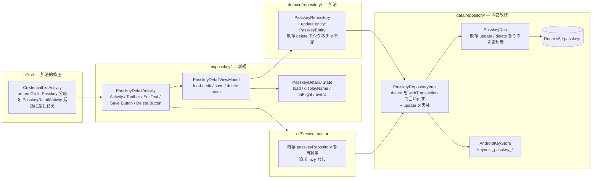
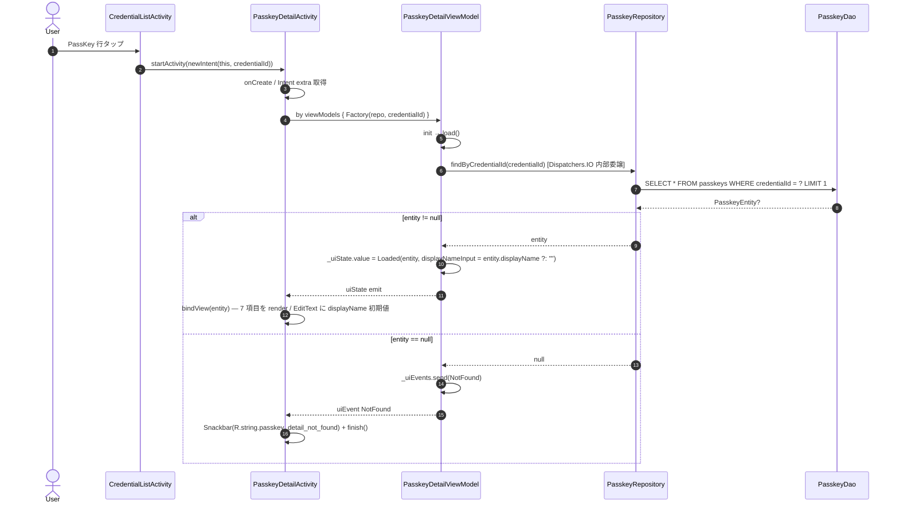
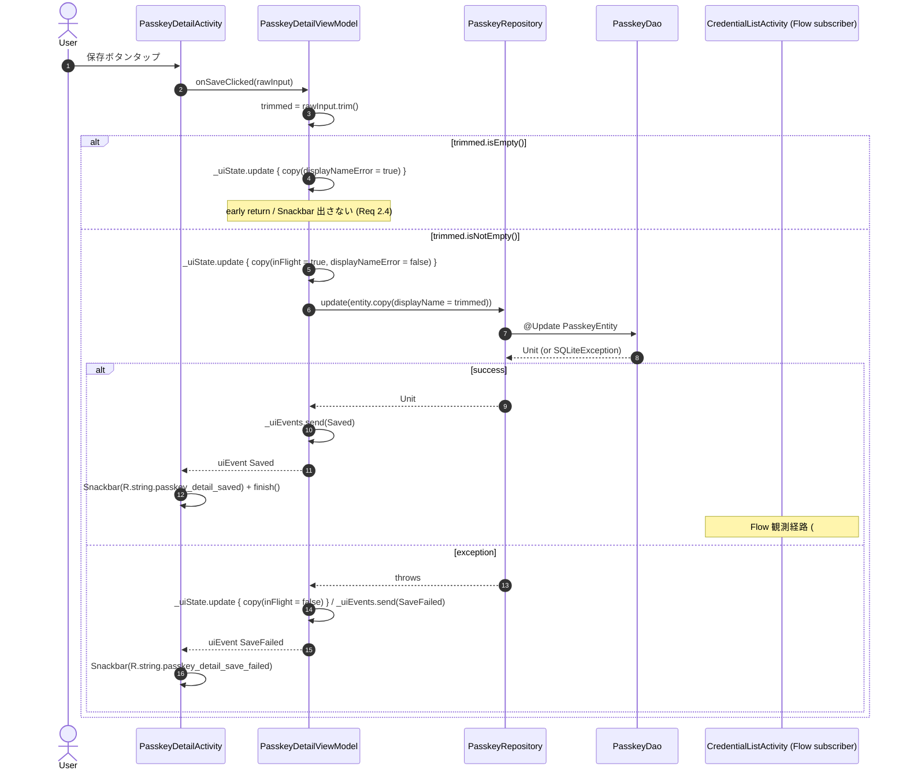
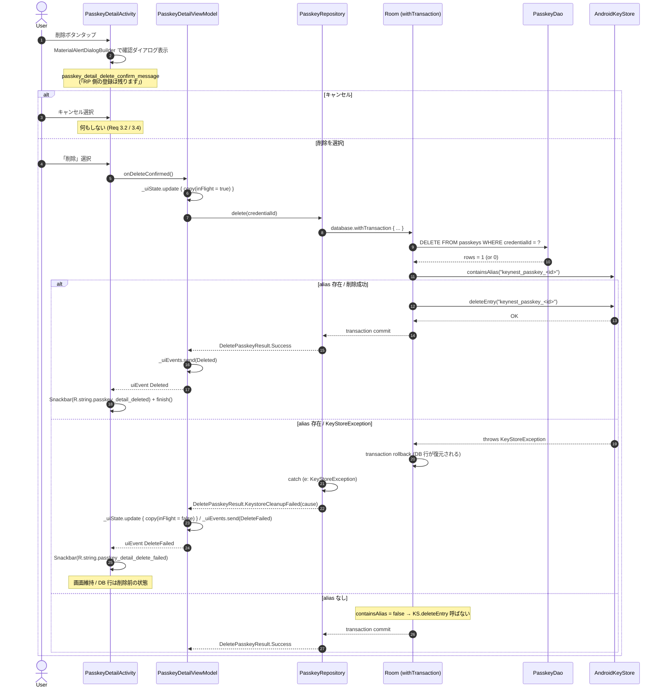

# Design Document — Issue #102 / feat(passkey): PassKey 単位の個別管理 UI (rename / delete)

> 関連: `requirements.md`（本ディレクトリ）
>
> - **Parent (umbrella)**: #89 feat(passkey): Android Credential Manager 経由の passkey プロバイダ対応
> - **Phase**: 5 (umbrella #89 サブ分割案 6)
> - **Depends on (merged)**:
>   - #91 — `passkeys` テーブル / `PasskeyEntity` / `PasskeyDao` / `Migration_4_5`
>   - #99 — 登録セレモニー、Keystore alias 命名規約 `keynest_passkey_<credentialId>` 確立済
>   - #100 — 認証セレモニー、`PasskeyRepositoryImpl` に `KeyNestDatabase` 注入済（`withTransaction` 利用可能）
>   - #101 — 一覧 UI 統合、`CredentialListItem.Passkey` variant / `PasskeyDisplayModel` / `onItemClick(CredentialListItem) -> Unit` callback 確立済
> - **作業ブランチ**: `claude/issue-102-design-feat-passkey-passkey-ui-rename-delete`
> - **PR base**: `develop`
> - **carve-out**: PassKey の export / 共有 / 同期 / RP 側登録解除導線 / displayName 以外の編集 / 種別フィルタ chip / DB schema 変更 / Service 系の変更（requirements.md `Out of Scope` に従う）
> - **表記**: UI ラベル / KDoc / コメント / ログ メッセージで PassKey 機能に言及する箇所は **「PassKey」** 表記固定（umbrella #89 確認事項 3）

## 1. Overview

### 1.1 Purpose

KeyNest は #91 (永続化) / #99 (登録) / #100 (認証) / #101 (一覧 UI) を経て、PassKey の保管・認証・閲覧が動作する状態にある。しかし保管済の **個々の PassKey をユーザーが KeyNest 上で管理（rename / delete）する手段が無い**。本 Issue は `PasskeyDetailActivity` を新規追加し、(1) PassKey メタデータ表示、(2) `displayName` 編集、(3) 確認ダイアログ経由の削除、(4) 一覧画面からの遷移経路差し替えを 1 PR の到達点とする。

### 1.2 Users / Impact

- **Users**: 既存 KeyNest 利用者で、PassKey を登録済 / RP 側で別アカウント整理時に古い PassKey を片付けたいユーザー。
- **Impact**: `CredentialListActivity` の PassKey 行タップ挙動が、#101 で導入した暫定 Snackbar (`credential_list_passkey_tap_v1_message`) から `PasskeyDetailActivity` 起動に差し替わる以外、既存画面の挙動を破壊しない（Requirement 6 / NFR 4）。データ層は `PasskeyDao.update` / `PasskeyDao.delete` / `PasskeyRepository.update` / `PasskeyRepository.delete` を活用するのみで、**DB schema 変更なし**（#91 で `displayName: TEXT NULL` が `passkeys` テーブル v5 に存在することを確認済 — `PasskeyEntity.displayName: String?` / Issue #91 design §3.1 / 本ファイル §3.1.1）。

### 1.3 Goals

1. `PasskeyDetailActivity` を新規追加し、`rpId` / `rpDisplayName` / `userName` / `userDisplayName` / `displayName` / `createdAt` / `lastUsedAt` の 7 項目を読み取り専用 + `displayName` のみ編集可で表示する。
2. `displayName` を空文字 / 空白のみで保存できないようバリデーションし、合法時は `PasskeyRepository.update` で他フィールド不変のまま保存する。
3. 削除は確認ダイアログ後に **DB first** (`Room transaction で row delete → KeyStore.deleteEntry`) を `PasskeyRepository.delete` 内で原子化する。KeyStore 削除失敗時は DB トランザクションをロールバックする（要件 3.6 / 3.7）。
4. `CredentialListActivity` の PassKey 行タップを `PasskeyDetailActivity` 起動に差し替える（暫定 Snackbar 撤去）。
5. 既存テスト全件 PASS + 新規 ViewModel / Repository / Robolectric テストで主要パスを回帰検知可能にする。
6. 既存 `PasskeyRepository.delete(credentialId): DeletePasskeyResult` の **シグネチャを変更せず** 内部順序のみ「DB first + rollback on KS failure」に置き換える（Requirement 6.4）。

### 1.4 Non-Goals

- PassKey の export / 共有 / バックアップ / 同期 / RP 側登録解除導線 — Out of Scope
- `displayName` 以外のフィールドの編集（`rpId` / `userName` / `signCount` / `isDiscoverable` / `userHandle` 等は read-only）
- 一覧画面側の種別フィルタ chip 表出 / sort UI の変更
- Recently used carousel への PassKey 統合
- DB schema 変更 / migration 追加
- `CredentialProviderService` / `PasskeyAuthActivity` / `KeyNestAutofillService` の変更
- AAGUID / `keyAlias` / `signCount` / `userHandle` / `encryptedPrivateKey` の UI 表示（NFR 2.1）

## 2. Architecture

### 2.1 Existing Architecture Analysis

- **現在のアーキテクチャ**: `ui/<feature>/` package に Activity + ViewModel + UiState の 3 点セットを置く ServiceLocator DI / View System (XML + ViewBinding) ベース。Compose は未採用（`CredentialListActivity` / `CredentialEditActivity` / `SettingsActivity` 全てが Android View System ベース）。
- **尊重すべきドメイン境界**:
  - `ui/<feature>/` Activity は ServiceLocator から UseCase / Repository を解決し、ViewModel を構築する
  - 永続化境界は `data/repository/` 配下の `*RepositoryImpl` が握る
  - Keystore alias 操作は `PasskeyRepositoryImpl` 内で完結（呼び出し側に漏らさない）
  - `CredentialProviderService` / `credentialprovider/` 配下は触らない
- **維持すべき統合点**:
  - `PasskeyRepository.delete(credentialId): DeletePasskeyResult` のシグネチャ（戻り値型含む / Requirement 6.4）
  - `PasskeyRepository.findByCredentialId` / `update(entity: PasskeyEntity)` のシグネチャ
  - `keynest_passkey_<credentialId>` Keystore alias 命名規約（#99 確立 / `PasskeyRepositoryImpl.Companion.aliasFor`）
  - `CredentialListActivity` の `setUpMainList` 内 `onItemClick` callback 形式（#101 `(CredentialListItem) -> Unit`）
  - `R.string.passkey_*` 系の既存命名（#99 / #101 / #103 と整合）
- **解消する technical debt**:
  - 現行 `PasskeyRepositoryImpl.delete` は `dao.delete(credentialId)` の後で try-catch で Keystore を消すが、`withTransaction` で囲んでいないため **Keystore 失敗時に DB がロールバックされない**。本 Issue で `database.withTransaction { ... }` に内包して「KS 失敗時に DB も巻き戻す」を実現する（要件 3.7）。`#100` で既に `signWithIncrement` で同 DB に対し `withTransaction` を使用済のため、追加依存なしで対応可能。

### 2.2 Architecture Pattern & Boundary Map



**Architecture Integration**:
- **採用パターン**: 既存 `ui/edit/CredentialEditActivity` + `CredentialEditViewModel` と同形の Activity + ViewModel + UiState 三点セット。`StateFlow<PasskeyDetailUiState>` を観測し `lifecycleScope.launch { repeatOnLifecycle(STARTED) { collect { ... } } }` で render（既存 `CredentialListActivity` / `SettingsActivity` のパターン踏襲）。
- **ドメイン境界**:
  - `PasskeyDetailActivity` / `PasskeyDetailViewModel` / `PasskeyDetailUiState` を `ui/passkey/` 新規 sub-package に集約（#103 が `ui/settings/passkey/` を確立済の対比で、本 Issue は **編集系**として `ui/passkey/` 直下に置き、後続 PassKey UI が増えた際の格納先とする）
  - Activity ↔ ViewModel 間は StateFlow + `Channel<UiEvent>` (Snackbar / finish の一過性イベント)
  - Repository ↔ ViewModel 間は suspend fun のみ（Flow 観測なし）
- **既存パターンの維持**:
  - ServiceLocator 1 行追加なし（既存 `passkeyRepository` を再利用 / NFR 4）
  - `R.string.passkey_detail_*` 系の string resource 経由 i18n（Requirement 5.2 / 5.3）
  - `Snackbar` での Save / Delete / Failure / Not-found 通知（既存 `CredentialListActivity` と同じ UX 粒度）
  - PassKey 表記は固定文言として `values/strings.xml` / `values-ja/strings.xml` 両方に「PassKey」を出す（i18n 不要 / Requirement 5.3）
- **新規コンポーネントの根拠**:
  - `PasskeyDetailActivity` / `PasskeyDetailViewModel` / `PasskeyDetailUiState`: 詳細画面の責務集約（読込 / 編集 / 削除 / 二重操作防止）
  - `PasskeyRepository.update`: rename の永続化 API。既存 `PasskeyDao.update` を delegate するのみ（#91 / #99 inline 時点で `update(entity)` は DAO に存在するが Repository interface には未公開のため、本 Issue で **加法的に公開**する）

### 2.3 Technology Stack

| Layer | Choice / Version | Role in Feature | Notes |
|-------|------------------|-----------------|-------|
| UI / View | Android View System (XML layout + ViewBinding) | `PasskeyDetailActivity` の inflate / EditText / Buttons | 既存 Activity 群と統一。Compose は未採用 |
| ViewModel | `androidx.lifecycle:lifecycle-viewmodel-ktx 2.8.6` | `PasskeyDetailViewModel` | 既存 |
| State | `kotlinx.coroutines.flow.StateFlow` + `Channel<UiEvent>` | `PasskeyDetailUiState` + 一過性 Snackbar イベント | 既存パターン (`CredentialListViewModel.duplicateResult` 等) |
| Confirm dialog | `androidx.appcompat.app.AlertDialog` または `MaterialAlertDialogBuilder` | 削除確認ダイアログ | `CredentialEditActivity` で `MaterialAlertDialogBuilder` 利用済のため踏襲 |
| Snackbar | `com.google.android.material:material 1.12.x` (既存) | Save / Delete / 失敗 / Not-found 通知 | 既存 |
| Date format | 既存 `CredentialEditActivity` と同方式 (`AdvancedDetailsFormatter` 風 / `DateUtils.getRelativeTimeSpanString` 等) | createdAt / lastUsedAt の表示 | §4.2 で確定 |
| Persistence | Room 2.6.x (`@Update` / `@Query("DELETE ...")`) | `PasskeyDao.update` / `delete` 既存 | 新規メソッド追加なし |
| Transaction | `androidx.room:room-ktx.withTransaction` | `delete` 内で DB → KS の atomic 化 | `PasskeyRepositoryImpl` 既存 `database: KeyNestDatabase` 注入を再利用（#100 で導入済） |
| Keystore | `java.security.KeyStore` (`ANDROID_KEYSTORE`) | alias `keynest_passkey_<credentialId>` の `deleteEntry` | 既存 `PasskeyRepositoryImpl.delete` で利用済 |
| Test (Unit) | Robolectric 4.13 + mockk 1.13.12 + Truth 1.4.4 + `kotlinx-coroutines-test` | `PasskeyDetailViewModelTest` / `PasskeyRepositoryTest` 拡張 | 既存 |
| Test (Instrumentation / Robolectric) | `androidx.test.ext:junit` + Robolectric `@Config(sdk = [33])` | 削除確認ダイアログ文言 / 一覧→詳細起動 intent 検証 | `SystemSettingsIntentsTest` / `CredentialListAdapterInstrumentationTest` の前例踏襲 |

## 3. File Structure Plan

### 3.1 Directory Structure

```
app/src/main/java/io/github/hitoshiichikawa/keynest/
├── ui/passkey/                                     # 新規 sub-package
│   ├── PasskeyDetailActivity.kt                    # 新規: 詳細画面 Activity
│   ├── PasskeyDetailViewModel.kt                   # 新規: load / edit / delete state + UseCase 呼び出し
│   ├── PasskeyDetailUiState.kt                     # 新規: data class (load / displayName / inFlight)
│   └── PasskeyDetailUiEvent.kt                     # 新規: sealed interface (Saved / Deleted / SaveFailed / DeleteFailed / NotFound)
├── ui/list/
│   └── CredentialListActivity.kt                   # 修正: PassKey 行タップを PasskeyDetailActivity 起動に差し替え
├── domain/repository/
│   └── PasskeyRepository.kt                        # 修正: update(entity: PasskeyEntity) を interface に加法的追加
└── data/repository/
    └── PasskeyRepositoryImpl.kt                    # 修正: update を実装 / delete を withTransaction で囲い直す

app/src/main/res/
├── layout/
│   └── passkey_detail_activity.xml                 # 新規: Toolbar + 7 項目 + EditText + Save / Delete ボタン
├── values/strings.xml                              # 修正: passkey_detail_* 系 string key を追加 (en)
└── values-ja/strings.xml                           # 修正: 同 key の ja 翻訳追加

app/src/main/AndroidManifest.xml                    # 修正: <activity android:name=".ui.passkey.PasskeyDetailActivity"/> 追加

app/src/test/java/io/github/hitoshiichikawa/keynest/
├── ui/passkey/
│   ├── PasskeyDetailViewModelTest.kt               # 新規: load / save / delete / validation / rollback の主要パス
│   └── PasskeyDetailActivityTest.kt                # 新規 (Robolectric): 削除確認ダイアログの文言検証 / Snackbar
└── data/
    └── PasskeyRepositoryTest.kt                    # 修正: update / delete (DB rollback) の検証ケース追加

app/src/androidTest/java/io/github/hitoshiichikawa/keynest/
└── ui/list/
    └── CredentialListActivityPasskeyNavigationTest.kt  # 新規 (Robolectric): PassKey 行タップで PasskeyDetailActivity が起動し credentialId extra が渡る検証
```

### 3.2 Modified Files

| Path | 変更概要 | 参照 Requirement |
|------|---------|----------------|
| `app/src/main/java/.../domain/repository/PasskeyRepository.kt` | `suspend fun update(entity: PasskeyEntity)` を interface に加法的追加。既存 7 メソッドのシグネチャ不変 | 2.5 / 6.4 |
| `app/src/main/java/.../data/repository/PasskeyRepositoryImpl.kt` | (1) `override suspend fun update(entity: PasskeyEntity) = dao.update(entity)` を実装 / (2) `delete(credentialId)` を `database.withTransaction { dao.delete(credentialId); KeyStore.deleteEntry(alias) }` で囲い直し、KeyStoreException を transaction 内で **rethrow** することで Room に rollback させた上で外側 try-catch で `DeletePasskeyResult.KeystoreCleanupFailed(cause)` に変換 (§5.3 / 要件 3.6 / 3.7) | 3.6 / 3.7 / 6.4 / 7.5 / 7.6 |
| `app/src/main/java/.../ui/list/CredentialListActivity.kt` | (1) `onItemClick` callback の `CredentialListItem.Passkey` 分岐で `showPasskeyTapSnackbar()` を撤去し `startActivity(PasskeyDetailActivity.newIntent(this, credentialId = item.passkey.credentialId))` に差し替え / (2) `viewModel.onPasskeyClicked(...)` 呼び出しも撤去 (本 Issue で edit 経路が確立するため不要) / (3) 既存 password 行タップ挙動 (`startEdit(item.credential)`) / 長押し / overflow は無変更 | 4.1 / 4.2 / 4.3 / 4.4 / 4.5 |
| `app/src/main/AndroidManifest.xml` | `<activity android:name=".ui.passkey.PasskeyDetailActivity" android:exported="false" android:parentActivityName=".ui.list.CredentialListActivity"/>` を追加 | 1.1 / 4.5 |
| `app/src/main/res/values/strings.xml` | §4.3 の string keys 追加 (en) | 5.2 / 5.3 |
| `app/src/main/res/values-ja/strings.xml` | 同 keys の ja 翻訳追加。「PassKey」は固定文言（NFR 3.2） | 5.1 / 5.2 / 5.3 / NFR 3 |
| `app/src/test/java/.../data/PasskeyRepositoryTest.kt` | (1) `update_persistsEntity_unchangedOtherFields` 1 ケース / (2) `delete_returnsSuccess_andDbRowIsGone_andKeystoreAliasIsGone` (既存 Success ケースを `withTransaction` 経由で再確認 — 既に存在すれば assertion 強化のみ) / (3) `delete_returnsKeystoreCleanupFailed_andDbRowIsRolledBack_whenKeystoreThrows` (新規; 要件 3.7 / 7.6) | 7.5 / 7.6 / 7.7 |
| `app/src/test/java/.../ui/passkey/PasskeyDetailViewModelTest.kt` | 新規: §5.1 のテーブル参照 | 7.1 / 7.2 / 7.3 / 7.4 |
| `app/src/test/java/.../ui/passkey/PasskeyDetailActivityTest.kt` | 新規 (Robolectric): 削除確認ダイアログの文言検証 (要件 3.3) / Snackbar 表示 / `lifecycleScope` 起動 | 7.8 |
| `app/src/androidTest/java/.../ui/list/CredentialListActivityPasskeyNavigationTest.kt` | 新規 (Robolectric): `Shadows.shadowOf(activity).nextStartedActivity` で `PasskeyDetailActivity` 起動 + `credentialId` extra 検証 | 7.9 |

`CredentialListViewModel.onPasskeyClicked(...)` は #101 で **後続 Issue が差し替える前提**で `SafeLogger.info` を呼ぶだけの shim として残されている（#101 design §4.5.4 / §5.3 注釈）。本 Issue では Activity 側で sealed when から `PasskeyDetailActivity` を直接起動するため、`onPasskeyClicked` 呼び出しを撤去する。`CredentialListViewModel` 本体は無変更（method 自体は将来別用途で使われる可能性を残し、削除しない）。

## 4. Components and Interfaces

### 4.1 UI Layer

#### `PasskeyDetailActivity` (新規)

| Field | Detail |
|-------|--------|
| Intent | 1 件の PassKey の詳細表示 + `displayName` 編集 + 削除確認 + 削除実行を 1 画面に集約 |
| Requirements | 1.1, 1.2, 1.3, 1.4, 1.5, 1.6, 1.7, 1.8, 1.9, 1.10, 2.1, 2.2, 2.3, 2.4, 2.6, 2.7, 2.9, 3.1, 3.2, 3.3, 3.4, 3.8, 3.9, 3.11, 4.5, 5.1, 5.2, NFR 1.1, NFR 1.3, NFR 2.1, NFR 3.1 |

**Responsibilities & Constraints**:
- 起動時に `Intent` extra `credentialId` を読み、`viewModel.load(credentialId)` を呼ぶ
- `PasskeyDetailUiState` を観測して view を render（read-only 項目テキスト / `displayName` EditText / inFlight ボタン disable）
- `PasskeyDetailUiEvent` を `Channel.consumeEach` で収集し Snackbar / `finish()` を実行
- 「保存」ボタンで `viewModel.onSaveClicked(input)` を呼ぶ（trim / 空チェックは ViewModel 側 / Requirement 2.3 / 2.4）
- 「削除」ボタンで `MaterialAlertDialogBuilder` を表示し、確認後に `viewModel.onDeleteConfirmed()` を呼ぶ
- 削除確認ダイアログの本文は `R.string.passkey_detail_delete_confirm_message`（「KeyNest から削除します。RP 側の登録は残ります。」相当 / Requirement 3.3）
- AAGUID / `keyAlias` / `signCount` / `userHandle` / `encryptedPrivateKey` を画面に出さない（NFR 2.1）

**Dependencies**:
- Inbound: `CredentialListActivity` (Critical) — Intent extra `credentialId` 経由
- Outbound: `PasskeyDetailViewModel` (Critical) / `ServiceLocator.passkeyRepository` (経由的 / Factory 注入)
- External: `MaterialAlertDialogBuilder` / `Snackbar` (Material Components)

**Contracts**: API [x] (Activity Intent contract) / State [x] (StateFlow observer)

##### Public API

```kotlin
class PasskeyDetailActivity : AppCompatActivity() {
    companion object {
        const val EXTRA_CREDENTIAL_ID: String = "io.github.hitoshiichikawa.keynest.ui.passkey.extra.CREDENTIAL_ID"

        fun newIntent(context: Context, credentialId: String): Intent =
            Intent(context, PasskeyDetailActivity::class.java)
                .putExtra(EXTRA_CREDENTIAL_ID, credentialId)
    }
}
```

- **Precondition**: `credentialId` は非空 String（呼び出し側 `CredentialListActivity` は `CredentialListItem.Passkey.passkey.credentialId` から渡す）
- **Postcondition**: `finish()` で `CredentialListActivity` に戻る。Result は **渡さない**（Requirement 4.5 — 一覧画面は Flow 観測経路で自動 refresh される）
- **Invariants**: 起動時に Intent extra が無い / null の場合は `R.string.passkey_detail_not_found` Snackbar を出して即 `finish()`（防御的、Requirement 1.10 と同一文言）

##### View 構成 (passkey_detail_activity.xml)

| ID | Role | Visibility | 編集可否 |
|----|------|-----------|---------|
| `toolbar` | 画面タイトル「PassKey の詳細」 | VISIBLE | — |
| `text_rp_display_name` | 1 行目: `rpDisplayName` ?: `rpId` (Req 1.6) | VISIBLE | read-only |
| `text_user_display_name` | 2 行目: `userDisplayName` ?: `userName` ?: `R.string.passkey_detail_unknown_user` (Req 1.7) | VISIBLE | read-only |
| `text_rp_id` | RP ID 行: `rpId` 固定 | VISIBLE | read-only |
| `text_created_at` | 作成日: `createdAt` (端末ロケール) | VISIBLE | read-only |
| `text_last_used_at` | 最終使用日: `lastUsedAt` か `R.string.passkey_detail_last_used_never` (Req 1.8) | VISIBLE | read-only |
| `input_display_name_layout` (`TextInputLayout`) | KeyNest 上の別名ラベル + EditText | VISIBLE | **編集可** |
| `input_display_name` (`TextInputEditText`) | `displayName` 編集 EditText | VISIBLE | **編集可** |
| `btn_save` (`MaterialButton`) | 保存ボタン | VISIBLE | クリック可 |
| `btn_delete` (`MaterialButton` / `colorError` トーン) | 削除ボタン | VISIBLE | クリック可 |
| (他) `text_label_rp_display_name` 等の固定ラベル | string resource 経由のラベル | VISIBLE | read-only |

##### Activity 内クリック・観測フロー

```
onCreate:
  binding = PasskeyDetailActivityBinding.inflate(...)
  setSupportActionBar(binding.toolbar)
  supportActionBar.setDisplayHomeAsUpEnabled(true)   // Req 4.5
  credentialId = intent.getStringExtra(EXTRA_CREDENTIAL_ID)
  if (credentialId.isNullOrEmpty()) {
    Snackbar(R.string.passkey_detail_not_found); finish(); return
  }
  viewModel = by viewModels { Factory(ServiceLocator.passkeyRepository, credentialId) }
  binding.btnSave.setOnClickListener { viewModel.onSaveClicked(binding.inputDisplayName.text.toString()) }
  binding.btnDelete.setOnClickListener { showDeleteConfirmDialog() }
  collectUiState() / collectUiEvents()

showDeleteConfirmDialog():
  MaterialAlertDialogBuilder(this)
    .setMessage(R.string.passkey_detail_delete_confirm_message)
    .setPositiveButton(R.string.passkey_detail_delete_confirm_positive) { _, _ -> viewModel.onDeleteConfirmed() }
    .setNegativeButton(R.string.passkey_detail_delete_confirm_negative, null)
    .show()
```

#### `PasskeyDetailViewModel` (新規)

| Field | Detail |
|-------|--------|
| Intent | 詳細画面の状態 (load / edit / save / delete / inFlight) を `StateFlow` で公開し、一過性 UI イベントを `Channel` で配信する |
| Requirements | 1.1, 1.2, 1.10, 2.3, 2.4, 2.5, 2.6, 2.7, 2.8, 2.9, 2.10, 3.5, 3.7, 3.8, 3.9, 3.10, 3.11, NFR 1.2, NFR 1.3, NFR 2.1, NFR 2.2 |

**Responsibilities & Constraints**:
- `load(credentialId)`: 初期化時に 1 回だけ呼ぶ。`PasskeyRepository.findByCredentialId(credentialId)` を `viewModelScope` で実行
- 戻り値が null の場合は `PasskeyDetailUiEvent.NotFound` を Channel 送信
- `onSaveClicked(input: String)`: input を `trim()`、空ならエラー State + 終了
- 合法時は `entity.copy(displayName = trimmed)` を構成し `PasskeyRepository.update(...)` を `withContext(Dispatchers.IO)` または既存 Repository が IO に切ってくれる前提で呼ぶ（Repository は suspend fun のため main-safe）
- `onDeleteConfirmed()`: `PasskeyRepository.delete(credentialId)` の戻り値 `DeletePasskeyResult` を `when` 分岐：`Success` → `Deleted` イベント、`KeystoreCleanupFailed(cause)` → `DeleteFailed` イベント（Requirement 3.9）
- `inFlight: Boolean` State で保存 / 削除中の二重操作を防ぐ（Requirement 2.9 / 3.11）
- ログ出力で `credentialId` raw / `userHandle` / `keyAlias` を **出さない**（NFR 2.1 / 2.2）

**Dependencies**:
- Inbound: `PasskeyDetailActivity` (Critical)
- Outbound: `PasskeyRepository` (Critical)
- External: なし

**Contracts**: Service [x] / State [x]

##### Service Interface

```kotlin
class PasskeyDetailViewModel(
    private val repo: PasskeyRepository,
    private val credentialId: String,
) : ViewModel() {

    private val _uiState = MutableStateFlow(PasskeyDetailUiState.LOADING)
    val uiState: StateFlow<PasskeyDetailUiState> = _uiState.asStateFlow()

    private val _uiEvents = Channel<PasskeyDetailUiEvent>(capacity = Channel.BUFFERED)
    val uiEvents: Flow<PasskeyDetailUiEvent> = _uiEvents.receiveAsFlow()

    init { load() }

    /** initial load. credentialId is fixed at construction time. */
    private fun load()

    /** "保存" tap: trim → validate → repo.update → emit Saved or SaveFailed. */
    fun onSaveClicked(rawInput: String)

    /** "削除" 確認後: repo.delete → emit Deleted or DeleteFailed. */
    fun onDeleteConfirmed()

    /**
     * Factory provided to `by viewModels { Factory(...) }` from Activity.
     * Resolves `PasskeyRepository` from ServiceLocator and binds the
     * fixed credentialId from Intent extra.
     */
    class Factory(
        private val repo: PasskeyRepository,
        private val credentialId: String,
    ) : ViewModelProvider.Factory { /* ... */ }
}
```

- **Preconditions**: `credentialId` は非空 / `repo` は `ServiceLocator.passkeyRepository` 由来（singleton 再利用）
- **Postconditions**:
  - `load()` 成功: `_uiState.value = Loaded(entity, displayNameInput = entity.displayName ?: "")`
  - `load()` 失敗 (`null`): `_uiEvents.send(NotFound)` + ViewModel は `NotFound` 状態のまま（Activity 側で `finish()`）
  - `onSaveClicked` 合法: `_uiState.value` を `inFlight = true` → `update` 完了で `Saved` イベント
  - `onSaveClicked` 不正 (空文字): `_uiState.value` を `displayNameError = true` に更新（要件 2.4）し early return
  - `onSaveClicked` 例外: `_uiEvents.send(SaveFailed)` + `inFlight = false` で再操作可能
  - `onDeleteConfirmed` 成功: `_uiEvents.send(Deleted)`
  - `onDeleteConfirmed` `KeystoreCleanupFailed`: `_uiEvents.send(DeleteFailed)` + `inFlight = false`
  - `onDeleteConfirmed` 予期せぬ例外伝播: `_uiEvents.send(DeleteFailed)` + `inFlight = false`（DB rollback 済 / Requirement 3.9）
- **Invariants**:
  - `inFlight = true` の間は `onSaveClicked` / `onDeleteConfirmed` を no-op (二重実行防止 / 要件 2.9 / 3.11)
  - `update` で送る entity は **元 entity からの `copy(displayName = trimmed)`** のみ。他列は一切変更しない（Requirement 2.10 / 7.2）

#### `PasskeyDetailUiState` (新規 data class)

```kotlin
data class PasskeyDetailUiState(
    val loadKind: LoadKind,                 // Loading / Loaded / NotFound
    val entity: PasskeyEntity?,             // Loaded のとき non-null。UI は本値から read-only 行を render。NFR 2.1 範囲外の sensitive 列は UI bind で参照しない
    val displayNameInput: String,           // EditText の現在値 (init: entity.displayName ?: "")
    val displayNameError: Boolean,          // 空文字 / 空白のみで保存試行した時 true (Req 2.4)
    val inFlight: Boolean,                  // save / delete 実行中の二重操作防止 (Req 2.9 / 3.11)
) {
    enum class LoadKind { Loading, Loaded, NotFound }

    companion object {
        val LOADING: PasskeyDetailUiState = PasskeyDetailUiState(
            loadKind = LoadKind.Loading,
            entity = null,
            displayNameInput = "",
            displayNameError = false,
            inFlight = false,
        )
    }
}
```

> **Note (NFR 2.1)**: `PasskeyDetailUiState` が `PasskeyEntity` 全フィールドを保持するのは、`PasskeyRepository.update(entity)` 呼び出しで他フィールド不変を保証するため必要（Requirement 2.10）。UI bind 側で `userHandle` / `encryptedPrivateKey` / `privateKeyIv` / `keyAlias` / `signCount` / `isDiscoverable` を **画面に出さない**ことで NFR 2.1 を担保する。Activity 内では `entity.rpId` / `entity.rpDisplayName` / `entity.userName` / `entity.userDisplayName` / `entity.displayName` / `entity.createdAt` / `entity.lastUsedAt` の 7 列のみ参照する。

#### `PasskeyDetailUiEvent` (新規 sealed interface)

```kotlin
sealed interface PasskeyDetailUiEvent {
    object Saved : PasskeyDetailUiEvent       // Snackbar(R.string.passkey_detail_saved) + finish()
    object Deleted : PasskeyDetailUiEvent     // Snackbar(R.string.passkey_detail_deleted) + finish()
    object SaveFailed : PasskeyDetailUiEvent  // Snackbar(R.string.passkey_detail_save_failed); 画面維持
    object DeleteFailed : PasskeyDetailUiEvent // Snackbar(R.string.passkey_detail_delete_failed); 画面維持
    object NotFound : PasskeyDetailUiEvent    // Snackbar(R.string.passkey_detail_not_found) + finish()
}
```

設計判断: 一過性イベントは StateFlow ではなく Channel で配信することで、構成変更（rotation）の re-collect でも重複表示しない（既存 `CredentialListViewModel.duplicateResult: SharedFlow` の踏襲だが、`replay = 0` 相当 / 1 回限り消費の意図で `Channel.consumeEach`）。

### 4.2 Date / Time 表示の方針 (Req 1.9 / 1.8)

- 既存 `CredentialEditActivity` は `AdvancedDetailsFormatter` で `createdAt` / `updatedAt` を端末ロケール文字列に変換している（`SimpleDateFormat.getDateTimeInstance(DateFormat.MEDIUM, DateFormat.SHORT)` 系）
- 本 Issue でも **同 formatter を再利用** することで一貫性を保つ。新規 formatter 作成は不要
- `lastUsedAt == null` のときは formatter を呼ばず `R.string.passkey_detail_last_used_never` を表示（Req 1.8）

### 4.3 String resources (新規追加 keys)

| Key | en (`values/strings.xml`) | ja (`values-ja/strings.xml`) | 参照 Req |
|-----|-------------------------|-------------------------------|---------|
| `passkey_detail_title` | `"PassKey details"` | `"PassKey の詳細"` | 1.x / 5.1 / 5.2 |
| `passkey_detail_label_rp_display_name` | `"Service"` | `"サービス名"` | 1.3 / 1.6 |
| `passkey_detail_label_user_display_name` | `"User"` | `"ユーザー"` | 1.3 / 1.7 |
| `passkey_detail_label_rp_id` | `"RP ID"` | `"RP ID"` | 1.3 |
| `passkey_detail_label_created_at` | `"Created"` | `"作成日時"` | 1.3 / 1.9 |
| `passkey_detail_label_last_used_at` | `"Last used"` | `"最終使用日時"` | 1.3 / 1.9 |
| `passkey_detail_label_display_name` | `"Nickname in KeyNest"` | `"KeyNest 上の別名"` | 2.1 |
| `passkey_detail_hint_display_name` | `"Enter a nickname"` | `"別名を入力してください"` | 2.1 |
| `passkey_detail_unknown_user` | `"(no user name)"` | `"(ユーザー名なし)"` | 1.7 |
| `passkey_detail_last_used_never` | `"Never used"` | `"未使用"` | 1.8 |
| `passkey_detail_displayname_required` | `"Enter a nickname for KeyNest."` | `"KeyNest 上の別名を入力してください"` | 2.4 |
| `passkey_detail_save` | `"Save"` | `"保存"` | 2.1 |
| `passkey_detail_saved` | `"Saved."` | `"保存しました"` | 2.6 |
| `passkey_detail_save_failed` | `"Could not save."` | `"保存に失敗しました"` | 2.7 |
| `passkey_detail_delete` | `"Delete"` | `"削除"` | 3.1 |
| `passkey_detail_delete_confirm_title` | `"Delete this PassKey?"` | `"この PassKey を削除しますか?"` | 3.2 / 3.3 |
| `passkey_detail_delete_confirm_message` | `"This removes the PassKey from KeyNest. The registration on the RP side is not affected. You may need to revoke it separately on the RP if you no longer want to sign in."` | `"KeyNest から削除します。RP 側の登録は残ります。RP 側でサインインに使わないようにする場合は、別途解除操作が必要です。"` | 3.3 / 7.8 |
| `passkey_detail_delete_confirm_positive` | `"Delete"` | `"削除"` | 3.4 |
| `passkey_detail_delete_confirm_negative` | `"Cancel"` | `"キャンセル"` | 3.4 |
| `passkey_detail_deleted` | `"Deleted."` | `"削除しました"` | 3.8 |
| `passkey_detail_delete_failed` | `"Could not delete."` | `"削除に失敗しました"` | 3.9 |
| `passkey_detail_not_found` | `"PassKey not found."` | `"PassKey が見つかりません"` | 1.10 |

「PassKey」表記は en / ja 共に固定（NFR 3.2）。

### 4.4 Domain / Data Layer

#### `PasskeyRepository.update(entity: PasskeyEntity)` (新規 / 加法)

| Field | Detail |
|-------|--------|
| Intent | PassKey 1 件の全フィールドを Room の `@Update` で上書きする |
| Requirements | 2.5, 2.10, 6.4, 7.2, 7.7 |

**Responsibilities & Constraints**:
- 既存 `PasskeyDao.update(entity: PasskeyEntity)` (#91 で既に存在) を delegate
- Repository は Entity をそのまま受け取り、暗号化 / 復号 / Keystore 操作には **触らない** (rename は metadata 列のみの更新)
- `displayName` 以外の列も entity の値を SQL UPDATE で上書きするため、呼び出し側 (ViewModel) が `entity.copy(displayName = trimmed)` で他列を保持する責務を持つ（Requirement 2.10）
- DB 例外は呼び出し側にそのまま伝播

**Contracts**: Service [x]

##### Service Interface

```kotlin
// domain/repository/PasskeyRepository.kt に加法
interface PasskeyRepository {
    // 既存 7 メソッド ...

    /**
     * 1 件の PassKey 行を `@Update` で完全上書きする。Issue #102 の rename UI から
     * 呼ばれ、呼び出し側は元 entity の `copy(displayName = trimmed)` のみを変更して
     * 渡す責務を持つ (Requirement 2.10)。
     *
     * `credentialId` / `rpId` / `userHandle` / `encryptedPrivateKey` / `privateKeyIv`
     * / `keyAlias` / `signCount` / `isDiscoverable` / `createdAt` / `lastUsedAt` は
     * 呼び出し側が元の値を保持して渡すことが前提 (本メソッドは selective update を
     * 行わない)。
     */
    suspend fun update(entity: PasskeyEntity)
}
```

- **Precondition**: `entity.credentialId` は既存行に対応している（呼び出し側が `findByCredentialId` で取得した entity を copy して渡す）
- **Postcondition**: 該当行が `@Update` の SQL で全列上書きされる。silent no-op は SQLite の `UPDATE WHERE PK = ?` で行が無い時に発生しうるが、本 Issue の呼び出しパスでは ViewModel が直前に `findByCredentialId` で entity を取得しているため通常発生しない
- **Invariants**: 戻り値なし。例外 (`SQLiteException` 等) は呼び出し側に伝播

#### `PasskeyRepositoryImpl.delete(credentialId)` (内部改修 / シグネチャ不変)

| Field | Detail |
|-------|--------|
| Intent | DB 行削除 + Keystore alias 削除を Room transaction で原子化し、KS 失敗時に DB をロールバックする |
| Requirements | 3.6, 3.7, 6.4, 7.5, 7.6 |

**Responsibilities & Constraints**:
- 戻り値型 `DeletePasskeyResult` は変更しない（Requirement 6.4 / 既存呼び出し元 = 認証セレモニーの異常系で `KeystoreCleanupFailed` を読む経路を破壊しないため）
- 内部実装を `database.withTransaction { dao.delete(credentialId); keyStore.deleteEntry(alias) }` に変更
- `KeyStore.deleteEntry` が `KeyStoreException` をスローした場合、transaction 内で **rethrow** することで Room に rollback させ、外側 try-catch で `DeletePasskeyResult.KeystoreCleanupFailed(cause)` に変換して返す
- 「DB 削除済 / KS 残存」状態 (= 旧実装の挙動) は本 Issue で完全に解消される。`KeystoreCleanupFailed` が返るケースでも DB 行は **削除前の状態で保存されている** (Requirement 3.7 / 7.6)
- 既存テスト `delete_returnsKeystoreCleanupFailed_*` は assertion を強化して「DB 行が rollback されていること (= `dao.findByCredentialId(...)` が non-null)」を新規検証する

**Dependencies**:
- Inbound: `PasskeyDetailViewModel` (Critical) / 既存認証セレモニー側の異常系経路 (Backward-compatible)
- Outbound: `PasskeyDao.delete` / `KeyStore.deleteEntry` / `KeyNestDatabase.withTransaction`

**Contracts**: Service [x]

##### Service Interface (シグネチャ不変)

```kotlin
// data/repository/PasskeyRepositoryImpl.kt
override suspend fun delete(credentialId: String): DeletePasskeyResult {
    return try {
        database.withTransaction {
            dao.delete(credentialId)
            val keyStore = keyStoreLoader()
            val alias = aliasFor(credentialId)
            if (keyStore.containsAlias(alias)) {
                keyStore.deleteEntry(alias)   // KeyStoreException → rethrow で transaction rollback
            }
        }
        DeletePasskeyResult.Success
    } catch (e: KeyStoreException) {
        DeletePasskeyResult.KeystoreCleanupFailed(e)
    }
}
```

- **Precondition**: `credentialId` は WebAuthn base64url。`keyStoreLoader()` は `AndroidKeyStore` を `load(null)` 済の状態で返す（既存実装と同じ）
- **Postcondition**:
  - `Success`: DB 行も Keystore alias も削除されている / alias がそもそも無かった場合も `Success` (`containsAlias` ガード)
  - `KeystoreCleanupFailed(cause)`: DB 行は削除前の状態で保存されている / Keystore alias は残ったまま / `cause` は `KeyStoreException`
- **Invariants**:
  - DB と KS の状態は「両方削除済」または「両方未削除」のいずれかに収束する（best-effort ではなく strong consistency / Requirement 3.7）
  - `KeyStoreException` 以外の例外 (例: `SQLiteException`) は `withTransaction` 内で投げられて `delete` から伝播する（呼び出し側 ViewModel は `try-catch` で受けて `DeleteFailed` イベントに変換する / Requirement 3.9）

#### `PasskeyRepositoryImpl.update(entity)` (新規実装)

```kotlin
override suspend fun update(entity: PasskeyEntity) {
    dao.update(entity)
}
```

- 単純 delegate。`PasskeyDao.@Update` を呼ぶのみ
- AES-GCM / Keystore には触らない

## 5. Processing Flows

### 5.1 起動 → load → 表示



### 5.2 保存 → DB update → Snackbar + finish



### 5.3 削除 → 確認 → DB rollback or Success



### 5.4 一覧画面の自動 refresh (Req 3.12)

削除成功時に `PasskeyDetailActivity` が `finish()` して `CredentialListActivity` に戻ると、#101 で確立した `PasskeyRepository.listAll(): Flow<List<PasskeyEntity>>` 経由で Room invalidation tracker が `passkeys` テーブル変更を検知し、`CredentialListViewModel.mainListFlow` の `combine` が再評価されて当該 PassKey 行がリストから消える。本 Issue は **明示的な refresh コマンドを送らない**（Requirement 3.12）。

## 6. Error Handling

### 6.1 Error Strategy

| エラー種別 | 発火場所 | 対応 | 文言 |
|----------|---------|------|------|
| Intent extra `credentialId` が null / 空 | `PasskeyDetailActivity.onCreate` | Snackbar + `finish()` | `passkey_detail_not_found` |
| `findByCredentialId` が null (= 削除済 / 不正 ID) | `PasskeyDetailViewModel.load` | `NotFound` event → Snackbar + `finish()` | `passkey_detail_not_found` |
| `displayName` が空文字 / 空白のみ | `PasskeyDetailViewModel.onSaveClicked` | EditText の `TextInputLayout.error` 表示 + 保存処理 skip | `passkey_detail_displayname_required` |
| `PasskeyRepository.update` 例外 (`SQLiteException` 等) | `PasskeyDetailViewModel.onSaveClicked` | `SaveFailed` event → Snackbar / 画面維持 / `inFlight = false` | `passkey_detail_save_failed` |
| `PasskeyRepository.delete` が `KeystoreCleanupFailed` 返却 | `PasskeyDetailViewModel.onDeleteConfirmed` | `DeleteFailed` event → Snackbar / 画面維持 / `inFlight = false` | `passkey_detail_delete_failed` |
| `PasskeyRepository.delete` が予期せぬ例外伝播 (= DB 例外で transaction rollback) | `PasskeyDetailViewModel.onDeleteConfirmed` catch | `DeleteFailed` event → Snackbar / 画面維持 / `inFlight = false` | `passkey_detail_delete_failed` |
| 二重タップ (保存 / 削除中) | `PasskeyDetailViewModel` | `inFlight = true` の間は no-op (UI 側も `isEnabled = false` でガード) | — |

### 6.2 Error Categories and Responses

- **User Errors (validation)**: `displayName` 空文字 → `TextInputLayout.error` で field-level inline error。Snackbar は出さない (画面遷移しない / 入力修正導線)
- **System Errors (DB / Keystore)**: Snackbar で一過性通知。画面を閉じず、ユーザーが再試行できる状態を維持
- **Business Logic Errors**: 「RP 側の登録は残ります」を確認ダイアログ本文で明示 (Requirement 3.3) — これは error ではなく **destructive アクションの事前説明** として扱う

### 6.3 ログ出力ポリシー (NFR 2.1 / 2.2)

- `SafeLogger.info` / `warn` で credentialId raw を出さない（先頭 8 文字程度の prefix は許容、本 Issue では「実行イベント名 + サイズ」のみログ）
- `userHandle` / `keyAlias` / `signCount` / `encryptedPrivateKey` / `privateKeyIv` / AAGUID をログに出さない
- 例外メッセージに credentialId raw を埋め込まない（`SafeLogger.warn("delete failed", throwable = cause)` のみ。message 文字列に id を入れない）

## 7. Testing Strategy

### 7.1 Unit Tests (`app/src/test/java/...`)

| Test file | Cases (3-5 項目) | 参照 Requirement |
|-----------|-----------------|----------------|
| `ui/passkey/PasskeyDetailViewModelTest.kt` (新規) | (1) `load_emitsLoaded_whenRepoReturnsEntity` (Req 1.2) / (2) `load_emitsNotFoundEvent_whenRepoReturnsNull` (Req 1.10) / (3) `onSaveClicked_withBlankInput_setsDisplayNameError_andDoesNotCallUpdate` (Req 2.4 / 7.1) / (4) `onSaveClicked_withValidInput_callsUpdate_withOnlyDisplayNameChanged_andEmitsSavedEvent` (Req 2.5 / 2.10 / 7.2) / (5) `onSaveClicked_whenRepoThrows_emitsSaveFailedEvent_andClearsInFlight` (Req 2.7 / 2.9) / (6) `onDeleteConfirmed_whenRepoReturnsSuccess_emitsDeletedEvent` (Req 3.8 / 7.3) / (7) `onDeleteConfirmed_whenRepoReturnsKeystoreCleanupFailed_emitsDeleteFailedEvent_andDoesNotEmitDeleted` (Req 3.9 / 7.4) / (8) `onSaveClicked_whileInFlight_isNoOp` (Req 2.9) / (9) `onDeleteConfirmed_whileInFlight_isNoOp` (Req 3.11) | 1.2, 1.10, 2.4, 2.5, 2.7, 2.9, 2.10, 3.8, 3.9, 3.11, 7.1, 7.2, 7.3, 7.4 |
| `data/PasskeyRepositoryTest.kt` (拡張) | (10) `update_persistsEntity_andDoesNotChangeOtherFields` — 全 14 列を pre-update entity と比較し displayName のみ差分があることを検証 (Req 7.7) / (11) `delete_returnsSuccess_andRowIsAbsent_andAliasIsAbsent` — `withTransaction` 経由でも happy path で `Success` 返却 (既存ケースの assertion 強化) / (12) `delete_returnsKeystoreCleanupFailed_andDbRowIsRestored_whenKeyStoreThrows` — fake `KeyStore` で `deleteEntry` が `KeyStoreException` を投げる時、戻り値が `KeystoreCleanupFailed` かつ `dao.findByCredentialId` が non-null で返ることを検証 (Req 3.7 / 7.6) / (13) `delete_callOrder_isDbFirstThenKeystore` — DAO mock の call order を verify (Req 7.5) | 3.6, 3.7, 6.4, 7.5, 7.6, 7.7 |

### 7.2 Integration / Robolectric Tests (`app/src/test/java/...`)

| Test file | Cases | 参照 Requirement |
|-----------|-------|----------------|
| `ui/passkey/PasskeyDetailActivityTest.kt` (新規 / Robolectric `@Config(sdk = [33])`) | (1) `deleteButton_showsConfirmDialog_withRpSideRetentionMessage` — `MaterialAlertDialogBuilder` を tap し、表示されたダイアログ本文 TextView の text に `R.string.passkey_detail_delete_confirm_message` の文字列 (「RP 側の登録は残ります」) が含まれることを検証 (Req 7.8) / (2) `notFoundIntent_finishesActivity_andShowsNotFoundSnackbar` (Req 1.10) / (3) `saveButton_disabled_whileInFlight` (Req 2.9) | 1.10, 3.3, 7.8 |

### 7.3 Instrumentation / UI Tests (`app/src/androidTest/java/...`)

| Test file | Cases | 参照 Requirement |
|-----------|-------|----------------|
| `ui/list/CredentialListActivityPasskeyNavigationTest.kt` (新規 / Robolectric) | (1) `passkeyRowTap_startsPasskeyDetailActivity_withCredentialIdExtra` — `Shadows.shadowOf(activity).nextStartedActivity` で `PasskeyDetailActivity` の ComponentName + extra `credentialId` を検証 (Req 4.1 / 4.2 / 7.9) / (2) `passwordRowTap_stillStartsCredentialEditActivity` — password 行タップが既存挙動を保つこと (Req 4.3 / 7.10) | 4.1, 4.2, 4.3, 7.9, 7.10 |

### 7.4 既存テストの維持確認 (Req 7.10)

- `CredentialListAdapterInstrumentationTest` / `CredentialListViewModelTest` (#101 で追加) は本 Issue で **assertion / setup を変更しない**。Activity 側 callback が `Snackbar` → `startActivity` に変わるだけで、Adapter / ViewModel は無変更
- `PasskeyRepositoryTest` の既存 `delete` ハッピーパスケースは `withTransaction` 経由でも同 assertion で PASS する想定。失敗時のみ assertion を強化（DB 行が非削除であることを追加検証）

### 7.5 Performance / Load (該当なし)

本 Issue は単発 Activity の起動 / 編集 / 削除のみで、N=1 件操作。性能観点の追加 NFR なし。

## 8. Security Considerations

### 8.1 Sensitive データの非表示 (NFR 2.1)

- `PasskeyDetailUiState` は `PasskeyEntity` 全体を保持するが、`PasskeyDetailActivity` の view bind 側で `userHandle` / `encryptedPrivateKey` / `privateKeyIv` / `keyAlias` / `signCount` / AAGUID を **参照しない** ことで NFR 2.1 を担保
- 「画面表示しない」リスト (Req 1.4 / 1.5) を design.md と layout XML 両方に明示
- 後続 Issue で表示候補に挙がっても、`passkey_detail_*` string keys が無いため accidentally 出ることを防ぐ

### 8.2 ログ漏洩防止 (NFR 2.2)

- §6.3 のログポリシー遵守
- `SafeLogger` 既存 API を用い、`tag = "KeyNest.PasskeyDetail"` で `info` 以上に credentialId raw を出さない

### 8.3 削除時の鍵リーク方向の遮断 (Requirement 3.6 / 3.7)

- Option A (DB first) を `withTransaction` で原子化することで、KS 削除失敗時に DB 行も巻き戻る
- 旧実装の「DB 削除済 / KS 残存」状態 (鍵のみ orphan) は本 Issue で解消されるため、`DeletePasskeyResult.KeystoreCleanupFailed` 返却時の意味が「両方未削除 / ユーザーから見て何も変わらない」に統一される

### 8.4 エクスポート禁止 (NFR 2.4 / umbrella #89 確認事項 7)

- `PasskeyDetailActivity` に export / 共有 / バックアップ / 同期系の UI 要素を一切置かない
- `displayName` 編集 EditText 以外で文字列をクリップボードへコピーする経路を作らない (Long-press などのテキスト選択コピーは Android 標準挙動で許容、`text_user_display_name` / `text_rp_id` 等は `android:textIsSelectable="false"` がデフォルト)

## 9. Risks / 既知の制約

| Risk | 影響 | 緩和策 |
|------|------|--------|
| `KeyStore.deleteEntry` の例外型が `KeyStoreException` 以外 (例: `ProviderException`, `SecurityException`) を投げる Android バージョン差 | 旧実装と同じく外側 catch が握り潰せず、ViewModel に伝播 → DeleteFailed イベントになる | `withTransaction` 内で `KeyStoreException` 以外も rethrow される（DB rollback される）ため、データ整合性は保たれる。ViewModel 側の `try-catch` で `Throwable` を受けて DeleteFailed に変換する（Requirement 3.9 と整合 / 設計判断: 既存 `delete` の catch は `KeyStoreException` 限定だが、本 Issue でも互換性のため `KeyStoreException` のみを `KeystoreCleanupFailed` に変換、それ以外は外側に伝播させ ViewModel で DeleteFailed として扱う） |
| `withTransaction` を使うことで `database` 引数が `PasskeyRepositoryImpl` のコンストラクタに既に存在することへの依存 | #100 で導入済 / 現コードベースで commit 済（`PasskeyRepositoryImpl(database.passkeyDao(), database)` / `ServiceLocator.kt` L91）のため新規依存追加なし | Read で確認済 (§2.1) |
| `PasskeyDao.update` が `@Update` で全列上書きするため、呼び出し側 ViewModel が `entity.copy(displayName = trimmed)` 以外の差分を入れたら意図せず他列が更新される | rename 以外の編集 UI が本 Issue 範囲外なため、現実の混入リスクは低 | `PasskeyDetailViewModelTest` ケース (4) で「displayName のみ差分」を assert (Req 7.2) |
| `PasskeyDetailUiState.entity: PasskeyEntity?` が UI レイヤに entity を直接持ち込むことの設計境界違反疑い (#101 では `PasskeyDisplayModel` で sensitive 列を遮断していた) | 本 Issue は **rename 時に元 entity の全列を保持する必要がある** ため、UI 用の trimmed projection だと `update` 呼び出し時に他列を失う | UI bind 側で参照する列を **7 列に限定** することで NFR 2.1 を担保。`@VisibleForTesting`/internal 化で entity を外部に漏らさない。代替案 (UI 用 model + 元 entity の二段持ち) は実装複雑度が上がるため見送る (§4.1 PasskeyDetailUiState の Note 参照) |
| 確認ダイアログを `MaterialAlertDialogBuilder` で出すと dismiss 時にコールバックが呼ばれないテスト経路 | Robolectric の Dialog Shadow で本文取得 + button click 検証は確立済パターン (`SettingsActivityTest` の例) | `ShadowAlertDialog.getLatestAlertDialog()` で参照 |
| 一覧画面のタップで Activity 起動した直後に背面で Flow refresh が走り、削除済 PassKey が一瞬残る視覚 | UX 観点 — 削除確定までは存在表示が正しいため許容 | `finish()` 時点で list 側 Flow が再評価される (#101 の listAll の Room invalidation tracker 経由) ため、復帰時には削除済の状態が反映される |

## 10. 既存実装への影響範囲

| 領域 | 変更 | 互換性 |
|------|------|--------|
| `domain/repository/PasskeyRepository.kt` | `update(entity)` を **加法的に追加** | Backward compatible (既存呼び出し元なし) |
| `data/repository/PasskeyRepositoryImpl.kt` | `delete` 内部を `withTransaction` で囲み直し / `update` を実装 | Backward compatible (戻り値型 `DeletePasskeyResult` 不変 / Requirement 6.4) |
| `data/dao/PasskeyDao.kt` | 変更なし (`update` / `delete` 既存) | — |
| `data/entity/PasskeyEntity.kt` | 変更なし (`displayName: String?` 列既存) | — |
| `data/KeyNestDatabase.kt` / `data/migration/*` | 変更なし (DB schema v5 維持 / Req 6.6) | — |
| `di/ServiceLocator.kt` | 変更なし (`passkeyRepository` 既存 singleton 再利用) | — |
| `ui/list/CredentialListActivity.kt` | PassKey 行 onItemClick の `Passkey` 分岐のみ差し替え | password 行 / 長押し / overflow / 検索 / フィルタ / sort は無変更 (Req 6.2 / 4.3 / 4.4) |
| `ui/list/CredentialListViewModel.kt` | 変更なし (`onPasskeyClicked` shim は呼ばれなくなるが残存) | — |
| `ui/list/CredentialListAdapter.kt` | 変更なし | — |
| `credentialprovider/*` | 変更なし (Req 6.3) | — |
| `AndroidManifest.xml` | `PasskeyDetailActivity` の `<activity>` 追加 (export false) | 加法的 |
| Build settings (`compileSdk` / `targetSdk` / `minSdk` / `namespace`) | 変更なし (Req 6.5) | — |

## 11. Open Questions

> 本 Issue requirements §「Open Questions」は 2 件とも PM 段階で決定済（「未使用」/ DB first Option A）。Architect への申し送りなし。
>
> 設計段階で追加の未決事項は **なし**。

実装段階で気づき得る点として、人間 reviewer に確認してもらう候補:

1. `KeyStore.deleteEntry` の例外型が `KeyStoreException` 以外を投げる端末で `withTransaction` 内 rethrow 経路が問題ないか（§9 リスク 1）— 既存 `delete` catch は `KeyStoreException` 限定なので、本 Issue でも同範囲に留める判断。他 Throwable は ViewModel 側 catch で `DeleteFailed` に変換し、データ整合性は `withTransaction` rollback で保証される
2. `PasskeyDetailUiState` に `PasskeyEntity` を直接保持する設計境界（§9 リスク 4）— UI 用 projection を別途用意する代替案を取らない判断と、NFR 2.1 を bind 側で守る方針
3. `passkey_detail_delete_confirm_message` の日英文言（「RP 側の登録は残ります。RP 側でサインインに使わないようにする場合は、別途解除操作が必要です。」）— Requirement 3.3 の趣旨を満たすか、より簡潔な文言が望ましいか

## 12. PR 確認事項候補（reviewer 向け）

PR description に転記する候補:

1. `PasskeyRepositoryImpl.delete` を `withTransaction` で囲い直した結果、戻り値型 `DeletePasskeyResult` のシグネチャは変更されないこと（Requirement 6.4 / 既存呼び出し元への影響なし）
2. `delete` 失敗時に DB 行が rollback され「DB 上に消えたが KS は残る」「DB に死んだ参照が残る」のどちらの状態も発生しないこと（`PasskeyRepositoryTest` ケース (12) で検証）
3. `PasskeyDetailViewModel.onSaveClicked` で `entity.copy(displayName = trimmed)` 以外の差分を作らないことを test ケース (4) で検証していること（Requirement 2.10 / 7.2）
4. `PasskeyDetailActivity` の view bind が `userHandle` / `encryptedPrivateKey` / `privateKeyIv` / `keyAlias` / `signCount` / AAGUID を参照しないこと（NFR 2.1）
5. `CredentialListActivity` の PassKey 行タップが `PasskeyDetailActivity` 起動に差し替わり、暫定 Snackbar (`credential_list_passkey_tap_v1_message`) が撤去されていること
6. en / ja 両ロケールで「PassKey」表記が固定されていること（NFR 3.2）
