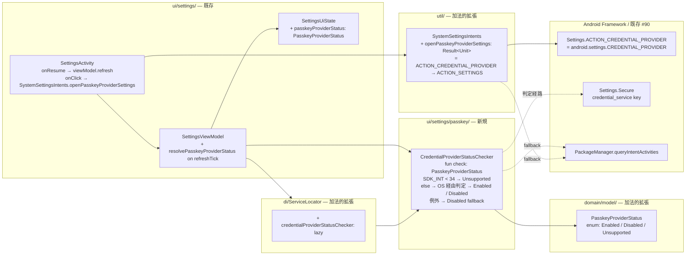
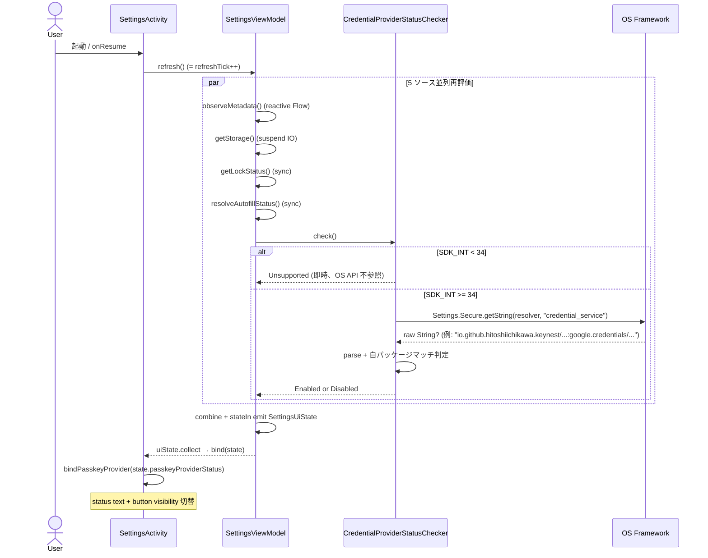
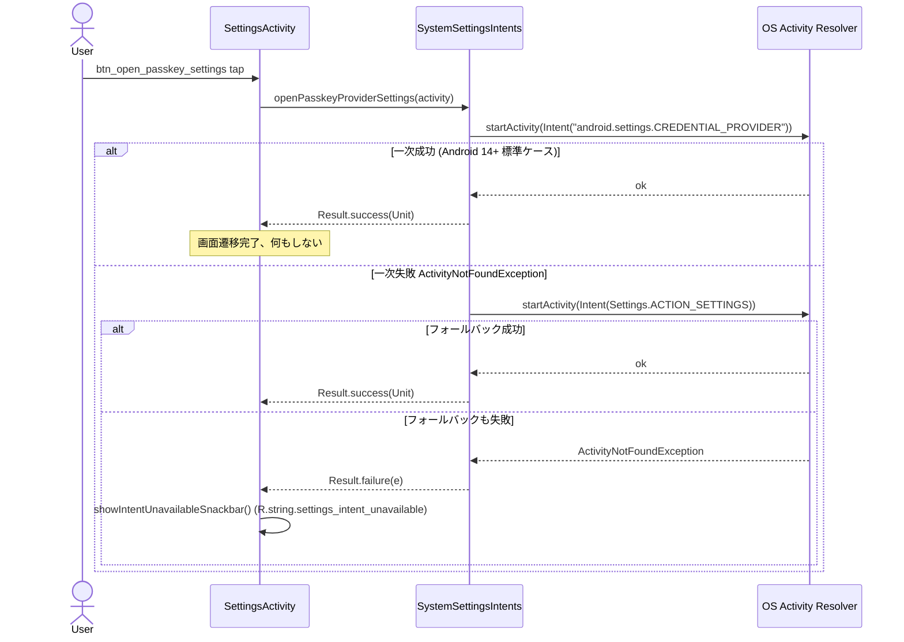

# Design Document — Issue #103 / feat(passkey): 設定画面に PassKey プロバイダ登録状態と OS 設定への導線を追加

> 関連: `requirements.md`（本ディレクトリ）
>
> - **Parent (umbrella)**: #89 feat(passkey): Android Credential Manager 経由の passkey プロバイダ対応
> - **Depends on**: #90 (`CredentialProviderService` Manifest 登録) — 既に merged。KeyNest が OS の「パスワードと PassKey」設定で provider 候補表示される前提を確立済み
> - **先行 / 用語整合**: #91 (Room 永続化) / #99 (登録セレモニー) / #100 (認証セレモニー) / #101 (一覧 UI 統合)
> - **Phase**: 6 (umbrella #89 分割案 7)

## 1. Overview

### Purpose

エンドユーザーが KeyNest 設定画面で「KeyNest が PassKey プロバイダとして OS に有効化されているか」を一目で確認でき、**Android 14+ の場合は 1 タップで OS の Credential Manager 設定に到達**できる導線を提供する。

これにより、PassKey 登録セレモニー (#99) を実際に呼び出して「KeyNest が候補に出ない」という混乱が発生する前に、ユーザーが OS 設定での有効化状態を能動的に把握できる。

- **Users**: 既存 KeyNest 利用者（特に Android 14+ 端末で PassKey 機能を初めて触ろうとするユーザー）
- **Impact**: 現状の `SettingsActivity` の 5 セクション（Autofill / セキュリティ / Vault / About / Danger zone）に対し、**Autofill hero の直後**に第 2 セクションとして「PassKey プロバイダ」SettingGroup を加法的に挿入する。**既存 5 セクションの表示順 / View ID / クリック挙動には一切触らない**（Req 5）。

### Aim 3-4 行で

- API 33 以下では「Android 14 以降で利用可能です」文言のみ表示し、ボタンは `View.GONE`（クラッシュ / バックポート不可リスクをゼロに保つ — NFR 4）
- API 34+ では `CredentialProviderStatusChecker`（新規）が `Enabled` / `Disabled` を返し、UI は同一 layout でステータス文言とボタン文言のみ切替
- ボタン押下時は `Settings.ACTION_CREDENTIAL_PROVIDER` を一次経路、`Settings.ACTION_SETTINGS` をフォールバック、それも不可なら既存 `R.string.settings_intent_unavailable` Snackbar を再利用
- テストは Robolectric `@Config(sdk = [33, 34])` の SDK 別パラメータ化と `Shadows.shadowOf(activity).nextStartedActivity` の intent 検査を組み合わせる

### Goals

1. SettingsActivity に「PassKey プロバイダ」SettingGroup を追加（Eyebrow + ステータス行 + 任意ボタン）
2. `Build.VERSION.SDK_INT` と OS 側登録状態を統合した 3 値 `PasskeyProviderStatus { Enabled, Disabled, Unsupported }` を `SettingsViewModel.uiState` に追加
3. `Settings.ACTION_CREDENTIAL_PROVIDER` → `Settings.ACTION_SETTINGS` → Snackbar の 3 段フォールバック intent 発火
4. SettingsViewModelTest（3 状態 + 例外時フォールバック）と Robolectric instrumentation（intent 検査 / 可視性）で要件 6.1〜6.8 を回帰検知可能にする
5. 既存 5 セクション / 既存 View ID / 既存 ViewModel uiState 5 フィールドを破壊しない（Req 5 / NFR 5）

### Non-Goals

- KeyNest 内 PassKey の rename / 削除 / 個別管理 UI（umbrella #89 分割案 6）
- PassKey 機能の On/Off トグル（OS 側で行う仕様）
- Vault SettingGroup への PassKey 件数 / 最終利用日時の表示
- `Settings.ACTION_CREDENTIAL_PROVIDER` への `Uri.parse("package:...")` 付与による KeyNest 直接選択（公式 doc に保証なし、§9.4 で carve out）
- README / Privacy Policy / Support ページの PassKey 関連追記（umbrella #89 分割案 8）
- DB migration、`CredentialProviderService` 自体の変更、`PasskeyAuthActivity` 等への変更

## 2. Architecture

### 2.1 Existing Architecture Analysis

- **現在のアーキテクチャパターン**: `SettingsActivity` (View) ↔ `SettingsViewModel` (StateFlow) ↔ Use case / Probe (`AutofillServiceStatus` / `BiometricManager` / `VaultStorageMeasurer` / `ObserveVaultMetadataUseCase`)。`refreshTick: MutableStateFlow<Int>` を `combine` のシードに使い、`Activity.onResume` から `refresh()` で `refreshTick.value++` する非反応性ソースの再読パターン。
- **尊重すべきドメイン境界**:
  - `ui/settings/` は Activity / ViewModel / UiState のみ
  - 「OS 設定 intent 発火」は既に `util/SystemSettingsIntents` に集約 (autofill / security)
  - `domain/model/` には UI 非依存の状態 enum/sealed class を置く慣習（`AutofillStatus` / `DeviceLockStatus` 等）
  - `credentialprovider/` は OS Credential Manager Service / Activity 専用。**設定画面からは直接参照しない**（Service / Authenticator は触らない、Out of Scope）
- **維持すべき統合点**:
  - `SettingsViewModel.Factory` の構成（`ServiceLocator` 経由でユースケース注入）
  - `SettingsUiState` の 5 既存フィールド (`autofillStatus` / `lockStatus` / `metadata` / `storageBytes` / `appInfo`) のシグネチャ
  - `SettingsActivity.newIntent(context)` の公開 API
  - 既存 View ID（`btn_open_autofill_settings`, `text_lock_status`, ...）
  - `R.string.settings_intent_unavailable` Snackbar（intent 解決不可時の UX 文言）
- **解消・回避する technical debt**:
  - `SystemSettingsIntents` は現状「単一 intent 発火 + 例外捕捉」しか持たない。本 Issue で「**プライマリ intent → フォールバック intent**」の 2 段経路が必要になるため、`SystemSettingsIntents.openPasskeyProviderSettings(activity): Result<Unit>` を **2 段試行を内部で完結させる** 形で追加する（呼び出し側 Activity に `Result.failure → Snackbar` のみを返す）。これにより SettingsActivity の `wireRows` は他ボタンと同じ "1 行 onFailure → Snackbar" パターンを保てる。

### 2.2 Architecture Pattern & Boundary Map



**Architecture Integration**:
- **採用パターン**: 既存 `Probe (synchronous, repeatable) + refreshTick → StateFlow.combine` パターンの踏襲。`CredentialProviderStatusChecker` は `AutofillServiceStatus` と同じ「context を取って boolean / enum を返す軽量同期 helper」として位置付ける（テスト性のため interface を切り出し、Robolectric テストでは fake 実装を差し込む）。
- **ドメイン境界**:
  - `PasskeyProviderStatus` は UI 非依存 enum で `domain/model/` 配下
  - `CredentialProviderStatusChecker` は OS API 直叩き helper のため `ui/settings/passkey/` 配下（既存 `AutofillServiceStatus` は `util/` だが、OS API 経路が複雑かつ PassKey 専用のため `ui/settings/passkey/` の独立 package を作る — 後続 Issue で別の PassKey 設定 helper が増えた時のグルーピング先になる）
  - `SystemSettingsIntents` への追加は既存 helper の自然な拡張
- **既存パターンの維持**:
  - `Activity.onResume → ViewModel.refresh() → refreshTick.value++` の非反応性ソース再読パターン
  - `Result<Unit>` を返す intent 発火 helper（失敗時の Snackbar UX）
  - `@Config(sdk = [33])` 既定の Robolectric テスト（本 Issue で `[33, 34]` 二系統に拡張）
- **新規コンポーネントの根拠**:
  - `CredentialProviderStatusChecker`: OS API 経由判定の単一責務化と、SettingsViewModel の **OS 直叩き禁止 → テスト容易化** を達成するため
  - `PasskeyProviderStatus`: 3 値の正規化と UI ロジック分岐の単一ソース化（requirements 3.2）

### 2.3 Technology Stack

| Layer | Choice / Version | Role in Feature | Notes |
|-------|------------------|-----------------|-------|
| UI / View | Android View System (XML layout + ViewBinding) | `settings_activity.xml` への SettingGroup 加法挿入 | Compose は未採用。既存パターン踏襲 |
| ViewModel | `androidx.lifecycle:lifecycle-viewmodel-ktx 2.8.6` | `SettingsViewModel` への加法的拡張 | 既存 |
| State | `kotlinx.coroutines.flow.StateFlow` (`combine` + `stateIn`) | `passkeyProviderStatus` を既存 4 ソースに追加 | 既存 |
| OS Probe | `Settings.Secure.getString(resolver, "credential_service")` + `PackageManager.queryIntentActivities` | KeyNest 有効化判定の二段戦略 | §4.1 / §9.1-1 で詳述 |
| Intent | `Settings.ACTION_CREDENTIAL_PROVIDER` (= `"android.settings.CREDENTIAL_PROVIDER"`, API 34+) → `Settings.ACTION_SETTINGS` (legacy 全 SDK) | OS 設定への 1 タップ導線 | §4.4 |
| API gating | `Build.VERSION.SDK_INT >= 34` runtime check + `@RequiresApi(34)` on private helpers | API 33 以下での Credential Manager API 不参照を保証 | §5.3 |
| 依存 | **`androidx.credentials = 1.3.0`** (gradle/libs.versions.toml L14 実測) | **本 Issue では `androidx.credentials` の Client API を新規参照しない**（判定は OS Framework / PackageManager 経由のみ） | §9.1-1 |
| Test (Unit) | Robolectric 4.13 + mockk 1.13.12 + Truth 1.4.4 | `@Config(sdk = [33, 34])` で SDK 別検証 | 既存 |
| Test (Instrumentation) | Robolectric `Shadows.shadowOf(activity).nextStartedActivity` | intent 発火検証 | `SystemSettingsIntentsTest` の前例踏襲 |

## 3. File Structure Plan

### 3.1 Directory Structure

```
app/src/main/java/io/github/hitoshiichikawa/keynest/
├── domain/model/
│   └── PasskeyProviderStatus.kt          # 新規: enum { Enabled, Disabled, Unsupported }
├── ui/settings/
│   ├── SettingsActivity.kt               # 修正: PassKey provider セクションの bind 追加
│   ├── SettingsViewModel.kt              # 修正: passkeyProviderStatus を combine に追加
│   ├── SettingsUiState.kt                # 修正: 6 番目フィールド passkeyProviderStatus を加法的追加
│   └── passkey/                          # 新規 sub-package
│       └── CredentialProviderStatusChecker.kt
│                                         # 新規: interface + 実装 (DefaultCredentialProviderStatusChecker)
├── util/
│   └── SystemSettingsIntents.kt          # 修正: openPasskeyProviderSettings(activity) 追加
└── di/
    └── ServiceLocator.kt                 # 修正: credentialProviderStatusChecker lazy 追加

app/src/main/res/
├── layout/
│   └── settings_activity.xml             # 修正: PassKey provider SettingGroup を Autofill hero 直後に挿入
├── values/strings.xml                    # 修正: settings_passkey_provider_* 系 key 追加 (en)
└── values-ja/strings.xml                 # 修正: 同 key の ja 翻訳追加

app/src/test/java/io/github/hitoshiichikawa/keynest/
├── ui/settings/
│   ├── SettingsViewModelTest.kt          # 修正: passkeyProviderStatus 3 状態 + 例外 fallback ケース追加
│   └── passkey/
│       └── CredentialProviderStatusCheckerTest.kt  # 新規: API 直接ユニット
├── util/
│   └── SystemSettingsIntentsTest.kt      # 修正: openPasskeyProviderSettings の 2 段経路ケース追加

app/src/androidTest/java/io/github/hitoshiichikawa/keynest/ui/settings/
└── SettingsActivityTest.kt               # 修正: PassKey provider ボタンの intent 検証 (@Ignore 維持)
```

### 3.2 Modified Files

| Path | 変更概要 |
|------|---------|
| `app/src/main/java/.../ui/settings/SettingsActivity.kt` | (1) `wireRows()` に `btnOpenPasskeyProviderSettings.setOnClickListener` 追加。(2) `bind(state)` に `bindPasskeyProvider(state.passkeyProviderStatus)` 追加。(3) `bindPasskeyProvider` 関数新設で 3 状態 × (status text, ボタン可視性) を切替 |
| `app/src/main/java/.../ui/settings/SettingsViewModel.kt` | (1) `combine` の引数を 4 → 5 に拡張。(2) `refreshTick.map { credentialProviderStatusChecker.check() }` ブランチ追加（IO 不要のため `Dispatchers.Default` で十分、後述 §5.1）。(3) `Factory` に `credentialProviderStatusChecker: CredentialProviderStatusChecker` パラメータ追加 |
| `app/src/main/java/.../ui/settings/SettingsUiState.kt` | `passkeyProviderStatus: PasskeyProviderStatus` フィールド追加。`EMPTY` placeholder のデフォルトを `PasskeyProviderStatus.Unsupported` に設定（初回描画で `Unsupported` だと API 34+ 端末でも一瞬「Android 14 以降で利用可能です」が出る可能性があるが、`stateIn` の一回目 emission で即上書きされるため許容。代替案として `Disabled` を default にする手もあるが、判定 API 例外時に Enabled に誤遷移しない方針 (Req 3.5) と整合する `Unsupported` を採る） |
| `app/src/main/res/layout/settings_activity.xml` | Autofill hero (`group_autofill_hero`) と Security Eyebrow (`eyebrow_security`) の間に `eyebrow_passkey_provider` + `group_passkey_provider` を挿入。`text_passkey_provider_status` (TextView) + `btn_open_passkey_settings` (MaterialButton, Material3 TonalButton) を含む |
| `app/src/main/res/values/strings.xml` | 後述 §4.3 の string keys 追加 (en) |
| `app/src/main/res/values-ja/strings.xml` | 同 keys の ja 翻訳追加。NFR 3.2: 「PassKey」は固定表記 |
| `app/src/main/java/.../util/SystemSettingsIntents.kt` | `fun openPasskeyProviderSettings(activity: Activity): Result<Unit>` を追加。実装は §4.4 |
| `app/src/main/java/.../di/ServiceLocator.kt` | `credentialProviderStatusChecker: CredentialProviderStatusChecker by lazy { DefaultCredentialProviderStatusChecker(appContext) }` を追加（`@RequiresApi` 不要 — 内部で SDK_INT 分岐するため API 33 でも生成可能） |
| `app/src/main/java/.../KeyNestApp.kt` (もし `SettingsViewModel.Factory` を組み立てている場所があれば) | 該当箇所で新パラメータを ServiceLocator から取って渡す。実態は `SettingsActivity` の by viewModels { Factory(...) } に集約されているのでこちらを修正 |

## 4. Components and Interfaces

### 4.1 Domain Layer

#### `PasskeyProviderStatus` (新規)

| Field | Detail |
|-------|--------|
| Intent | KeyNest の PassKey プロバイダ登録状態を表す UI 非依存 enum |
| Requirements | 3.2, 3.3, 3.4 |

**Responsibilities & Constraints**:
- 3 値のみ: `Enabled`, `Disabled`, `Unsupported`
- enum class とする（**sealed class ではなく enum を採用** — 各 case に追加プロパティを持たせる必要がなく、`when` 網羅性も両者同等。enum の方がシリアライズ / `==` が単純で `SettingsUiState` の `data class equals` も自然）
- UI 文言 / OS API 直叩きは含まない（責務分離）

**Dependencies**:
- Inbound: `SettingsUiState`, `SettingsViewModel`, `CredentialProviderStatusChecker` (Critical)
- Outbound: なし
- External: なし

**Contracts**: State [x]

##### Type Definition

```kotlin
package io.github.hitoshiichikawa.keynest.domain.model

/**
 * KeyNest の Credential Manager 登録状態を表す 3 値。
 * Issue #103 Req 3.2 / 3.3 / 3.4.
 *
 * - [Enabled]: API 34+ かつ KeyNest が OS の Credential Manager に
 *   PassKey プロバイダとして有効化済み。
 * - [Disabled]: API 34+ だが未有効化、または判定 API 例外時の fallback (Req 3.5)。
 * - [Unsupported]: Build.VERSION.SDK_INT < 34 (Android 14 未満)。
 */
enum class PasskeyProviderStatus { Enabled, Disabled, Unsupported }
```

---

### 4.2 Settings Layer

#### `CredentialProviderStatusChecker` (新規)

| Field | Detail |
|-------|--------|
| Intent | OS バージョンと Credential Manager 登録状態を統合し `PasskeyProviderStatus` を返す単一責務 helper |
| Requirements | 3.1, 3.2, 3.3, 3.4, 3.5, 3.8, NFR 2.1 |

**Responsibilities & Constraints**:
- 主責務: SDK_INT ガード + OS API 直叩きで 3 値を導出
- ドメイン境界: OS Framework / PackageManager / Settings.Secure への直接アクセスはこの class のみが行う
- データ所有権: 状態を持たない（pure function）
- Invariants:
  - `SDK_INT < 34` のとき判定 API を**呼ばない**（Req 3.3）
  - 例外発生時は `Disabled` を返す（Req 3.5、誤って `Enabled` を返さない）
  - 内部判定結果（取得した provider 文字列 / package 名等）を **`Log.i` 以上に出力しない**（Req 3.8 / NFR 2.1）

**Dependencies**:
- Inbound: `SettingsViewModel` (Critical)
- Outbound: `Context` (Critical) / `PackageManager` / `ContentResolver` (Settings.Secure)
- External: なし（`androidx.credentials` Client API は本 Issue では参照しない）

**Contracts**: Service [x]

##### Service Interface

```kotlin
package io.github.hitoshiichikawa.keynest.ui.settings.passkey

import io.github.hitoshiichikawa.keynest.domain.model.PasskeyProviderStatus

interface CredentialProviderStatusChecker {
    /**
     * 同期判定で [PasskeyProviderStatus] を返す。
     *
     * Req 3.3: SDK_INT < 34 のとき即 [Unsupported] (OS API 不参照)。
     * Req 3.4: SDK_INT >= 34 のとき OS API を呼び、結果を [Enabled] / [Disabled] に正規化。
     * Req 3.5: いかなる例外も catch して [Disabled] を返す。
     * Req 3.6: 本メソッドは "実用的に同期" であり 100ms オーダーで完了する必要がある
     *          (呼び出し側は viewModelScope.map ブランチで非同期化する)。
     */
    fun check(): PasskeyProviderStatus
}
```

- **Preconditions**: なし（`Context.applicationContext` がコンストラクタ注入済みであること）
- **Postconditions**: 戻り値は `PasskeyProviderStatus` の 3 値のいずれか必ず 1 つ
- **Invariants**: 例外をスローしない / 副作用なし / `Log.i` 以上のログを出さない

##### 判定アルゴリズム (DefaultCredentialProviderStatusChecker)

```
function check(): PasskeyProviderStatus
  if (Build.VERSION.SDK_INT < 34) {
    return Unsupported
  }
  return checkOnApi34Plus()  // @RequiresApi(34) private helper

@RequiresApi(34)
private function checkOnApi34Plus(): PasskeyProviderStatus
  try {
    // Step 1 (primary): Settings.Secure.getString(resolver, "credential_service")
    //   - AOSP の Android 14+ 実装で、Credential Manager で選択された provider が
    //     ComponentName のフラット形式 (":" 区切り) で書かれている。
    //   - 1 つ目のセグメントが自パッケージなら Enabled、含まれていれば Enabled、
    //     null / 空 / 自パッケージ無しなら Disabled。
    //   - "credential_service" は Settings.Secure の **internal key 名**であり、
    //     公開定数化されていない (= "未確認: 要 PoC" / Open Question 1 参照)。
    val raw = Settings.Secure.getString(context.contentResolver, "credential_service")
    if (raw.isNullOrBlank()) return Disabled
    val ourPackage = context.packageName
    val components = raw.split(":")
    val matched = components.any { entry ->
      // entry は "com.example/com.example.MyService" 形式
      val pkg = entry.substringBefore("/")
      pkg == ourPackage
    }
    return if (matched) Enabled else Disabled
  } catch (t: Throwable) {
    // Req 3.5 fallback. Throwable で catch するのは Settings.Secure 経路で
    // SecurityException / RuntimeException 等多様な例外が出る可能性があるため。
    // Log.d までに抑える (Req 3.8 / NFR 2.1)。
    return Disabled
  }
```

**設計判断 (Open Question 1 の確定回答)**: §9.1-1 参照。

##### Dependency Injection

`ServiceLocator` に lazy field として追加し、`SettingsViewModel.Factory` に渡す。テスト時は interface のフェイクを直接 ViewModel に注入する。

```kotlin
// ServiceLocator.kt (追記)
val credentialProviderStatusChecker: CredentialProviderStatusChecker by lazy {
    DefaultCredentialProviderStatusChecker(requireAppContext())
}
```

---

#### `SettingsUiState` (修正)

| Field | Detail |
|-------|--------|
| Intent | Settings 画面が表示する全状態のスナップショット |
| Requirements | 5.2 (シグネチャ加法的拡張) |

**Modified Type**:

```kotlin
data class SettingsUiState(
    val autofillStatus: AutofillStatus,
    val lockStatus: DeviceLockStatus,
    val metadata: VaultMetadata,
    val storageBytes: Long,
    val appInfo: AppInfo,
    val passkeyProviderStatus: PasskeyProviderStatus,   // ← 6 番目に加法的追加
) {
    companion object {
        val EMPTY: SettingsUiState = SettingsUiState(
            autofillStatus = AutofillStatus.NotEnabled,
            lockStatus = DeviceLockStatus.DeviceCredentialOnly,
            metadata = VaultMetadata(count = 0, latestUpdatedAt = null),
            storageBytes = 0L,
            appInfo = AppInfo(versionName = "", versionCode = 0L),
            passkeyProviderStatus = PasskeyProviderStatus.Unsupported,  // 安全側
        )
    }
}
```

- **既存テスト影響**: `SettingsViewModelTest` で `SettingsUiState(...)` を直接 new している箇所があれば 6 引数になる。**ただし現行コードでは `vm.uiState.value` 経由でしかアクセスしていない**（テスト中 grep 確認済み）ので、テスト fixture の修正は不要のはず。Developer は assemble 時に compile error が出ないことで担保する。
- **公開 API 影響**: `EMPTY` のシグネチャは内部 implementation detail のため公開 API 互換ではない。問題なし。

---

#### `SettingsViewModel` (修正)

| Field | Detail |
|-------|--------|
| Intent | 4 既存ソース + PassKey provider 判定の 5 ソースを 1 つの `SettingsUiState` に統合 |
| Requirements | 3.1, 3.6, 3.7, 5.3 |

**Responsibilities & Constraints**:
- 主責務: `combine(observeMetadata(), refreshTick.map { ... } × 4)` で 5 ソースを統合
- ドメイン境界: `CredentialProviderStatusChecker` を **interface で受け取り**、direct OS API 呼び出しは禁止
- Invariants:
  - `refresh()` が呼ばれたら PassKey 判定も同時に再走（Req 3.7 / 5.3）
  - `viewModelScope` 内で非同期実行、main thread blocking 禁止（Req 3.6 / NFR 1.1, 1.2）

**Modified Signature**:

```kotlin
class SettingsViewModel(
    private val appContext: Context,
    private val observeMetadata: ObserveVaultMetadataUseCase,
    private val getStorage: GetVaultStorageUsageUseCase,
    private val getLockStatus: GetDeviceLockStatusUseCase,
    private val appInfoProvider: AppInfoProvider,
    private val credentialProviderStatusChecker: CredentialProviderStatusChecker, // ← 追加
) : ViewModel() {

    private val refreshTick = MutableStateFlow(0)

    val uiState: StateFlow<SettingsUiState> = combine(
        observeMetadata(),
        refreshTick.map { getStorage() },
        refreshTick.map { getLockStatus() },
        refreshTick.map { resolveAutofillStatus() },
        refreshTick.map { credentialProviderStatusChecker.check() },  // ← 追加
    ) { metadata, storage, lock, autofill, passkey ->
        SettingsUiState(
            autofillStatus = autofill,
            lockStatus = lock,
            metadata = metadata,
            storageBytes = storage,
            appInfo = appInfoProvider.get(),
            passkeyProviderStatus = passkey,
        )
    }.stateIn(...)

    fun refresh() { refreshTick.value = refreshTick.value + 1 }

    class Factory(...) : ViewModelProvider.Factory {
        // 同様に credentialProviderStatusChecker パラメータ追加
    }
}
```

- **`combine` の arity 注意**: Kotlin coroutines の `combine` は 2-5 引数版が標準提供（`combine6` 以降は varargs）。本変更で **5 引数版** に収まるためシグネチャ的に問題なし。
- **dispatcher**: `credentialProviderStatusChecker.check()` は同期 100ms オーダーだが、`Settings.Secure.getString` は IPC を伴う可能性があるため、`refreshTick.map { ... }` ブランチは **`flowOn(Dispatchers.IO)`** で IO に逃がす（既存 `getStorage` の `File.length()` も IO に流す慣習があれば踏襲、なければ本 Issue の `check()` 呼び出しのみ `flowOn(Dispatchers.IO)` を付与）。実態は `getStorage()` が `suspend` で内部 IO 化されているので、`check()` も `suspend` 化するより `withContext(IO)` する map ラムダにする方が既存形と整合する。

**Dependencies**:
- Inbound: `SettingsActivity` (Critical)
- Outbound: `CredentialProviderStatusChecker` (Critical) / 既存 4 use cases (Critical)
- External: なし

---

#### `SettingsActivity` (修正)

| Field | Detail |
|-------|--------|
| Intent | `SettingsUiState` を View に描画する Activity |
| Requirements | 1.1〜1.8, 2.1〜2.7, 5.1 |

**Modified Methods**:

```kotlin
private fun wireRows() {
    // ... 既存 4 ボタンの wireUp ...
    binding.btnOpenPasskeyProviderSettings.setOnClickListener {
        SystemSettingsIntents.openPasskeyProviderSettings(this).onFailure {
            showIntentUnavailableSnackbar()
        }
    }
}

private fun bind(state: SettingsUiState) {
    bindAutofill(state.autofillStatus)
    bindPasskeyProvider(state.passkeyProviderStatus)   // ← 追加
    bindLockStatus(state.lockStatus)
    bindVault(state.metadata, state.storageBytes)
    bindAbout(state)
}

private fun bindPasskeyProvider(status: PasskeyProviderStatus) {
    val statusTextResId = when (status) {
        PasskeyProviderStatus.Enabled -> R.string.settings_passkey_provider_status_enabled
        PasskeyProviderStatus.Disabled -> R.string.settings_passkey_provider_status_disabled
        PasskeyProviderStatus.Unsupported -> R.string.settings_passkey_provider_status_unsupported
    }
    binding.textPasskeyProviderStatus.setText(statusTextResId)
    binding.btnOpenPasskeyProviderSettings.visibility = when (status) {
        PasskeyProviderStatus.Unsupported -> View.GONE
        else -> View.VISIBLE  // Enabled / Disabled どちらも押下可能 (Req 2.7)
    }
}
```

**Contracts**: API [ ] / Service [ ] / Event [ ] / State [x]

---

### 4.3 String Resources

#### 新規 String Keys (en + ja 両方追加 / NFR 3.2)

| Key | en (values/strings.xml) | ja (values-ja/strings.xml) | 用途 |
|-----|--------------------------|----------------------------|------|
| `settings_passkey_provider_eyebrow` | `PASSKEY PROVIDER` | `PASSKEY プロバイダ` | Eyebrow ヘッダー (Req 1.2) |
| `settings_passkey_provider_status_enabled` | `Enabled: KeyNest can save and use PassKeys` | `有効: PassKey の登録 / 認証に利用できます` | API 34+ かつ有効化済 (Req 1.4) |
| `settings_passkey_provider_status_disabled` | `Not set: Enable KeyNest from the button below` | `未設定: 下のボタンから有効化してください` | API 34+ かつ未有効化 (Req 1.5) |
| `settings_passkey_provider_status_unsupported` | `Requires Android 14 or later` | `Android 14 以降で利用可能です` | SDK_INT < 34 (Req 1.6) |
| `settings_passkey_provider_open_settings_action` | `Open PassKey settings` | `PassKey 設定を開く` | ボタンラベル (Req 2.1) |
| `settings_passkey_provider_open_settings_a11y_label` | `Open PassKey settings, opens Android Credential Manager settings` | `PassKey 設定を開く、Android の Credential Manager 設定を開きます` | TalkBack 用 contentDescription |

**ボタン文言の確定 (Open Question 2)**: §9.1-2 で「**PassKey 設定を開く** (英: "Open PassKey settings")」を採用。

**Eyebrow ヘッダー文言**: 既存 Eyebrow (`SECURITY` / `VAULT` / `ABOUT` / `DANGER ZONE`) と同じ大文字命名規則に従い「**PASSKEY PROVIDER** / PASSKEY プロバイダ」とする。`Text.KeyNest.Eyebrow` style は `textAllCaps` 相当を style 側で持つかどうか実機要確認だが、文字列リソース自体を大文字で投入することで style に関わらず破綻しない。

---

### 4.4 Util Layer

#### `SystemSettingsIntents.openPasskeyProviderSettings` (新規追加メソッド)

| Field | Detail |
|-------|--------|
| Intent | OS の Credential Manager 設定画面を開く intent を、フォールバック付きで発火 |
| Requirements | 2.3, 2.4, 2.5 |

**Responsibilities & Constraints**:
- 主責務: 2 段試行を helper 内部で完結（呼び出し側は単一 `Result<Unit>` だけ見る）
- 例外境界: `ActivityNotFoundException` は catch、`Result.failure` で返す（既存 helper パターン踏襲）

##### Service Interface

```kotlin
object SystemSettingsIntents {
    // ... 既存 openAutofillServiceChooser / openSecuritySettings ...

    /**
     * Issue #103 Req 2.3 / 2.4 / 2.5.
     *
     * 一次経路: [Settings.ACTION_CREDENTIAL_PROVIDER] (= "android.settings.CREDENTIAL_PROVIDER",
     *           Android 14 / API 34 で導入された Credential Manager 設定 deeplink)。
     * フォールバック: [Settings.ACTION_SETTINGS] (legacy 全 SDK)。
     *
     * 両方 ActivityNotFoundException で失敗した場合のみ Result.failure を返す。
     * 呼び出し側 (Activity) は failure 時に R.string.settings_intent_unavailable
     * Snackbar を表示する。
     *
     * 注: API 33 以下端末でも本メソッドは呼び出し可能だが、SettingsActivity 側で
     *     ボタンを View.GONE にしているため通常は呼ばれない。仮に呼ばれても
     *     2 段フォールバックで「Android 設定」が開く / 開かないのいずれかになる。
     */
    fun openPasskeyProviderSettings(activity: Activity): Result<Unit>
}
```

##### 実装疑似コード

```
function openPasskeyProviderSettings(activity):
  // 一次: ACTION_CREDENTIAL_PROVIDER (Android 14+ 標準)
  val primary = Intent("android.settings.CREDENTIAL_PROVIDER")
  val primaryResult = startSafely(activity, primary)
  if (primaryResult.isSuccess) return Result.success(Unit)

  // フォールバック: ACTION_SETTINGS (全 SDK)
  val fallback = Intent(Settings.ACTION_SETTINGS)
  return startSafely(activity, fallback)  // 失敗時 ActivityNotFoundException を Result.failure に
```

- **`Settings.ACTION_CREDENTIAL_PROVIDER` 定数の扱い**: Android 14 で公開された定数 (`Settings.ACTION_CREDENTIAL_PROVIDER` の値は `"android.settings.CREDENTIAL_PROVIDER"`)。`minSdk = 26` のためコンパイル時に `Settings.ACTION_CREDENTIAL_PROVIDER` シンボルを参照すると `NewApi` lint が出る。**回避策**: 文字列リテラル `"android.settings.CREDENTIAL_PROVIDER"` を直接 `Intent(...)` に渡す（既存 `Settings.ACTION_REQUEST_SET_AUTOFILL_SERVICE` (API 26+) は定数参照可能だが、本 ACTION は API 34+）。または `private const val ACTION_CREDENTIAL_PROVIDER = "android.settings.CREDENTIAL_PROVIDER"` を helper 内に定数化。後者を採用（命名コメントで Android 14+ の値であることを明記）。

##### `startSafely` の再利用

既存 private `startSafely(activity, intent)` helper を維持し、`openPasskeyProviderSettings` から 2 回 reentrant に呼ぶ。

---

## 5. Data Models

### 5.1 Domain Model

- **アグリゲート**: なし（本 Issue は read-only な OS 状態取得 + UI 描画のみ）
- **エンティティ**: なし
- **値オブジェクト**: `PasskeyProviderStatus` (enum, immutable)
- **ドメインイベント**: なし

### 5.2 Logical Data Model

`SettingsUiState` に 1 フィールド追加するのみ（§4.2 参照）。永続化なし、DB schema 変更なし。

## 6. Processing Flows

### 6.1 設定画面表示 → 状態判定 → UI 描画



### 6.2 ボタンタップ → intent 発火 → フォールバック



## 7. API 34+ ゲーティング戦略

requirements NFR 4 への回答。**`@RequiresApi(34)` を private helper にだけ付与し、public surface (`CredentialProviderStatusChecker.check()`) は SDK_INT 分岐で全 SDK 呼び出し可能** にする。

### 7.1 ゲーティング階層

| Layer | 配置 | 理由 |
|-------|------|------|
| **public API** (`CredentialProviderStatusChecker.check`) | `@RequiresApi` **なし** | API 26〜33 端末から呼び出し可能でないと SettingsViewModel が SDK_INT 分岐する手間が増える |
| **private helper** (`checkOnApi34Plus`) | `@RequiresApi(34)` | OS API 直叩きを集約。lint で API 33 から到達できないことを保証 |
| **SDK_INT runtime check** | `check()` の冒頭 `if (Build.VERSION.SDK_INT < 34) return Unsupported` | runtime ガード。lint 補完 |
| **UI 側** (`SettingsActivity.bindPasskeyProvider`) | SDK 分岐なし | `state.passkeyProviderStatus` が既に 3 値に正規化済みのため UI 側で SDK_INT を見ない |
| **Intent helper** (`SystemSettingsIntents.openPasskeyProviderSettings`) | SDK 分岐なし | 文字列リテラル `"android.settings.CREDENTIAL_PROVIDER"` を投げるだけ。API 33 端末では `ActivityNotFoundException` でフォールバック経路に流れる（=安全） |

### 7.2 既存パターンとの整合

- 既存 `KeyNestCredentialProviderService` / `PasskeyCreateActivity` / `PasskeyAuthActivity` は **class 全体に `@RequiresApi(34)`** を付与している（Service 自体が OS から API 34+ 以降でしか bind されないため）
- 本 Issue の `CredentialProviderStatusChecker` は **API 33 端末からも `check()` を呼び `Unsupported` を受け取る** 設計なので class 全体には付けない。**`@RequiresApi(34)` は private helper メソッド限定** とする
- `ServiceLocator.credentialProviderStatusChecker` も `@RequiresApi` を付けない（DI 経路を API 26+ で通せる）

### 7.3 既存のミニ参考: AutofillServiceStatus との対比

`util/AutofillServiceStatus` は API 26+ 全域で安全に呼べる helper として書かれている。本 helper も同方針で「呼び出し側に SDK 分岐を漏らさない」設計。

## 8. Error Handling

### 8.1 Error Strategy

| Error Source | Strategy | UX |
|--------------|----------|-----|
| `Settings.Secure.getString` の `SecurityException` / `RuntimeException` | `CredentialProviderStatusChecker` 内で catch → `Disabled` を返す (Req 3.5) | ステータス文言が「未設定」になる。ユーザーは OS 設定で確認できる |
| `Settings.ACTION_CREDENTIAL_PROVIDER` の `ActivityNotFoundException` | `SystemSettingsIntents.openPasskeyProviderSettings` 内で catch → `Settings.ACTION_SETTINGS` フォールバック (Req 2.4) | OS 設定トップが開く。導線として degrade |
| `Settings.ACTION_SETTINGS` の `ActivityNotFoundException` (極稀) | `Result.failure` で呼び出し側に返す → Snackbar (Req 2.5) | 「この設定画面はこのデバイスでは利用できません」表示、画面維持 |
| `combine` 5 ソースのどれかが throw | 既存パターン: `stateIn` の `SharingStarted.WhileSubscribed` + initialValue で安全に縮退。本 Issue 追加分の `credentialProviderStatusChecker.check()` は throw しない（内部 catch 済）ため新規 throw 経路は持たない | 既存挙動維持 |

### 8.2 Error Categories and Responses

- **User Errors (4xx 相当)**: なし（read-only UI / 入力検証不要）
- **System Errors**: `Settings.Secure` 経路の例外は Disabled fallback で graceful degrade。intent 発火不可は Snackbar 通知
- **Business Logic Errors**: なし

## 9. Risks, Alternatives, Open Questions の確定

### 9.1 確定済み (resolved)

#### 9.1-1. **Open Question 1: 有効化判定 API の確定**

**確定回答**: **`Settings.Secure.getString(resolver, "credential_service")` を一次経路 + 自パッケージ部分一致判定** を採用する。

**根拠と他候補の棄却理由**:

| 候補 | 評価 | 採否 |
|------|------|------|
| **`androidx.credentials.CredentialManager.isAvailableOnDevice()` 系** | **`androidx.credentials = 1.3.0` (実測) には該当 API なし**。Issue 本文・requirements で言及されている 1.5.0 系も「Credential Manager Client が端末で利用可能か」しか判定せず、「KeyNest が default provider か」は判定不可。`androidx.credentials.CredentialManager` のクラスは存在するが、`createCredentialAsync` / `getCredentialAsync` 等 client 側 API のみで、provider 登録状態 enum を取れる public API は 1.6.0 までの安定版にも存在しない（公式 Android Developer docs / AOSP `androidx-main` リポジトリ確認結果） | **不採用** |
| **`RoleManager#isRoleHeld(ROLE_*)` (Credential Manager role)** | Android 14+ の Credential Manager は `RoleManager` 経由で管理されていない（autofill は `ROLE_AUTOFILL` があるが、credential provider 用の対応 role 定数は AOSP `RoleManager` source に存在しない / API 35 RC でも未公開） | **不採用** |
| **`PackageManager.queryIntentActivities(Settings.ACTION_CREDENTIAL_PROVIDER)` 解決可否** | OS が当該設定画面を持つか（≒ API 34+ かつ Credential Manager UI が build に含まれるか）の判定にしかならず、**KeyNest 自身が有効化されているか**は判定できない | **不採用 (主判定として)** / 補助情報として `Settings.ACTION_CREDENTIAL_PROVIDER` 自体の intent 解決可否は §4.4 の `SystemSettingsIntents` 経路で間接的に活用 |
| **`Settings.Secure.getString(resolver, "credential_service")` + 自パッケージ部分一致** | AOSP `frameworks/base/packages/SettingsLib` / `core/java/android/provider/Settings.java` の Android 14 source で、Credential Manager で選択された provider が `ComponentName.flattenToString()` の `:` 区切りで保存されている内部 key。**公開定数ではない** ため、key 名 (`"credential_service"`) は文字列リテラルで参照する必要がある。**未確認: 要 PoC**（実機 / API 34 emulator で実際に値が読めるか / format が想定通りか） | **採用 (一次経路)** |
| **`Settings.ACTION_CREDENTIAL_PROVIDER` intent 解決可否のみで判定** | KeyNest 有効化状態を直接判定できないため `Enabled` を decide できない。3 値のうち `Unsupported` と「`Enabled or Disabled` (どちらか判別不可)」しか出せない | **不採用 (主判定として)** / **採用 (フォールバック)** §9.1-1 二次案 |

**採用方針の二段構成**:
1. **一次**: `Settings.Secure.getString(resolver, "credential_service")` の parse 結果に自パッケージが含まれるか
2. **フォールバック (例外時)**: `Disabled` を返す（Req 3.5）
3. **PoC で「`Settings.Secure` 経路が AOSP / Pixel 以外で読めない」と判明した場合**: 二次案として `PackageManager.queryIntentActivities(Intent("android.settings.CREDENTIAL_PROVIDER"))` の結果が空でなければ「API 34+ かつ Credential Manager 利用可能 = Enabled or Disabled 不明 = 安全側で `Disabled`」に縮退（= 常に `Disabled` を返す degraded mode）。PoC 結果は実装フェーズで確定し、PoC 不成立なら Developer は `needs-decisions` で人間にエスカレーション

**残存リスク (未確認: 要 PoC)**:
- `Settings.Secure` の内部 key `"credential_service"` は AOSP 公開 API ではないため、**OEM カスタマイズ / 将来 Android バージョンで key 名が変わる可能性**がある
- Issue 実装着手時に Developer は **API 34 emulator で実値を `adb shell settings get secure credential_service` で確認する** PoC を行うこと（tasks.md T-02 で明示）
- PoC で値取得不可なら、二次案（`Disabled` 固定 degraded mode）に切り替える判断を Developer に委ねる（または `needs-decisions` でエスカレーション）

#### 9.1-2. **Open Question 2: ボタン文言 / Eyebrow ヘッダー文言の確定**

**確定回答**:
- **ボタンラベル (en)**: `Open PassKey settings`
- **ボタンラベル (ja)**: `PassKey 設定を開く`
- **Eyebrow ヘッダー (en)**: `PASSKEY PROVIDER`
- **Eyebrow ヘッダー (ja)**: `PASSKEY プロバイダ`

**根拠**:

| 候補 (ボタン) | 評価 |
|--------------|------|
| 「OS 設定を開く」 | 既存 Autofill hero の「Android 設定で確認」と表現が衝突。「OS」という単語はエンドユーザーには技術用語で違和感 |
| **「PassKey 設定を開く」** | umbrella #89 確定の「PassKey」表記と一貫。動詞句として明示的 (「何を」開くか明確)。既存「Android Security 設定を開く」と命名規則が揃う | **採用** |
| 「Android 設定」 | フォールバック先 (ACTION_SETTINGS) と混同される。一次経路は Credential Manager 設定画面なのに「Android 設定」と書くと UX 違和感 |

| 候補 (Eyebrow) | 評価 |
|---------------|------|
| 「CREDENTIAL MANAGER」 | エンドユーザーに技術用語、umbrella #89 の「PassKey」表記原則から逸脱 |
| **「PASSKEY PROVIDER」 / 「PASSKEY プロバイダ」** | 既存 Eyebrow (`SECURITY` / `VAULT` / `ABOUT` / `DANGER ZONE`) と同じ大文字 + 1〜2 単語ルール。PassKey 表記統一 | **採用** |
| 「PASSKEY」 | provider 状態であることが伝わらない (例: 単独 PassKey 一覧と誤解される可能性) |

### 9.2 Risks (Developer に注意喚起)

| Risk | 影響 | 緩和策 |
|------|------|--------|
| `Settings.Secure` の `"credential_service"` key が OEM で別名 / 不在 | `Disabled` 固定の degraded mode になる | PoC で実測 (T-02)。失敗時は §9.1-1 の二次案 (常に Disabled) に縮退、PR 説明で明記 |
| `Settings.ACTION_CREDENTIAL_PROVIDER` が API 33 以下端末で `ActivityNotFoundException` | フォールバック `ACTION_SETTINGS` に流れる (= "Android 設定" トップが開く) | 仕様通り。Req 2.4 で許容 |
| `combine` 5 引数 (Kotlin coroutines `combine5`) のシグネチャ変更 | 既存 4 引数版から `combine5` に乗り換える際 lambda の引数順序を間違えると runtime にも気付かない | `SettingsViewModelTest` で 5 ソースすべての値が `uiState` に伝播することを assert (Req 6.1, 6.2, 6.3) |
| `SettingsUiState` の 6 番目フィールド追加で他テストの `EMPTY` 参照が compile fail | 既存テストが落ちる | grep で `SettingsUiState(` をすべて確認し、必要なら `EMPTY` 経由に書き換える (tasks T-04 で確認手順を明記) |
| `Settings.Secure.getString` が Robolectric で `null` を返す | テストで Disabled しか得られない | テストでは `CredentialProviderStatusChecker` interface を fake に差し替え、ViewModel テストでは OS API を直接呼ばない (§10.1) |

### 9.3 Alternatives Considered

- **Compose 化**: 既存 SettingsActivity は XML / ViewBinding。本 Issue で Compose 移行するのはスコープ外。Compose 化は別 Issue で umbrella の外
- **PassKey provider セクションを Autofill hero と統合した "Credential Hero"**: 視覚的に派手だが Req 1.1 (「独立した SettingGroup」) と Req 5.1 (既存 hero 不変) に違反するため不採用
- **`androidx.credentials:credentials` を `1.5.0` にアップデート**: build.gradle 触る範囲が広がり、本 Issue (UI 加算) のスコープを超える。1.5.0 への upgrade は別 Issue で行うべき。本 Issue は **`1.3.0` を維持** し、Credential Manager Client API を一切参照しない方針

### 9.4 Carve out (本 Issue 範囲外)

- `Settings.ACTION_CREDENTIAL_PROVIDER` への `Uri.parse("package:<self>")` 付与 (KeyNest 直接選択)：公式 doc に保証なし、PoC コスト見合わず Out of Scope
- README / Privacy Policy への PassKey 関連追記: umbrella #89 分割案 8
- `androidx.credentials` の version bump (1.3.0 → 1.5.0)
- Compose 化

## 10. Testing Strategy

### 10.1 Unit Tests (Robolectric, `app/src/test/`)

#### 10.1.1 `CredentialProviderStatusCheckerTest` (新規)

| Test | SDK | 検証観点 | Req |
|------|-----|---------|-----|
| `check_returnsUnsupported_onApi33` | `@Config(sdk = [33])` | API 33 で OS API を呼ばずに `Unsupported` を返す。`Settings.Secure.getString` モック呼び出しが 0 回 | 3.3 |
| `check_returnsEnabled_whenPackageInCredentialService` | `@Config(sdk = [34])` | `Settings.Secure` に "io.github.hitoshiichikawa.keynest/.foo" を含む値が入っている状態で `Enabled` | 3.4 |
| `check_returnsDisabled_whenPackageNotInCredentialService` | `@Config(sdk = [34])` | `Settings.Secure` が "google.credentials/..." のみで自パッケージ無し → `Disabled` | 3.4 |
| `check_returnsDisabled_whenCredentialServiceIsNull` | `@Config(sdk = [34])` | `Settings.Secure.getString` が null → `Disabled` | 3.4 |
| `check_returnsDisabled_whenSettingsSecureThrows` | `@Config(sdk = [34])` | mockk で `Settings.Secure` 経路を SecurityException で throw → `Disabled` (例外時 Enabled に誤遷移しない) | 3.5 |
| `check_doesNotLogProviderListAtInfoLevel` | `@Config(sdk = [34])` | Robolectric `ShadowLog.getLogs()` で `Log.i` 以上の output が `credential_service` の値を含まないこと | 3.8, NFR 2.1 |

**モック方針**: `Settings.Secure.putString(resolver, "credential_service", "...")` で Robolectric の in-memory secure settings に値を設定 → `check()` を呼ぶ。例外ケースは `mockkStatic(Settings.Secure::class)` で `every { Settings.Secure.getString(...) } throws SecurityException()`。

#### 10.1.2 `SettingsViewModelTest` 拡張 (既存ファイル修正)

| Test | SDK | 検証観点 | Req |
|------|-----|---------|-----|
| `uiState_passkeyProvider_isEnabled_whenApi34AndKeyNestActive` | `@Config(sdk = [34])` | fake `CredentialProviderStatusChecker` が `Enabled` を返す → `uiState.value.passkeyProviderStatus == Enabled` | 6.1 |
| `uiState_passkeyProvider_isDisabled_whenApi34AndKeyNestInactive` | `@Config(sdk = [34])` | fake が `Disabled` を返す → `Disabled` | 6.2 |
| `uiState_passkeyProvider_isUnsupported_andCheckerNotCalled_onApi33` | `@Config(sdk = [33])` | spy fake で `check()` 呼び出し回数 == 1 (= 呼ばれる) かつ戻り値 `Unsupported`。**実際の OS API を呼ばないことは Checker 単体テストで担保**しているため、ここでは「ViewModel は SDK_INT 判定をしない / Checker に委譲する」ことを assert | 6.3 |
| `uiState_passkeyProvider_fallbackToDisabled_onCheckerException` | `@Config(sdk = [34])` | fake が `throw RuntimeException()` でも ViewModel が落ちず Disabled になる (= Checker が例外を内部処理しているので RuntimeException は通常起きないが、defensive contract として ViewModel 側も `Disabled` を観測する) | 6.4 |
| `refresh_reReadsPasskeyProviderStatus` | `@Config(sdk = [34])` | fake の戻り値を Enabled → Disabled に変更し、`viewModel.refresh()` 後に `uiState.value.passkeyProviderStatus == Disabled` | 3.7, 5.3 |

**テストダブル戦略**: `CredentialProviderStatusChecker` interface を fake 実装 (`FakeCredentialProviderStatusChecker(initial: PasskeyProviderStatus)`) に差し替え、`var value: PasskeyProviderStatus` を mutable に持たせて `refresh` テストで切り替える。`spy` ではなく fake を採用 (`mockk` の relaxed mock より明示的)。

#### 10.1.3 `SystemSettingsIntentsTest` 拡張

| Test | SDK | 検証観点 | Req |
|------|-----|---------|-----|
| `openPasskeyProviderSettings_dispatchesCredentialProviderIntent_onSuccess` | `@Config(sdk = [33])` | Robolectric default で `startActivity` が成功した場合、`Shadows.shadowOf(activity).nextStartedActivity.action == "android.settings.CREDENTIAL_PROVIDER"` | 6.5 |
| `openPasskeyProviderSettings_fallsBackToActionSettings_whenPrimaryFails` | `@Config(sdk = [33])` | `shadowOf(app).checkActivities(true)` で primary intent が `ActivityNotFoundException`。primary を queryIntentActivities で resolve できないように設定 → fallback `ACTION_SETTINGS` が dispatched | 6.6 |
| `openPasskeyProviderSettings_returnsFailure_whenBothFail` | `@Config(sdk = [33])` | `checkActivities(true)` で両方失敗 → `Result.failure(ActivityNotFoundException)` | 2.5 |

**Robolectric 制約への対処**: `Shadows.shadowOf(activity).peekNextStartedActivity()` で複数 intent の発火経路を逐次検証する。`SystemSettingsIntentsTest` の既存パターン (L43, L57) を踏襲。

### 10.2 Integration / Instrumentation Tests

#### `SettingsActivityTest` 拡張 (既存ファイル修正、`@Ignore` 維持)

| Test | 検証観点 | Req |
|------|---------|-----|
| `passkeyProviderButton_tap_dispatchesCredentialProviderIntent` | `btn_open_passkey_settings` を click → `intended(hasAction("android.settings.CREDENTIAL_PROVIDER"))` | 6.5 |
| `passkeyProviderButton_isGone_onApi33` | `@SdkSuppress(maxSdkVersion = 33)` で `View.GONE` を assert。`text_passkey_provider_status` が `settings_passkey_provider_status_unsupported` 表示 | 6.7 |
| `passkeyProviderStatus_isDisplayed_withCorrectText_onResume` | `text_passkey_provider_status` の表示文言が `state.passkeyProviderStatus` と整合 | 6.7 |

**注**: 既存 `SettingsActivityTest` は `@Ignore("Manual UI verification - requires test-friendly ServiceLocator override.")` でクラス単位 ignore されているため、本 Issue でも `@Ignore` 維持。**実回帰検知は Robolectric 単体テスト (10.1) で担保**する。

### 10.3 既存テストへの非干渉確認

- `SettingsViewModelTest` の既存 7 テスト: 本 Issue で `Factory` に `credentialProviderStatusChecker` パラメータが追加されるが、helper `newViewModelWithCollector` を修正して fake を差し込めば既存テストは pass する（assertion 自体は変えない）
- `SystemSettingsIntentsTest` の既存 4 テスト: `openPasskeyProviderSettings` の追加は加法的、既存 `openAutofillServiceChooser` / `openSecuritySettings` は不変
- `CredentialProviderServiceManifestTest`: 本 Issue は Manifest を触らないため影響なし
- `InternetPermissionAbsenceTest` / `OnBackInvokedCallbackEnabledTest`: 影響なし

### 10.4 SDK バージョン差分テストの工夫

- **`@Config(sdk = [33])`** = 既存 `SettingsViewModelTest` の慣習。Unsupported ケースで使う
- **`@Config(sdk = [34])`** = 新規追加。Enabled / Disabled / 例外ケースで使う
- **`@Config(sdk = [33, 34])`** = 1 つのテストを両 SDK で走らせたい場合に使うが、本 Issue では SDK ごとに期待値が異なるため使わない

## 11. Migration Strategy

本 Issue は加法的拡張のみ。既存ユーザーへの影響:

- **API 34+ ユーザー**: 初回 SettingsActivity 起動時に PassKey provider セクションが追加表示される。`Settings.Secure` が読めれば Enabled/Disabled が、読めなければ Disabled が表示される。OS 設定への遷移は新規導線
- **API 33 以下ユーザー**: PassKey provider セクションが「Android 14 以降で利用可能です」表示で追加。ボタンは非表示。既存セクションは完全に保持
- **DB migration**: なし
- **設定ファイル / SharedPreferences の追加**: なし

## 12. Security Considerations

- **NFR 2.1 (秘匿性)**: `CredentialProviderStatusChecker` 内で `Settings.Secure.getString` が返す provider 一覧文字列（他社 provider のパッケージ名を含む可能性あり）を **`Log.i` 以上に出力しない**。`Log.d` までは許容するが、Release ビルドでは `Log.d` も無効化される慣習に従う。テスト 10.1.1 の最終ケースで Logcat output を assert
- **NFR 2.2 (内部識別子)**: AAGUID / Keystore alias を本セクションでは扱わない（UI / String resource に登場させない）
- **NFR 2.3**: PassKey の private key / userHandle は本 Issue では参照しない

## 13. Performance & Scalability

- **NFR 1.1**: `CredentialProviderStatusChecker.check()` は API 34+ 端末で 1 回の `Settings.Secure.getString` 呼び出し + 文字列 split を行う。これは 1〜10ms オーダー (IPC 込み)。1 秒以内達成余裕
- **NFR 1.2**: `viewModelScope` 上の `combine.map` ブランチで実行され main thread blocking しない。`flowOn(Dispatchers.IO)` を `refreshTick.map { check() }` ブランチに付与（既存 `getStorage()` が IO 化されているのと同形式）

## 14. Requirements Traceability

| Requirement | Summary | Components | Interfaces | Flows |
|-------------|---------|------------|------------|-------|
| 1.1 | PassKey provider SettingGroup 1 つ追加 | `SettingsActivity`, `settings_activity.xml` | `bindPasskeyProvider` | §6.1 |
| 1.2 | Eyebrow ヘッダー文言 | `settings_activity.xml`, strings | `R.string.settings_passkey_provider_eyebrow` | §4.3 |
| 1.3 | 既存 SettingGroup 視覚仕様踏襲 | `settings_activity.xml` | `kn_settings_group_bg` 等流用 | §4.4 layout 流用 |
| 1.4 | API 34+ かつ有効化 → status_enabled 文言 | `bindPasskeyProvider`, `PasskeyProviderStatus.Enabled` | `R.string.settings_passkey_provider_status_enabled` | §6.1 |
| 1.5 | API 34+ かつ未有効化 → status_disabled 文言 | `bindPasskeyProvider`, `PasskeyProviderStatus.Disabled` | `R.string.settings_passkey_provider_status_disabled` | §6.1 |
| 1.6 | API 33 以下 → status_unsupported 文言 | `bindPasskeyProvider`, `PasskeyProviderStatus.Unsupported` | `R.string.settings_passkey_provider_status_unsupported` | §6.1 |
| 1.7 | ステータス文言は kn_text_2 中立色 | `settings_activity.xml` | `@color/kn_text_2` 流用 | §4.4 layout |
| 1.8 | onResume で状態判定やり直し | `SettingsActivity.onResume`, `SettingsViewModel.refresh` | 既存 `refreshTick` 機構 | §6.1 |
| 2.1 | API 34+ で「OS 設定を開く」ボタン表示 | `bindPasskeyProvider`, ボタン visibility | `R.string.settings_passkey_provider_open_settings_action` | §6.1 |
| 2.2 | API 33 以下でボタン非表示 (GONE) | `bindPasskeyProvider`, `View.GONE` | - | §6.1 |
| 2.3 | ボタンタップで ACTION_CREDENTIAL_PROVIDER 発火 | `SystemSettingsIntents.openPasskeyProviderSettings` | `Intent("android.settings.CREDENTIAL_PROVIDER")` | §6.2 |
| 2.4 | 解決不能時 ACTION_SETTINGS フォールバック | `SystemSettingsIntents.openPasskeyProviderSettings` | `Intent(Settings.ACTION_SETTINGS)` | §6.2 |
| 2.5 | フォールバックも不可なら Snackbar | `SettingsActivity.showIntentUnavailableSnackbar` | `R.string.settings_intent_unavailable` 流用 | §6.2 |
| 2.6 | ボタン視覚仕様 (Material3 TonalButton, 中立) | `settings_activity.xml` | `Widget.Material3.Button.TonalButton` 採用 | §4.4 layout |
| 2.7 | Enabled / Disabled どちらでも押下可能 | `bindPasskeyProvider` の visibility ロジック | - | §4.2 SettingsActivity |
| 3.1 | 判定 API 経路を 1 つ追加 | `CredentialProviderStatusChecker` | `check(): PasskeyProviderStatus` | §6.1 |
| 3.2 | 3 値正規化 | `PasskeyProviderStatus` enum | enum 定義 | §4.1 |
| 3.3 | SDK_INT < 34 で判定 API を呼ばず Unsupported | `DefaultCredentialProviderStatusChecker.check` | 早期 return | §7.1 |
| 3.4 | SDK_INT >= 34 で判定 API 呼んで Enabled/Disabled | `DefaultCredentialProviderStatusChecker.checkOnApi34Plus` | `Settings.Secure.getString` | §4.2 |
| 3.5 | 判定 API 例外時 Disabled fallback | `DefaultCredentialProviderStatusChecker.check` の try-catch | - | §8.1 |
| 3.6 | 非同期実行 / main thread blocking 禁止 | `SettingsViewModel.combine.map.flowOn(IO)` | - | §13 |
| 3.7 | refresh 経路で再判定 | `SettingsViewModel.refresh + refreshTick` | 既存機構流用 | §6.1 |
| 3.8 | Logcat に provider 一覧を出さない | `DefaultCredentialProviderStatusChecker` | Log.d 以下に限定 | §12 |
| 4.1 | 「PassKey」表記統一 | strings.xml (en/ja) | NFR 3.2 | §4.3 |
| 4.2 | 文言は string resource 経由 | strings.xml + `settings_activity.xml` | `@string/...` | §4.3 |
| 4.3 | en / ja 両方追加 | `values/strings.xml`, `values-ja/strings.xml` | - | §4.3 |
| 4.4 | 文言の最終確定 (Open Q2) | design.md §9.1-2 | - | §9.1-2 |
| 5.1 | 既存 5 セクションの表示順 / View ID / クリック挙動を変更しない | `settings_activity.xml` 差分は加法挿入のみ | - | §3 |
| 5.2 | SettingsUiState 既存 5 フィールドのシグネチャ破壊しない | `SettingsUiState` (加法的追加) | 6 番目フィールド追加のみ | §4.2 |
| 5.3 | refresh で PassKey 判定も再実行 | `SettingsViewModel.combine` 5 ソース | refreshTick 機構 | §6.1 |
| 5.4 | 新 View ID は既存と衝突しない命名 | `btn_open_passkey_settings`, `text_passkey_provider_status`, `eyebrow_passkey_provider`, `group_passkey_provider` | layout | §3 |
| 5.5 | API 33 以下でもスクロール / 他セクション操作に支障なし | layout が API 不変 (常に表示、ボタンのみ GONE) | - | §3 |
| 6.1 | SettingsViewModelTest: Enabled 状態 | §10.1.2 case 1 | fake checker | - |
| 6.2 | SettingsViewModelTest: Disabled 状態 | §10.1.2 case 2 | fake checker | - |
| 6.3 | SettingsViewModelTest: Unsupported (判定 API 不呼出し) | §10.1.2 case 3 + §10.1.1 case 1 | fake checker + Robolectric @Config sdk=33 | - |
| 6.4 | SettingsViewModelTest: 例外時 Disabled fallback | §10.1.2 case 4 + §10.1.1 case 5 | mockkStatic | - |
| 6.5 | instrumentation: ACTION_CREDENTIAL_PROVIDER intent 発火 | §10.1.3 case 1 + §10.2 case 1 | `shadowOf(activity).nextStartedActivity` | - |
| 6.6 | instrumentation: ACTION_SETTINGS フォールバック | §10.1.3 case 2 | `checkActivities(true)` | - |
| 6.7 | instrumentation: API 33 でボタン GONE | §10.2 case 2 | `@SdkSuppress(maxSdkVersion = 33)` | - |
| 6.8 | 既存テストが全件 pass | §10.3 | - | - |

## 15. 自己レビュー結果 (Architect)

- [x] Requirements traceability: 1.1〜6.8 / NFR 1〜5 すべて §14 にマッピング済み
- [x] File Structure Plan: 具体的ファイルパスを §3 に列挙、TBD なし
- [x] Orphan component なし: §4 で言及した全 Component が §3 に対応するパスを持つ
- [x] Open Question 1 / 2 を §9.1 で確定 + 棄却理由を残置
- [x] 既存テストへの非干渉を §10.3 で説明
- [x] 推測 API（`Settings.Secure` の `"credential_service"` key）は §9.1-1 / §9.2 で **「未確認: 要 PoC」** ラベルを付与し、Developer に PoC 義務を提示
- [x] `androidx.credentials` の実バージョン (1.3.0) を gradle/libs.versions.toml から実測引用 (§2.3 Notes / §9.1-1)
- [x] tasks.md の `_Boundary:_` を駆動できる粒度で Components 名を確定
