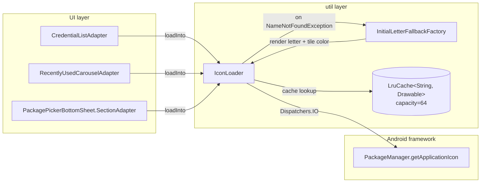

# Design Document

## Overview

**Purpose**: クレデンシャル一覧 / 最近使用 carousel / Package Picker 行の 3 画面に対し、
`PackageManager.getApplicationIcon(packageName)` 経由で実アプリアイコンを描画する共通基盤
`IconLoader` を導入する。Phase 2 (#31〜#34) で配置済みの `@drawable/kn_icon_tile_bg`
（`@color/kn_blue_500` fill + 角丸）を背景として残し、解決済みアイコンを前景に乗せる。
未インストール / 例外時はパッケージ名末尾セグメント先頭 1 文字を白色で描画する頭文字
fallback を提供する。

**Users**: KeyNest エンドユーザーが、credential 一覧画面の閲覧 / 最近使用カードからの
直接起動 / クレデンシャル編集時の package picker の 3 動線で利用する。

**Impact**: 現在は 3 画面のアイコン枠が単色タイルのみで描画されており、保存済み
credential / 候補アプリの視覚的識別が困難である。本 Issue により実アイコン描画 +
頭文字 fallback が共通基盤で提供され、Phase 2 のデザイントークン整合を維持したまま
識別性を回復する。Coil / Glide 等の外部ローダ追加・adaptive icon 独自 mask 描画・
オンライン icon 解決はスコープ外。

### Goals

- 3 adapter (`CredentialListAdapter` / `RecentlyUsedCarouselAdapter` /
  `PackagePickerBottomSheet.SectionAdapter`) で共通利用できる `IconLoader` を新設する
- `Dispatchers.IO` 上で `PackageManager.getApplicationIcon` を呼び、main thread を
  ブロックしない。RecyclerView スクロール中のキャッシュヒット経路で 16ms 以内に
  結果を返す
- 最大 64 エントリの LRU キャッシュで重複解決を抑止する
- 例外時 / 空 packageName 時の挙動を要件 1.4 / 1.5 に従って分岐する
- 3 layout 上のアイコン枠を破壊せず ImageView を内包する形に拡張し、既存 ID と
  `@dimen/kn_icon_tile_lg` / `@dimen/kn_icon_tile_sm` / `@drawable/kn_icon_tile_bg` を維持する
- 単体テスト 4 ケース（成功 / 例外 fallback / cache hit / 空入力）を提供する

### Non-Goals

- 外部画像ローダ (Coil / Glide) への依存追加
- adaptive icon 独自 mask 描画（API 26+ の framework `Drawable` をそのまま使用）
- Web favicon / icon pack のオンライン解決経路
- per-package 動的タイル色割り当て（`@color/kn_blue_500` 単色を維持）
- semaphore 等による並列解決のスロットリング（単純な `Dispatchers.IO` + `launch` で十分）
- Compose 化（既存 View ベース XML / Adapter 改修にとどめる）
- `pm.getApplicationLabel(...)` ベースの頭文字算出（API 呼び出し増のため不採用、
  package name 末尾セグメントを使う）

## Architecture

### Existing Architecture Analysis

- **DI**: 軽量 `ServiceLocator`（`app/src/main/java/com/example/keynest/di/ServiceLocator.kt`）
  が `Context` 起動時に singleton を供給する既存パターン。Application は
  `KeyNestApp.onCreate()` で `ServiceLocator.initialize(this)` を呼ぶ
- **PackageManager 経路**: `PackageSignatureResolver`（`app/src/main/java/com/example/keynest/util/PackageSignatureResolver.kt`）
  が `PackageManager` を constructor 注入する形で実装され、mockk で純粋に単体テストできる
  慣習がある（`PackageSignatureResolverTest`）。本 Issue でも同方針を踏襲する
- **非同期パターン**: 既存の `PackagePickerBottomSheet.onViewCreated()` が
  `viewLifecycleOwner.lifecycleScope.launch { withContext(Dispatchers.IO) { ... } }`
  パターンで package 一覧をロードしている。本 Issue の adapter 統合も同様に
  `recyclerView.findViewTreeLifecycleOwner()` から取れる `lifecycleScope` か、
  Activity / Fragment 側から渡される `CoroutineScope` を利用する
- **ViewBinding**: `viewBinding = true` が有効。adapter は `*Binding` 経由で
  View を参照しており、layout に ImageView を追加すれば自動的に binding 経由で
  アクセスできる
- **既存 layout 上のアイコン枠**: 3 layout とも `FrameLayout` で
  `android:background="@drawable/kn_icon_tile_bg"` を引いている。子 View を持たない
  単純な枠であり、`ImageView` を子として追加する余地がある

### Architecture Pattern & Boundary Map

採用パターン: **共通 utility + per-adapter integration**。
`IconLoader` は単一クラスで cache + 非同期解決 + fallback 描画を提供し、3 adapter は
`onBindViewHolder` 内で `iconLoader.loadInto(imageView, packageName)` を呼ぶ。



**Architecture Integration**:
- 採用パターン: **共通 utility クラス + ViewBinding 統合**。新規 interface を切らず、
  単一クラス `IconLoader` で完結させる（投機的抽象化を避ける）
- ドメイン境界: `com.example.keynest.util` 名前空間（既存の `PackageSignatureResolver` /
  `AppInfoProvider` と同レイヤ）。UI レイヤから片方向に呼ばれる
- 既存パターンの維持: `ServiceLocator` 経由の singleton 供給、`PackageManager` の
  constructor 注入、`lifecycleScope` + `Dispatchers.IO` の非同期ペア
- 新規コンポーネントの根拠: 3 adapter で重複実装したくないため共通 utility が必要。
  cache / race-prevention / fallback 描画の 3 責務を 1 ファイルに集約

### Technology Stack

| Layer | Choice / Version | Role in Feature | Notes |
|-------|------------------|-----------------|-------|
| Frontend / UI | Android View (XML layouts) + ViewBinding | アイコン ImageView を 3 layout に追加 | minSdk=26 |
| Adapters | RecyclerView.Adapter / ListAdapter | bind 時に IconLoader を呼ぶ | 既存 3 adapter |
| Util | 新規 `IconLoader` (Kotlin class) | cache + 非同期解決 + fallback 描画 | `com.example.keynest.util` |
| Cache | `android.util.LruCache<String, Drawable>` | 解決済みアイコンの常駐 | 64 エントリ固定 |
| Async | `kotlinx.coroutines` (`Dispatchers.IO` + `lifecycleScope.launch`) | UI thread を塞がない | 既存依存に含まれる |
| Framework | `PackageManager.getApplicationIcon(String)` | 実アイコン取得 | API 26+ で adaptive icon を `Drawable` で返す |
| Fallback drawing | `android.graphics.drawable.Drawable` サブクラス（手書き） | 頭文字 1 文字を tile 上に描画 | TextDrawable 相当を内製 |
| Tokens | `@dimen/kn_icon_tile_lg` (44dp) / `@dimen/kn_icon_tile_sm` (32dp) / `@drawable/kn_icon_tile_bg` / `@color/kn_blue_500` / `@color/kn_on_primary` (#FFFFFF) | 既存トークンを維持 | NFR 3.1 / 3.2 |
| Test | JUnit4 + mockk + Robolectric (Drawable / Paint 用) | IconLoader 単体テスト | 既存スイートに準拠 |

## File Structure Plan

### Directory Structure

```
app/src/main/java/com/example/keynest/
├── util/
│   ├── IconLoader.kt                       # 新規: cache + 非同期解決 + fallback 描画
│   └── InitialLetterDrawable.kt            # 新規: 頭文字 fallback の Drawable 実装
├── di/
│   └── ServiceLocator.kt                   # 編集: iconLoader プロパティを追加
├── ui/list/
│   ├── CredentialListAdapter.kt            # 編集: bind / onViewRecycled で IconLoader 統合
│   ├── RecentlyUsedCarouselAdapter.kt      # 編集: 同上
│   └── CredentialListActivity.kt           # 編集: adapter 構築時に IconLoader を渡す
└── ui/edit/
    └── PackagePickerBottomSheet.kt         # 編集: SectionAdapter / RowVH に IconLoader を渡す

app/src/main/res/
├── layout/
│   ├── credential_list_item.xml            # 編集: 既存 FrameLayout 内に ImageView (id=icon_app) を追加
│   ├── credential_list_recent_item.xml     # 編集: 同上 (id=icon_app)
│   └── package_picker_row_item.xml         # 編集: 同上 (id=icon_app)
└── values/
    └── ids.xml                              # 新規: <item name="icon_loader_request_tag" type="id"/>

app/src/test/java/com/example/keynest/util/
├── IconLoaderTest.kt                       # 新規: 4 ケース（成功 / 例外 fallback / cache hit / 空入力）
└── InitialLetterDrawableTest.kt            # 新規 (optional): 頭文字算出 pure helper の単体テスト
```

### Modified Files

- `app/src/main/res/layout/credential_list_item.xml`
  - 既存 `<FrameLayout android:background="@drawable/kn_icon_tile_bg" .../>`（58-61 行目）
    の子として `<ImageView android:id="@+id/icon_app" .../>` を追加
  - `android:contentDescription="@null"`（label が別 TextView に存在するため重複読み上げを避ける）
  - `android:scaleType="fitCenter"`、`android:clipToOutline="true"`、`android:padding` は 0
  - 寸法は親 FrameLayout の `kn_icon_tile_lg` を継承
- `app/src/main/res/layout/credential_list_recent_item.xml`
  - 既存 FrameLayout（45-50 行目）の子として `<ImageView android:id="@+id/icon_app" .../>` を追加
  - 寸法 36dp（既存の親と一致）
- `app/src/main/res/layout/package_picker_row_item.xml`
  - 既存 FrameLayout（44-48 行目）の子として `<ImageView android:id="@+id/icon_app" .../>` を追加
  - 寸法は親の `kn_icon_tile_sm` を継承
- `app/src/main/java/com/example/keynest/ui/list/CredentialListAdapter.kt`
  - constructor に `iconLoader: IconLoader` を追加
  - `bind()` 末尾で `iconLoader.loadInto(binding.iconApp, item.packageName)` を呼ぶ
  - `onViewRecycled(holder)` をオーバーライドし `iconLoader.cancel(holder.binding.iconApp)` を呼ぶ
- `app/src/main/java/com/example/keynest/ui/list/RecentlyUsedCarouselAdapter.kt`
  - 同上
- `app/src/main/java/com/example/keynest/ui/edit/PackagePickerBottomSheet.kt`
  - `SectionAdapter` constructor に `iconLoader: IconLoader` を追加（onClick の隣）
  - `RowVH.bind()` 内で `iconLoader.loadInto(binding.iconApp, item.app.packageName)` を呼ぶ
  - `onViewRecycled` をオーバーライドし `RowVH` のとき `iconLoader.cancel(...)` を呼ぶ
- `app/src/main/java/com/example/keynest/ui/list/CredentialListActivity.kt`
  - `setUpMainList()` / `setUpRecentCarousel()` の adapter コンストラクタ呼び出しに
    `ServiceLocator.iconLoader` を渡す
- `app/src/main/java/com/example/keynest/di/ServiceLocator.kt`
  - `val iconLoader: IconLoader by lazy { IconLoader(requireAppContext().packageManager, requireAppContext().resources) }` を追加

## Requirements Traceability

| Requirement | Summary | Components | Interfaces | Flows |
|-------------|---------|------------|------------|-------|
| 1.1 | クレデンシャル一覧で実アイコン描画 | `IconLoader` / `CredentialListAdapter` | `IconLoader.loadInto` | onBindViewHolder → loadInto → PM.getApplicationIcon |
| 1.2 | 最近使用 carousel で実アイコン描画 | `IconLoader` / `RecentlyUsedCarouselAdapter` | 同上 | 同上 |
| 1.3 | Package Picker 行で実アイコン描画 | `IconLoader` / `PackagePickerBottomSheet.SectionAdapter` | 同上 | 同上 |
| 1.4 | 例外時 / 未インストール時に頭文字 fallback | `IconLoader` / `InitialLetterDrawable` | `IconLoader.resolveFallback` | NameNotFoundException catch → InitialLetterDrawable 生成 → ImageView へ |
| 1.5 | 空 / null packageName で fallback なし、tile のみ | `IconLoader` | `IconLoader.loadInto` (early return) | packageName 検証 → ImageView.setImageDrawable(null) |
| 2.1 | LRU cache 最大 64 エントリ | `IconLoader` / `LruCache` | private cache | cache.get → miss → resolve → cache.put |
| 2.2 | main thread 以外で PM 呼び出し | `IconLoader` | suspend / lifecycleScope launch | Dispatchers.IO へ switch |
| 2.3 | スクロール中 cache hit で 16ms 以内 | `IconLoader` / cache | synchronous cache path | cache hit → 同期 setImageDrawable |
| 2.4 | onViewRecycled で旧解決の反映を防ぐ | `IconLoader` / 3 adapter | request tag による照合 | ImageView.setTag(R.id.icon_loader_request_tag, packageName) + cancel |
| 3.1 | tile が未解決時のみ可視 | `IconLoader` / layout | layout 構造 | tile bg は ImageView の下、解決後は不透明 icon が覆う |
| 3.2 | 解決後 ImageView が tile 角丸境界内 | layout / clipToOutline | XML attr | clipToOutline + tile bg の outline |
| 3.3 | 一覧本体 tile サイズ `kn_icon_tile_lg` | layout | XML | dimen 参照を維持 |
| 3.4 | carousel / picker tile サイズ `kn_icon_tile_sm` | layout | XML | dimen 参照を維持 (carousel は 36dp 固定 / picker は kn_icon_tile_sm) |
| 4.1 | 成功ケース テスト | `IconLoaderTest` | `loadIcon(pkg) == drawable` | mockk PackageManager |
| 4.2 | NameNotFoundException fallback テスト | `IconLoaderTest` | `loadIcon` が InitialLetterDrawable を返す | mockk throws |
| 4.3 | cache hit テスト | `IconLoaderTest` | 2 回目で PM 呼ばれない | mockk verify exactly(1) |
| 4.4 | 空 / null fallback なしテスト | `IconLoaderTest` | `loadIcon("")` returns null | early return |
| NFR 1.1 | cache 容量固定 + LRU 追い出し | `IconLoader` | `LruCache` constructor | capacity=64 |
| NFR 1.2 | cache hit 16ms 以内 | `IconLoader` | 同期 path | 同 2.3 |
| NFR 1.3 | キャッシュミス時 main thread 以外 | `IconLoader` | `Dispatchers.IO` | 同 2.2 |
| NFR 2.1 | adaptive icon をそのまま描画 | `IconLoader` | PM 戻り値の `Drawable` を加工せず | 同 1.1 |
| NFR 2.2 | API 26 未満なし（minSdk=26） | (該当なし) | (該当なし) | minSdk=26 で本要件は自動充足 |
| NFR 2.3 | 既存 `<queries>` 制限を増やさない | (Manifest 変更なし) | (該当なし) | AndroidManifest を編集しない |
| NFR 3.1 | `kn_icon_tile_bg` 削除しない | layout | `@drawable/kn_icon_tile_bg` を残す | layout 編集方針 |
| NFR 3.2 | tile dimen 値を変えない | dimens.xml | 編集しない | (該当なし) |
| NFR 3.3 | 既存 bind / ViewHolder / コールバック維持 | 3 adapter | constructor 追加のみ | 既存 callback / DiffUtil / ID 不変 |
| NFR 4.1 | 外部 ローダ依存追加なし | build.gradle | 編集しない | 既存依存のみ使用 |
| NFR 4.2 | オンライン解決経路なし | `IconLoader` | offline-only | PM のみ呼ぶ |

## Components and Interfaces

### Util Layer

#### IconLoader

| Field | Detail |
|-------|--------|
| Intent | 3 adapter から呼ばれる共通アイコン解決ユーティリティ。cache / 非同期 / fallback 描画 / race prevention を担う |
| Requirements | 1.1, 1.2, 1.3, 1.4, 1.5, 2.1, 2.2, 2.3, 2.4, 3.1, NFR 1.1, NFR 1.2, NFR 1.3, NFR 2.1 |

**Responsibilities & Constraints**
- 主責務: `packageName` から `Drawable` を解決して `ImageView` にセットする。
  cache hit は同期で、cache miss は `Dispatchers.IO` 経由で非同期に解決
- 例外時は `InitialLetterDrawable` を返す（要件 1.4）
- `packageName` が空 / null の時は null を返し、ImageView の前景を null にする
  （要件 1.5: 既定 placeholder = null。tile bg だけが見える）
- race prevention: `ImageView.setTag(R.id.icon_loader_request_tag, packageName)` で
  リクエスト ID を ImageView に紐付け、非同期 callback 時に tag が一致する場合のみ
  `setImageDrawable` を行う（要件 2.4）
- cache は `LruCache<String, Drawable>(capacity = 64)`（NFR 1.1）
- main thread から呼び出される前提。`Dispatchers.IO` への switch は IconLoader 内部で行う

**Dependencies**
- Inbound: `CredentialListAdapter` / `RecentlyUsedCarouselAdapter` /
  `PackagePickerBottomSheet.SectionAdapter` — bind 時にアイコン解決を依頼 (Critical)
- Outbound: `PackageManager` — 実アイコン取得 (Critical) / `InitialLetterDrawable` — fallback 描画 (Critical)
- External: なし（外部ライブラリ依存追加なし、NFR 4.1）

**Contracts**: Service [x] / API [ ] / Event [ ] / Batch [ ] / State [ ]

##### Service Interface

```kotlin
package com.example.keynest.util

class IconLoader(
    private val pm: android.content.pm.PackageManager,
    private val resources: android.content.res.Resources,
    private val ioDispatcher: kotlinx.coroutines.CoroutineDispatcher = kotlinx.coroutines.Dispatchers.IO,
    private val cacheCapacity: Int = 64,
) {
    /**
     * Bind the icon for [packageName] into [imageView].
     *
     * - cache hit: synchronously calls setImageDrawable on the calling
     *   (main) thread. Returns immediately.
     * - cache miss: resolves on [ioDispatcher]; on success the result is
     *   posted back to the main thread via imageView.post and applied iff
     *   the imageView's request tag still equals [packageName]
     *   (race prevention; Req 2.4).
     * - packageName blank or null: clears the imageView (setImageDrawable(null))
     *   and returns. No fallback drawing (Req 1.5).
     *
     * Always called from the main thread (RecyclerView bind path).
     */
    fun loadInto(imageView: android.widget.ImageView, packageName: String?)

    /**
     * Marks the imageView's request tag as cleared. Adapters must call this
     * from onViewRecycled so any in-flight resolve will be ignored when it
     * completes (Req 2.4).
     */
    fun cancel(imageView: android.widget.ImageView)

    /**
     * Pure resolution path used by unit tests. Returns the Drawable that
     * would be applied to the ImageView for [packageName], or null when
     * packageName is blank (Req 1.5). On NameNotFoundException returns the
     * fallback InitialLetterDrawable (Req 1.4). On cache hit returns the
     * cached drawable without invoking PackageManager (Req 4.3 / NFR 1.2).
     *
     * suspend so the test can run it under runTest{} with a controlled
     * dispatcher. Internally jumps to [ioDispatcher] for the PM call.
     */
    suspend fun resolve(packageName: String?): android.graphics.drawable.Drawable?
}
```

- **Preconditions**: `loadInto` は main thread から呼ばれること
- **Postconditions**: `loadInto` から戻った時点で、cache hit なら ImageView に
  drawable がセット済み、miss なら一時的に null（または既存 drawable）のまま、
  非同期完了時に tag 一致なら ImageView へ反映
- **Invariants**: cache サイズは常に 64 以下。`InitialLetterDrawable` は不変なので
  cache に複数 ImageView から共有しても安全

##### Race-Prevention Strategy

```kotlin
// Pseudo-code only (Architect は実装コードを書かない)
fun loadInto(imageView: ImageView, packageName: String?) {
    if (packageName.isNullOrBlank()) {
        imageView.setTag(R.id.icon_loader_request_tag, null)
        imageView.setImageDrawable(null)        // Req 1.5
        return
    }
    imageView.setTag(R.id.icon_loader_request_tag, packageName)
    val cached = cache.get(packageName)
    if (cached != null) {
        imageView.setImageDrawable(cached)      // Req 2.3 / NFR 1.2 (同期パス)
        return
    }
    imageView.setImageDrawable(null)            // 解決中は tile bg だけが見える (Req 3.1)
    val lifecycleOwner = imageView.findViewTreeLifecycleOwner() ?: return
    lifecycleOwner.lifecycleScope.launch {
        val drawable = withContext(ioDispatcher) { resolveOrFallback(packageName) }
        cache.put(packageName, drawable)
        if (imageView.getTag(R.id.icon_loader_request_tag) == packageName) {
            imageView.setImageDrawable(drawable)
        }
    }
}
```

- `findViewTreeLifecycleOwner()` で各 ImageView から lifecycle を取得する方針
  （RecyclerView は Activity / Fragment 配下にあるため必ず lifecycle owner を持つ）
- tag key は `R.id.icon_loader_request_tag`（`values/ids.xml` に宣言）

#### InitialLetterDrawable

| Field | Detail |
|-------|--------|
| Intent | 頭文字 1 文字を `@color/kn_blue_500` tile 上に白色で描画する `Drawable` |
| Requirements | 1.4, 3.1, 3.2, NFR 2.1 |

**Responsibilities & Constraints**
- pure `Drawable` サブクラス。背景色 = `@color/kn_blue_500`、角丸 =
  `@dimen/kn_r_icon_tile` (12dp)、テキスト色 = `@color/kn_on_primary` (#FFFFFF)
- 頭文字 = `packageName.substringAfterLast('.').firstOrNull()?.uppercaseChar() ?: '?'`
  （`com.example.keynest` → `K`、`com.android.chrome` → `C`）
- フォントサイズはタイル短辺の 0.45 を目安（44dp tile → 約 20sp 相当、36dp → 16sp 相当、
  32dp → 14sp 相当）。`Paint.measureText` 後に縦中央配置
- 同 packageName で同じ Drawable インスタンスを cache に共有する設計

**Dependencies**
- Inbound: `IconLoader` (Critical)
- Outbound: `android.graphics.Canvas` / `Paint` / `Resources` (color lookup) — Critical
- External: なし

**Contracts**: Service [ ] / API [ ] / Event [ ] / Batch [ ] / State [ ]

##### Drawable Interface

```kotlin
package com.example.keynest.util

internal class InitialLetterDrawable(
    private val letter: String,        // 1 文字。fallback '?' を含む
    private val tileColor: Int,        // @color/kn_blue_500
    private val textColor: Int,        // @color/kn_on_primary
    private val cornerRadiusPx: Float, // @dimen/kn_r_icon_tile を px 換算
) : android.graphics.drawable.Drawable() {
    override fun draw(canvas: android.graphics.Canvas)
    override fun setAlpha(alpha: Int)
    override fun setColorFilter(colorFilter: android.graphics.ColorFilter?)
    @Suppress("OVERRIDE_DEPRECATION")
    override fun getOpacity(): Int

    companion object {
        /** Pure helper covered directly by InitialLetterDrawableTest. */
        fun computeInitial(packageName: String): String
    }
}
```

**設計判断: 描画方式 (Option A: Drawable / Option B: TextView 切替)**

- **採用 = Option A (Drawable 手書き)**
- 理由:
  - 既存 layout（`credential_list_item.xml` 等）は FrameLayout に背景指定のみで、
    内部に TextView を持たせると ImageView と並ぶレイアウト分岐が増えてしまう
  - cache が `Drawable` 型で完結し、ImageView.setImageDrawable() という単一 API で
    実アイコン / fallback の両方を扱えるため、adapter 側のコードが単純化する
  - 頭文字テキスト + tile 背景を 1 つの Drawable にまとめると、cache 容量の上限管理が
    Drawable 単位で完結する
- Option B (TextView 切替) を不採用にする理由:
  - 3 layout 全てに `<ImageView>` と `<TextView>` を兼ねた切替構造を導入する必要があり、
    layout 変更面積が大きくなる
  - adapter 側で `imageView.visibility = GONE / textView.visibility = VISIBLE` の
    切替ロジックが入り、race prevention の単位（ImageView / TextView の 2 つ）が増える

### UI Layer

#### CredentialListAdapter (modified)

| Field | Detail |
|-------|--------|
| Intent | クレデンシャル一覧本体の RecyclerView バインドに IconLoader を組み込む |
| Requirements | 1.1, 2.4, 3.1, 3.2, 3.3, NFR 3.3 |

**Responsibilities & Constraints**
- constructor に `iconLoader: IconLoader` を追加（既存 3 つの click callback の隣に追加）
- `ViewHolder.bind()` 末尾で `iconLoader.loadInto(binding.iconApp, item.packageName)` を呼ぶ
- `onViewRecycled(holder)` をオーバーライドして `iconLoader.cancel(holder.binding.iconApp)`
- 既存 ID (`text_label` / `text_subtitle` / `text_package` / `btn_overflow` / `chip_signature` /
  `strength_bar` / `icon_signature` / `text_signature`) は不変 (NFR 3.3)
- DiffUtil 比較項目は packageName を含む既存条件のまま（既に packageName を比較しているので変更不要）

**Dependencies**
- Inbound: `CredentialListActivity.setUpMainList()`
- Outbound: `IconLoader` (Critical) / `Credential` ドメインモデル
- External: なし

**Contracts**: Service [ ] / API [ ] / Event [ ] / Batch [ ] / State [x]（ViewHolder ライフサイクル）

#### RecentlyUsedCarouselAdapter (modified)

| Field | Detail |
|-------|--------|
| Intent | 最近使用 carousel の RecyclerView バインドに IconLoader を組み込む |
| Requirements | 1.2, 2.4, 3.1, 3.2, 3.4, NFR 3.3 |

**Responsibilities & Constraints**
- `CredentialListAdapter` と同様の改修パターン
- 既存 ID (`card_recent` / `text_recent_label` / `text_recent_username`) は不変

**Dependencies**
- Inbound: `CredentialListActivity.setUpRecentCarousel()`
- Outbound: `IconLoader` (Critical)
- External: なし

#### PackagePickerBottomSheet.SectionAdapter (modified)

| Field | Detail |
|-------|--------|
| Intent | Package Picker 行 (RowVH) のバインドに IconLoader を組み込む |
| Requirements | 1.3, 2.4, 3.1, 3.2, 3.4, NFR 3.3 |

**Responsibilities & Constraints**
- `SectionAdapter` の constructor に `iconLoader: IconLoader` を追加
  （現在は `onClick: (String) -> Unit` のみ）
- `RowVH.bind()` で `iconLoader.loadInto(binding.iconApp, item.app.packageName)` を呼ぶ
- HeaderVH / EmptyVH は影響なし
- `SectionAdapter.onViewRecycled` を実装し、`holder is RowVH` の時に `cancel` を呼ぶ
- `PackagePickerBottomSheet.onViewCreated` で `SectionAdapter` を構築する箇所に
  `ServiceLocator.iconLoader` を渡す
- 既存 ID (`text_app_label` / `text_app_package`) は不変、show() の signature は不変
  (NFR 3.3 / 既存 Req 9.1 維持)

**Dependencies**
- Inbound: `PackagePickerBottomSheet.onViewCreated`
- Outbound: `IconLoader` (Critical)
- External: なし

#### ServiceLocator (modified)

| Field | Detail |
|-------|--------|
| Intent | `IconLoader` singleton の供給 |
| Requirements | NFR 3.3（既存 DI 経路を踏襲し、新規 init を導入しない） |

**Responsibilities & Constraints**
- `val iconLoader: IconLoader by lazy { IconLoader(requireAppContext().packageManager, requireAppContext().resources) }`
- 既存 `KeyNestApp.onCreate()` の `ServiceLocator.initialize(this)` 経路で実体化される
- アプリ全プロセスで singleton（cache を共有することで NFR 1.1 の 64 エントリ上限を
  アプリ全体で守れる）

## Data Models

### Domain Model

本 Issue はドメイン層を変更しない（`Credential` / `EncryptedCredentialRecord` 等は不変）。

### Logical / Physical Data Model

新規データベース変更なし。本 Issue は in-memory cache のみ。

#### IconLoader Cache

| Field | Type | Description |
|-------|------|-------------|
| key | `String` | packageName（trim 済み、非 blank） |
| value | `Drawable` | `PackageManager.getApplicationIcon` の戻り値 or `InitialLetterDrawable` |
| capacity | `Int` | 64 固定（NFR 1.1） |
| eviction | LRU | `android.util.LruCache` 内部実装に委譲。超過時は最も古いエントリを追い出す |
| lifetime | Process 単位 | `ServiceLocator` singleton と同寿命。Activity 再生成では追い出されない |

cache は `Drawable` インスタンスを共有するが、`Drawable` は描画状態（alpha / bounds）を
持つため、複数 ImageView 間で共有する際は `Drawable.constantState?.newDrawable()` 経由で
inflate するか、`ImageView.setImageDrawable` 側で自動 mutate される前提で運用する。
`PackageManager.getApplicationIcon` の戻り値は通常 ConstantState を持つので問題ない。
`InitialLetterDrawable` は constantState を持たない（state は全て constructor 引数で
不変）ので、複数 ImageView で同一インスタンスを共有しても問題ない。

## Error Handling

### Error Strategy

- 例外は呼び出し元（adapter）に伝播させない。すべて `IconLoader` 内部で握りつぶし、
  頭文字 fallback または null に変換する
- 例外発生時の SafeLogger 出力は **行わない**（NFR 1.x 系の機密ログポリシーに反しないが、
  per-row でログが噴くと運用ログを汚すため）

### Error Categories and Responses

- **NameNotFoundException** (`PackageManager.getApplicationIcon` から)
  → `InitialLetterDrawable` を返す (Req 1.4)
- **その他 RuntimeException** (PackageManager 内部の SecurityException / DeadObjectException 等)
  → catch して `InitialLetterDrawable` を返す (Req 1.4 の「アイコン取得処理で例外」)
- **空 / null packageName** → fallback を描画せず null を返す。ImageView の前景は null に
  なり、tile bg (`@drawable/kn_icon_tile_bg`) のみが見える状態 (Req 1.5)
- **末尾セグメントが取れない packageName**（例: `"."` / `".."`）
  → `InitialLetterDrawable("?", ...)` を返す（要件 1.4 の broader interpretation）

## Testing Strategy

### Unit Tests

ファイル: `app/src/test/java/com/example/keynest/util/IconLoaderTest.kt`

1. **成功ケース** (Req 4.1): mockk で `PackageManager.getApplicationIcon("com.example")` が
   特定の `Drawable` を返すよう設定し、`iconLoader.resolve("com.example")` がそれを
   そのまま返すことを `assertThat(result).isSameInstanceAs(stubDrawable)` で検証
2. **NameNotFoundException fallback** (Req 4.2): mockk で
   `getApplicationIcon` が `NameNotFoundException` を throw するよう設定し、
   `iconLoader.resolve("com.missing")` の戻り値が `InitialLetterDrawable` インスタンスで、
   `computeInitial("com.missing") == "M"` であることを検証
3. **Cache hit** (Req 4.3 / NFR 1.2): 同一 packageName を 2 回 resolve し、
   `verify(exactly = 1) { pm.getApplicationIcon(any<String>()) }` で PM が 1 回しか
   呼ばれないことを検証
4. **空 / null fallback なし** (Req 4.4 / Req 1.5): `iconLoader.resolve("")` および
   `iconLoader.resolve(null)` が `null` を返すこと、`verify(exactly = 0) { pm.getApplicationIcon(any<String>()) }`
   で PM が呼ばれないことを検証

ファイル: `app/src/test/java/com/example/keynest/util/InitialLetterDrawableTest.kt` (optional)

5. **頭文字算出** (Req 1.4 補強): `computeInitial("com.example.keynest") == "K"` /
   `computeInitial("com.android.chrome") == "C"` / `computeInitial("foo") == "F"` /
   `computeInitial(".") == "?"`

### Integration Tests

本 Issue では adapter 側の統合テスト（Espresso）は導入しない（既存スイートが
源コード XML pinning 中心であり、新規 UI test harness の導入はスコープ外）。
ただし以下を必要に応じて追加検討:

1. **Layout pinning 更新**: `CredentialListLayoutTokensTest` / `PackagePickerLayoutTokensTest`
   に `@+id/icon_app` の存在確認を追加（既存スタイルに合わせて XML 直読みで検証）

### E2E/UI Tests

該当なし。

### Performance/Load

- Req 2.3 / NFR 1.2 の「cache hit 16ms 以内」は単体テストでは検証困難（Robolectric の
  仮想時間では現実的な物理時間を測れない）。設計上、cache lookup は `LruCache.get`
  （O(1) HashMap 操作）+ `ImageView.setImageDrawable`（同期）のみで完結するため、
  実装上 16ms を超過する余地がない構造をレビューで確認する

## Security Considerations

- `PackageManager.getApplicationIcon` は端末上のインストール済みアプリのアイコンを返す
  だけで、credential のプレーンテキストには触れない。NFR 1.3（plaintext を bind しない）
  に違反する経路は本変更で追加されない
- 同一 process / 同一 ServiceLocator singleton に常駐するため、cache に乗る Drawable
  はアプリ終了で消える。永続化はしない
- AndroidManifest の `<queries>` は変更せず、既存の launcher-launchable apps の可視性
  範囲を維持する (NFR 2.3)

## Optional Sections

### Performance & Scalability

- minSdk=26 のため `getApplicationIcon` は同期 API でブロックしうる
  （ディスク I/O が発生する可能性あり）。すべての PM 呼び出しは `Dispatchers.IO` で実行
- スクロール中の cache hit は同期 path のみ（O(1) LruCache lookup + setImageDrawable）
  であり、1 frame 予算 16.67ms に対して充分マージンがある
- 64 エントリ cache はメモリ的に約数 MB 程度（adaptive icon Bitmap は通常 100KB 前後）。
  Application singleton として常駐させても問題ない

## 確認事項

PM 要件定義の「確認事項」3 項目に対する Architect の暫定設計判断。最終確定は人間レビュワーに委ねる。

1. **頭文字算出ルール**: package name 末尾セグメント先頭 1 文字を大文字化する方針で
   `InitialLetterDrawable.computeInitial` を実装。`com.android.chrome` → `C` /
   `org.mozilla.firefox` → `F` / 末尾セグメント取得失敗時は `?`。
   `pm.getApplicationLabel` は呼び出さない（API 増 + NameNotFoundException 時にラベルが
   そもそも取れない）
2. **非同期実装の粒度**: `IconLoader` 内で `withContext(Dispatchers.IO)` への switch を
   行い、呼び出し側 adapter は `findViewTreeLifecycleOwner()?.lifecycleScope` を利用する
   単純な構成。semaphore 等のスロットリングは導入しない（cache が効くため再解決頻度が低く、
   minSdk=26 の PM 呼び出しコストも限定的）
3. **adaptive icon の扱い**: API 26+ で `getApplicationIcon` が返す `AdaptiveIconDrawable`
   をそのまま `ImageView.setImageDrawable` に渡す。独自 mask を描画しない。
   タイルの角丸 clip は `ImageView` の `android:clipToOutline="true"` + 親 FrameLayout の
   `kn_icon_tile_bg`（角丸 12dp）の outline で実現する。minSdk=26 のため API 26 未満
   分岐は不要

## 自己レビュー（Mechanical Checks）

- **Requirements traceability**: requirements.md の全 numeric ID
  (1.1, 1.2, 1.3, 1.4, 1.5, 2.1, 2.2, 2.3, 2.4, 3.1, 3.2, 3.3, 3.4, 4.1, 4.2, 4.3, 4.4,
  NFR 1.1, NFR 1.2, NFR 1.3, NFR 2.1, NFR 2.2, NFR 2.3, NFR 3.1, NFR 3.2, NFR 3.3,
  NFR 4.1, NFR 4.2) を Requirements Traceability セクションに記載済み
- **File Structure Plan の充填**: TBD / placeholder なし。すべての新規 / 編集ファイルに
  絶対パス相当（リポジトリルートからの相対パス）と編集内容を明示
- **Orphan component**: design.md の Components (IconLoader / InitialLetterDrawable /
  CredentialListAdapter / RecentlyUsedCarouselAdapter / PackagePickerBottomSheet.SectionAdapter /
  ServiceLocator) すべて File Structure Plan に対応ファイルあり
