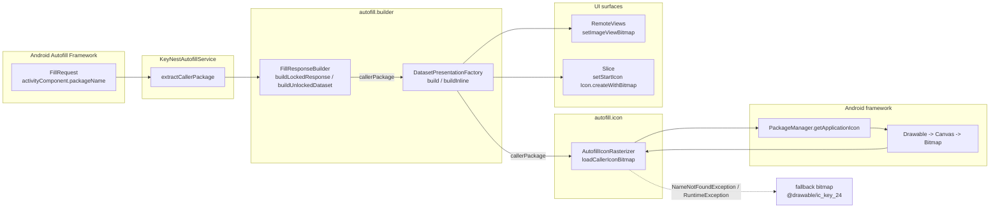

# Design Document — Issue #80 / feat(autofill): クレデンシャル候補リストに入力対象アプリのアイコンを表示

> 関連: `requirements.md`（本ディレクトリ）
>
> 関連 Issue: #34（dataset_presentation.xml の View ID 不変ルール）/ #43, #46（in-app `IconLoader` の前例。autofill 経路は別実装）/ #66（locked dataset の customField 取り扱い）

## 1. 概要 / 全体像

### Purpose
autofill caller アプリの application icon を `PackageManager.getApplicationIcon` で取得して `Bitmap` にラスタライズし、dataset popup（`RemoteViews`）と inline suggestion（`Slice`）の双方に同じ caller icon を表示する。icon 取得に失敗した場合は既存の `@drawable/ic_key_24` に fallback する（要件 1.3 / 確認事項 3-(a)）。

### Aim 3-4 行で
- `DatasetPresentationFactory` に新たに `callerPackage: String?` を渡し、internally に新 util `AutofillIconRasterizer` を呼んで bitmap を作る。
- `FillResponseBuilder` が `FillRequest` 由来の caller `packageName`（`AssistStructure.activityComponent.packageName`）を伝搬する。
- locked / unlocked dataset、popup / inline すべての経路で同じ caller icon が乗る（要件 4.2）。
- 既存 View ID（`@+id/dataset_label` / `@+id/dataset_subtitle`）は不変。新規 ID のみ追加し layout 構造は維持する。

### アーキテクチャ図



## 2. モジュール構成 / 公開 IF

### 配置

| Component | Path | Status |
|-----------|------|--------|
| `AutofillIconRasterizer` | `app/src/main/java/io/github/hitoshiichikawa/keynest/autofill/icon/AutofillIconRasterizer.kt` | 新規 |
| `DatasetPresentationFactory` | `app/src/main/java/io/github/hitoshiichikawa/keynest/autofill/builder/DatasetPresentationFactory.kt` | 既存・改修 |
| `FillResponseBuilder` | `app/src/main/java/io/github/hitoshiichikawa/keynest/autofill/builder/FillResponseBuilder.kt` | 既存・改修 |
| `dataset_presentation.xml` | `app/src/main/res/layout/dataset_presentation.xml` | 既存・属性のみ改修 |

> 既存 `IconLoader`（`util/IconLoader.kt`）との統合は **しない**（要件 Out of Scope）。Service には `lifecycleScope` が無く `applicationScope` 連動も autofill では別管理が必要なため、autofill 経路は同期的にラスタライズして bitmap だけ返すシンプルな経路を持つ。

### 新規 util の置き場所（採用方針）
- `autofill/icon/` パッケージを新設し `AutofillIconRasterizer` を置く。
- 理由: 同じ autofill ドメイン内で「Drawable→Bitmap 変換 + fallback」だけを担う薄い util にしたい。`util/` に置くと in-app の `IconLoader` と機能が紛らわしい（cache / lifecycle がある／ない、`Drawable` 返却 / `Bitmap` 返却の差）。
- 代替案（不採用）: `util/AutofillIconRasterizer.kt` 直下。autofill 専用ロジックを `util/` に置くと境界が曖昧になるため不採用。

### `DatasetPresentationFactory.build()` シグネチャ

| Phase | Signature |
|-------|-----------|
| 現行 | `fun build(label: String, subtitle: String): RemoteViews` |
| 新 | `fun build(label: String, subtitle: String, callerPackage: String?): RemoteViews` |

#### `callerPackage` の挙動
- `null` または blank の場合: 既存と同じく `@drawable/ic_key_24` を ImageView に残す（fallback と同一の見た目）。これにより既存テスト（`dataset_label` / `dataset_subtitle` の `setTextViewText` だけ呼ぶ単純パス）の構造を維持する。
- 非 null の場合: `AutofillIconRasterizer.loadCallerIconBitmap(callerPackage)` を呼び、戻り値 `Bitmap` を `RemoteViews.setImageViewBitmap(R.id.dataset_icon, bitmap)` で適用する。

### `DatasetPresentationFactory.buildInline()` シグネチャ

| Phase | Signature |
|-------|-----------|
| 現行 | `fun buildInline(label, subtitle, spec: InlinePresentationSpec?): InlinePresentation?` |
| 新 | `fun buildInline(label, subtitle, spec: InlinePresentationSpec?, callerPackage: String?): InlinePresentation?` |

- `Slice.Builder` に `InlineSuggestionUi.newContentBuilder(...).setStartIcon(Icon.createWithBitmap(bitmap)).setTitle(...).setSubtitle(...).build()` を流す。
- `spec.maxSize` が指定されている場合は bitmap サイズをそれに収める（§3 サイズ規定参照）。

### 新 util の公開 IF

| Member | Signature | Notes |
|--------|-----------|-------|
| `class AutofillIconRasterizer` | `constructor(context: Context)` | `PackageManager` / `Resources` は context から取得。テスト容易性のため `packageManager: PackageManager` を overload 引数として受け取れる secondary constructor を用意してもよい |
| `loadCallerIconBitmap` | `fun loadCallerIconBitmap(callerPackage: String?, sizePx: Int = defaultSizePx): Bitmap` | 失敗時は fallback bitmap を返す（null は返さない）。サイズは density から計算する 48dp 相当（§3） |
| `loadFallbackBitmap` | `fun loadFallbackBitmap(sizePx: Int = defaultSizePx): Bitmap` | `@drawable/ic_key_24` を blue tile 込みでラスタライズしたものを返す |

> Note: 関数は context 化された Drawable → Bitmap 変換だけを行う。**キャッシュは持たない**（確認事項 4 採用方針）。

### `FillResponseBuilder` の伝搬経路

```
KeyNestAutofillService.onFillRequest
    ├── structure = request.fillContexts.lastOrNull()?.structure
    ├── callerPackage = extractCallerPackage(structure)    ── 既存
    └── responseBuilder.buildLockedResponse(
              candidates, usernameAutofillId, passwordAutofillId,
              customFieldCandidates, inlineSpecs,
              callerPackage = callerPackage,                 ── 新規追加
        )
            └── buildLockedDataset(..., callerPackage = callerPackage)
                    ├── presentationFactory.build(label, subtitle, callerPackage)
                    └── presentationFactory.buildInline(label, subtitle, spec, callerPackage)
```

- locked / unlocked 両 dataset で同じ `callerPackage` を使う点が要件 4.2 の核心。`AutofillUnlockActivity` 経由の post-auth Dataset 経路でも同じ presentation を作る場合は同じ伝搬ルートを通す（後述 §4 異常系参照）。
- `callerPackage` は `KeyNestAutofillService.extractCallerPackage` がすでに `AssistStructure.activityComponent.packageName` を返している（Service の caller package 信頼パス）。新たな取得経路を増やさない。

## 3. データモデル / 定数

### Bitmap サイズ

| Constant | Value | 根拠 |
|----------|-------|------|
| `DEFAULT_ICON_DP` | `48` | dataset 行の icon tile が 32dp（`kn_icon_tile_sm`）+ 内側 20dp icon。bitmap は icon tile に合わせて 48dp を上限とし、`scaleType` で center crop。inline 用は `spec.maxSize` で更に縮小される |
| `defaultSizePx` | `(DEFAULT_ICON_DP * resources.displayMetrics.density).toInt()` | xxhdpi (3.0) で 144 px、xxxhdpi (4.0) で 192 px、mdpi (1.0) で 48 px |
| `MAX_SIZE_PX` | `192` | 上限を密度に依存させず固定で押さえる安全策。`displayMetrics.density` が異常に大きい端末でも IPC を超えない |

### IPC サイズ見積もり

- bitmap 1 枚: 192 × 192 × 4 bytes = **147,456 bytes ≒ 144 KB**（最大密度 xxxhdpi の上限）。
- 典型ケース（xxhdpi 144×144×4 ≒ 81 KB）。
- 1 `FillResponse` が dataset 最大 N 件で、各 dataset の `RemoteViews` に bitmap が乗る場合: **N × 144 KB**。
- Binder transaction 制約 ≒ **1 MB**。安全マージンを取り N=6 を実質上限と見做す（144 KB × 6 = 864 KB）。`AutofillCandidate` の件数自体は use case 側で抑える契約だが、念のため `DatasetPresentationFactory` 側でも bitmap サイズ上限（192 px）でガードする。
- 6 件を超える場合の挙動: bitmap サイズを 96 px（=48dp×2.0）に強制縮小する fallback 経路は **本 Issue では未実装**（確認事項に列挙、後続 Issue で対応）。

### fallback の Drawable リソース
- `R.drawable.ic_key_24`（既存）
- blue tile 込み: `R.drawable.kn_icon_tile_bg`（既存）を背景として下に敷き、その上に `ic_key_24` を描画する fallback bitmap を組み立てる（要件 2.3「blue tile 背景の上に center crop で表示」と整合）。
- 実装方針: `loadFallbackBitmap` 内で「`kn_icon_tile_bg` を canvas に draw → 中央に 20dp 相当の `ic_key_24` を `kn_on_primary` tint で draw」して 1 枚の bitmap にまとめる。

### caller icon を blue tile 上に乗せるか
- 要件 2.3 に従い、**caller icon もこれまでの blue tile 上に乗せる**。
  - 描画手順: `kn_icon_tile_bg` を bitmap canvas に draw → caller `Drawable` をその上に center crop / aspect-preserve fit で draw（§5）。
  - これにより、layout XML 側の `FrameLayout` 背景 `kn_icon_tile_bg` と内側 ImageView の構造は維持しつつ、ImageView の `src` だけを bitmap で差し替える形になる。
- 代替案（不採用）: layout 側の `FrameLayout` 背景を消し ImageView 全面に caller icon を貼る。視覚仕様が変わるため不採用。
- 別案として「blue tile を描かず、caller icon の透過部分は透ける」案も検討したが、視覚整合（§10 確認事項）に列挙する。

## 4. 処理フロー

### 4.1 正常系シーケンス

```
1. FillRequest 着信
2. KeyNestAutofillService.extractCallerPackage(structure)
   -> callerPackage: String?
3. FillResponseBuilder.buildLockedResponse(..., callerPackage)
4. for each candidate:
   a. buildLockedDataset(candidate, ..., callerPackage)
   b. presentationFactory.build(label, subtitle, callerPackage)
      -> AutofillIconRasterizer.loadCallerIconBitmap(callerPackage)
      -> PackageManager.getApplicationIcon(callerPackage) : Drawable
      -> drawableToBitmap(drawable, sizePx) : Bitmap
      -> RemoteViews.setImageViewBitmap(R.id.dataset_icon, bitmap)
   c. presentationFactory.buildInline(label, subtitle, spec, callerPackage)
      -> 同じ rasterizer + Icon.createWithBitmap -> slice.setStartIcon
5. FillResponse を framework に返却
```

### 4.2 異常系

| Trigger | 挙動 |
|---------|------|
| `callerPackage == null` または blank | 既存 `@drawable/ic_key_24` を維持（layout XML の初期 `src` を変更しない）。`AutofillIconRasterizer` は呼ばない |
| `PackageManager.NameNotFoundException` | `loadFallbackBitmap()` を返す（blue tile + key icon の合成 bitmap）。warn ログは出さない（NFR 3.2） |
| `RuntimeException`（`SecurityException` / `DeadObjectException` 等） | 同上。`loadFallbackBitmap()` で degrade。`IconLoader` の前例に倣い `Log.w` までは出さない |
| `Drawable` が `AdaptiveIconDrawable` | `drawable.setBounds(0, 0, w, h) + drawable.draw(canvas)` 標準パターン（§5） |
| `Drawable` が `BitmapDrawable` のみ | aspect-preserve fit + center crop で 48dp tile に揃える（§5） |
| `Drawable` の `intrinsicWidth/Height <= 0` | フォールバックとして fixed sizePx で描く |

### 4.3 locked dataset vs unlocked dataset の挙動の同一性

- **locked dataset**: `buildLockedDataset` 内で `presentationFactory.build(label, subtitle, callerPackage)` を呼ぶ。`attachLockedValue` で `setValue(id, value, presentation, inlinePresentation)` に渡す `presentation` / `inlinePresentation` が新 bitmap を保持。
- **unlocked dataset**: 現行コード（`buildUnlockedDataset`）は presentation を **持たない**（コメント参照: 「auth-result Dataset は picker に表示されないため RemoteViews 不要」）。
  - したがって caller icon を **乗せる必要は無い**。要件 4.2 は「locked dataset と unlocked dataset 両方の dataset 行に伝搬」と書かれているが、ここでの "両方の dataset 行" は **ユーザーが picker で目にする行のみ**（= locked dataset）を指すと解釈する。unlocked Dataset は picker に出ないため icon 描画の対象外。
  - 確認事項に明記（§10）: 「要件 4.2 の文言の解釈確認」。

## 5. AdaptiveIconDrawable のラスタライズ方針

### 標準パターン
```
val sizePx = computeSizePx()
val bitmap = Bitmap.createBitmap(sizePx, sizePx, Bitmap.Config.ARGB_8888)
val canvas = Canvas(bitmap)
// blue tile を先に描く
tileDrawable.setBounds(0, 0, sizePx, sizePx)
tileDrawable.draw(canvas)
// caller icon を中央に描く
drawable.setBounds(0, 0, sizePx, sizePx)
drawable.draw(canvas)
```

### `AdaptiveIconDrawable` の挙動
- API 26+ では `AdaptiveIconDrawable` がそのまま `setBounds + draw` で正方形領域にレンダリングされる（background レイヤー + foreground レイヤーが合成済み）。framework がマスクを適用しない代わりに我々が要求した正方形にフル描画される。
- 独自 mask（円形 / squircle 等）は **適用しない**（要件 Out of Scope）。framework が出力した正方形 raw を blue tile 上に乗せる。
- foreground / background のレイヤーを取り出して独自に合成する案もあるが、要件で「framework がラスタライズした bitmap をそのまま使う」と明示されているため最小実装に留める。

### `BitmapDrawable` のみのアプリ
- `drawable.intrinsicWidth / intrinsicHeight` が `> 0` の場合、aspect-preserve fit + center crop で `sizePx × sizePx` 領域に収める。
  - 計算: `scale = max(sizePx / intrinsicW, sizePx / intrinsicH)`、scale 後に中央寄せして bounds を設定。
- `<= 0` の場合は `setBounds(0, 0, sizePx, sizePx)` で強制ストレッチ（要件 確認事項 2 で許容）。

## 6. InlinePresentation 対応

### Slice での icon 設定

現行の `buildInlineApiR` は `InlineSuggestionUi.newContentBuilder(pendingIntent).setTitle(label).setSubtitle(subtitle).build()` だけを呼んでいる。`androidx.autofill.inline.v1.InlineSuggestionUi.Content.Builder` には `setStartIcon(Icon)` API があるためそれを利用する：

```
val icon: Icon = Icon.createWithBitmap(bitmap)
val content = InlineSuggestionUi.newContentBuilder(pendingIntent)
    .setStartIcon(icon)
    .setTitle(label)
    .setSubtitle(subtitle)
    .build()
val slice = content.slice
```

### サイズ整合
- `InlinePresentationSpec.maxSize: Size` を参照し、`sizePx = min(defaultSizePx, maxSize.width, maxSize.height)` で bitmap を作る。
- `spec.maxSize` が `<= 0` の場合は `defaultSizePx` を使う（防御）。

### API レベルガード
- `InlinePresentation` 自体が API 30+。既存の `@RequiresApi(Build.VERSION_CODES.R)` で `buildInlineApiR` が分離されている境界をそのまま維持する。
- `Icon.createWithBitmap` は API 23+ なので Android R では問題なし。

## 7. テスト設計

### モック方針
- **Robolectric** で `AndroidJUnit4` を使い、`ApplicationProvider.getApplicationContext<Context>()` から `Context` を取得する慣習を継続。
- `PackageManager` のモックは Robolectric の `ShadowPackageManager` 経由で `shadowOf(packageManager).installPackage(packageInfo)` パターンを使うか、または `mockk<PackageManager>` を `AutofillIconRasterizer` の secondary constructor に注入する経路を提供する。
  - 採用方針: **secondary constructor + mockk 注入** を採る。`shadowOf(packageManager).installPackage` は full PackageInfo 構築が冗長で、テストの読みやすさが落ちるため。

### 既存テストへの影響

| File | 影響 | 修正方針 |
|------|------|---------|
| `FillResponseBuilderTest` | `buildLockedResponse` の引数 1 個追加 | 既存呼び出しに `callerPackage = "com.example.target"` を追加（既存 `candidate.packageName` と同じでよい） |
| `LockedFillResponseSecurityTest` | 同上 | `buildLockedResponse(..., callerPackage = ...)` の追加。parcel 中に caller package が含まれることは許容（package name は元々非機密） |
| `DatasetPresentationLayoutTokensTest` | layout XML の text 検証のみ。bitmap 設定は実行時挙動なので影響なし | `R.id.dataset_icon` の存在を新たに検証する assertion を 1 つ追加（推奨） |
| `CustomFieldFillResponseTest` | `buildLockedResponse` のシグネチャ更新 | 既存呼び出しに `callerPackage` を追加 |

### 新規テスト

| File | 検証観点 | 要件対応 |
|------|---------|---------|
| `AutofillIconRasterizerTest` | 正常系: mock PM が任意の `Drawable` を返したとき、`Bitmap` が正方形 `sizePx × sizePx` で返ること | 1.1 / 1.2 |
| | `NameNotFoundException`: fallback bitmap が返ること（null ではないこと） | 1.3 |
| | `RuntimeException`: 同上 | 1.3 |
| | blank / null `callerPackage`: fallback bitmap が返ること | 4.x |
| `DatasetPresentationFactoryTest`（新規） | 正常系: `RemoteViews` が `dataset_icon` に bitmap を `setImageViewBitmap` していることを reflection or `RemoteViews.apply` で検証 | 2.1 / 5.1 |
| | `NameNotFoundException` 経路で fallback bitmap が乗る | 5.2 |
| | `buildInline` で slice の `startIcon` が設定される | 3.1 / 5.3 |
| | `callerPackage == null` の場合は `setImageViewBitmap` を呼ばない（既存 `src` を残す） | 5.x（要件 4.x の null パス） |

> Note: `RemoteViews` の inflate 内容を検証するのは Robolectric では難易度が高い。`RemoteViews` の `setBitmap` が記録した action を public API で取り出す経路が乏しいため、テストは「ビルダが例外なく完了する」「rasterizer モックが期待回数で呼ばれる」レベルで止める。bitmap が実 dataset_icon に乗ったかは `DatasetPresentationLayoutTokensTest` の View ID 存在チェックで担保する。

## 8. リスク / トレードオフ

| Risk | 影響 | 緩和策 |
|------|------|--------|
| IPC サイズ超過（dataset 多数 × 大 bitmap） | `TransactionTooLargeException` で `FillResponse` が届かない | bitmap を 192 px 上限（§3）、`AutofillCandidate` の件数は use case 側で N <= 数件に制限される運用前提。N が増えた場合の bitmap 縮小は後続 Issue |
| `PackageManager` 呼び出しコスト | dataset N 件分の同期解決 | 初期実装はキャッシュなし（確認事項 4）。1 caller package につき N 回呼ぶ無駄を避けるため、`DatasetPresentationFactory` の build 関数を 1 `FillResponse` 内で 1 回だけ caller bitmap を解決し、N dataset で同一 bitmap を **再利用** する経路にする（`FillResponseBuilder` 側で `bitmap` を一度作って各 dataset の `build()` に渡す形ではなく、`DatasetPresentationFactory` 自体を `FillResponse` 単位の short-lived instance として作るか、内部で per-response 1-shot キャッシュを持つ）。**採用案: `FillResponseBuilder.buildLockedResponse` 内で rasterizer を 1 回だけ呼び、結果 bitmap を per-dataset `build()` に渡す**（最も明示的）。`build` のシグネチャはそれに合わせ `bitmap: Bitmap?` を取る形にする選択肢もあるが、API がブレるので **`build(label, subtitle, callerPackage)` を維持しつつ rasterizer 側で memoize は持たない**を採用する。確認事項に列挙。 |
| 不正な `packageName` が渡された場合 | `NameNotFoundException` → fallback bitmap | `extractCallerPackage` は `activityComponent.packageName` 由来で framework が検証済み。fallback で安全に倒れる |
| AdaptiveIconDrawable レイヤー合成が想定外 | 描画乱れ | framework 出力をそのまま使うので、ベンダー固有の AdaptiveIcon が崩れた場合のレポートを観察。本 Issue では mask を当てない |
| View ID 不変ルール（Issue #34 Req 7）への抵触 | 既存テスト失敗 | `@+id/dataset_label` / `@+id/dataset_subtitle` は **不変**。新規 `@+id/dataset_icon` を **追加** のみ。既存 ImageView に `android:id="@+id/dataset_icon"` を追加するだけで構造を変えない |
| dataset_presentation.xml の visual contract（`DatasetPresentationLayoutTokensTest`） | 既存テスト失敗 | 既存の `@drawable/ic_key_24` / `@drawable/kn_icon_tile_bg` / `kn_on_primary` tint への参照は維持。テストが期待する文字列は layout XML 上に残る |
| blue tile + caller icon の合成で違和感（特に AdaptiveIcon は元々背景を持つ） | 視覚的に「タイル on タイル」になる | 要件 2.3 通り blue tile は維持。違和感が大きい場合は §10 確認事項として将来検討 |
| `Bitmap` のメモリ占有 | 端末 RAM 圧迫 | per-response でも数 MB に収まる。dataset を返した後に bitmap 参照は `RemoteViews` 側に握られるので、Service 側ではローカル参照を解放（GC 任せ） |

## 9. ロールアウト / 後方互換

- 既存テスト（`FillResponseBuilderTest` / `LockedFillResponseSecurityTest` / `DatasetPresentationLayoutTokensTest` / `CustomFieldFillResponseTest`）は引数追加に伴う **微修正** のみで pass する。
- feature flag は **不要**。シンプルに切り替える。
- `DatasetPresentationFactory.build(label, subtitle, callerPackage)` の `callerPackage` を呼び出し側で必ず指定する（既存呼び出しは `FillResponseBuilder` 内のみなので外部互換性懸念なし）。
- minSdk 26（既存）に変更なし。
- ProGuard / R8: 新規クラスは reflection を使わないため特別な keep 不要。

## 10. 確認事項 / オープン課題（PR 本文に転記）

> Architect が判断しきれず Developer / Reviewer に確認したい論点。

1. **Bitmap 上限ピクセル数の最終値（NFR 2.1）**
   - 設計案: `defaultSizePx = 48dp × density`、`MAX_SIZE_PX = 192`。
   - 確認: dataset を 6 件返す想定で 864 KB の IPC 占有を許容するか。N が増えた場合の自動縮小ロジックは別 Issue でよいか。

2. **AdaptiveIconDrawable のレイヤー描画戦略**
   - 設計案: `drawable.setBounds + drawable.draw` のみ（framework 既定のレンダリング）。
   - 確認: background レイヤー + foreground レイヤーを別々に取り出してフルマスク（円形 mask）まで自前で行う必要はあるか。要件 Out of Scope を踏襲し本 Issue では未実装。

3. **既存 blue tile 背景との視覚整合（要件 2.3）**
   - 設計案: blue tile を bitmap 内に焼き込み、その上に caller icon を center crop で乗せる（caller icon が透過 PNG / AdaptiveIcon の場合は blue が透けて見える）。
   - 確認: AdaptiveIcon は元来自分の背景レイヤーを持つため、「タイル on タイル」になり違和感が出る可能性がある。blue tile を撤廃して caller icon 単独で描く案を採るかどうか。本 Issue は **blue tile 維持** を採るが、視覚レビューで NG なら追って差し替え。

4. **要件 4.2 の解釈確認（locked / unlocked 両方）**
   - 設計案: unlocked Dataset は picker に表示されないため presentation を持たず、caller icon は乗せない。**locked dataset のみが picker UI に現れるので icon 差し替え対象**。
   - 確認: 要件文「locked dataset / unlocked dataset 両方の dataset 行に伝搬」は、コード上では locked のみで実害なしという解釈で問題ないか。

5. **rasterizer の per-FillResponse 1-shot キャッシュ**
   - 設計案: キャッシュ無し。`AutofillIconRasterizer` は呼ばれるたびに `getApplicationIcon` を実行。N dataset で N 回呼ばれる。
   - 確認: 1 FillResponse 内では caller package が同一なので、`FillResponseBuilder.buildLockedResponse` 冒頭で **1 回だけ** rasterize し、結果 bitmap を各 `buildLockedDataset` に渡す経路に変更してもよいか。本ドキュメント §8 では現状「シンプル優先で N 回呼ぶ」と書いているが、N=6 で大きな差はないので Developer フェーズで再判断する。

6. **`DatasetPresentationFactoryTest`（新規）の RemoteViews 検証手段**
   - 設計案: `RemoteViews.apply` を `ApplicationProvider` の Context で実行し、inflate 後の `ImageView.drawable` が `BitmapDrawable` であることを確認する経路を取る。
   - 確認: Robolectric 配下で `RemoteViews.apply` を呼ぶテスト経路は KeyNest 既存に前例がない。リフレクション / モックでも検証可能だが、可読性とのトレードオフは Developer 判断とする。
