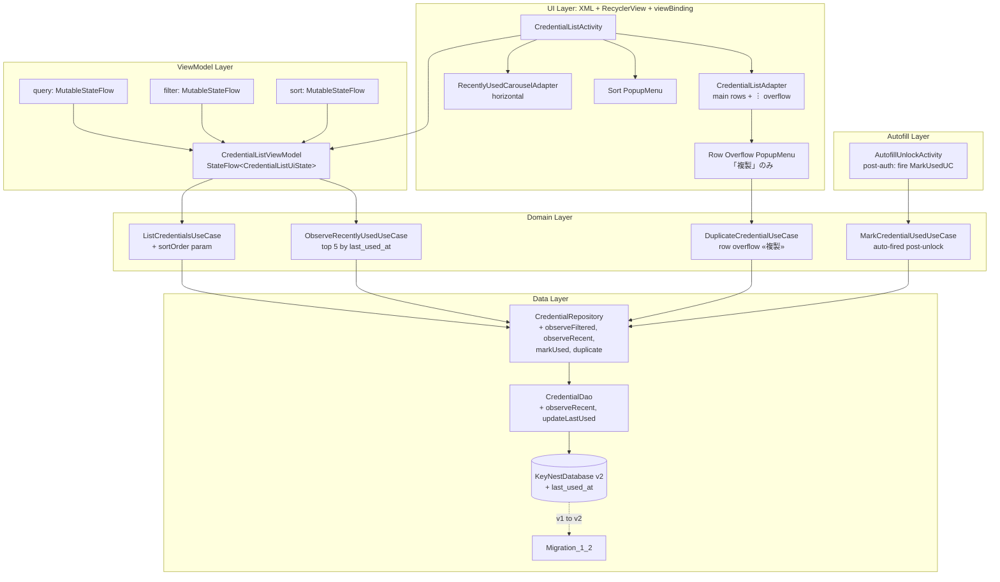
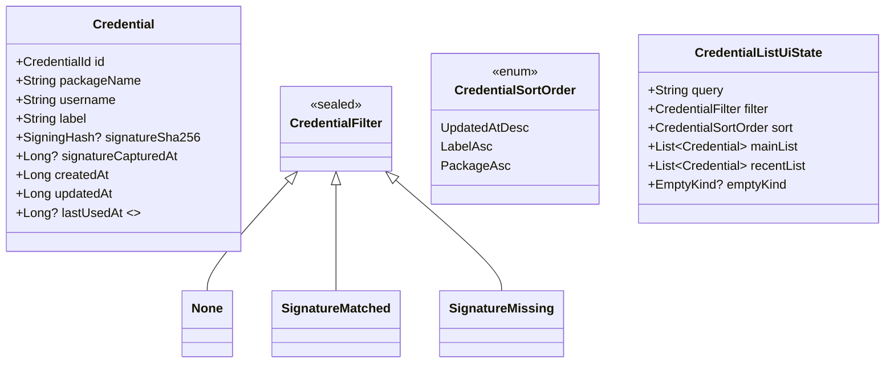
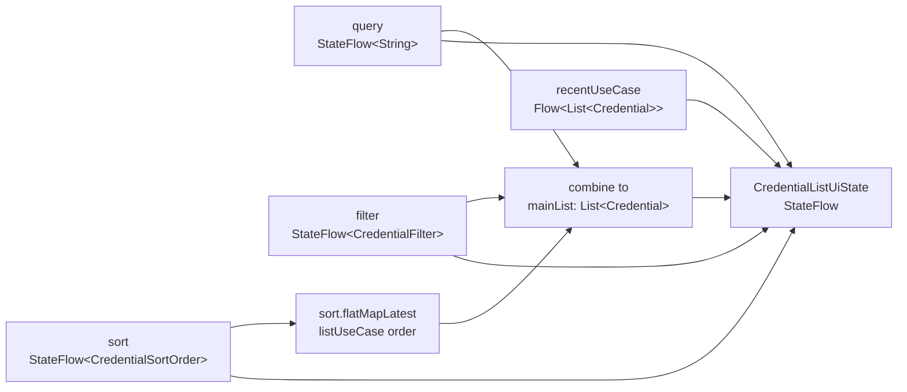
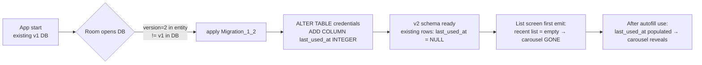

# Design Document

## Overview

**Purpose**: クレデンシャル一覧画面に「検索」「フィルタチップ」「最近使ったカルーセル」「並び替え」「行 overflow メニュー（複製）」を導入し、登録件数の増加に伴って劣化する到達性を改善する。完全ローカル動作で、ネットワーク同期・analytics 送信は一切行わない。

**Users**: KeyNest を業務端末で日常的に使う利用者（同一アプリの複数アカウント運用者、署名未取得 credential の点検運用者）。一覧から目当ての credential を探す動線、および「最近 autofill で使った credential への再アクセス」の頻度が高い。

**Impact**: 現状の `CredentialListActivity` + `CredentialListAdapter` + `CredentialListViewModel` は「全件 `updated_at DESC` をそのまま流す」だけの片方向データフローで、Room schema にも `last_used_at` カラムは存在しない。本機能は (a) Room schema v2 への migration を追加し、(b) Repository / DAO に「直近 5 件」「last_used_at 更新」「並び替え別 query」を追加し、(c) `AutofillUnlockActivity` の auth 成功直後に `last_used_at` 更新を fire-and-forget で挟み、(d) ViewModel に検索文字列 / フィルタ集合 / ソート種別の入力 channel を追加して 3 つの `Flow` をメインリスト / カルーセル / 空状態に合成し、(e) XML レイアウトに検索バー・チップ群・カルーセル領域・並び替えボタン・行 overflow アイコンを追加する。

### Goals

- 検索（部分一致、大文字小文字区別なし、incremental）/ 2 種フィルタチップ（排他選択）/ 3 種並び替え（既定: `updated_at DESC`）/ overflow メニュー（「複製」のみ）/ 「最近使った」カルーセル（`last_used_at` 降順上位 5 件、件数 0 件時は非表示）を 1 画面に同居させる
- `last_used_at` 更新の起動点を **autofill 経由のアンロック成功時のみ**に限定し、手動編集・コピー操作では更新しない（Req 3.2、Out of Scope 3）
- 既存の登録・編集・削除・autofill 動線（MVP Req 1.1 / 1.5 / 6.1 / 6.3）を一切変更しない（Req 6）
- Room schema v1 → v2 への migration を `fallbackToDestructiveMigration` なしで安全に提供する

### Non-Goals

- overflow メニューの「エクスポート」「共有」項目（複製のみ。Req 5.5）
- 既存リソース/文言からの「export」「share」痕跡撤去（別 PR。現リポジトリ内のユーザー可視文字列にはそもそも該当語彙が存在しないことを確認済 — `app/src/main/res/values/strings.xml` には export / 共有 / share 文言なし）
- 検索 / フィルタ / 並び替え状態の永続化（Activity ライフサイクル内のみ。Out of Scope）
- 「最近使った」5 件以外の設定 UI、利用頻度ベースの並び順
- `last_used_at` を手動編集・行タップ・コピー操作で更新する経路

## Architecture

### Existing Architecture Analysis

現リポジトリは Clean Architecture 風 3 層 + 軽量 DI（`ServiceLocator`）:

- **data layer**: `KeyNestDatabase`（Room v1, `exportSchema = true`, schemas ディレクトリは未作成）, `CredentialDao`（`observeAll` は `updated_at DESC, label ASC` を返す Flow を 1 本だけ提供）, `CredentialRepositoryImpl`
- **domain layer**: `Credential` / `EncryptedCredentialRecord` / `CredentialRepository` / use-case 群（`ListCredentialsUseCase` は repo の `observeAll()` を素通しで返す）
- **ui layer**: `CredentialListActivity`（AppCompatActivity, viewBinding, RecyclerView）/ `CredentialListAdapter`（ListAdapter + DiffUtil）/ `CredentialListViewModel`（`stateIn` で list を提供 + delete のみ）
- **autofill layer**: `KeyNestAutofillService.onFillRequest` は ZERO 復号、`AutofillUnlockActivity` が BiometricPrompt 後に `UnlockVaultUseCase` を呼び `Dataset` を framework へ返す

尊重すべき制約:

- **domain は plaintext を見ない**: `last_used_at` 更新は metadata 更新であり plaintext 不要。Repository / DAO に直接 update メソッドを追加し、UnlockVault use case 直後に呼ぶ
- **AutofillService process でも同じ `ServiceLocator` を使う**: prewarm パターンに合わせ、`last_used_at` 更新を `scope.launch` で fire-and-forget にして `onFillRequest` 応答時間（MVP NFR 2.1 = 300ms 中央値）を阻害しない
- **UI は XML + RecyclerView + viewBinding**: Compose は未導入（`buildFeatures { viewBinding = true }`）。本設計でも同じ stack を維持する（Compose 導入は scope 外）
- **`fallbackToDestructiveMigration` 禁止**（既存ポリシー）: 明示的な Migration v1→v2 を提供する

解消・回避する technical debt:

- `exportSchema = true` でありながら `app/schemas/` が未生成 → migration test の前提として `room.schemaLocation` を `app/build.gradle.kts` に追加する必要があるかは設計判断（後述）
- `CredentialListViewModel` の入力 channel が delete だけで、UI 状態（検索文字列・フィルタ・ソート）を Activity 側に持つ余地がない → MutableStateFlow を 3 本追加して `combine` で list を合成する設計に拡張する

### Architecture Pattern & Boundary Map

採用パターン: **layered (Activity → ViewModel → UseCase → Repository → DAO)** を維持しつつ、ViewModel に **MVI 風の input/output state 合成**（`combine(query, filter, sort, allList, recentList)`）を追加する。



**Architecture Integration**:

- 採用パターン: 既存の **layered + use-case-per-action** を維持し、ViewModel に MVI 風の入力 StateFlow を追加する（合成は `combine` で表現）
- ドメイン／機能境界:
  - **「検索 / フィルタ / 並び替え」の責務は ViewModel + Repository クエリ**に置く（DAO に複数 query variant を持たせるか、Flow を memory 上で transform するかは後述「Data Models」で決定）
  - **「最近使った」は別 Flow** として独立させ、検索・フィルタの影響を受けない（Req 3.6）
  - **「last_used_at 更新」は AutofillUnlockActivity の auth 成功直後**だけ。手動編集・コピーは触らない
  - **「複製」は use-case として独立**させ、`createdAt` / `updatedAt` を現在時刻に再生成、`last_used_at` は null（未使用）で生成
- 既存パターンの維持:
  - `ServiceLocator` への use-case 登録（同パターン）
  - `Result<T, Failure>` 返却（複製の異常系）
  - `SafeLogger` の使用（NFR 1.2: 平文を含めない）
  - XML + viewBinding + RecyclerView + DiffUtil（Compose を導入しない）
- 新規コンポーネントの根拠:
  - `RecentlyUsedCarouselAdapter`: メインリストと別 viewType / 別 RecyclerView（横スクロール）を分けることで DiffUtil の差分計算を独立させ、メインリストの並び替えがカルーセルを再生成しないようにする
  - `Migration_1_2`: Room 規約上必須
  - `DuplicateCredentialUseCase` を専用 use-case として切る理由: 既存 `SaveCredentialUseCase` は `NewCredentialInput`（plaintext password を CharArray で受ける）を想定していて、複製では既存の `passwordCiphertext` / `passwordIv` をそのまま継承する（再暗号化しない = 既存 IV と ciphertext で一意なので新しい行も同じ blob を持ってよい）ため signature が合わない

### Technology Stack

| Layer | Choice / Version | Role in Feature | Notes |
|-------|------------------|-----------------|-------|
| UI | Android View System + viewBinding + RecyclerView | 検索バー / チップ / カルーセル / 並び替えメニュー / 行 overflow メニュー | Compose は導入しない（既存 stack 維持） |
| UI components | `com.google.android.material:material` の `TextInputLayout` / `ChipGroup` + `Chip` / `PopupMenu` | 検索バー / チップ群 / 並び替え・行 overflow ポップアップ | 既に dep にある |
| State holder | `androidx.lifecycle.ViewModel` + `kotlinx.coroutines.flow.StateFlow` | UI state（query / filterSet / sortOrder / mainList / recentList / emptyKind）の合成 | 既存 ViewModel を拡張 |
| Domain / use case | Kotlin coroutines + `Flow.combine` | フィルタ / ソート / 検索の合成 | DB ヒット最小化のため、検索とソートは Repository 層クエリで実行、フィルタは Flow 上 transform |
| Data / persistence | Room 2.x + KSP | Schema v2（`last_used_at` カラム追加）、複数 query variant | `KeyNestDatabase.version = 2` + `Migration(1, 2)` を追加 |
| Migration test | `androidx.room:room-testing` の `MigrationTestHelper` | `app/schemas/` への schema export + 1→2 migration の自動検証 | `app/build.gradle.kts` に `ksp { arg("room.schemaLocation", "$projectDir/schemas") }` を追加 |
| Testing | JUnit4 + Truth + MockK + Robolectric + Espresso | unit / Robolectric DAO test / Espresso UI test | 既存 stack を継承 |

## File Structure Plan

### New Files

```
app/src/main/java/com/example/keynest/
├── data/
│   └── migration/
│       └── Migration_1_2.kt              # Room 1→2: ALTER TABLE credentials ADD COLUMN last_used_at INTEGER NULL
├── domain/
│   └── usecase/
│       ├── ObserveRecentlyUsedUseCase.kt # last_used_at DESC LIMIT 5 を Flow で観測
│       ├── MarkCredentialUsedUseCase.kt  # autofill auth 成功直後の last_used_at 更新
│       └── DuplicateCredentialUseCase.kt # 行 overflow「複製」: 既存 ciphertext を継承して新規行作成
└── ui/list/
    ├── CredentialListUiState.kt          # data class: query / filterSet / sortOrder / mainList / recentList / emptyKind
    ├── CredentialFilter.kt               # sealed: None / SignatureMatched / SignatureMissing
    ├── CredentialSortOrder.kt            # enum: UpdatedAtDesc / LabelAsc / PackageAsc
    ├── EmptyKind.kt                      # enum: Initial(未登録) / NoMatch(検索/フィルタ 0 件)
    └── RecentlyUsedCarouselAdapter.kt    # 横スクロール RecyclerView 用 ListAdapter

app/src/main/res/
├── layout/
│   ├── credential_list_item.xml          # 既存。本 PR で overflow ImageButton (︙) を追加
│   ├── credential_list_recent_item.xml   # 新規。カルーセル 1 枚分のカードレイアウト
│   └── credential_list_activity.xml      # 既存。検索バー / chip group / recent header + horizontal RecyclerView / 並び替えボタンを追加
└── menu/
    ├── credential_list_row_overflow.xml  # 「複製」1 項目のみ
    └── credential_list_sort.xml          # PopupMenu 用: 更新日時降順 / ラベル昇順 / packageName 昇順

app/src/test/java/com/example/keynest/
├── data/
│   ├── Migration_1_2_Test.kt             # MigrationTestHelper で v1→v2 を migrate、既存行の last_used_at = NULL 確認
│   └── CredentialDaoTest.kt              # 既存。observeRecent / updateLastUsedAt / 並び替え別 query のテストを追加
├── domain/usecase/
│   ├── ObserveRecentlyUsedUseCaseTest.kt # Flow ↔ Fake repo
│   ├── MarkCredentialUsedUseCaseTest.kt  # last_used_at 更新の挙動
│   ├── DuplicateCredentialUseCaseTest.kt # ciphertext/iv 継承、timestamp 再生成
│   └── FakeCredentialRepository.kt       # 既存。新 IF（observeFiltered / observeRecent / markUsed / duplicate）を追加
└── ui/list/
    └── CredentialListViewModelTest.kt    # query/filter/sort/list の combine、検索 0 件→NoMatch emptyKind

app/src/androidTest/java/com/example/keynest/
└── ui/list/
    └── CredentialListActivityTest.kt     # Espresso: 検索 incremental / chip 排他 / 並び替え PopupMenu / 行 ︙ → 複製 / カルーセル非表示
```

### Modified Files

- `app/src/main/java/com/example/keynest/data/KeyNestDatabase.kt`
  - `version = 1` → `version = 2`
  - `addMigrations(Migration_1_2)` を `databaseBuilder` に追加
- `app/src/main/java/com/example/keynest/data/entity/CredentialEntity.kt`
  - `@ColumnInfo(name = "last_used_at") val lastUsedAt: Long?` を追加（nullable）
  - `equals` / `hashCode` / `toString` に `lastUsedAt` を反映（既存 `toString` で平文露出させない方針は維持）
- `app/src/main/java/com/example/keynest/data/dao/CredentialDao.kt`
  - `observeRecent(limit: Int): Flow<List<CredentialEntity>>` 追加（`WHERE last_used_at IS NOT NULL ORDER BY last_used_at DESC LIMIT :limit`）
  - `observeAll(orderBy: ...)` 系: **クエリ分岐を Kotlin 側で吸収するため**、`observeByUpdatedAtDesc` / `observeByLabelAsc` / `observeByPackageAsc` の **3 query メソッド**を追加し、既存 `observeAll` は `observeByUpdatedAtDesc` に置き換える（リネームは migration risk があるため既存メソッドは保持し、新メソッドを追加する形を推奨）
  - `updateLastUsedAt(id: Long, ts: Long)` 追加
- `app/src/main/java/com/example/keynest/domain/model/Credential.kt`
  - `val lastUsedAt: Long?` を追加（domain も nullable で保持。Req 3.4 の「保持しない credential」判定に必要）
  - `EncryptedCredentialRecord` 側にも `lastUsedAt` を追加（mapping 一貫性）
- `app/src/main/java/com/example/keynest/data/repository/CredentialRepositoryImpl.kt`
  - mapping helpers に `lastUsedAt` を追加
  - 新 IF（`observeBySort` / `observeRecentlyUsed` / `markUsed` / `duplicate`）を実装
- `app/src/main/java/com/example/keynest/domain/repository/CredentialRepository.kt`
  - 以下を追加: `fun observeBySort(order: CredentialSortOrder): Flow<List<Credential>>`, `fun observeRecentlyUsed(limit: Int): Flow<List<Credential>>`, `suspend fun markUsed(id: CredentialId, timestamp: Long)`, `suspend fun duplicate(sourceId: CredentialId, timestamp: Long): Result<CredentialId, DuplicateFailure>`
  - 既存 `observeAll()` は `observeBySort(UpdatedAtDesc)` の薄い alias として残す（呼び出し元壊れ防止）
- `app/src/main/java/com/example/keynest/domain/usecase/ListCredentialsUseCase.kt`
  - `operator fun invoke(order: CredentialSortOrder = UpdatedAtDesc): Flow<List<Credential>>` にシグネチャ拡張（default 引数で既存呼び出し互換）
- `app/src/main/java/com/example/keynest/autofill/unlock/AutofillUnlockActivity.kt`
  - `auth 成功 → unlockVaultUseCase 成功 → finish 前`に `MarkCredentialUsedUseCase(credentialId, now)` を fire-and-forget で呼ぶ（`Result` を Log し、unlock 結果には影響させない）
- `app/src/main/java/com/example/keynest/di/ServiceLocator.kt`
  - 新規 use-case 3 つを lazy で公開
- `app/src/main/java/com/example/keynest/ui/list/CredentialListActivity.kt`
  - 検索 EditText の `addTextChangedListener` → `viewModel.onQueryChanged`
  - ChipGroup の `setOnCheckedStateChangeListener` → `viewModel.onFilterChanged`
  - 並び替えボタンの `setOnClickListener { showSortPopupMenu() }` → `viewModel.onSortChanged`
  - 横スクロール RecyclerView の visibility を `recentList.isEmpty()` で gone（Req 3.4）
  - 既存「クレデンシャル未登録」と「該当する credential はありません」の 2 状態を分離（`EmptyKind`）
- `app/src/main/java/com/example/keynest/ui/list/CredentialListAdapter.kt`
  - row レイアウト変更に伴い、overflow `ImageButton` の click を `onOverflowClick(Credential, anchorView)` で通す
  - 既存「長押しで削除」導線は維持（Req 5.6）
- `app/src/main/java/com/example/keynest/ui/list/CredentialListViewModel.kt`
  - `MutableStateFlow<String> query`, `MutableStateFlow<CredentialFilter> filter`, `MutableStateFlow<CredentialSortOrder> sort` を追加
  - `combine(query, filter, sort.flatMapLatest { listUseCase(it) })` でメインリスト合成、recentList は別 Flow で `combine` 直前に合流
  - `onQueryChanged` / `onFilterChanged` / `onSortChanged` / `onDuplicate(credentialId)` を公開
  - `delete` は既存挙動を維持
- `app/src/main/res/values/strings.xml`
  - 追加: `credential_list_search_hint` / `credential_list_chip_signature_matched` / `credential_list_chip_signature_missing` / `credential_list_recent_header` / `credential_list_empty_no_match` / `credential_list_sort_button` / `credential_list_sort_updated_at_desc` / `credential_list_sort_label_asc` / `credential_list_sort_package_asc` / `credential_list_row_overflow_a11y` / `credential_list_row_action_duplicate` / `credential_list_recent_card_a11y` / `message_duplicate_failed`
- `app/build.gradle.kts`
  - `ksp { arg("room.schemaLocation", "$projectDir/schemas") }` を追加（Migration test が依存）
  - `androidTestImplementation(libs.androidx.room.testing)` は既に存在（再利用）

### Untouched Files (明示)

- `KeyNestAutofillService.kt` は変更しない（`onFillRequest` は ZERO 復号のまま。`last_used_at` 更新は復号後の `AutofillUnlockActivity` でのみ実行する）
- `SaveCredentialUseCase` / `UpdateCredentialUseCase` / `UnlockVaultUseCase` は変更しない（複製は新 use-case で実装。既存 plaintext 経路を触らない）
- 既存リソース文字列（`action_delete_credential` 等）は撤去しない（Req 5.6）

## Requirements Traceability

| Req ID | Summary | Components / Files | Interfaces / Flows |
|--------|---------|---------------------|--------------------|
| 1.1 | 検索: label/username/packageName 部分一致（大小無視） | `CredentialListViewModel.onQueryChanged` + Flow filter step | `combine(query, sortedList) { q, list -> list.filter { matches(q, it) } }` |
| 1.2 | 検索 incremental（送信ボタン不要） | `EditText.addTextChangedListener` → `MutableStateFlow query` | 即時 emit + downstream `combine` 再評価 |
| 1.3 | 検索クリア時にフィルタ/ソート維持 | ViewModel state 分離（query は独立 StateFlow） | combine 内 q.isBlank() なら filter step skip |
| 1.4 | 検索 0 件 → 「該当する credential はありません」 | `EmptyKind.NoMatch` 分岐 | `Activity` で `emptyKind` を見てメッセージ切替 |
| 1.5 | ローカル照合のみ | `CredentialListViewModel` 内 in-memory filter | 外部 IO なし |
| 2.1 | 2 種フィルタチップ | `ChipGroup` + 2 `Chip`、`CredentialFilter` sealed | UI → ViewModel `onFilterChanged` |
| 2.2 | 未選択 = 全件 | `CredentialFilter.None` 既定値 | combine 内 filter step が NoOp |
| 2.3 | 「署名一致あり」= `signatureSha256 != null` | `CredentialFilter.SignatureMatched` | Flow `.filter { it.signatureSha256 != null }` |
| 2.4 | 「未取得のみ」= `signatureSha256 == null` | `CredentialFilter.SignatureMissing` | Flow `.filter { it.signatureSha256 == null }` |
| 2.5 | 同チップ再操作で解除 | `Chip.isChecked` トグル + `onFilterChanged(None)` | ViewModel 側で同値再 emit |
| 2.6 | 排他選択（同時選択禁止） | `ChipGroup.isSingleSelection = true` | Material の single-selection 機能を採用 |
| 2.7 | フィルタ 0 件 → 空メッセージ | `EmptyKind.NoMatch` | (1.4 と共通) |
| 3.1 | カルーセル: `last_used_at` 降順上位 5 件 | `ObserveRecentlyUsedUseCase` + `RecentlyUsedCarouselAdapter` | `dao.observeRecent(limit = 5)` → ViewModel `recentList` |
| 3.2 | autofill 確定時に `last_used_at` 更新 | `AutofillUnlockActivity` + `MarkCredentialUsedUseCase` | auth 成功 → unlock 成功 → `markUsed(id, now)` fire-and-forget |
| 3.3 | 5 件未満なら持っている件数のみ | DAO `LIMIT 5` 自然挙動 | プレースホルダ追加なし |
| 3.4 | 0 件ならカルーセル領域非表示 | Activity の `View.visibility` | `recentList.isEmpty() → GONE`（headerも含めて GONE） |
| 3.5 | カードタップで編集画面遷移 | `RecentlyUsedCarouselAdapter.onItemClick` | `CredentialEditActivity.newIntent(this, credentialId)` |
| 3.6 | 検索/フィルタの影響を受けない | `recentList` を独立 Flow として `combine` | メインリストの filter step を通さない別ブランチ |
| 3.7 | ローカル問い合わせのみ | Room DAO 直叩き | 外部 IO なし |
| 4.1 | 3 種並び替え | `CredentialSortOrder` enum + DAO 3 メソッド | UpdatedAtDesc / LabelAsc / PackageAsc |
| 4.2 | 既定 = 更新日時降順 | `MutableStateFlow(UpdatedAtDesc)` 初期値 | ViewModel 起動時 |
| 4.3 | 並び順切替で即時更新 | `sort.flatMapLatest { listUseCase(it) }` | 新 sort で DAO Flow 再 subscribe |
| 4.4 | 検索/フィルタと並び替えの合成: filter → sort 順 | DAO で sort 適用、Kotlin Flow で filter 適用 | DAO 出力が sorted → memory filter で順序保持 |
| 4.5 | 並び替えはライフサイクル内のみ保持 | ViewModel 内 `MutableStateFlow`、`SavedStateHandle` 未使用 | プロセス kill で破棄、永続化なし |
| 5.1 | 各行に ︙ アイコン | `credential_list_item.xml` に `ImageButton` 追加 | `contentDescription` で a11y 保証 |
| 5.2 | ︙ タップで「複製」1 項目 PopupMenu | `credential_list_row_overflow.xml` | `PopupMenu(anchor)` |
| 5.3 | 複製 = label/username/packageName/password/署名関連を初期値、`createdAt/updatedAt` 現在時刻 | `DuplicateCredentialUseCase` | 既存 ciphertext/iv を継承、`signatureSha256`/`signatureCapturedAt` も継承 |
| 5.4 | 複製元は不変、複製先が一覧/カルーセル判定対象に追加 | `DuplicateCredentialUseCase` が INSERT のみ | source は読み取りのみ |
| 5.5 | 「エクスポート」「共有」を表示しない | `credential_list_row_overflow.xml` に該当 menu item を含めない | item は `action_duplicate` のみ |
| 5.6 | 既存「長押しで削除」維持 | `CredentialListAdapter.setOnLongClickListener` 既存維持 | 変更なし |
| 6.1 | MVP 1.1/1.5/6.1/6.3 動線を変更しない | 既存 `SaveCredentialUseCase` / `DeleteCredentialUseCase` / `AutofillEnableActivity` 経路を一切触らない | Activity の FAB / 長押し削除 / autofill enable 経路は無変更 |
| 6.2 | 行タップで編集画面遷移を維持 | `CredentialListAdapter.onItemClick` 既存維持 | 変更なし |
| 6.3 | `onFillRequest` 応答に副作用なし | `MarkCredentialUsedUseCase` は `AutofillUnlockActivity` 側でのみ起動 | `onFillRequest` は ZERO 復号のまま |
| NFR 1.1 | 検索/フィルタ/順序/recent 内容を外部送信しない | アプリにネットワーク権限なし、analytics SDK 未導入 | コード経路上ネットワーク呼び出しなし |
| NFR 1.2 | 診断ログに平文を含めない | `SafeLogger` 経由、平文 username/label/packageName を log に渡さない | 既存規約継承（`CredentialListActivity` の `size=...` ログ形式踏襲） |
| NFR 1.3 | 一覧/カルーセルで password 平文を表示しない | adapter で password を bind しない（既存通り） | 復号は AutofillUnlockActivity でのみ実施 |
| NFR 1.4 | 複製はローカル保存、外部通知なし | `DuplicateCredentialUseCase` は Repository のみ呼ぶ | 外部 IO なし |
| NFR 2.1 | 1 文字入力 → 反映 200ms 中央値（500 件規模） | Flow filter は in-memory、DAO は cached Flow | 検索は DAO 再クエリしない（filter step のみ） |
| NFR 2.2 | autofill `onFillRequest` 応答時間に影響しない | `MarkCredentialUsedUseCase` は fire-and-forget で `Dispatchers.IO` | onFillRequest 側は変更なし |
| NFR 3.1 | a11y ラベル | 検索 hint / chip `contentDescription` / overflow `contentDescription` / カルーセル card `contentDescription` | string resource で提供 |
| NFR 3.2 | 48dp タッチ領域 | overflow `ImageButton` `minWidth/minHeight=48dp`、card `minHeight=48dp` | layout XML で担保 |
| NFR 3.3 | chip selected/not selected を a11y で公開 | Material `Chip` は標準で `selected` 状態を a11y に公開 | 追加実装不要 |
| NFR 4.1 | 文言をリソース化 | `strings.xml` に追加 | (File Structure Plan 参照) |

## Components and Interfaces

### Data Layer

#### `CredentialEntity` (modified)

| Field | Detail |
|-------|--------|
| Intent | Room schema v2 — 既存 8 カラム + `last_used_at` 1 カラム |
| Requirements | 3.1, 3.2, 3.3, 3.4 |

**Responsibilities & Constraints**
- `lastUsedAt: Long?` — `epochMillis` 形式。null = 未使用（カルーセル除外）
- 既存 `equals` / `hashCode` / `toString` の同パターンで `lastUsedAt` を反映

#### `Migration_1_2`

| Field | Detail |
|-------|--------|
| Intent | v1（`last_used_at` なし）→ v2（`last_used_at INTEGER NULL` 追加） |
| Requirements | 3.1, 3.2 |

**Responsibilities & Constraints**
- `ALTER TABLE credentials ADD COLUMN last_used_at INTEGER` を実行（SQLite における INTEGER 型、NULL 許容、デフォルト指定なし）
- 既存行は `last_used_at = NULL`（「未使用」扱い）— Req 3.4 と整合：起動直後カルーセル領域は非表示

**Dependencies**
- Inbound: `KeyNestDatabase.create()` — Critical（migration なしで開けるとデータ消失）
- Outbound: none
- External: `androidx.room.migration.Migration`

##### Migration Contract

```kotlin
object Migration_1_2 : Migration(1, 2) {
    override fun migrate(db: SupportSQLiteDatabase) {
        db.execSQL("ALTER TABLE credentials ADD COLUMN last_used_at INTEGER")
    }
}
```

#### `CredentialDao` (modified)

| Field | Detail |
|-------|--------|
| Intent | 並び替え 3 種 + 直近 5 件 + last_used_at 更新を SQL で提供 |
| Requirements | 3.1, 3.2, 4.1, 4.2, 4.3 |

##### Service Interface (added methods)

```kotlin
@Query("SELECT * FROM credentials ORDER BY updated_at DESC, label ASC")
fun observeByUpdatedAtDesc(): Flow<List<CredentialEntity>>

@Query("SELECT * FROM credentials ORDER BY label COLLATE NOCASE ASC, updated_at DESC")
fun observeByLabelAsc(): Flow<List<CredentialEntity>>

@Query("SELECT * FROM credentials ORDER BY package_name COLLATE NOCASE ASC, updated_at DESC")
fun observeByPackageAsc(): Flow<List<CredentialEntity>>

@Query("SELECT * FROM credentials WHERE last_used_at IS NOT NULL ORDER BY last_used_at DESC LIMIT :limit")
fun observeRecentlyUsed(limit: Int): Flow<List<CredentialEntity>>

@Query("UPDATE credentials SET last_used_at = :timestamp WHERE id = :id")
suspend fun updateLastUsedAt(id: Long, timestamp: Long)
```

**Preconditions**: `limit > 0` / `timestamp > 0`
**Postconditions**: `updateLastUsedAt` は対象 id がない場合も silent（autofill 経路で id が直近で削除された race を許容）
**Invariants**: ラベル / packageName ソートは `COLLATE NOCASE` で大小無視、tiebreaker は `updated_at DESC`

### Domain Layer

#### `Credential` (modified)

`val lastUsedAt: Long?` を追加。`signatureSha256` / `signatureCapturedAt` の組合せ invariant とは独立（`lastUsedAt` は単独で null 許容）。

#### `CredentialRepository` (modified)

```kotlin
interface CredentialRepository {
    // ... 既存メソッド ...
    fun observeBySort(order: CredentialSortOrder): Flow<List<Credential>>
    fun observeRecentlyUsed(limit: Int): Flow<List<Credential>>
    suspend fun markUsed(id: CredentialId, timestamp: Long)
    suspend fun duplicate(sourceId: CredentialId, timestamp: Long): Result<CredentialId>
}
```

`duplicate` 失敗時の `Throwable` は `DuplicateFailure`（sealed）を返す（NFR 1.3 — 平文を含まない reason 文字列）。

#### `ObserveRecentlyUsedUseCase`

| Field | Detail |
|-------|--------|
| Intent | カルーセル用に `last_used_at` 降順 5 件を Flow で提供 |
| Requirements | 3.1, 3.3, 3.6, 3.7 |

```kotlin
class ObserveRecentlyUsedUseCase(private val repo: CredentialRepository) {
    operator fun invoke(): Flow<List<Credential>> = repo.observeRecentlyUsed(limit = 5)
}
```

**Invariants**: 検索 / フィルタの影響を受けない（呼び出し元 ViewModel は別 Flow としてのみ subscribe）。

#### `MarkCredentialUsedUseCase`

| Field | Detail |
|-------|--------|
| Intent | autofill auth 成功後に `last_used_at` を更新 |
| Requirements | 3.2 |

```kotlin
class MarkCredentialUsedUseCase(
    private val repo: CredentialRepository,
    private val now: () -> Long = System::currentTimeMillis,
) {
    suspend operator fun invoke(id: CredentialId): Result<Unit>
}
```

**Preconditions**: 呼び出し前に `UnlockVaultUseCase` が success していること（caller side invariant）
**Postconditions**: 例外は飲み込まず Result に packed（fire-and-forget だがログには失敗が残る）
**Failure model**: I/O 失敗時 `Result.failure(MarkUsedFailure.Storage(reason))` を返す（NFR 1.3 reason は class name のみ）

#### `DuplicateCredentialUseCase`

| Field | Detail |
|-------|--------|
| Intent | 行 overflow「複製」: 既存 credential を base に新規行を INSERT |
| Requirements | 5.3, 5.4, NFR 1.4 |

```kotlin
class DuplicateCredentialUseCase(
    private val repo: CredentialRepository,
    private val now: () -> Long = System::currentTimeMillis,
) {
    suspend operator fun invoke(sourceId: CredentialId): Result<CredentialId>
}
```

**継承するフィールド**（人間判断の反映）:
- `label` / `username` / `packageName` / `passwordCiphertext` / `passwordIv` / `signatureSha256` / `signatureCapturedAt` を**そのまま継承**する（再暗号化・署名再取得は行わない）
  - 理由: (a) 復号 → 再暗号化は plaintext を unnecessarily に経由するため NFR 1.3 に反する、(b) Req 5.3 が「署名関連情報を初期値として持つ」と明示している、(c) 同一 IV/ciphertext を異なる行が持っても KeyNest の cipher 設計（key derived from AndroidKeyStore alias）上の不変条件は破られない（同じ key + 同じ IV + 同じ plaintext → 同じ ciphertext は自然）
- `createdAt` / `updatedAt` は `now()` で再生成
- `lastUsedAt` は null（新規 = 未使用）

**Postconditions**: source 行は変更されない / 新 id を持つ新規行が 1 つ作られる

**Failure model**: `DuplicateFailure.NotFound`（source id が存在しない） / `DuplicateFailure.Storage(reason)`

### UI Layer

#### `CredentialListUiState`

```kotlin
data class CredentialListUiState(
    val query: String,
    val filter: CredentialFilter,
    val sort: CredentialSortOrder,
    val mainList: List<Credential>,
    val recentList: List<Credential>,
    val emptyKind: EmptyKind?,  // null = リスト表示中, non-null = 空状態
)

sealed interface CredentialFilter {
    data object None : CredentialFilter
    data object SignatureMatched : CredentialFilter
    data object SignatureMissing : CredentialFilter
}

enum class CredentialSortOrder { UpdatedAtDesc, LabelAsc, PackageAsc }
enum class EmptyKind { Initial, NoMatch }  // Initial = 全件 0、NoMatch = 検索/フィルタで 0
```

#### `CredentialListViewModel` (modified)

##### Service Interface (added)

```kotlin
class CredentialListViewModel(
    private val listUseCase: ListCredentialsUseCase,         // 既存
    private val recentUseCase: ObserveRecentlyUsedUseCase,   // 新規
    private val duplicateUseCase: DuplicateCredentialUseCase,// 新規
    private val deleteUseCase: DeleteCredentialUseCase,      // 既存
) : ViewModel() {
    val uiState: StateFlow<CredentialListUiState>
    fun onQueryChanged(query: String)
    fun onFilterChanged(filter: CredentialFilter)
    fun onSortChanged(order: CredentialSortOrder)
    fun onDuplicate(id: CredentialId)
    fun delete(id: CredentialId)  // 既存
}
```

**State flow composition**:

```kotlin
// pseudo
val mainListFlow = combine(query, filter, sort.flatMapLatest { listUseCase(it) }) { q, f, list ->
    list
        .let { if (f is None) it else it.filter { c -> applies(f, c) } }
        .let { if (q.isBlank()) it else it.filter { c -> matches(q, c) } }
}
val uiState = combine(query, filter, sort, mainListFlow, recentUseCase()) { ... }
    .stateIn(...)
```

**Invariants**:
- `recentList` は `query` / `filter` に依存しない（Req 3.6）
- `emptyKind` は `(mainList.isEmpty(), query.isBlank() && filter is None) → Initial else NoMatch` で決定
- `sort` 切替時は `flatMapLatest` で前 Flow をキャンセル（重複 emit を避ける）

#### `CredentialListActivity` (modified)

**Responsibilities**:
- 検索 EditText の `addTextChangedListener` で `onQueryChanged`
- ChipGroup の `setOnCheckedStateChangeListener` で `onFilterChanged`（`isSingleSelection = true` で Req 2.6）
- 並び替えボタン → `PopupMenu`（`credential_list_sort.xml`） → `onSortChanged`
- 横スクロール `RecyclerView` (`recent_recycler`) を `LinearLayoutManager(HORIZONTAL)` で構築、`RecentlyUsedCarouselAdapter` を bind
- `uiState.recentList.isEmpty()` で recent header + recent recycler を `GONE`（Req 3.4）
- `uiState.emptyKind` で empty_view の `text` を切替（Initial = 「クレデンシャル未登録」/ NoMatch = 「該当する credential はありません」）
- adapter の `onOverflowClick(credential, anchor) → PopupMenu(credential_list_row_overflow) → onDuplicate(id)`
- 既存「FAB タップで新規作成」「行長押しで削除」「アクションバー Autofill 設定」は無変更

#### `CredentialListAdapter` (modified)

新 binding: `onOverflowClick: (Credential, View) -> Unit` を constructor に追加。`ViewHolder.bind` で `binding.btnOverflow.setOnClickListener { onOverflowClick(item, it) }`。既存 click / longClick は維持。

#### `RecentlyUsedCarouselAdapter` (new)

```kotlin
class RecentlyUsedCarouselAdapter(
    private val onItemClick: (Credential) -> Unit,
) : ListAdapter<Credential, RecentlyUsedCarouselAdapter.ViewHolder>(DIFF)
```

`DiffUtil` は `id` と `lastUsedAt` で content 比較。card の `contentDescription` は `"label, last used at <relative time>"` 形式（NFR 3.1）。

### Autofill Layer

#### `AutofillUnlockActivity` (modified)

`runUnlockFlow` 内、auth Succeeded → `unlockVaultUseCase` success → `plain.close()` の **直前**で:

```kotlin
// fire-and-forget; failures are logged but do not block the autofill response
launch(Dispatchers.IO) {
    ServiceLocator.markCredentialUsedUseCase(CredentialId(credentialId))
        .onFailure { SafeLogger.warn(tag = TAG, message = "markUsed failed", throwable = it) }
}
```

呼び出し位置の根拠: BiometricPrompt が成功 + 復号成功 = Req 3.2 の「credential 本体が autofill 応答に含まれた時点」。`plain.close()` 前なので unlock の Critical Path は伸びるが、`Dispatchers.IO` 上の `launch` なので await しない → unlock 完了は阻害しない。

## Data Models

### Domain Model



### Physical Data Model

**`credentials` table v2** (差分のみ):

| Column | Type | Null | Default | Note |
|--------|------|------|---------|------|
| ... (既存 8 カラム) ... | | | | 変更なし |
| `last_used_at` | INTEGER | YES | NULL | epoch millis、autofill 経路でのみ更新 |

**既存 index**（`package_name`）は維持。`last_used_at` への index は **追加しない**（理由: 5 件しか取らず、テーブルサイズ想定 1000 件規模以下では full scan + sort で十分高速。index 追加は将来の負荷次第で別 Issue）。

### ViewModel State Composition



## Error Handling

### Error Strategy

- **Migration 失敗（v1→v2）**: Room は `IllegalStateException` を throw → アプリ起動時 crash で人間に可視化。`fallbackToDestructiveMigration` は使わない（既存ポリシー継続）。Migration 自体は `ADD COLUMN ... INTEGER NULL` で SQLite が失敗しうるケースは非常に限定的（disk full 等）
- **検索 0 件 / フィルタ 0 件**: `EmptyKind.NoMatch` を `uiState.emptyKind` に立て、Activity 側で `empty_view` のテキストを切替
- **カルーセル 0 件**: `recentList.isEmpty() → header + recycler GONE`（Req 3.4 — 高さも占有しない）
- **複製失敗**: `Result.failure(DuplicateFailure)` を Activity で受け、Snackbar で「複製に失敗しました」を表示。reason は class name のみ（NFR 1.3）
- **`updateLastUsedAt` 失敗**: `SafeLogger.warn` で残してそのまま無視（autofill 結果には影響させない）

### Error Categories and Responses

- **User Errors (4xx 相当)**:
  - 検索 0 件 / フィルタ 0 件: 専用空状態メッセージで明示（Initial 状態とは別文言）
- **System Errors (5xx 相当)**:
  - Migration 失敗: アプリ起動 crash（既存ポリシー）
  - Storage I/O 失敗（複製・markUsed）: Snackbar（複製） / Log only（markUsed）
- **Business Logic Errors**:
  - 複製対象が直前に削除された race: `DuplicateFailure.NotFound` → Snackbar「対象が見つかりません」

## Testing Strategy

### Unit Tests

1. `ObserveRecentlyUsedUseCaseTest`: Fake repo の `observeRecentlyUsed(5)` が降順 5 件を返すこと、件数 < 5 の場合に件数分のみ emit すること
2. `DuplicateCredentialUseCaseTest`: ciphertext/iv が継承され、新 id を持つ行が追加されること、source は変更されないこと、`createdAt`/`updatedAt` が `now()` で再生成され `lastUsedAt = null` であること
3. `MarkCredentialUsedUseCaseTest`: 指定 id の `lastUsedAt` が `now()` で更新されること、存在しない id でも例外を投げず Result.failure ないし success を返すこと（DAO の `updateLastUsedAt` は silent なので success）
4. `CredentialListViewModelTest`: query/filter/sort の combine — 検索 0 件で `emptyKind = NoMatch`、query 空でフィルタ単独 0 件でも `NoMatch`、初期状態（query 空 / filter None）で list 0 件なら `Initial`
5. `CredentialListViewModelTest`: `recentList` が `query`/`filter` 変更時に影響を受けないこと（独立 Flow）

### Integration Tests

1. `Migration_1_2_Test`: `MigrationTestHelper` で v1 schema を作成 → 行を 1 つ INSERT → v2 へ migrate → `last_used_at IS NULL` を確認
2. `CredentialDaoTest`: `observeByLabelAsc` / `observeByPackageAsc` が `COLLATE NOCASE` で正しく並ぶこと、`observeRecentlyUsed(5)` が `last_used_at IS NULL` を除外して 5 件返すこと
3. `CredentialDaoTest`: `updateLastUsedAt` で対象行のみ更新、他行の `last_used_at` が変わらないこと
4. `CredentialRepositoryImplTest`: `markUsed` / `duplicate` が DAO 経由で正しく動作すること（既存 Robolectric DAO テスト基盤を流用）

### E2E / UI Tests (Espresso)

1. 検索 incremental: 1 文字入力 → 部分一致行のみ表示 / クリア → 全件復帰（フィルタ・ソート状態は維持）
2. ChipGroup 排他選択: 「署名一致あり」選択 → 「未取得のみ」選択で前者が解除され後者のみ active
3. 並び替え PopupMenu: 「ラベル昇順」選択 → 一覧の 1 番目が変わる
4. 行 ︙ → PopupMenu に「複製」のみ表示 → 選択で行数が +1
5. recent カルーセル: `lastUsedAt` を持つ行が 0 の状態では recent header / recycler が `not displayed`、テスト用に DAO 経由で 1 行 mark → 表示される

### Performance

1. `CredentialListViewModelTest` の 500 件規模 fixture で検索 1 文字あたりの combine 実行時間を計測（NFR 2.1: 中央値 200ms 以内 — JVM 上計測値で代替）

## Migration Strategy

Room schema v1 → v2:



**既存データの `last_used_at` 初期値**: **NULL（未使用扱い）** を採用。

選択理由（要件「確認事項」への回答）:
- (a) NULL = 「未使用」: Req 3.4「0 件ならカルーセル非表示」と自然に整合
- (b) `0` 初期: 1970-01-01 が「最近」になってしまい降順カルーセル先頭に古いデータが並ぶ
- (c) `updatedAt` 初期化: 「使用していないのに最近使った」と表示されるため Req 3.1 の意味論と乖離

→ NULL（a）を採用。Migration SQL の `ADD COLUMN last_used_at INTEGER` は default 指定なしで NULL になる（SQLite 既定）。

**Migration 検証**: `MigrationTestHelper` を `app/src/androidTest/` ではなく `app/src/test/`（Robolectric）に置く既存パターンを継承し、`AndroidJUnit4 + @Config(sdk = [33])` で実行。`androidx.room:room-testing` は既に `testImplementation` に含まれている。`room.schemaLocation` の export 先として `app/schemas/com.example.keynest.data.KeyNestDatabase/1.json` と `2.json` を生成する必要があるため、`app/build.gradle.kts` に以下を追加:

```kotlin
ksp {
    arg("room.schemaLocation", "$projectDir/schemas")
}
```

## Security Considerations

- **検索 / フィルタ / 順序 / recent カルーセル内容を log / analytics / ネットワークに送出しない**（NFR 1.1, 1.2）。アプリは現状ネットワーク権限を保持しておらず、analytics SDK も未導入のため経路自体が存在しない
- **`SafeLogger` に渡す引数に平文 username / label / packageName を含めない**（既存規約継承）
- **複製で plaintext 経路を踏まない**: `DuplicateCredentialUseCase` は cipher を呼ばず、既存 ciphertext / iv を継承するため復号 → 再暗号化のサイクルを避けられる
- **`markUsed` は metadata 更新のみ**: plaintext / cipher key を touch しない

## Performance & Scalability

- **検索**: メインリスト Flow を memory 上で `filter` するだけ。500 件規模では JVM 上 1ms オーダー → NFR 2.1 = 200ms 中央値は十分達成可能（実機での mediaserver / GC pause を含めた値）
- **カルーセル**: DAO `LIMIT 5` で SQLite 側で固定 cost、初回 `Flow` subscribe 時 1 回 + `last_used_at` 更新ごとに 1 回再 emit
- **autofill 経路への影響**: `MarkCredentialUsedUseCase` を `launch(Dispatchers.IO)` で fire-and-forget。`AutofillUnlockActivity.finish` が `markUsed` の completion を待たないため NFR 2.2（MVP onFillRequest 300ms 中央値）に影響しない
