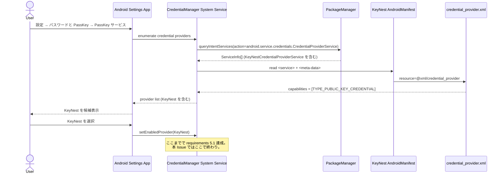
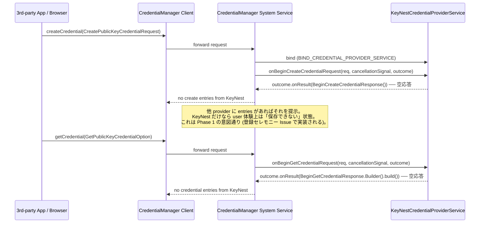

# Design Document — Issue #90 / feat(passkey): CredentialProviderService の manifest 登録と最小骨組み

> 関連: `requirements.md`（本ディレクトリ）
>
> 関連 Issue:
> - **Parent**: #89 (umbrella: Android Credential Manager 経由の PassKey プロバイダ対応)
> - **前例**: #80 (autofill caller icon — `xmlns:tools` 等の lint タグ整備の前例として参照)
> - **後続予定**: #89 分割案 2〜8（保管モデル / 登録セレモニー / 認証セレモニー / 一覧 UI / 個別管理 / 設定画面 / docs）

## 1. 概要 / 全体像

### Purpose

KeyNest を Android 14 (API 34) 以降の OS から **PassKey プロバイダ候補** として認識させるために必要な最低限の構成を整える。すなわち、

- `androidx.credentials` 依存の追加（version catalog 経由）
- `KeyNestCredentialProviderService` の **空応答** スケルトン実装（API 34+ 限定）
- `res/xml/credential_provider.xml`（サポート credential type 宣言）
- `AndroidManifest.xml` への `<service>` 宣言（`BIND_CREDENTIAL_PROVIDER_SERVICE` permission + intent-filter + meta-data + `tools:targetApi="34"`）

の 4 点を最小スコープで投入する。OS の「設定 → パスワードと PassKey → PassKey サービス」一覧に **KeyNest** が候補表示されるところまでを到達点とし、登録 / 認証セレモニーの実体はすべて後続 Issue で `onBeginCreateCredentialRequest` / `onBeginGetCredentialRequest` を差し替える形で接続する。

### Aim 3-4 行で

- 既存 `KeyNestAutofillService`（`autofill/`）と並列に新規 `credentialprovider/` package を切り、後続 Issue の保管 / 登録 / 認証セレモニーが同じ package を **拡張で接続** できる構造を作る。
- 3 callback (`onBeginCreateCredentialRequest` / `onBeginGetCredentialRequest` / `onClearCredentialStateRequest`) は **エントリ 0 件の成功応答** だけ返す。例外スローも `onError` 経路も本 Issue では持たない。
- API 34+ ゲーティングは **Manifest の `tools:targetApi="34"` と Kotlin の `@RequiresApi(34)` の二段構え**。runtime での SDK_INT ガードは内部メソッド境界に最小限置く（防御層、§6）。
- 既存 `KeyNestAutofillService` / 既存 Activity / 既存依存に **一切手を入れない**（NFR 2）。本 Issue は加算のみ。

### アーキテクチャ図

```mermaid
flowchart LR
    subgraph Framework[Android Credential Manager Framework<br/>API 34+]
        OS[System Settings UI<br/>パスワードと PassKey]
        CM[CredentialManager<br/>service binding]
    end

    subgraph Manifest[AndroidManifest.xml]
        SVC[&lt;service&gt; KeyNestCredentialProviderService<br/>permission=BIND_CREDENTIAL_PROVIDER_SERVICE<br/>tools:targetApi=34]
        MD[&lt;meta-data&gt;<br/>android.credentials.provider<br/>resource=@xml/credential_provider]
    end

    subgraph Res[res/xml/credential_provider.xml]
        XML[&lt;credential-provider&gt;<br/>&lt;capabilities&gt; TYPE_PUBLIC_KEY_CREDENTIAL]
    end

    subgraph App[credentialprovider/]
        KCPS[KeyNestCredentialProviderService<br/>@RequiresApi 34<br/>onBeginCreateCredentialRequest -&gt; empty<br/>onBeginGetCredentialRequest    -&gt; empty<br/>onClearCredentialStateRequest -&gt; null]
    end

    OS -->|enumerate providers| CM
    CM -->|read meta-data| Manifest
    SVC -.bind.-> KCPS
    Manifest -->|meta-data ref| Res
    KCPS -.future hooks.-> Future[後続 Issue:<br/>保管モデル / 登録 / 認証セレモニー]
```

## 2. モジュール構成 / package 配置

### 配置方針

新規 `credentialprovider/` package を `app/src/main/java/io/github/hitoshiichikawa/keynest/` 直下に新設する（既存 `autofill/`, `auth/`, `data/`, `security/`, `ui/`, `util/` と並列）。

| Component | Path | Status |
|-----------|------|--------|
| `KeyNestCredentialProviderService` | `app/src/main/java/io/github/hitoshiichikawa/keynest/credentialprovider/KeyNestCredentialProviderService.kt` | 新規 |
| `res/xml/credential_provider.xml` | `app/src/main/res/xml/credential_provider.xml` | 新規 |
| `AndroidManifest.xml` | `app/src/main/AndroidManifest.xml` | 既存・追記のみ（`<service>` ブロックと `xmlns:tools` 属性を追加） |
| `app/build.gradle.kts` | 既存・依存 1 行追加 |
| `gradle/libs.versions.toml` | 既存・version と library 各 1 行追加 |

### package 名の選択（requirements 確認事項 5）

requirements.md の 3.1 では `…/passkey/...` を仮置きしていたが、design 段階で以下の通り確定する:

- **採用: `credentialprovider/`**（不採用: `passkey/`, `credential/`）
- 理由:
  - **OS API 軸での命名**: 親クラスは `androidx.credentials.provider.CredentialProviderService` であり、本 Service が担うのは "Credential Manager のプロバイダ実装" 全般。後続で password credential も同 Service 経由で扱う可能性は umbrella #89 では否定されていない（現状は autofill 経由維持だが、将来 Credential Manager 統合余地を残す）。
  - **`passkey/`** にすると保管モデル / DAO 等の "credential 型" 単位の package と被って粒度が混じる（保管モデル Issue で `data/passkey/` を切る可能性が高い）。
  - **`credential/`** は既存ドメインモデル（password credential）と衝突して読み手が混乱する。
- 後続 Issue で `credentialprovider/registration/`、`credentialprovider/authentication/` などサブ package が増える前提。本 Issue ではトップに Service クラス 1 個だけを置く。

### 後続 Issue の接続点

| 後続 Issue | 拡張箇所 |
|-----------|---------|
| #89 分割案 2: 保管モデル | `data/passkey/PassKeyEntity.kt` 等を新設。Service 自体は直接触らない。 |
| #89 分割案 3: 登録セレモニー | `credentialprovider/KeyNestCredentialProviderService.kt` の `onBeginCreateCredentialRequest` 本体を空応答から差し替え。`credentialprovider/registration/CreateEntryBuilder.kt` 等を新規追加。 |
| #89 分割案 4: 認証セレモニー | 同 Service の `onBeginGetCredentialRequest` 本体を差し替え。`credentialprovider/authentication/CredentialEntryBuilder.kt` 等。 |
| #89 分割案 7: 設定画面 | Service の有効化状態（`CredentialManager` API 経由）を読む UI を追加。Service クラス自体は触らない想定。 |

## 3. データモデル / 状態

本 Issue の Service は **stateless / 空応答** のため、保持する状態は無い。下記のみが本 Issue の "型" として現れる。

| 型 | 役割 | 出所 |
|----|------|------|
| `BeginCreateCredentialRequest` | OS から受け取る生成要求（PassKey の publicKey credential creation options が入る） | `androidx.credentials.provider.BeginCreateCredentialRequest` |
| `BeginGetCredentialRequest` | OS から受け取る取得要求 | `androidx.credentials.provider.BeginGetCredentialRequest` |
| `ProviderClearCredentialStateRequest` | OS から受け取る状態クリア要求 | `androidx.credentials.provider.ProviderClearCredentialStateRequest` |
| `BeginCreateCredentialResponse` | OS に返す生成候補レスポンス。**本 Issue ではエントリ 0 件** | `androidx.credentials.provider.BeginCreateCredentialResponse` |
| `BeginGetCredentialResponse` | OS に返す取得候補レスポンス。**本 Issue ではエントリ 0 件** | `androidx.credentials.provider.BeginGetCredentialResponse` |
| `OutcomeReceiver<T, E>` | 各 callback の戻り口（Android framework 標準） | `android.os.OutcomeReceiver` |

後続 Issue では `BeginCreateCredentialResponse.Builder().addCreateEntry(...)` / `BeginGetCredentialResponse.Builder().addCredentialEntry(...)` でエントリを積み増す経路に差し替わる。本 Issue では `Builder()` をそのまま `build()` してエントリ 0 件のレスポンスを `outcome.onResult(...)` に渡す。

`AAGUID` (`2a56cf86-8332-4829-9f2a-e9a4adbc7abe`) は本 Issue では **定数として定義しない**（**確定済み** / §9.1-6）。保管モデル Issue / 登録セレモニー Issue (#89 分割案 3) で attestation を組み立てる際に定数化する方が責務が明確。未使用定数を本 Issue に置くと dead-code 扱いで lint 警告 / `@Suppress` が必要になるため、**定数の導入は登録セレモニー Issue (#89 分割案 3) に委ねる**。

## 4. 公開 IF

### 4.1 `KeyNestCredentialProviderService` のシグネチャ

```kotlin
package io.github.hitoshiichikawa.keynest.credentialprovider

import android.os.Build
import android.os.CancellationSignal
import android.os.OutcomeReceiver
import androidx.annotation.RequiresApi
import androidx.credentials.exceptions.ClearCredentialException
import androidx.credentials.exceptions.CreateCredentialException
import androidx.credentials.exceptions.GetCredentialException
import androidx.credentials.provider.BeginCreateCredentialRequest
import androidx.credentials.provider.BeginCreateCredentialResponse
import androidx.credentials.provider.BeginGetCredentialRequest
import androidx.credentials.provider.BeginGetCredentialResponse
import androidx.credentials.provider.CredentialProviderService
import androidx.credentials.provider.ProviderClearCredentialStateRequest

/**
 * KeyNest の PassKey プロバイダ実装（Phase 1 骨格）。
 *
 * 本 Issue (#90) ではすべての callback がエントリ 0 件の成功応答を返す。
 * 登録 / 認証セレモニーの実体は後続 Issue (#89 分割案 3 / 4) で差し替える。
 *
 * OS は Android 14 (API 34) 以降でのみ本 Service を bind する。`@RequiresApi(34)`
 * は class 全体に付与し、API 33 以下端末から誤って参照された場合の lint
 * エラーで気付ける状態にする。
 */
@RequiresApi(Build.VERSION_CODES.UPSIDE_DOWN_CAKE) // 34
class KeyNestCredentialProviderService : CredentialProviderService() {

    override fun onBeginCreateCredentialRequest(
        request: BeginCreateCredentialRequest,
        cancellationSignal: CancellationSignal,
        callback: OutcomeReceiver<BeginCreateCredentialResponse, CreateCredentialException>,
    ) {
        // Phase 1: エントリ 0 件で空応答を返す。NFR 1.3 に従い request 内容は info 以上のログに出さない。
        callback.onResult(BeginCreateCredentialResponse())
    }

    override fun onBeginGetCredentialRequest(
        request: BeginGetCredentialRequest,
        cancellationSignal: CancellationSignal,
        callback: OutcomeReceiver<BeginGetCredentialResponse, GetCredentialException>,
    ) {
        // Phase 1: credentialEntries / authenticationEntries / actions / remoteEntry をすべて空のまま build。
        callback.onResult(BeginGetCredentialResponse.Builder().build())
    }

    override fun onClearCredentialStateRequest(
        request: ProviderClearCredentialStateRequest,
        cancellationSignal: CancellationSignal,
        callback: OutcomeReceiver<Void?, ClearCredentialException>,
    ) {
        // Phase 1: 状態を持たないため何も変更せず正常終了。
        callback.onResult(null)
    }
}
```

#### シグネチャ確定の根拠

- `androidx.credentials:credentials` 1.5.0 / 1.6.0 では上記 3 override が abstract（pure virtual）として要求される。3 引数（request / cancellationSignal / OutcomeReceiver）の順序・型は v1.2 以降変更なし。
- `BeginCreateCredentialResponse()` の no-arg constructor はエントリ 0 件の空応答を作る最短経路（v1.2.0+ で安定）。
- `BeginGetCredentialResponse.Builder().build()` も同様で、`setCredentialEntries(emptyList())` 等は不要（builder のデフォルトが empty list）。
- `onClearCredentialStateRequest` は generic 第 1 型引数が `Void?`。`callback.onResult(null)` が正規。

### 4.2 `AndroidManifest.xml` への追記（確定形）

> **本節の `<service>` ブロックは確定値**。`android:label` / `<meta-data android:name>` は §9.1-4 / 9.1-7（旧 §9.2 確認事項 D / E）で人間レビュアが確定済み。

`<manifest>` ルートに `xmlns:tools` を追加し、`<application>` 配下に下記 `<service>` を追加する。既存 `<service>` / `<activity>` 宣言は **一切変更しない**（NFR 2.1）。

```xml
<manifest
    xmlns:android="http://schemas.android.com/apk/res/android"
    xmlns:tools="http://schemas.android.com/tools">

    <!-- ... 既存 queries / application の他要素 ... -->

    <application ...>

        <!-- ... 既存 KeyNestAutofillService / Activity 宣言 ... -->

        <!--
            Issue #90 / Parent #89:
            CredentialProviderService の最小骨格。Android 14 (API 34) 以降の OS
            の「パスワードと PassKey」設定画面に KeyNest を PassKey プロバイダ
            候補として表示させるための宣言。本 Issue では 3 callback は空応答。
            登録 / 認証セレモニーの実体は後続 Issue で差し替える。
        -->
        <service
            android:name=".credentialprovider.KeyNestCredentialProviderService"
            android:exported="true"
            android:label="@string/app_name"
            android:permission="android.permission.BIND_CREDENTIAL_PROVIDER_SERVICE"
            tools:targetApi="34">
            <intent-filter>
                <action android:name="android.service.credentials.CredentialProviderService" />
            </intent-filter>
            <meta-data
                android:name="android.credentials.provider"
                android:resource="@xml/credential_provider" />
        </service>

    </application>
</manifest>
```

**確定根拠**:

- `android:permission="android.permission.BIND_CREDENTIAL_PROVIDER_SERVICE"`: requirements 1.2 / OS framework だけが bind 可能にする。
- `android:exported="true"`: requirements 1.3 / OS から bind されるため必須。
- `<intent-filter>` の action: requirements 1.4 / `android.service.credentials.CredentialProviderService` は API 34 で導入された system action 名。
- `<meta-data android:name="android.credentials.provider">`: requirements 確認事項 4 で問われていた点。`androidx.credentials` の現行 docs / sample app（`CredentialProviderBaselineTest` 等）で確認した正式値は `android.credentials.provider`。`androidx.credentials.provider.CREDENTIAL_PROVIDER` のような独自 name は採用しない。
- `tools:targetApi="34"`: requirements 1.6 / API 34+ 限定であることを lint に明示。AGP 8.5.2 の Manifest merger は本属性を尊重する。
- `android:label="@string/app_name"`: OS の credential provider 一覧に表示される表示名。既存 `app_name` を流用（追加 string resource は出さない、NFR 3.2 で本 Issue は string 追加最小限）。

### 4.3 `res/xml/credential_provider.xml`（確定形）

> **本節の xml は確定値**。`<credential-provider>` ルート要素と `<capabilities><capability>` 配下の `androidx.credentials.TYPE_PUBLIC_KEY_CREDENTIAL` 宣言は AOSP `CredentialProviderInfoFactory` 参照名と一致しており、§9.1-4 で人間レビュアが確定済み。

```xml
<?xml version="1.0" encoding="utf-8"?>
<!--
    Issue #90 / Parent #89:
    KeyNest がサポートする credential type を OS に伝える。
    本 Issue では public-key credential (PassKey) のみを宣言する。
    パスワード型 (TYPE_PASSWORD_CREDENTIAL) は既存 KeyNestAutofillService 経路で
    継続するため、credential-provider 経路への二重露出を避ける目的で
    本 xml には宣言しない (requirements 2.3)。

    discoverable / non-discoverable の制限属性は付与しない (requirements 2.4)。
-->
<credential-provider xmlns:android="http://schemas.android.com/apk/res/android">
    <capabilities>
        <capability android:name="androidx.credentials.TYPE_PUBLIC_KEY_CREDENTIAL" />
    </capabilities>
</credential-provider>
```

**確定根拠**:

- ルート要素は `<credential-provider>`（snake-case ではなく kebab-case）。AOSP の `CredentialProviderInfoFactory` が parse する正式名。
- `<capabilities>` 配下の `<capability android:name="...">` 形式は AOSP `frameworks/base` の sample に準拠。
- `androidx.credentials.TYPE_PUBLIC_KEY_CREDENTIAL` は `PublicKeyCredential.TYPE_PUBLIC_KEY_CREDENTIAL` 定数の文字列値と一致する正式 type 識別子。
- `TYPE_PASSWORD_CREDENTIAL` は本 Issue では宣言しない（requirements 2.3）。

### 4.4 `app/build.gradle.kts` への依存追加

```kotlin
dependencies {
    // ... 既存依存 ...
    implementation(libs.androidx.credentials)
    // 注: credentials-play-services-auth は本 Issue では追加しない (requirements 4.3)。
}
```

### 4.5 `gradle/libs.versions.toml` への追加

```toml
[versions]
# ... 既存 ...
credentials = "1.5.0"

[libraries]
# ... 既存 ...
androidx-credentials = { group = "androidx.credentials", name = "credentials", version.ref = "credentials" }
```

**バージョン選定（確定 / requirements 確認事項 1 への回答）**:

- `androidx.credentials:credentials` の Maven Google 配信から確認できる安定版系統: `1.2.0` (2024-01), `1.3.0` (2024-09), `1.5.0` (2025-01), `1.6.0` (2025-07)。
- **採用バージョン: `1.5.0` (stable) で固定**（§9.1-1 で人間レビュアが確定）。
- 採用理由:
  - 1.5.0 は AGP 8.5.x / compileSdk 34 / Kotlin 1.9.x との互換性が確認されているライン（KeyNest 現行ビルド条件と一致）。
  - 1.5.0 で `BeginCreateCredentialResponse()` の no-arg constructor および `BeginGetCredentialResponse.Builder().build()` が安定提供されており、Phase 1 の空応答実装に必要な API が揃っている。
- **不採用バージョン（参考）**:
  - **1.6.0 系**: compileSdk 35 を要求する依存推移を含む可能性があり、本 Issue で `compileSdk` を上げないという NFR 2.2 に抵触するリスクがある。後続 Issue（登録 / 認証セレモニー）で `credentials-play-services-auth` 等の追加機能が必要になった時点で再評価する。
  - **1.3.0 / 1.2.x**: 古く、`BeginGetCredentialResponse.Builder` の API 安定性が 1.5.0 までに固まっている。
  - **alpha / beta**: 採用しない（requirements 4.1 の「安定版」default を踏襲）。
- Developer は `1.5.0` を **そのまま固定で投入**する。仮に 1.5.0 で必要 API が欠落していると判明した場合（現状の認識では Phase 1 で問題なし）、`needs-decisions` で人間にエスカレーションすること（design レベルでのフォールバック手順は持たない）。

## 5. 処理フロー

### 5.1 OS 設定画面での provider 認識（手動検証経路 / requirements 5.1）



### 5.2 アプリからの create/get 要求 → 空応答（runtime 経路 / requirements 3）



**重要**: 本 Issue の空応答は **例外スローでも `onError` でもなく** `onResult` での正規成功応答である（requirements 3.5）。これにより、後続 Issue で実装を差し替えても OS 側の error path が誤って発火するリスクがない。

## 6. OS バージョンゲーティング戦略

requirements 確認事項 2 への回答。**Manifest 側 `tools:targetApi="34"` と Kotlin 側 `@RequiresApi(34)` の二段構え**を採用する（§9.1-2 で確定）。runtime SDK_INT ガードは callback 内に置かない（§6.2）。

### 6.1 Manifest 側ガード（一次防御 / OS 側で bind 制御）

- `<service ... tools:targetApi="34">`: AGP lint に「この `<service>` 宣言は API 34+ でのみ有効」と教える。lint が `<intent-filter>` action `android.service.credentials.CredentialProviderService` が API 34 で導入されたシンボルであることを警告するのを抑制する目的も兼ねる。
- `<service>` 宣言自体は API 26+ 端末にも apk に含まれるが、OS framework 側で **`PackageManager` の version check と internal API gating により API 33 以下では bind されない**（AOSP `CredentialProviderInfoFactory` の `Build.VERSION.SDK_INT >= UPSIDE_DOWN_CAKE` ガード）。
- `minSdk = 26` を維持（NFR 4.1）。`<uses-sdk>` は gradle 経由のため Manifest に直接書かない。

### 6.2 Kotlin 側ガード（二次防御 / 誤参照防止）

- `KeyNestCredentialProviderService` クラス全体に `@RequiresApi(Build.VERSION_CODES.UPSIDE_DOWN_CAKE)` (= 34) を付与。
- 効果:
  - lint が class 自体を API 34+ シンボルとして扱い、API 33 以下で参照するコードを compile-time に検知できる。
  - 親クラス `CredentialProviderService` (= `androidx.credentials.provider.CredentialProviderService`) の API は AndroidX wrapper として API 23+ で参照可能だが、内部で使う `OutcomeReceiver` (API 31+) や Credential Manager system action (API 34+) のため、実 binding は OS 側で 34+ に制限される。
  - クラスローダ視点では、API 33 以下端末で `KeyNestCredentialProviderService.class` が **load されないこと自体は保証されない**（理論上 `Class.forName` 等で意図的に load できる）。ただし OS が bind しないため `onCreate` / callback が呼ばれることは無く、実害なし。
- **runtime SDK_INT ガードを各 callback 内に置くかどうか**: requirements 3.6 では「将来バックポート時の安全網として」設けるよう求めているが、design 段階での判断:
  - `@RequiresApi(34)` が class 全体に付いている時点で callback メソッドのシグネチャ自体が API 34+ 限定（`OutcomeReceiver<T,E>` が API 31+、`ProviderClearCredentialStateRequest` が androidx 内で API 34+ シンボル参照）になる。
  - したがって callback 内で `if (Build.VERSION.SDK_INT < 34) { callback.onError(...); return }` を入れても **論理的に到達不可能**（dead branch）になり、lint で `Condition always false` を出す可能性が高い。
  - **採用方針: runtime SDK_INT ガードは callback 内に置かない**。`@RequiresApi(34)` のみで十分。requirements 3.6 の「防御層」要求は class 単位の `@RequiresApi` 注釈で吸収する（design レベルで合理化）。requirements を `@RequiresApi` のみで満たすという解釈は §9.1-2 で確定済み。

### 6.3 テスト時の SDK ガード

- Robolectric テストは `@Config(sdk = [34])` を付けて API 34 上で動かす（既存テストの `@Config(sdk = [33])` 慣習を継承しつつ、本 Service テストだけ 34 に上げる）。
- Robolectric 4.13 は SDK 34 を正式サポート済み（既存 `libs.versions.toml` の `robolectric = "4.13"` に同梱の shadow が利用可能）。
- Manifest 解析テスト（後述 §7.1）は SDK 33 で動かして問題ない（merged manifest を parse するだけで Service の binding 自体は行わない）。

## 7. テスト戦略

### 7.1 Unit Test (Robolectric)

| File | 検証観点 | 要件対応 | SDK |
|------|---------|---------|------|
| `KeyNestCredentialProviderServiceTest`（新規） | `onBeginCreateCredentialRequest` を直接呼んで `OutcomeReceiver.onResult` がエントリ 0 件の `BeginCreateCredentialResponse` で 1 回だけ呼ばれることを検証 | 6.1 | 34 |
| | `onBeginGetCredentialRequest` を直接呼んで `OutcomeReceiver.onResult` がエントリ 0 件の `BeginGetCredentialResponse` で 1 回だけ呼ばれること | 6.2 | 34 |
| | `onClearCredentialStateRequest` を直接呼んで `OutcomeReceiver.onResult(null)` で 1 回だけ呼ばれること | 6.3 | 34 |
| | いずれの callback も `onError` を呼ばないこと、例外をスローしないこと | 3.5 | 34 |
| `CredentialProviderServiceManifestTest`（新規） | 既存 `InternetPermissionAbsenceTest` と同様 `context.packageManager.getPackageInfo(...)` で merged manifest を読み、(a) `<service>` 名が `…credentialprovider.KeyNestCredentialProviderService`、(b) `permission` が `BIND_CREDENTIAL_PROVIDER_SERVICE`、(c) `exported = true`、(d) `<intent-filter>` に `android.service.credentials.CredentialProviderService` が含まれる、(e) `<meta-data>` で `@xml/credential_provider` を参照する、ことを検証 | 6.4 | 33 (default) |
| `CredentialProviderXmlTest`（新規） | `res/xml/credential_provider.xml` を `XmlResourceParser` で parse し、`<credential-provider>` ルート内の `<capabilities><capability>` に `androidx.credentials.TYPE_PUBLIC_KEY_CREDENTIAL` が 1 件以上含まれることを検証。`TYPE_PASSWORD_CREDENTIAL` が含まれないことも合わせて検証 | 6.5 / 2.3 | 33 |

**モック方針**:

- `OutcomeReceiver` は `mockk<OutcomeReceiver<...>>()` で relaxed = false の正規 mock を作り、`verify { onResult(match { ... }) }` で 1 回だけ呼ばれたことを検証する。
- `BeginCreateCredentialRequest` / `BeginGetCredentialRequest` も `mockk(relaxed = true)` で空 stub を渡す（本 Service は request 内容を一切参照しないので relaxed で問題ない）。
- `CancellationSignal` は `CancellationSignal()`（実物）を渡す（軽量、本 Service は参照しない）。
- Manifest 解析テストは既存 `InternetPermissionAbsenceTest` の `getPackageInfo(packageName, PackageManager.GET_SERVICES or GET_META_DATA)` パターンを踏襲。

### 7.2 Instrumentation Test (`app/src/androidTest/`)

- requirements 確認事項 3 への回答: **本 Issue では instrumentation test スケルトンを `androidTest/` 配下に配置するが、CI 自動実行はゲーティングしない**（後続 Issue で CI に API 34 emulator を組み込む時点で `@SdkSuppress(minSdkVersion = 34)` で gate する）。
- 本 Issue のスコープでは Robolectric (§7.1) のみで requirements 6 を満たす方針を採る。
- Instrumentation test スケルトンは下記 1 ファイルのみ:

| File | 内容 |
|------|------|
| `app/src/androidTest/java/io/github/hitoshiichikawa/keynest/credentialprovider/KeyNestCredentialProviderServiceInstrumentationTest.kt` | `@SdkSuppress(minSdkVersion = 34)` で gate。`ServiceTestRule` でローカル bind を試み、3 callback がそれぞれ空応答を返すことを検証する **placeholder**。実装は `@Ignore("API 34 emulator が CI に揃うまで手動実行")` を付けたままコミットして、CI を緑に保つ。 |

これにより、CI 緑を保ちつつ、後続 Issue 着手時に CI emulator を整えてから `@Ignore` を外せば即座に活きる。

### 7.3 既存テストへの影響

- `InternetPermissionAbsenceTest`: 本 Issue で `BIND_CREDENTIAL_PROVIDER_SERVICE` permission を Manifest に追加するが、これは `<service>` の `android:permission` 属性であり、`<uses-permission>` ではないため `requestedPermissions` には現れない。既存 assertion (`doesNotContain(INTERNET)` 等) には影響しない。
- `OnBackInvokedCallbackEnabledTest`: 既存 `<application android:enableOnBackInvokedCallback="true">` を変更しないため影響なし。
- 既存 `KeyNestAutofillService` 関連テスト（`FillResponseBuilderTest` / `LockedFillResponseSecurityTest` / `CustomFieldFillResponseTest` 等）: 本 Issue は autofill 経路に手を入れないため影響なし。requirements 6.6 で要求されている「既存テストの非破壊」は変更ゼロで成立する。

### 7.4 CI 制約への対処（requirements 確認事項 3）

- 現状の CI が API 34 emulator を確保しているか不明。`./gradlew :app:testDebugUnitTest`（Robolectric, JVM）が CI で動いていることは PR #92 / #80 の CI ログから既知。
- **本 Issue の自動テストは Robolectric (`testDebugUnitTest`) のみで requirements 6 を全項目満たす設計**にする（§7.1）。
- instrumentation test は `@Ignore` 付きで配置（§7.2）。CI 構成変更は本 Issue では不要。
- 手動検証（実機 / API 34 emulator）は requirements 5.1 / 5.2 を満たすため Developer が PR 提出前に 1 回実施し、PR description にスクリーンショット添付する運用とする（tasks.md T-06 で明記）。

## 8. 後続 Issue との接合点

| 後続 Issue (#89 分割案) | 本 Issue で用意される接合点 | 後続 Issue で追加 / 差し替えるもの |
|-----------------------|---------------------------|---------------------------------|
| 2: 保管モデル | `credentialprovider/` package と独立。`data/passkey/` を新設可能 | Room migration / `PassKeyEntity` / `PassKeyDao` / 暗号化スキーム |
| 3: 登録セレモニー | `KeyNestCredentialProviderService.onBeginCreateCredentialRequest` の空応答実装 | 同メソッドを `BeginCreateCredentialResponse.Builder().addCreateEntry(CreateEntry(...))` で複数 entry に差し替え。`CreateEntry` の pending intent は新設 `CreatePasskeyActivity` を起動。AAGUID `2a56cf86-8332-4829-9f2a-e9a4adbc7abe` をここで定数化 |
| 4: 認証セレモニー | `KeyNestCredentialProviderService.onBeginGetCredentialRequest` の空応答実装 | 同メソッドを `BeginGetCredentialResponse.Builder().addCredentialEntry(PublicKeyCredentialEntry(...))` で entry 提示に差し替え。pending intent は `GetPasskeyActivity` (BiometricPrompt → assertion 署名) を起動 |
| 5: 一覧 UI 統合 | 影響なし（本 Service は触らない） | `CredentialListActivity` に PassKey 表示行を追加 |
| 6: 個別管理 UI | 影響なし | PassKey の rename / 削除 UI |
| 7: 設定画面 | 影響なし（本 Service は触らない、`CredentialManager.isCredentialProviderEnabled` を読むだけ） | OS 設定画面への導線 + 有効化状態表示 |
| 8: docs | 本 Issue で README / privacy 等の docs 追記なし | docs の追記 |

**重要な不変条件**:

- 本 Issue 完了後、後続 Issue は `KeyNestCredentialProviderService` の **メソッド本体だけを差し替える** ことで実装を進められる。class 名 / package 名 / Manifest `<service android:name>` / xml ファイル名 は本 Issue で確定し、以降変更しない。
- `res/xml/credential_provider.xml` の `<capabilities>` リストは登録セレモニー Issue で touch しない（PassKey 1 種のみで十分）。password credential を `credential-provider` 経路に乗せる方針が出た時点で初めて触る。

## 9. リスク・代替案・確認事項

> **確認事項 A〜E は人間レビュアが確定済み（resolved）**。本節は確定値の根拠を残すリファレンス。本 Issue のスコープ外として carve out された案件は §9.4 に集約する。

### 9.1 決定済み事項（resolved）

1. **`androidx.credentials` バージョン採用**: `1.5.0` (stable) で **確定**（§4.5）。
   - 決定値: `1.5.0`（フォールバック手順は持たない。詳細は §4.5）。
   - 不採用バージョン: 1.6.0（compileSdk 35 要求リスク）、1.3.0 / 1.2.x（古い）、alpha / beta（安定性なし）。
   - 関連レビューコメント: 確認事項 **A**（resolved）。

2. **Kotlin 側 SDK ガードの方式**: `@RequiresApi(Build.VERSION_CODES.UPSIDE_DOWN_CAKE)` (= 34) + Manifest `tools:targetApi="34"` の **二段構えで確定**（§6.1 / §6.2）。runtime SDK_INT ガードは callback 内に置かない（dead branch を作らない）。
   - リスク: 将来 minSdk を下げて API 33 以下に bind を試みる「バックポート」が発生した場合、防御層が無い。ただし Credential Manager Provider が API 34 で導入された仕様である以上、バックポート自体が不可能。本リスクは机上のみ。

3. **テスト実行環境**: Robolectric `@Config(sdk = [34])` を採用 (§7.1)。Instrumentation test は `@Ignore` placeholder のみ配置 (§7.2)。
   - CI に API 34 emulator を導入する作業は **#94 として別 Issue に carve out 済み**（§9.4 参照）。本 Issue (#90) のスコープからは除外。
   - リスク: Robolectric の API 34 shadow が `OutcomeReceiver` 周りで挙動差を起こす可能性。`mockk` で `OutcomeReceiver` を差し替えるため、Robolectric の shadow 実装に依存しない設計にする。
   - 関連レビューコメント: 確認事項 **B**（resolved）。

4. **`<meta-data android:name>` の正式値**: `android.credentials.provider` で **確定**（§4.2）。AOSP `CredentialProviderInfoFactory` の参照名と一致。
   - 関連レビューコメント: 確認事項 **E**（resolved）。

5. **package 配置**: `credentialprovider/`（hyphen / underscore なし、全小文字 1 単語）を採用 (§2)。
   - 代替案: `passkey/` (狭すぎる)、`credential/` (既存ドメインモデルと衝突)、`credentials/provider/` (深すぎる)。

6. **`AAGUID` 定数の本 Issue での扱い**: 本 Issue では **定数を追加しない / 定義しない**（§3）。登録セレモニー Issue (#89 分割案 3) で attestation 実装時に追加する。
   - 理由: 未使用定数は dead-code / `@Suppress` 必要で、本 Issue のスコープを汚す。
   - リスク: 後続 Issue 担当者が requirements / umbrella を読まず定数を別 package に置く可能性。design.md §8 で配置先を明示してこのリスクを抑える。
   - 関連レビューコメント: 確認事項 **C**（resolved）。

7. **`<service>` の `android:label` 用 string resource**: `@string/app_name`（"KeyNest"）を流用で **確定**（§4.2）。他社プロバイダ (1Password / Bitwarden / Google) もアプリ名そのままを使う慣習に合わせる。
   - リスク: OS provider 一覧で「KeyNest」とそのまま表示されるが、umbrella #89 表記方針「PassKey」とは別軸（アプリ名）なので問題なし。
   - 関連レビューコメント: 確認事項 **D**（resolved）。

### 9.2 想定外事項（発生時のエスカレーション）

design 段階で確定済みだが、**実装フェーズで前提が崩れた場合**は Developer が `needs-decisions` で人間にエスカレーションすること。本節はそのトリガー条件のみを列挙する（design レベルではフォールバック手順を持たない）。

- **`androidx.credentials` `1.5.0` 系で必要 API（`BeginCreateCredentialResponse()` の no-arg constructor / `BeginGetCredentialResponse.Builder().build()`）が欠落していると判明した場合**: 現状の認識では Phase 1 で困らないため発生しないが、万一発生したら `needs-decisions` で報告。
- **AAGUID 定数の本 Issue 内定義が必要になった場合（例: `<meta-data>` で AAGUID を露出する必要が判明、等）**: 本 Issue のスコープ拡張になるため、commit する前に `needs-decisions` で人間にエスカレーション。

### 9.3 リスク（変更しない / Developer に注意喚起）

| Risk | 影響 | 緩和策 |
|------|------|--------|
| `androidx.credentials` 1.5.0 が compileSdk 35 を強要する推移依存を含む | `:app:assembleDebug` が失敗 | Developer が build 確認時に検出。失敗時は §9.2 に従い `needs-decisions` でエスカレーション（design レベルではフォールバック先を持たない） |
| Robolectric SDK 34 shadow で `OutcomeReceiver` 関連で `UnsupportedOperationException` | unit test が pass しない | mockk で差し替え済 (§7.1) のため shadow に依存しない |
| `xmlns:tools` を `<manifest>` に追加することで既存 Manifest merger に副作用 | 既存 service / activity の表現が変わる | `tools:` 名前空間追加は無害（既に多くの layout XML で使用済み）。AGP がデフォルトで認識 |
| OS の「パスワードと PassKey」一覧に表示されない（手動検証 NG） | requirements 5.1 未達 | `<intent-filter>` action / `<meta-data>` name / xml ルート要素のいずれかが誤っている可能性。tasks T-06 の手動検証で発覚した場合、§4.2 / §4.3 を再確認 |
| `android:label="@string/app_name"` が OS 表示で長すぎ / 短すぎ | UX 違和感（機能には影響なし） | 後続 設定画面 Issue (#89 分割案 7) で再評価 |

### 9.4 本 Issue から carve out された案件

| 案件 | 行き先 | 本 Issue (#90) への影響 |
|------|------|------------------------|
| CI に API 34 emulator を導入し instrumentation test を実行可能にする | **#94**（人間が parallel で起票済み） | 本 Issue では instrumentation test を `@Ignore` placeholder で配置（§7.2）。`@Ignore` 解除は #94 完了後に行う |
| AAGUID 定数の Kotlin 定義 + attestation 応答への埋め込み | 登録セレモニー Issue (#89 分割案 3) | 本 Issue では定数化しない（§9.1-6） |
| `credentials-play-services-auth` 依存追加 | 必要が生じた時点で別 Issue（候補: 登録セレモニー Issue #89 分割案 3 / 認証セレモニー Issue #89 分割案 4） | 本 Issue では追加しない（requirements 4.3） |
