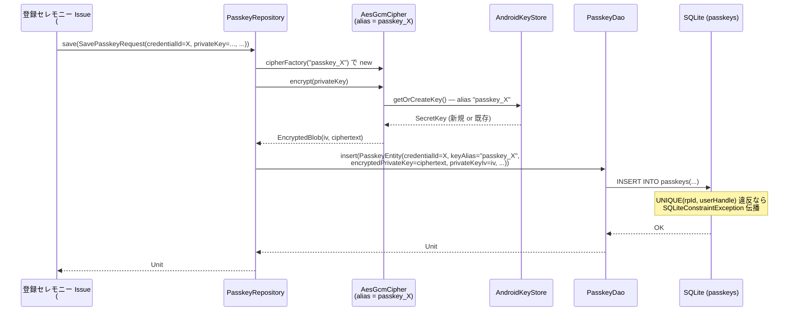
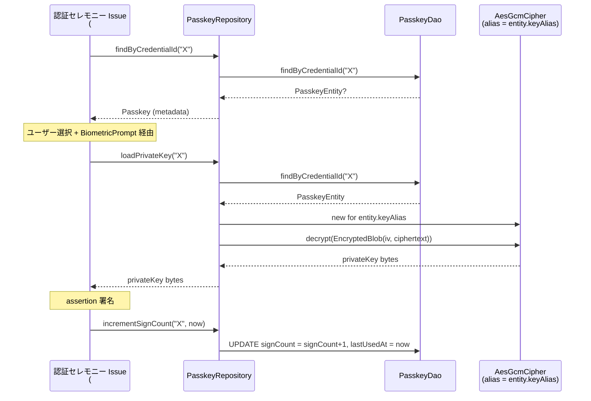
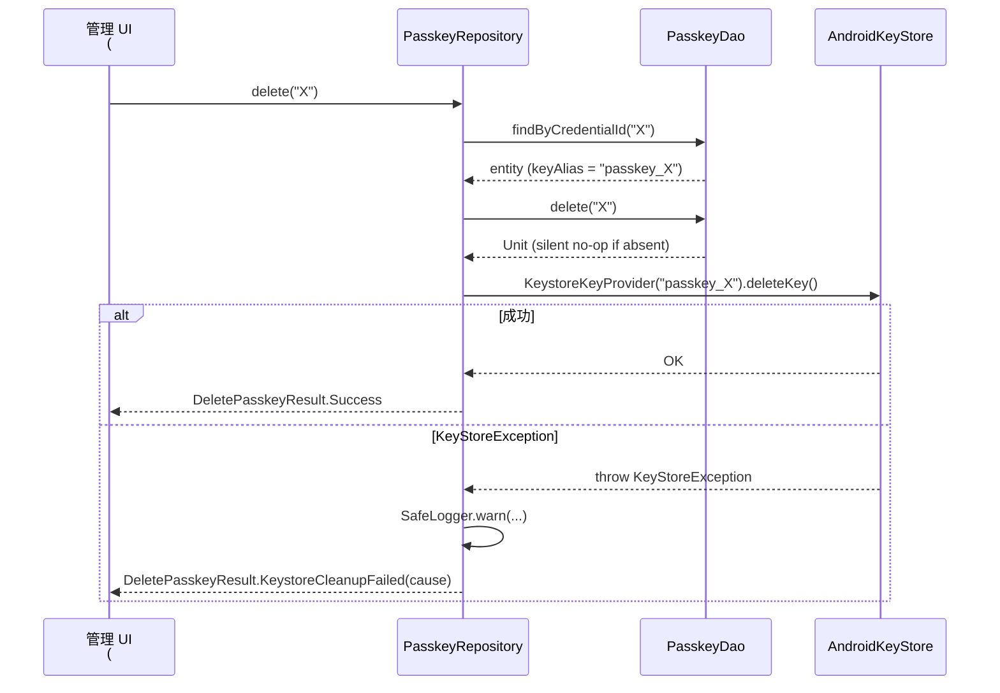

# Design Document — Issue #91 / feat(passkey): Room migration + PasskeyEntity / DAO の追加

> 関連: `requirements.md`（本ディレクトリ）
>
> 関連 Issue:
> - **Parent**: #89 (umbrella: Android Credential Manager 経由の PassKey プロバイダ対応)
> - **並列実施可**: #90 (CredentialProviderService の Manifest 登録と最小骨組み)
> - **後続予定**:
>   - #89 分割案 3: 登録セレモニー (本 Issue の `PasskeyRepository.save` を呼ぶ)
>   - #89 分割案 4: 認証セレモニー (本 Issue の DAO 検索系を呼ぶ)
>   - #89 分割案 5/6/7: 一覧 UI / 個別管理 / 設定画面

## 1. 目的とスコープ要約

KeyNest を Android Credential Manager 経由の PassKey プロバイダにするうえで、umbrella #89 の Phase 1 として **PassKey を端末側に永続化するためのデータ層** を整える。`PasskeyEntity` (`passkeys` テーブル) と `PasskeyDao`、Migration_4_5 によって Room schema を v4 → v5 に上げ、その上に `PasskeyRepository` を被せて ES256 private key を AES-GCM + AndroidKeyStore wrapping key で暗号化境界を確立する。本 Issue 単独では「実際に PassKey が生成される」「`CredentialProviderService` callback に配線される」までは到達せず、後続セレモニー Issue が `PasskeyRepository` / `PasskeyDao` をそのまま呼べる状態を到達点とする。Service 配線は並列 Issue #90 が担当する。

## 2. モジュール構成

### 2.1 配置方針

`PasskeyEntity` / `PasskeyDao` / `Migration_4_5` は既存と同じ `data/entity` / `data/dao` / `data/migration` package 配下に追加する（`CredentialEntity` / `CredentialDao` / `Migration_3_4` の隣に並べる）。Repository は既存 `CredentialRepository` の三層分割 (`domain/repository/CredentialRepository` interface + `data/repository/CredentialRepositoryImpl` 実装 + `domain/model/*` 型) を踏襲し、`PasskeyRepository` interface を `domain/repository/` に、実装を `data/repository/` に配置する。domain 型 (`Passkey` / `EncryptedPasskeyRecord` / `PasskeyId` 等) は `domain/model/Passkey.kt` 1 ファイルに集約する（既存 `Credential.kt` と同じ単一ファイル方式）。

DI は **Hilt ではなく既存 `ServiceLocator`**（`di/ServiceLocator.kt`）に singleton を追加して接続する。これは現行コードベースに Hilt 導入実績が無く、`ServiceLocator` パターンが MVP 維持で既存 DAO/Repository/CryptoHelper を一手に握っているため、本 Issue で Hilt を導入すると本来スコープ外の build 構成変更が発生するためである（requirements にも Hilt は登場しない）。

### 2.2 関係図

```mermaid
flowchart TB
    subgraph domain[domain/]
        PR[PasskeyRepository<br/>interface]
        PD[Passkey / EncryptedPasskeyRecord / PasskeyId<br/>domain models]
    end

    subgraph data[data/]
        DB[KeyNestDatabase<br/>v4 → v5]
        DAO[PasskeyDao]
        ENT[PasskeyEntity]
        MIG[Migration_4_5]
        RImpl[PasskeyRepositoryImpl]
    end

    subgraph security[security/]
        AGC[AesGcmCipher<br/>既存]
        KKP[KeystoreKeyProvider<br/>既存 / alias 引数活用]
        EB[EncryptedBlob<br/>既存]
    end

    subgraph di[di/]
        SL[ServiceLocator<br/>追記: passkeyDao / passkeyRepository]
    end

    subgraph future[後続 Issue で接続]
        REG[#89 分割案 3<br/>登録セレモニー]
        AUTH[#89 分割案 4<br/>認証セレモニー]
    end

    DB --> DAO
    DB --> ENT
    DB --> MIG
    RImpl --> DAO
    RImpl --> AGC
    RImpl -.passkey ごとに新規 instance.-> KKP
    AGC --> KKP
    AGC --> EB
    PR <|.. RImpl
    SL --> DB
    SL --> RImpl
    REG --> PR
    AUTH --> DAO
    AUTH --> PR
```

## 3. データモデル詳細

### 3.1 PasskeyEntity の Kotlin 定義案

requirements §「データモデル仕様」表に従い、14 カラムを保持する。既存 `CredentialEntity` の書式（`@ColumnInfo(typeAffinity = ...)` 明示、`ByteArray` の `equals` / `hashCode` / `toString` 手書き）を踏襲する。

```kotlin
@Entity(
    tableName = "passkeys",
    indices = [
        Index(value = ["rpId"]),
        Index(value = ["rpId", "userHandle"], unique = true),
    ],
)
data class PasskeyEntity(
    @PrimaryKey(autoGenerate = false)
    @ColumnInfo(name = "credentialId")
    val credentialId: String,

    @ColumnInfo(name = "rpId")
    val rpId: String,

    @ColumnInfo(name = "rpDisplayName")
    val rpDisplayName: String?,

    @ColumnInfo(name = "userHandle", typeAffinity = ColumnInfo.BLOB)
    val userHandle: ByteArray,

    @ColumnInfo(name = "userName")
    val userName: String?,

    @ColumnInfo(name = "userDisplayName")
    val userDisplayName: String?,

    @ColumnInfo(name = "isDiscoverable", defaultValue = "1")
    val isDiscoverable: Boolean,

    @ColumnInfo(name = "encryptedPrivateKey", typeAffinity = ColumnInfo.BLOB)
    val encryptedPrivateKey: ByteArray,

    @ColumnInfo(name = "privateKeyIv", typeAffinity = ColumnInfo.BLOB)
    val privateKeyIv: ByteArray,

    @ColumnInfo(name = "keyAlias")
    val keyAlias: String,

    @ColumnInfo(name = "signCount", defaultValue = "0")
    val signCount: Long,

    @ColumnInfo(name = "displayName")
    val displayName: String?,

    @ColumnInfo(name = "createdAt")
    val createdAt: Long,

    @ColumnInfo(name = "lastUsedAt")
    val lastUsedAt: Long?,
) {
    // ByteArray を含む data class の equals/hashCode/toString は contentEquals/
    // contentHashCode で書き直す（既存 CredentialEntity と同じパターン）。
    // toString は userHandle / encryptedPrivateKey / privateKeyIv をサイズ表記の
    // み（NFR 2.2）に絞る。
}
```

#### 3.1.1 カラム命名の判断

requirements §NFR 4.2 のとおり、本 Issue では Issue #91 本文の schema 表に従って **camelCase** を採用する（既存 `credentials` テーブルの snake_case とは異なる）。`@ColumnInfo(name = ...)` を明示することで KSP 自動生成名と Kotlin プロパティ名を独立に管理する。

#### 3.1.2 `isDiscoverable` の Boolean 表現

Room の Boolean は SQLite では INTEGER 0/1 に変換される。`defaultValue = "1"` を `@ColumnInfo` に付与することで Room の export schema 側にも DEFAULT 1 が記録され、Migration_4_5 の `CREATE TABLE` 文の DEFAULT 1 と diff ゼロで一致する。

#### 3.1.3 `signCount` の Long と DEFAULT

`signCount` は WebAuthn 仕様上 unsigned 32-bit だが、Kotlin 側で安全に扱うため Long を採用する（既存 `lastUsedAt: Long?` と同じ epoch 時刻表現）。`defaultValue = "0"` で Migration の DEFAULT 0 と一致させる。

### 3.2 UNIQUE 制約の Room 表現方法（未解決事項 1 への確定）

requirements §未解決事項 1 で 2 案あった `(rpId, userHandle)` UNIQUE の表現方法は、**`@Entity(indices = [Index(value = ["rpId", "userHandle"], unique = true)])`** を採用し、Migration_4_5 側では **別途 `CREATE UNIQUE INDEX index_passkeys_rpId_userHandle ON passkeys(rpId, userHandle)`** で生成する方式を採る。

判断根拠:
- Room 2.6.1 の KSP が生成する export schema (`5.json`) は、composite UNIQUE 制約を `CREATE TABLE` 文の中に inline せず、必ず別 `CREATE UNIQUE INDEX` 文として `indices[]` 配列に出力する（既存 `4.json` の `index_credentials_package_name` と同じパターン）。
- Migration 側で `CREATE TABLE` 文の中に `UNIQUE(rpId, userHandle)` を inline すると、Room の identity-hash 比較に基づく schema validation が schema diff を検出して失敗する可能性がある（Room は CREATE TABLE 文の正規化文字列も照合に使う）。
- したがって Migration_4_5 は **(a) `CREATE TABLE` で credentialId PK + 全 NOT NULL / DEFAULT 制約のみを書き、(b) `CREATE INDEX index_passkeys_rpId` と (c) `CREATE UNIQUE INDEX index_passkeys_rpId_userHandle` の 3 文を順に execSQL** する形にする。
- `rpId` 単独 INDEX も `@Index(value = ["rpId"])` で宣言済み（Requirement 1.3）。

### 3.3 各カラムの SQLite 型対応

| カラム | Kotlin | SQLite affinity | NULL |
|---|---|---|---|
| credentialId | String | TEXT | NOT NULL (PK) |
| rpId | String | TEXT | NOT NULL |
| rpDisplayName | String? | TEXT | NULL 可 |
| userHandle | ByteArray | BLOB | NOT NULL |
| userName | String? | TEXT | NULL 可 |
| userDisplayName | String? | TEXT | NULL 可 |
| isDiscoverable | Boolean | INTEGER (DEFAULT 1) | NOT NULL |
| encryptedPrivateKey | ByteArray | BLOB | NOT NULL |
| privateKeyIv | ByteArray | BLOB | NOT NULL |
| keyAlias | String | TEXT | NOT NULL |
| signCount | Long | INTEGER (DEFAULT 0) | NOT NULL |
| displayName | String? | TEXT | NULL 可 |
| createdAt | Long | INTEGER | NOT NULL |
| lastUsedAt | Long? | INTEGER | NULL 可 |

## 4. Migration_4_5 の SQL

requirements Req 2.1〜2.3 / Req 5.3 を満たし、かつ Room export schema (`5.json`) との diff がゼロになる SQL を以下に確定する。既存 `Migration_3_4` と同じ `object Migration_4_5 : Migration(4, 5)` パターンに従う。

```kotlin
object Migration_4_5 : Migration(4, 5) {
    override fun migrate(db: SupportSQLiteDatabase) {
        db.execSQL(
            "CREATE TABLE IF NOT EXISTS `passkeys` (" +
                "`credentialId` TEXT NOT NULL, " +
                "`rpId` TEXT NOT NULL, " +
                "`rpDisplayName` TEXT, " +
                "`userHandle` BLOB NOT NULL, " +
                "`userName` TEXT, " +
                "`userDisplayName` TEXT, " +
                "`isDiscoverable` INTEGER NOT NULL DEFAULT 1, " +
                "`encryptedPrivateKey` BLOB NOT NULL, " +
                "`privateKeyIv` BLOB NOT NULL, " +
                "`keyAlias` TEXT NOT NULL, " +
                "`signCount` INTEGER NOT NULL DEFAULT 0, " +
                "`displayName` TEXT, " +
                "`createdAt` INTEGER NOT NULL, " +
                "`lastUsedAt` INTEGER, " +
                "PRIMARY KEY(`credentialId`))",
        )
        db.execSQL(
            "CREATE INDEX IF NOT EXISTS `index_passkeys_rpId` " +
                "ON `passkeys` (`rpId`)",
        )
        db.execSQL(
            "CREATE UNIQUE INDEX IF NOT EXISTS `index_passkeys_rpId_userHandle` " +
                "ON `passkeys` (`rpId`, `userHandle`)",
        )
    }
}
```

### 4.1 Room が自動生成する schema と一致させるための注意点

- 既存 `4.json` のとおり、Room は `CREATE TABLE` 文を `\`${TABLE_NAME}\`` プレースホルダ付きで出力する。Migration 側は実テーブル名 `\`passkeys\`` を直接書くため、`createSql` の文字列照合は行われない（Room の schema validation は `identity_hash` の列名 / 型 / not null / default / index に基づき、SQL 文の文字列一致は照合対象外）。
- `defaultValue` を `@ColumnInfo` に書いた場合、5.json には `"defaultValue": "1"` のように記録され、Room は migration 実行後の DB schema を PRAGMA で読み取って照合する。Migration 側の `DEFAULT 1` / `DEFAULT 0` 記述が必須。
- INDEX 名は Room の慣例（`index_<table>_<col1>_<col2>`）に揃える。`CREATE INDEX IF NOT EXISTS` を使うことで `migrate(db)` の冪等性も確保する（既存 `Migration_3_4` と同じ）。
- 列順序は `5.json` の `fields[]` 配列順序に厳密に合わせる（Room は順序差を identity-hash の対象にはしないが、テストの可読性のため Entity 宣言順と Migration SQL の列順を揃える）。

## 5. DAO の公開 IF（メソッドシグネチャ確定版）

requirements §「DAO 公開 IF 一覧」を実装可能シグネチャに落とす。既存 `CredentialDao` の suspend / Flow パターンに準拠し、本 Issue では **Flow を返す observer 系は追加しない**（requirements §設計メモ 2）。

```kotlin
@Dao
interface PasskeyDao {

    @Insert
    suspend fun insert(entity: PasskeyEntity)

    @Update
    suspend fun update(entity: PasskeyEntity)

    @Query("DELETE FROM passkeys WHERE credentialId = :credentialId")
    suspend fun delete(credentialId: String)

    @Query("SELECT * FROM passkeys WHERE credentialId = :credentialId LIMIT 1")
    suspend fun findByCredentialId(credentialId: String): PasskeyEntity?

    @Query(
        "SELECT * FROM passkeys " +
            "WHERE rpId = :rpId AND userHandle = :userHandle LIMIT 1"
    )
    suspend fun findByRpIdAndUserHandle(
        rpId: String,
        userHandle: ByteArray,
    ): PasskeyEntity?

    @Query(
        "SELECT * FROM passkeys WHERE rpId = :rpId AND isDiscoverable = 1 " +
            "ORDER BY (lastUsedAt IS NULL) ASC, lastUsedAt DESC, createdAt DESC"
    )
    suspend fun listDiscoverableByRpId(rpId: String): List<PasskeyEntity>

    @Query(
        "SELECT * FROM passkeys WHERE rpId = :rpId " +
            "ORDER BY (lastUsedAt IS NULL) ASC, lastUsedAt DESC, createdAt DESC"
    )
    suspend fun listAllByRpId(rpId: String): List<PasskeyEntity>

    @Query(
        "UPDATE passkeys SET signCount = signCount + 1, lastUsedAt = :timestamp " +
            "WHERE credentialId = :credentialId"
    )
    suspend fun incrementSignCount(credentialId: String, timestamp: Long)
}
```

### 5.1 `incrementSignCount` の単一 UPDATE 採用（未解決事項相当）

requirements §設計メモ 1 のとおり、`UPDATE passkeys SET signCount = signCount + 1, lastUsedAt = :timestamp WHERE credentialId = :credentialId` を **単一 SQL** で実行する。read → write のトランザクション分割は採らない:

- SQLite の単文 UPDATE は内部的に atomic（暗黙トランザクション）であり、別途 `runInTransaction` で囲む必要が無い。
- read+write 分割を採ると認証 hot path で 2 ラウンドトリップになり、認証セレモニーのレスポンス時間が悪化する。
- `signCount` の race は同一 credentialId に対する並列認証要求でのみ発生し得るが、Credential Manager の OS 側で同一 credential への並列要求は逐次化されるため、現実には起きない。

### 5.2 `listDiscoverableByRpId` / `listAllByRpId` の NULL 並び順（未解決事項 2 への確定）

requirements §未解決事項 2 を本 design で確定する。`ORDER BY (lastUsedAt IS NULL) ASC, lastUsedAt DESC, createdAt DESC` を採用する。

- `(lastUsedAt IS NULL) ASC` は SQLite の Boolean 評価で 0/1 を返し、NULL を持つ行が常に後ろになる（NULL 行は 1、非 NULL は 0）。
- `lastUsedAt DESC` を 2 番目に置くことで、使ったことのある PassKey を新しい順に並べる。
- 3 番目の `createdAt DESC` で NULL 行同士のタイブレイクを保証する。
- この並び順は `listDiscoverableByRpId` / `listAllByRpId` の両方で同一にする（Requirement 3.4 / 3.5）。

### 5.3 `delete` を entity 引数ではなく PK 引数に絞る判断

requirements §設計メモ 4 のとおり、`@Delete fun delete(entity: PasskeyEntity)` ではなく `@Query("DELETE FROM passkeys WHERE credentialId = :credentialId")` を採用する。登録 / 認証セレモニーから「credentialId だけ知っている状態で削除したい」ケースが主であり、entity 取得 → 削除の 2 段 SQL を避ける。row が存在しない場合は SQLite が silent no-op を返すため Requirement 3.7 を自動的に満たす。

## 6. PasskeyRepository インターフェース + 実装方針

### 6.1 公開 IF（domain 型 ↔ entity 型の境界）

```kotlin
// domain/repository/PasskeyRepository.kt
interface PasskeyRepository {
    /** 登録セレモニーから呼ばれる。private key を平文で受け取り、AES-GCM 暗号化して永続化する。*/
    suspend fun save(request: SavePasskeyRequest)

    /** PK lookup。完全一致で 0 or 1 件を返す。*/
    suspend fun findByCredentialId(credentialId: String): Passkey?

    /** UNIQUE 制約により 0 or 1 件。 */
    suspend fun findByRpIdAndUserHandle(rpId: String, userHandle: ByteArray): Passkey?

    /** discoverable のみ。usernameless login 候補に使う。 */
    suspend fun listDiscoverableByRpId(rpId: String): List<Passkey>

    /** discoverable / non-discoverable 両方。管理 UI 用。 */
    suspend fun listAllByRpId(rpId: String): List<Passkey>

    /**
     * 認証セレモニーから assertion 署名直前 / 直後に呼ばれる。
     * 認証セレモニー Issue (#89 分割案 4) で signCount 運用方針が確定するまで、本 Issue
     * では「呼ばれたら +1」のみを保証する。
     */
    suspend fun incrementSignCount(credentialId: String, timestamp: Long)

    /** 認証セレモニーで private key を一時的に必要とする時に呼ぶ。復号失敗時は例外伝播。*/
    suspend fun loadPrivateKey(credentialId: String): ByteArray?

    /** 削除。row 削除 + 対応 Keystore alias 廃棄を行う（§7 参照）。 */
    suspend fun delete(credentialId: String): DeletePasskeyResult
}
```

domain 型は `domain/model/Passkey.kt` に集約する（未解決事項 4 への確定 / §11）:

- `Passkey`: UI / 管理層が触る metadata aggregate（`encryptedPrivateKey` / `privateKeyIv` を持たない）
- `SavePasskeyRequest`: 登録セレモニーから渡される「平文 private key + metadata」要求 DTO
- `EncryptedPasskeyRecord`（任意）: data ↔ domain 境界用。本 Issue では Entity ↔ Repository 直接で済ませ、必要になった時点で後続セレモニー Issue で追加する選択肢を残す（未解決事項として §12 に記載）

### 6.2 暗号化レイヤの責務分離（CryptoHelper の利用 or 拡張）

**既存 `AesGcmCipher` をそのまま再利用する**（拡張も新規ヘルパも作らない）。判断根拠:

- `AesGcmCipher(keyProvider: KeystoreKeyProvider)` の API はコンストラクタ引数で `KeystoreKeyProvider` を差し替え可能なため、PassKey ごとに `KeystoreKeyProvider(keyAlias = "passkey_<id>")` で異なる alias を渡せばそのまま使える。
- `AesGcmCipher.encrypt(plaintext: ByteArray): EncryptedBlob` / `decrypt(blob: EncryptedBlob): ByteArray` は API として既に汎用（password 専用ロジックを持たない）。
- ServiceLocator の `aesGcmCipher` singleton は `KeystoreKeyProvider()`（デフォルト alias `keynest_aead_v1`）に bind されているため、これは **PassKey 用には使えない**。`PasskeyRepositoryImpl` は credentialId ごとに `KeystoreKeyProvider(keyAlias = "passkey_$credentialId")` と `AesGcmCipher(keyProvider = ...)` を都度 new する設計にする（singleton 共有しない）。
- これにより Requirement 4.2 の「passkey ごとに独立した Keystore wrapping key を `passkey_<credentialId>` alias で作成 / 取得」を満たす。

実装スケッチ:

```kotlin
class PasskeyRepositoryImpl(
    private val dao: PasskeyDao,
    private val cipherFactory: (alias: String) -> AesGcmCipher = { alias ->
        AesGcmCipher(KeystoreKeyProvider(keyAlias = alias))
    },
    private val keyProviderFactory: (alias: String) -> KeystoreKeyProvider = { alias ->
        KeystoreKeyProvider(keyAlias = alias)
    },
    private val ioDispatcher: CoroutineDispatcher = Dispatchers.IO,
) : PasskeyRepository {

    override suspend fun save(request: SavePasskeyRequest) = withContext(ioDispatcher) {
        val alias = aliasFor(request.credentialId)
        val cipher = cipherFactory(alias)
        val blob = cipher.encrypt(request.privateKey)   // 平文 byte をそのまま暗号化
        try {
            dao.insert(request.toEntity(blob, alias))
        } finally {
            // 平文の参照を呼び出し側がすぐ wipe する設計（NFR 2.3）。Repository 内では
            // request.privateKey の所有権はあくまで呼び出し側にあるため、ここでは wipe しない。
        }
    }

    override suspend fun loadPrivateKey(credentialId: String): ByteArray? =
        withContext(ioDispatcher) {
            val entity = dao.findByCredentialId(credentialId) ?: return@withContext null
            val cipher = cipherFactory(entity.keyAlias)
            cipher.decrypt(EncryptedBlob(iv = entity.privateKeyIv, ciphertext = entity.encryptedPrivateKey))
        }

    companion object {
        internal fun aliasFor(credentialId: String): String = "passkey_$credentialId"
    }
}
```

`cipherFactory` / `keyProviderFactory` をコンストラクタ injection することで、`PasskeyRepositoryTest` で fake CryptoHelper（実 AndroidKeyStore に依存しない `AesGcmCipher` の `open` override）に差し替え可能（既存 `AesGcmCipher` / `KeystoreKeyProvider` は `open` クラスで unit test 用に置換可能なのを確認済み）。

### 6.3 IO Dispatcher 指定方法

各 public method を `withContext(Dispatchers.IO) { ... }` で囲む（既存 `CredentialRepositoryImpl` は dispatcher を明示せず DAO 任せにしているが、Keystore API は内部で synchronized block を持ち blocking であるため、PassKey Repository では明示的に IO に逃がす）。コンストラクタで `ioDispatcher: CoroutineDispatcher = Dispatchers.IO` を injection 可能にしてテストでは `StandardTestDispatcher` に差し替え可能にする（NFR 1.2 達成）。

### 6.4 復号失敗時の例外型と伝播ポリシー

**例外を握り潰さず呼び出し側に伝播する**（Requirement 4.4 / NFR 2.5）。具体的には:

- `AesGcmCipher.decrypt` が内部で `Cipher.doFinal(...)` を呼ぶため、auth tag 不整合時は `javax.crypto.AEADBadTagException` がそのまま投げられる。Repository は **try-catch しない**（=自然伝播）。
- ただし `SafeLogger.warn(tag = "KeyNest.Passkey", message = "passkey decrypt failed", throwable = ex)` で warn ログを発行する（NFR 2.4: `credentialId` raw を出さない / `tag` のみ）。
- `loadPrivateKey` の戻り値が null になるのは **row 自体が存在しないとき** のみ。「row はあるが復号できない」は null ではなく例外（呼び出し側で `try { loadPrivateKey(id) }` で対処）。
- 上位ラップ専用例外（例: `PasskeyDecryptException`）の導入は本 Issue では行わない。後続セレモニー Issue が `AEADBadTagException` を独自エラーモデルに変換するか判断する余地を残す。

## 7. Keystore alias 管理方針

### 7.1 alias 命名規則と衝突回避

`passkey_<credentialId>` 形式で生成する（Requirement 4.2 / 決定 3）。credentialId は WebAuthn の base64url 文字列であり、`A-Za-z0-9_-` のみで構成されるため、AndroidKeyStore の alias 命名規則（任意の Unicode 文字列許可）に違反しない。既存 `keynest_aead_v1` alias とは prefix が完全に異なるため衝突しない（NFR 3.2）。

`internal fun aliasFor(credentialId: String): String = "passkey_$credentialId"` を `PasskeyRepositoryImpl` の companion に置き、Entity への書き込み（`keyAlias` カラム）も alias 発番もすべてこの関数経由で行う。テストからも参照可能にする (`internal` 公開)。

### 7.2 登録時の alias 生成タイミング

`save(request)` 呼び出し時に `cipherFactory(alias)` → `cipher.encrypt(...)` の流れで暗号化を行う。`KeystoreKeyProvider.getOrCreateKey()` は alias が未存在なら `KeyGenerator.generateKey()` で AndroidKeyStore に AES-256 GCM 鍵を生成し、既存なら getKey() で取得する（既存実装そのまま）。したがって `cipher.encrypt(...)` の中で alias 作成が暗黙的に走る。「DB INSERT より先に Keystore に鍵が生成される」順序になるため、INSERT 失敗時に Keystore に孤立 alias が残るリスクがある（§7.4 で扱う）。

### 7.3 削除時の Keystore エントリクリーンアップ手順

`delete(credentialId)` は以下の順序で実行する:

1. `dao.findByCredentialId(credentialId)` で entity を取得（alias を確認するため）。
2. `dao.delete(credentialId)` で DB row を削除。
3. `KeystoreKeyProvider(keyAlias = aliasFor(credentialId)).deleteKey()` で AndroidKeyStore エントリを削除。

順序は **「row 削除 → Keystore alias 削除」**（Requirement 4.3）。理由:

- DB 削除が先に成功していれば、ユーザー視点では「PassKey は消えた」状態が即座に成立する。
- Keystore 削除が後で失敗しても、孤立した wrapping key だけが残る（鍵単体ではユーザー識別不可、復号する暗号文も DB 上には存在しない）ため、セキュリティ上のリスクは最小。
- 逆順（Keystore → DB）にすると、Keystore 削除成功後に DB 削除が失敗した場合、entity は残っているが復号できない「ゾンビ row」が生まれる（より状態が悪い）。

### 7.4 alias 削除失敗時のハンドリング（未解決事項 3 への確定）

requirements §未解決事項 3 を本 design で確定する:

- `delete(credentialId)` の戻り値型を `DeletePasskeyResult` sealed class にする:
  - `DeletePasskeyResult.Success`: row 削除 + Keystore alias 削除いずれも成功
  - `DeletePasskeyResult.KeystoreCleanupFailed(cause: Throwable)`: row 削除は成功したが Keystore alias 削除が失敗
- Repository は **例外を上位伝播せず Result 型で返す**（silent fail ではなく、構造化された結果通知）。これにより:
  - 呼び出し側（後続 UI Issue）は「UI 上は削除済みとして扱うが、Keystore は孤立している」状態をユーザーへの再試行案内に変換できる。
  - `KeystoreException` をそのまま投げる設計より、UI 側の error handling が型安全になる。
- `KeystoreKeyProvider.deleteKey()` 自体は `KeyStoreException` を投げる可能性があるため、Repository 実装は try-catch でラップして `KeystoreCleanupFailed` に変換する。
- 登録時に Keystore alias 生成 (cipher.encrypt 内) が成功して DB insert が失敗するケース（§7.2 末尾の孤立 alias）は本 Issue では明示的なロールバックを行わない（後続 Issue で再 save 時に同じ alias を再利用すれば暗号文上書きされるため実害は限定的）。発生条件は SQLite 制約違反 (UNIQUE / PK 重複) のみで、その場合は呼び出し側 (登録セレモニー Issue) が同じ alias で再 save するため孤立しない。代替設計（Keystore 生成を DB INSERT 後に行う）は AesGcmCipher API の変更が必要となるため見送る。

### 7.5 DB と Keystore の整合性

本 Issue の対象範囲では「DB row が消えたら必ず Keystore alias も消える」を **強保証ではなく best-effort 保証**で達成する（§7.4 の理由）。「DB row 存在 ↔ Keystore alias 存在」の不整合検査・修復は本 Issue では実装せず、後続 #89 分割案 7 (設定画面) で Danger Zone 系として実装する余地を残す。

## 8. DI 構成

### 8.1 ServiceLocator への追記

`di/ServiceLocator.kt` に以下を追加する:

```kotlin
abstract fun passkeyDao(): PasskeyDao   // ← KeyNestDatabase 側に追加（§11.1）

val passkeyRepository: PasskeyRepository by lazy {
    PasskeyRepositoryImpl(database.passkeyDao())
}
```

`PasskeyRepositoryImpl` のコンストラクタは `cipherFactory` / `keyProviderFactory` / `ioDispatcher` にデフォルト値を持つため、ServiceLocator では DAO のみ injection する。後続セレモニー Issue は `ServiceLocator.passkeyRepository` を直接参照できる。

### 8.2 既存 `aesGcmCipher` / `keystoreKeyProvider` singleton への影響

既存の `keystoreKeyProvider` / `aesGcmCipher` は alias `keynest_aead_v1` に bind されているため、PassKey 用には流用しない（§6.2 で説明）。これらの singleton は **変更しない**（NFR 3.2 を満たすため触らない）。

### 8.3 Hilt module を追加しない判断

本リポジトリは Hilt 未導入。Hilt 導入はビルド設定変更を伴うスコープ拡張になるため、本 Issue では行わず ServiceLocator にとどめる。後続 Issue 群で Hilt 移行が必要になった場合は別 Issue で扱う。

## 9. テスト方針

### 9.1 既存テスト構成の確認結果

- 既存 `app/src/androidTest/` 配下に Migration / DAO テストは **存在せず**、すべて `app/src/test/` 配下に Robolectric (`@Config(sdk = [33])`) で実装されている（`Migration_3_4_Test`, `CredentialDaoTest`, `DetectedFieldDaoTest`, `CredentialRepositoryImplTest`）。
- Migration テストは Room の `MigrationTestHelper` を **使わず**、`SupportSQLiteOpenHelper` で v(N) schema を素 SQL で復元 → `Migration.migrate(db)` を直接呼ぶ手法を採用している（KSP 生成の `<version>.json` への依存を切るため）。本 Issue もこの方式を踏襲する。
- DAO テストは `Room.inMemoryDatabaseBuilder(...).allowMainThreadQueries().build()` のシンプルな in-memory DB を使う。
- libs.versions.toml: `room = "2.6.1"`、`robolectric = "4.13"`、`androidx.room:room-testing` 依存あり（追加不要）。

### 9.2 Migration_4_5_Test 設計

ファイル: `app/src/test/java/io/github/hitoshiichikawa/keynest/data/Migration_4_5_Test.kt`

`Migration_3_4_Test` と同じ「v4 fixture を SupportSQLiteOpenHelper で復元 → migrate → PRAGMA 検証」パターン。

検証ケース:

1. **`migrate_createsPasskeysTable_andPreservesCredentialsAndDetectedFields`** (Req 2.1 / 2.3 / 5.1 / 5.2)
   - Arrange: v4 fixture（`credentials` + `detected_fields` 各 1 行ずつ投入）
   - Act: `Migration_4_5.migrate(db)`
   - Assert:
     - `passkeys` テーブル存在 (PRAGMA `table_info(passkeys)` で 14 カラム全てを `containsExactly` で検証)
     - 各列の `notnull` / `dflt_value`（特に `isDiscoverable=1`, `signCount=0`）が一致
     - `credentials` / `detected_fields` の代表データが完全一致で残存
2. **`migrate_createsIndexes`** (Req 2.2 / 5.3)
   - PRAGMA `index_list('passkeys')` で 2 つの index が存在することを確認:
     - `index_passkeys_rpId` (unique = 0)
     - `index_passkeys_rpId_userHandle` (unique = 1)
   - PRAGMA `index_info('index_passkeys_rpId_userHandle')` で 2 列構成 (`rpId`, `userHandle`) を確認
3. **`migrate_isIdempotent_onSecondCall`** (既存パターン踏襲)
   - 2 回連続 migrate を呼んでも `CREATE TABLE IF NOT EXISTS` / `CREATE INDEX IF NOT EXISTS` により例外が出ないことを確認
4. **`migrate_uniqueConstraint_rejectsDuplicateInsert`** (Req 5.3 補強)
   - migrate 後に `(rpId, userHandle)` が同じ 2 行目を `CONFLICT_IGNORE` で insert → `-1` が返ることで UNIQUE 制約を確認
5. **`migrate_allowsInsert_afterMigration`** (既存パターン踏襲)
   - DEFAULT 値 / NOT NULL 制約に違反しない合法 row を insert できることを確認

v4 fixture の `CREATE TABLE` SQL は `app/schemas/.../4.json` の `createSql` から書き起こす（既存 `Migration_3_4_Test` の `V3_CREATE_CREDENTIALS_SQL` と同じ作り）。

### 9.3 PasskeyDaoTest 設計

ファイル: `app/src/test/java/io/github/hitoshiichikawa/keynest/data/PasskeyDaoTest.kt`

`DetectedFieldDaoTest` と同じ `Room.inMemoryDatabaseBuilder(...)` + `runTest` パターン。検証ケース:

1. **`insert_thenFindByCredentialId_returnsEntity`** (Req 3.2 / 5.4)
2. **`findByCredentialId_returnsNull_whenAbsent`** (Req 3.2 / 5.4)
3. **`insert_duplicateRpIdAndUserHandle_throwsConstraintException`** (Req 5.6) — `SQLiteConstraintException` をキャッチ
4. **`findByRpIdAndUserHandle_returnsSingleEntity`** (Req 3.3 / 5.4)
5. **`findByRpIdAndUserHandle_returnsNull_whenUserHandleDiffers`** (Req 3.3 / 5.4) — ByteArray 比較が SQLite BLOB レベルで正しく動くことを確認
6. **`listDiscoverableByRpId_excludesNonDiscoverable`** (Req 3.4 / 5.5)
7. **`listDiscoverableByRpId_ordersByLastUsedAtThenCreatedAt`** (Req 3.4 / 5.2 NULL ソート)
8. **`listAllByRpId_includesNonDiscoverable`** (Req 3.5 / 5.5)
9. **`listAllByRpId_excludesOtherRpId`**
10. **`incrementSignCount_increments_andUpdatesLastUsedAt`** (Req 3.6 / 5.7)
11. **`incrementSignCount_onAbsentRow_isNoOp`** (Req 3.7 / 5.7)
12. **`delete_removesOnlyTargetRow`** (Req 3.7)
13. **`delete_onAbsentCredentialId_isNoOp`** (Req 3.7)
14. **`update_persistsModifiedFields`** (基本動作)

### 9.4 PasskeyRepositoryTest 設計

ファイル: `app/src/test/java/io/github/hitoshiichikawa/keynest/data/PasskeyRepositoryTest.kt`

**Keystore mock 戦略の判断**: requirements §5.8 では Robolectric もしくはテストダブルが選択肢。本 design では **fake CryptoHelper（既存 `AesGcmCipher` / `KeystoreKeyProvider` を `open class` の override で差し替え）** を採用する。判断根拠:

- 既存 `AesGcmCipher` / `KeystoreKeyProvider` は `open class` で、`encrypt` / `decrypt` / `getOrCreateKey` / `hasKey` / `deleteKey` がすべて `open` メソッド。JVM テストでも override 可能。
- Robolectric の Bouncy Castle backed AndroidKeyStore は SDK 33+ で利用可能だが、**毎回の `KeyGenerator.generateKey()` が遅く**、test suite 全体の実行時間に響く（既存 `CredentialRepositoryImplTest` は ServiceLocator の cipher を使わず DAO のみテストしている点も裏付け）。
- Fake で済ませることで「passkey ごとに alias が異なる」「delete 時に alias が消える」を **alias 文字列の収集と検査**で十分に検証できる。

#### 9.4.1 FakeKeystoreKeyProvider 設計（テストヘルパ）

```kotlin
class FakeKeystoreKeyProvider(alias: String) : KeystoreKeyProvider(keyAlias = alias) {
    private val aliasName = alias
    override fun getOrCreateKey(): SecretKey {
        aliveAliases.add(aliasName)
        return testKeyFor(aliasName)  // alias ごとに決定的に生成した SecretKey
    }
    override fun hasKey(): Boolean = aliveAliases.contains(aliasName)
    override fun deleteKey() { aliveAliases.remove(aliasName) }
    companion object {
        val aliveAliases: MutableSet<String> = mutableSetOf()  // テスト間で reset
        private val keyCache = mutableMapOf<String, SecretKey>()
        fun testKeyFor(alias: String): SecretKey =
            keyCache.getOrPut(alias) {
                // 32 byte (256 bit) の決定的鍵を SecretKeySpec で作成
                SecretKeySpec(SHA256(alias).copyOf(32), "AES")
            }
    }
}
```

`AesGcmCipher` 側はそのまま使えるが、`AndroidKeyStore` provider 経由ではなく標準 JCE で動かす必要があるため、**TestAesGcmCipher として `encrypt` / `decrypt` を override** し、`Cipher.getInstance("AES/GCM/NoPadding")` をデフォルト provider で呼ぶ実装を用意する。

#### 9.4.2 検証ケース

1. **`save_thenLoadPrivateKey_roundTripsPlaintext`** (Req 5.8)
   - 平文 private key bytes を `save(...)` → `loadPrivateKey(...)` で取り出して完全一致
2. **`save_persistsKeyAlias_inEntity`** (Req 5.9 前半 / 決定 3 反映)
   - DAO 直読みで `entity.keyAlias == "passkey_<credentialId>"` を確認
3. **`save_createsKeystoreAlias`** (Req 5.9 前半)
   - `FakeKeystoreKeyProvider.aliveAliases.contains("passkey_X")` を確認
4. **`delete_removesRow_andKeystoreAlias`** (Req 5.9 後半 / Req 4.3)
   - `delete(...)` 後に `dao.findByCredentialId(...)` が null + `aliveAliases.contains(...)` が false
5. **`delete_returnsKeystoreCleanupFailed_whenKeystoreFails`** (§7.4 確定事項)
   - Fake が `deleteKey()` で例外を投げるよう設定 → `DeletePasskeyResult.KeystoreCleanupFailed` が返る
6. **`loadPrivateKey_throwsAEADBadTagException_whenCiphertextTampered`** (Req 5.10)
   - save 後に DAO 直叩きで `encryptedPrivateKey` の 1 byte を改竄 → `loadPrivateKey` が例外伝播（silent null fail しない）
7. **`save_multipleCredentialIds_usesDistinctAliases`** (決定 3 / 命名規則検証)
   - 2 件の PassKey を save し、`aliveAliases` に 2 つの異なる alias が登録されていることを確認
8. **`findByCredentialId_returnsNull_whenAbsent`** (基本動作)
9. **`findByRpIdAndUserHandle_returnsPasskey_whenPresent`** (基本動作)

## 10. 処理フロー

### 10.1 登録セレモニーから insert される時



### 10.2 認証セレモニーから query される時（allowCredentials 経路）



### 10.3 ユーザーが削除する時



## 11. 既存コードへの影響

### 11.1 `KeyNestDatabase.kt` の変更

```kotlin
@Database(
    entities = [CredentialEntity::class, DetectedFieldEntity::class, PasskeyEntity::class],
    version = 5,
    exportSchema = true,
)
abstract class KeyNestDatabase : RoomDatabase() {
    abstract fun credentialDao(): CredentialDao
    abstract fun detectedFieldDao(): DetectedFieldDao
    abstract fun passkeyDao(): PasskeyDao   // ← 追加

    companion object {
        const val DB_NAME = "keynest.db"
        fun create(context: Context): KeyNestDatabase =
            Room.databaseBuilder(context.applicationContext, KeyNestDatabase::class.java, DB_NAME)
                .addMigrations(Migration_1_2, Migration_2_3, Migration_3_4, Migration_4_5)   // ← 追加
                .build()
    }
}
```

KDoc の `Schema history:` セクションに `v4 -> v5 ([Migration_4_5]): creates the passkeys table for PassKey credential storage (Issue #91 / parent #89).` を追加する。

### 11.2 既存 CryptoHelper への影響

**変更しない**。`AesGcmCipher` / `KeystoreKeyProvider` / `EncryptedBlob` の API は既存のまま利用可能（§6.2）。

### 11.3 既存テストへの影響

- `Migration_3_4_Test` / `CredentialDaoTest` / `DetectedFieldDaoTest` / `CredentialRepositoryImplTest` は **変更不要**。Room の `inMemoryDatabaseBuilder` は version up しても既存 entity スキーマがそのままなので影響を受けない。
- `Migration_1_2_Test` / `Migration_2_3_Test` も影響なし（migration が `v(N) → v(N+1)` の単発 hop で完結する設計のため）。
- 既存 `CredentialDaoTest` / `CredentialRepositoryImplTest` 等が `db.passkeyDao()` を触らないため、entity 追加だけでは挙動が変わらない。

### 11.4 ServiceLocator への影響

§8.1 のとおり `passkeyRepository` lazy singleton 追加のみ。既存の `credentialRepository` / `aesGcmCipher` / `keystoreKeyProvider` には触れない（NFR 3.2）。

### 11.5 app/schemas 配下

- `app/schemas/io.github.hitoshiichikawa.keynest.data.KeyNestDatabase/5.json` が KSP により新規生成される（`@Database(version = 5, exportSchema = true)` の効果）。
- 5.json は `./gradlew :app:kspDebugKotlin` の副作用として自動生成され、Developer が commit する。CI で schema 検証が走るため commit 必須（Requirement 2.5 / NFR 5.1）。

## 12. リスクと未解決事項

requirements §未解決事項に対する本 design の確定状況を整理する:

| # | requirements の未解決事項 | 本 design での決定 | 残課題 / PR 確認事項候補 |
|---|---|---|---|
| 1 | Migration_4_5 の UNIQUE 制約生成方法 | §3.2 / §4 で確定: 別 `CREATE UNIQUE INDEX` で生成し、`@Index(..., unique = true)` と組み合わせる | 5.json の diff を Developer 実装時に確認 |
| 2 | `listDiscoverableByRpId` / `listAllByRpId` の NULL 並び順 | §5.2 で確定: `ORDER BY (lastUsedAt IS NULL) ASC, lastUsedAt DESC, createdAt DESC` | なし |
| 3 | `delete` 時の Keystore 削除失敗の挙動 | §7.4 で確定: `DeletePasskeyResult.KeystoreCleanupFailed(cause)` で返す (例外伝播ではなく結果型) | 後続管理 UI Issue で UI に対する再試行設計が必要になる可能性 |
| 4 | domain 型 (`Passkey` / `EncryptedPasskeyRecord` / `PasskeyId`) の配置 | §6.1 で部分確定: `Passkey` aggregate + `SavePasskeyRequest` を `domain/model/Passkey.kt` に集約。`EncryptedPasskeyRecord` は本 Issue では追加しない（Entity ↔ Repository 直接マッピング） | 後続セレモニー Issue で `EncryptedPasskeyRecord` 型が欲しくなった場合は別 Issue で追加 |
| 5 | Room バージョン | §9.1 で確認: 現行 `room = "2.6.1"` で `Migration_4_5_Test` に必要な API (`SupportSQLiteDatabase` 直叩き) が揃っているため変更不要 | なし |

### 12.1 リスク（design 段階で識別済み / Developer に注意喚起）

| Risk | 影響 | 緩和策 |
|------|------|--------|
| 5.json の identity-hash が Migration_4_5 の SQL と一致しない（DEFAULT 値書き忘れ / 列順違い） | Room init 時に `IllegalStateException: Migration didn't properly handle ...` | Migration_4_5_Test の全 PRAGMA assertion で事前検知。Developer は実装後 `./gradlew :app:kspDebugKotlin` を実行して 5.json を生成し、`createSql` / `defaultValue` / `indices[]` を目視確認 |
| `FakeKeystoreKeyProvider` の差し替え方法が AesGcmCipher 内部の `Cipher.getInstance(...)` の provider 解決と噛み合わない（Bouncy Castle / SunJCE どちらが解決されるか実装環境依存） | PasskeyRepositoryTest が JVM 上で失敗 | テストでは `AesGcmCipher` も `open` 経由で `encrypt` / `decrypt` を完全 override する `TestAesGcmCipher` を fake として用意し、内部の `Cipher.getInstance` を一切呼ばない設計にする（§9.4.1） |
| `credentialId` が base64url ではない場合（呼び出し側の bug）に Keystore alias 文字列が想定外文字を含む | Keystore alias 規約違反で `KeyStoreException` | 本 Issue 範囲外（呼び出し側の責務）。ただし `aliasFor` は public 公開せず `internal` にとどめ、命名規則を localize する |
| 平文 private key bytes の管理（呼び出し元での wipe 責務） | メモリスキャン攻撃で平文露出 | Repository は `save` 後に request の `privateKey` byte を触らない設計とし、wipe 責務は登録セレモニー Issue (`SavePasskeyRequest` を構築した側) に持たせる。NFR 2.3 のとおり Repository 内で `Arrays.fill` を呼ぶかは後続 Issue 設計で確定する余地を残す |

### 12.2 PR「確認事項」候補

PR description の確認事項セクションに転記する候補:

1. `5.json` の自動生成内容（特に `indices[]` で `index_passkeys_rpId_userHandle` が `"unique": true` で 2 列 (`rpId`, `userHandle`) を持ち、`index_passkeys_rpId` が `"unique": false` で 1 列を持つこと）を Developer が目視確認する
2. `DeletePasskeyResult.KeystoreCleanupFailed` の上位への通知粒度（warning ログ + 結果型のみ。例外伝播しない）が要件 4.4「silent fail 禁止」を満たすことを human reviewer に確認してもらう
3. `EncryptedPasskeyRecord` domain 型を本 Issue で追加せず Entity ↔ Repository 直接マッピングにした判断（§6.1 / 未解決事項 4）を human reviewer に確認してもらう。後続セレモニー Issue で必要になれば別 Issue で追加する前提
4. 平文 private key bytes の wipe 責務（Repository ではなく呼び出し元）の確定を human reviewer に確認してもらう（§12.1 最下行）
