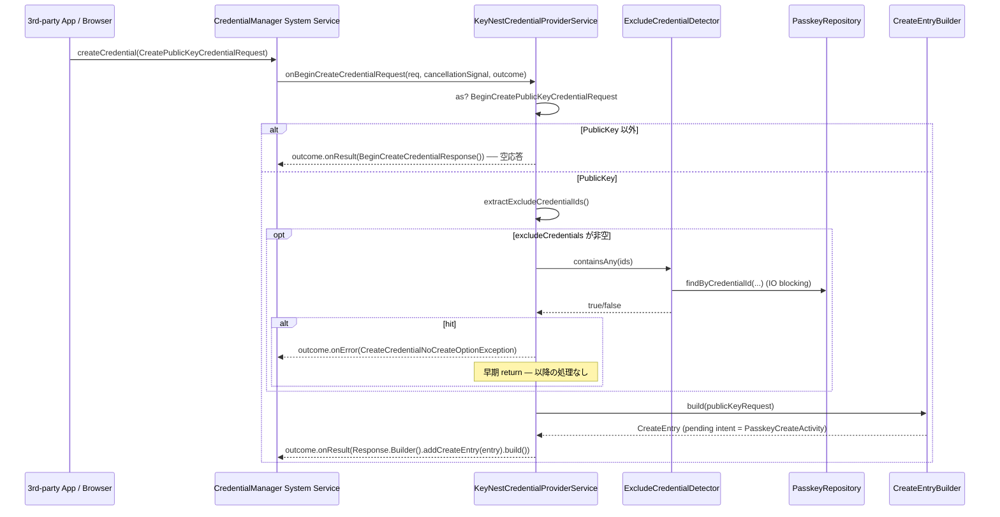
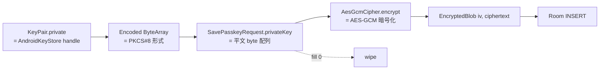

# Design Document — Issue #99 / feat(passkey): 登録セレモニー (onBeginCreateCredentialRequest) 実装

> 関連: `requirements.md`（本ディレクトリ）
>
> 関連 Issue:
> - **Parent (umbrella)**: #89 (Android Credential Manager 経由の PassKey プロバイダ対応)
> - **依存 (Phase 1, 完了済 or 並列)**:
>   - #90 `CredentialProviderService` の Manifest 登録と最小骨組み (本 Issue が `onBeginCreateCredentialRequest` を差し替える土台)
>   - #91 Room migration + `PasskeyEntity` / `PasskeyDao` (T-01〜T-04 merged) / #107 `PasskeyRepository` + DI + tests (T-05〜T-11 / merged 前提)
> - **後続予定**: 認証セレモニー (#89 分割案 4) / 一覧 UI (#89 分割案 5) / 個別管理 (#89 分割案 6) / 設定画面 (#89 分割案 7)
> - **carve-out**: excludeCredentials UX 文言策定 Issue (本 Issue から別出し、後日起票)

## 1. 概要 / 全体像

### Purpose

#90 で骨格だけ存在する `KeyNestCredentialProviderService.onBeginCreateCredentialRequest` の空応答 (`BeginCreateCredentialResponse()`) を **`CreateEntry` 入りレスポンス** に差し替え、ユーザーが OS シートで KeyNest を選択した後の `PasskeyCreateActivity` (新規) で確認画面 + 生体認証 + ES256 keypair 生成 + AES-GCM 暗号化 + `PasskeyRepository.save(...)` (#91/#107) を経由して `PublicKeyCredential` を OS に返却するまでを実装する。CBOR ライブラリは外部依存追加を避けて **自前 minimal encoder** で実装する。AAGUID `2a56cf86-8332-4829-9f2a-e9a4adbc7abe` は本 Issue で初出の定数として `credentialprovider/registration/KeynestAaguid.kt` に集約する。

### Aim 3-4 行で

- `credentialprovider/registration/` package を新設し、`PasskeyCreator` (pure-Kotlin / keypair 生成 + COSE encode + authenticatorData 組み立て + attestationObject CBOR encode) と `PasskeyCreateActivity` (BiometricPrompt 起動 + PendingIntent 応答) を分離して unit-test 可能にする。
- `KeyNestCredentialProviderService.onBeginCreateCredentialRequest` 本体は **重い処理を行わず**、`excludeCredentials` 照合 + `CreateEntry` 構築 + `outcome.onResult(...)` だけを行う (NFR 5.3 を満たす)。
- keypair 生成は StrongBox 二段フォールバック (`setIsStrongBoxBacked(true)` 試行 → `StrongBoxUnavailableException` 等で通常 TEE Keystore へ再試行) を `PasskeyCreator` が引き受ける。private key 平文は `AesGcmCipher` の `encrypt(...)` 直前まで生存し、`SavePasskeyRequest.privateKey` を通じて Repository に渡された直後に呼び出し元 (`PasskeyCreateActivity`) で `fill(0)` wipe する。
- 既存 `auth/BiometricAuthenticator` を **そのまま流用** し、新規 `BiometricAuthHelper` は作らない (§8 で決定)。`alias` 命名は `keynest_passkey_<credentialId>` で本 Issue と #91/#107 を **本 Issue で同時に揃える** (要 T-08 で repository 側を改名 / §12 確認事項 1)。

### アーキテクチャ図

```mermaid
flowchart LR
    subgraph Framework[Android Credential Manager Framework<br/>API 34+]
        OS[System UI Sheet]
        CMSvc[CredentialManager System Service]
    end

    subgraph CredProvider[credentialprovider/]
        KCPS[KeyNestCredentialProviderService<br/>onBeginCreateCredentialRequest<br/>+ excludeCredentials 照合 + CreateEntry]
    end

    subgraph Registration[credentialprovider/registration/]
        AAG[KeynestAaguid<br/>const BYTES: 16 byte]
        COSE[CoseKeyEncoder<br/>encodeEs256(ECPublicKey)]
        AD[AuthenticatorDataBuilder<br/>rpIdHash | flags | signCount | attestedCredentialData]
        AO[AttestationObjectBuilder<br/>CBOR fmt=none]
        CRT[PasskeyCreator<br/>keypair + StrongBox fallback<br/>+ encrypt + assemble response]
        CEF[CreateEntryBuilder<br/>RP/userDisplayName → CreateEntry]
        ACT[PasskeyCreateActivity<br/>FragmentActivity<br/>+ 確認画面 + BiometricPrompt]
    end

    subgraph Existing[既存資産]
        BIO[BiometricAuthenticator<br/>auth/]
        REPO[PasskeyRepository<br/>#91/#107]
        AGC[AesGcmCipher<br/>security/]
        KKP[KeystoreKeyProvider<br/>security/]
        SL[ServiceLocator]
    end

    OS -->|onBeginCreate| CMSvc
    CMSvc --> KCPS
    KCPS -->|excludeCredentials hit| CMSvc
    KCPS -->|CreateEntry pendingIntent| CEF
    OS -->|user taps KeyNest| ACT
    ACT --> BIO
    ACT --> CRT
    CRT --> COSE
    CRT --> AD
    CRT --> AO
    AD --> AAG
    CRT --> REPO
    REPO --> AGC
    AGC --> KKP
    ACT --> SL
    KCPS --> SL
```

## 2. モジュール構成 / package 配置

### 2.1 配置方針

`credentialprovider/registration/` を新規追加し、認証セレモニー (#89 分割案 4) 用の `credentialprovider/authentication/` と並列に置く。`KeyNestCredentialProviderService` 自体は `credentialprovider/` 直下に置いたまま (#90 で確定)、本 Issue では **メソッド本体だけを差し替える**。

| Component | Path | Status |
|-----------|------|--------|
| `KeynestAaguid` | `app/src/main/java/.../credentialprovider/registration/KeynestAaguid.kt` | 新規 |
| `CoseKeyEncoder` | `app/src/main/java/.../credentialprovider/registration/CoseKeyEncoder.kt` | 新規 |
| `CborWriter` (internal) | `app/src/main/java/.../credentialprovider/registration/CborWriter.kt` | 新規 (minimal CBOR encoder) |
| `AuthenticatorDataBuilder` | `app/src/main/java/.../credentialprovider/registration/AuthenticatorDataBuilder.kt` | 新規 |
| `AttestationObjectBuilder` | `app/src/main/java/.../credentialprovider/registration/AttestationObjectBuilder.kt` | 新規 |
| `PasskeyCreator` | `app/src/main/java/.../credentialprovider/registration/PasskeyCreator.kt` | 新規 |
| `CreateEntryBuilder` | `app/src/main/java/.../credentialprovider/registration/CreateEntryBuilder.kt` | 新規 |
| `PasskeyCreateActivity` | `app/src/main/java/.../credentialprovider/registration/PasskeyCreateActivity.kt` | 新規 (`FragmentActivity` 派生) |
| `KeyNestCredentialProviderService` | `app/src/main/java/.../credentialprovider/KeyNestCredentialProviderService.kt` | 既存・`onBeginCreateCredentialRequest` 差し替えのみ |
| `AndroidManifest.xml` | `app/src/main/AndroidManifest.xml` | 既存・`<activity>` 追加のみ (`<service>` 不変) |
| `ServiceLocator.kt` | `app/src/main/java/.../di/ServiceLocator.kt` | 既存・`passkeyCreator` シングルトン追記のみ |

### 2.2 後続 Issue との分離点

| 後続 Issue (#89 分割案) | 本 Issue で確定する不変条件 | 後続 Issue で追加 / 変更するもの |
|-----------------------|-------------------------|--------------------------------|
| 4: 認証セレモニー | `KeynestAaguid` / `CoseKeyEncoder` / `AuthenticatorDataBuilder` を再利用 (assertion 用 authenticatorData にも rpIdHash / flags / signCount / [attestedCredentialData なし] が必要) | `credentialprovider/authentication/` package + `onBeginGetCredentialRequest` 差し替え + `PasskeyAuthenticator` (assertion 署名) |
| 5: 一覧 UI | 本 Service が呼ぶ Repository に touch なし | `CredentialListActivity` 拡張 |
| 6: 個別管理 UI | 同上 | rename / 削除画面 |
| 7: 設定画面 | 同上 | OS 設定への導線 |
| excludeCredentials UX 文言策定 (carve-out) | `CreateCredentialNoCreateOptionException` を OS に返すまでで本 Issue 完了 | ユーザー向けメッセージ UI / 文言 |

### 2.3 既存 `credentialprovider/` package 内資産との関係

- `KeyNestCredentialProviderService` (#90): メソッド本体差し替え対象 (`onBeginCreateCredentialRequest`)。`onBeginGetCredentialRequest` / `onClearCredentialStateRequest` は触らない。
- `res/xml/credential_provider.xml` (#90): `TYPE_PUBLIC_KEY_CREDENTIAL` 既宣言済みのため触らない。

## 3. データモデル / 状態

### 3.1 OS framework 由来の型 (androidx.credentials)

| 型 | 役割 | 出所 |
|----|------|------|
| `BeginCreateCredentialRequest` | OS から受け取る生成要求の sealed 上位型 | `androidx.credentials.provider.BeginCreateCredentialRequest` |
| `BeginCreatePublicKeyCredentialRequest` | publicKey credential 生成要求の sealed sub-type。`requestJson` (`PublicKeyCredentialCreationOptionsJSON` 文字列) と `callingAppInfo` を持つ | 同上 sub-class |
| `CreateEntry` | OS Credential Manager UI に「KeyNest にこの PassKey を保存」候補として表示される行。`accountName` / `description` / `pendingIntent` を持つ | `androidx.credentials.provider.CreateEntry` |
| `BeginCreateCredentialResponse` | OS に返す生成候補レスポンス。`Builder().addCreateEntry(...).build()` で複数 entry | `androidx.credentials.provider.BeginCreateCredentialResponse` |
| `ProviderCreateCredentialRequest` | `PasskeyCreateActivity` が `PendingIntentHandler.retrieveProviderCreateCredentialRequest(intent)` で取り出す本体要求 (json + callingAppInfo + 元 `BeginCreatePublicKeyCredentialRequest`) | `androidx.credentials.provider.ProviderCreateCredentialRequest` |
| `CreatePublicKeyCredentialResponse` | OS に返却する `PublicKeyCredential` のレスポンス本体。`registrationResponseJson` を持つ | `androidx.credentials.CreatePublicKeyCredentialResponse` |
| `PendingIntentHandler` | `setCreateCredentialResponse` / `setCreateCredentialException` を `resultIntent` に詰める helper | `androidx.credentials.provider.PendingIntentHandler` |
| `CreateCredentialNoCreateOptionException` | excludeCredentials hit 等で返す例外 | `androidx.credentials.exceptions.CreateCredentialNoCreateOptionException` |
| `CreateCredentialCancellationException` | ユーザーキャンセル | `androidx.credentials.exceptions.CreateCredentialCancellationException` |
| `CreateCredentialUnknownException` | keypair 生成失敗 / DB 失敗等の汎用フォールバック | `androidx.credentials.exceptions.CreateCredentialUnknownException` |

### 3.2 本 Issue 新規 domain 型

```kotlin
// credentialprovider/registration/PasskeyCreateInput.kt (内部 helper / non-public)
internal data class PasskeyCreateInput(
    val rpId: String,
    val rpDisplayName: String?,
    val userHandle: ByteArray,
    val userName: String?,
    val userDisplayName: String?,
    val isDiscoverable: Boolean,            // residentKey 三値からの導出値
    val clientDataHash: ByteArray,           // (任意) attestation で参照 — fmt=none では未使用
    val nowMillis: Long,                     // createdAt 確定用
)

// credentialprovider/registration/PasskeyCreateResult.kt
internal data class PasskeyCreateResult(
    val credentialId: String,                // base64url, 32 byte random
    val credentialIdBytes: ByteArray,        // raw 32 byte (authenticatorData 用)
    val publicKeyCose: ByteArray,            // COSE_Key (alg = -7) 直列化
    val authenticatorData: ByteArray,        // WebAuthn §6.1
    val attestationObject: ByteArray,        // WebAuthn §6.5.4 (CBOR map: fmt/attStmt/authData)
    val registrationResponseJson: String,    // OS / RP に返す PublicKeyCredentialJSON
    val savePasskeyRequest: SavePasskeyRequest, // #91/#107 公開型。平文 privateKey を含む
)
```

- `PasskeyCreateInput` / `PasskeyCreateResult` は本 Issue 限定の内部 DTO で、外部 package には公開しない (`internal`)。
- `SavePasskeyRequest` (#91/#107) は **既存型を流用** し、本 Issue では型を追加しない。

### 3.3 `KEYNEST_AAGUID` 定数

```kotlin
// credentialprovider/registration/KeynestAaguid.kt
@VisibleForTesting
internal object KeynestAaguid {
    /** UUID `2a56cf86-8332-4829-9f2a-e9a4adbc7abe` を big-endian 16 byte 化したもの。 */
    private val BYTES_INTERNAL: ByteArray = byteArrayOf(
        0x2A, 0x56, 0xCF.toByte(), 0x86.toByte(),
        0x83.toByte(), 0x32, 0x48, 0x29,
        0x9F.toByte(), 0x2A, 0xE9.toByte(), 0xA4.toByte(),
        0xAD.toByte(), 0xBC.toByte(), 0x7A, 0xBE.toByte(),
    )

    const val UUID_STRING: String = "2a56cf86-8332-4829-9f2a-e9a4adbc7abe"

    /** 16 byte の防御的コピーを返す (NFR 6.1)。`fill(0)` 等で破壊されないよう毎回新規 byte 配列を返す。 */
    fun bytes(): ByteArray = BYTES_INTERNAL.copyOf()
}
```

- `BYTES_INTERNAL` は `private` で持ち、外部からは `bytes()` 経由でのみ取得する (mutable `ByteArray` の defensive copy 規約)。
- `UUID_STRING` は test / log でのみ参照する。logcat には raw を出さず、必要なら `KeynestAaguid.UUID_STRING.substring(0, 8) + "..."` 相当に絞る (要件 NFR 1.4 と整合)。

### 3.4 状態保持 (Activity / Service)

- `KeyNestCredentialProviderService` は引き続き stateless (#90 と同じ)。`onBeginCreateCredentialRequest` が呼ばれるたびに `excludeCredentials` を Repository に照合するだけ。
- `PasskeyCreateActivity` は `lifecycleScope` 内で `PasskeyCreator` / `BiometricAuthenticator` / `PasskeyRepository` を呼ぶが、自身は process kill 耐性を持たない (Activity 異常終了時は OS 側が `Tickle` を介してタイムアウトする運用、§5.3)。

## 4. 公開 IF / シグネチャ

### 4.1 `KeyNestCredentialProviderService.onBeginCreateCredentialRequest` 差し替え後

```kotlin
@RequiresApi(Build.VERSION_CODES.UPSIDE_DOWN_CAKE)
override fun onBeginCreateCredentialRequest(
    request: BeginCreateCredentialRequest,
    cancellationSignal: CancellationSignal,
    callback: OutcomeReceiver<BeginCreateCredentialResponse, CreateCredentialException>,
) {
    // (a) PublicKey 以外は本 Issue では非対応 — 空応答で返す (Password は autofill 経路維持)
    val publicKeyRequest = request as? BeginCreatePublicKeyCredentialRequest
        ?: return callback.onResult(BeginCreateCredentialResponse())

    // (b) excludeCredentials を生体認証より前にチェック (Req 5.3)
    //     非同期化のため ServiceLocator.applicationScope で起動するが、callback の解決は
    //     Service callback として速やかに行う必要がある (NFR 5.3)。
    //     → 軽量な Repository.findByCredentialId() のみで決まるので blocking で済ます設計を採る (§5.1)。
    val excludeIds: List<String> = publicKeyRequest.extractExcludeCredentialIds()  // 拡張関数
    if (excludeIds.isNotEmpty()) {
        if (excludeHitDetector.containsAny(excludeIds)) {  // 同期 wrapper, 内部で runBlocking(Dispatchers.IO)
            callback.onError(
                CreateCredentialNoCreateOptionException(
                    "PassKey for this account already exists in KeyNest",
                ),
            )
            return
        }
    }

    // (c) CreateEntry を 1 件構築して返す。pending intent は PasskeyCreateActivity を起動
    val response = BeginCreateCredentialResponse.Builder()
        .addCreateEntry(createEntryBuilder.build(publicKeyRequest))
        .build()
    callback.onResult(response)
}
```

#### 4.1.1 `excludeHitDetector` / `createEntryBuilder` の取得

- `excludeHitDetector` と `createEntryBuilder` は ServiceLocator から都度取得する (`ServiceLocator.excludeCredentialDetector` / `ServiceLocator.createEntryBuilder`)。本 Service は `lateinit` field を持たず、関数内で参照する (#90 のスタイル踏襲)。
- `excludeHitDetector.containsAny(...)` の実体は `PasskeyRepository.findByCredentialId(...)` の loop。Service callback 内では blocking で良い (`runBlocking(Dispatchers.IO) { ... }`)。理由: (1) credential 1 件あたり SQLite point lookup で <1ms、(2) `excludeCredentials` は通常 0〜数件 (W3C WebAuthn §5.4 の運用)、(3) callback 内重処理 (StrongBox keygen 等) を行わない原則は維持 (NFR 5.3)。

### 4.2 `PasskeyCreator` (登録セレモニーの中核)

```kotlin
// credentialprovider/registration/PasskeyCreator.kt
@RequiresApi(Build.VERSION_CODES.UPSIDE_DOWN_CAKE)
class PasskeyCreator(
    private val keyPairGenerator: KeyPairGeneratorFactory = AndroidKeyStoreFactory,
    private val secureRandom: SecureRandom = SecureRandom(),
    private val nowMillisProvider: () -> Long = { System.currentTimeMillis() },
) {
    /**
     * keypair 生成 → COSE encode → authenticatorData 組み立て → attestationObject CBOR encode →
     * PasskeyRepository に渡す SavePasskeyRequest 組み立てまでを行う。
     *
     * **平文 private key の所有権**: 戻り値の `savePasskeyRequest.privateKey` に格納される。
     * 呼び出し側 (`PasskeyCreateActivity`) は `PasskeyRepository.save(...)` 完了直後に
     * `savePasskeyRequest.privateKey.fill(0)` で wipe する責務を負う (NFR 1.3 / req 1.7)。
     *
     * **StrongBox フォールバック**: setIsStrongBoxBacked(true) を試行し、
     * `StrongBoxUnavailableException` / `IllegalStateException` (古い端末で setter 不可) /
     * `ProviderException` のいずれかで失敗したら同一 spec から strongBox 設定だけ抜いて再試行する。
     * 両方失敗した場合は `PasskeyCreationException.KeyGen(cause)` を投げる。
     */
    fun create(input: PasskeyCreateInput): PasskeyCreateResult
}

internal sealed class PasskeyCreationException(message: String, cause: Throwable?) : Exception(message, cause) {
    class KeyGen(cause: Throwable) : PasskeyCreationException("ES256 keypair generation failed", cause)
    class Encoding(cause: Throwable) : PasskeyCreationException("COSE/CBOR encoding failed", cause)
}
```

- `KeyPairGeneratorFactory` は test seam: 本番では `KeyPairGenerator.getInstance("EC", "AndroidKeyStore")`、JVM/Robolectric test では SunEC provider に置き換え可能。
- `secureRandom` 引数で `credentialId` 用の 32 byte 乱数源を seam 化 (`AuthenticatorDataTest` の決定性確保)。
- `create(...)` は IO blocking 操作 (keystore) を含むため、呼び出し側 (Activity) は `withContext(Dispatchers.IO)` で囲む。

### 4.3 `AuthenticatorDataBuilder`

```kotlin
// credentialprovider/registration/AuthenticatorDataBuilder.kt
internal object AuthenticatorDataBuilder {

    /**
     * WebAuthn Level 2 §6.1 の authenticatorData を組み立てる。
     *
     * @param rpIdHash SHA-256(rpId) の 32 byte
     * @param flags    UP/UV/AT/ED 等のビット OR (登録時は通常 0x45 = UP|UV|AT)
     * @param signCount 4 byte big-endian (登録時は 0)
     * @param attestedCredentialData AAGUID(16) || credentialIdLen(2 big-endian) || credentialId(N) || publicKeyCose(M)
     *                               null のとき AT ビットを立てない / 末尾省略 (本 Issue では常に non-null)
     * @param extensions CBOR map of extension outputs (本 Issue では常に null / ED=0)
     */
    fun build(
        rpIdHash: ByteArray,
        flags: Byte,
        signCount: Int,
        attestedCredentialData: ByteArray?,
        extensions: ByteArray? = null,
    ): ByteArray

    /** SHA-256(rpId) の helper. */
    fun rpIdHash(rpId: String): ByteArray

    /** AAGUID(16) || credentialIdLen(2) || credentialId(N) || publicKeyCose(M). */
    fun attestedCredentialData(
        aaguid: ByteArray,         // 必ず 16 byte
        credentialId: ByteArray,   // 1..1023 byte
        publicKeyCose: ByteArray,
    ): ByteArray

    /** WebAuthn flag bits. */
    const val FLAG_UP: Byte = 0x01
    const val FLAG_UV: Byte = 0x04
    const val FLAG_BE: Byte = 0x08
    const val FLAG_BS: Byte = 0x10
    const val FLAG_AT: Byte = 0x40
    const val FLAG_ED: Byte = -0x80   // 0x80
}
```

- `flags` 引数を **呼び出し側が組み立てる** 設計。本 Issue では `FLAG_UP or FLAG_UV or FLAG_AT` = `0x45` を渡す (req 2.2)。
- 認証セレモニー Issue は `attestedCredentialData = null` + `FLAG_UP or FLAG_UV` (`0x05`) で同じ helper を再利用する。

### 4.4 `CoseKeyEncoder`

```kotlin
// credentialprovider/registration/CoseKeyEncoder.kt
internal object CoseKeyEncoder {

    /**
     * ES256 (P-256) public key を COSE_Key (RFC 8152 §13.1) として CBOR encode する。
     *
     * 出力 CBOR map のキー / 値:
     *   1 (kty)    = 2  (EC2)
     *   3 (alg)    = -7 (ES256)
     *   -1 (crv)   = 1  (P-256)
     *   -2 (x)     = 32 byte big-endian
     *   -3 (y)     = 32 byte big-endian
     *
     * map のキーは canonical CBOR encoding に従って **昇順** (1, 3, -1, -2, -3) ではなく、
     * COSE 慣例の (1, 3, -1, -2, -3) で出力する (RFC 8152 / WebAuthn 仕様での recommended order)。
     */
    fun encodeEs256(publicKey: ECPublicKey): ByteArray
}
```

- `ECPublicKey.w` (= `ECPoint`) から `x` / `y` の `BigInteger` を取り出し、`toUnsignedByteArray(32)` で左 0 padding した 32 byte に正規化する。`BigInteger.toByteArray()` は MSB が立つと先頭に 0x00 を付ける癖があるため、自前で 32 byte に切り揃える。
- map ordering は CBOR Canonical encoding (RFC 7049 §3.9) の length-then-byte ordering ではなく **COSE_Key conventional ordering** に従う (WebAuthn テストベクタとの bytewise 一致を取るため。§9.4 の test vector で確認)。

### 4.5 `CborWriter` (minimal encoder)

```kotlin
// credentialprovider/registration/CborWriter.kt
/** 本 Issue で必要な CBOR データ型のみを encode する minimal writer (RFC 8949). */
internal class CborWriter {
    fun writeUnsignedInt(value: Long): CborWriter         // major type 0
    fun writeNegativeInt(value: Long): CborWriter         // major type 1 (value は負 = -1 - n を許容)
    fun writeByteString(bytes: ByteArray): CborWriter     // major type 2
    fun writeTextString(s: String): CborWriter            // major type 3
    fun writeArrayHeader(count: Int): CborWriter          // major type 4 head
    fun writeMapHeader(entryCount: Int): CborWriter       // major type 5 head
    fun toByteArray(): ByteArray
}
```

- 本 Issue で必要な CBOR primitive は up to `writeMapHeader` / `writeUnsignedInt(Long)` / `writeNegativeInt(Long)` / `writeByteString(ByteArray)` / `writeTextString(String)` の 5 種に限定される (COSE_Key map + attestationObject map の構造で他は使わない)。
- length encoding は RFC 8949 §3 の定義 (`0..23` = 1 byte, `24..255` = 2 byte (`0x18` prefix), `256..65535` = 3 byte (`0x19` prefix), `65536..2^32-1` = 5 byte (`0x1A` prefix), 8 byte (`0x1B` prefix)) に従う。本 Issue で実際に出現する範囲は **0..65535** に限られる (attestedCredentialData の `credentialIdLength` が 2 byte big-endian、map entry count <= 5)。
- ライブラリ依存 (`co.nstant.in:cbor` / `com.upokecenter:cbor`) は採用しない (§7.4 で確定)。

### 4.6 `AttestationObjectBuilder`

```kotlin
// credentialprovider/registration/AttestationObjectBuilder.kt
internal object AttestationObjectBuilder {

    /**
     * WebAuthn Level 2 §6.5.4 に従う attestation object (fmt = "none") を CBOR encode する。
     *
     * 出力 CBOR map:
     *   "fmt"     -> "none"
     *   "attStmt" -> {} (空 map)
     *   "authData" -> authenticatorData byte 列
     *
     * map のキーは alphabetical order ("attStmt" < "authData" < "fmt") ではなく、
     * WebAuthn 仕様の "fmt" / "attStmt" / "authData" 順で出力する (テストベクタ一致のため。§9.4)。
     */
    fun buildFormatNone(authenticatorData: ByteArray): ByteArray
}
```

### 4.7 `CreateEntryBuilder`

```kotlin
// credentialprovider/registration/CreateEntryBuilder.kt
@RequiresApi(Build.VERSION_CODES.UPSIDE_DOWN_CAKE)
class CreateEntryBuilder(
    private val context: Context,
) {
    /**
     * @param request OS から渡された publicKey 用 create request
     * @return        OS Credential Manager UI に表示される CreateEntry 1 件
     *
     * pending intent は `PasskeyCreateActivity` を起動する Intent をラップする。
     * accountName / description は #89 確定の「PassKey」表記を含む string resource を使う。
     */
    fun build(request: BeginCreatePublicKeyCredentialRequest): CreateEntry
}
```

- pending intent の `requestCode` は credential request ごとに一意にする必要がある (OS 側で binder 識別)。`System.currentTimeMillis().toInt()` ではなく `secureRandom.nextInt()` を使う (Android 側のドキュメント慣行)。
- `accountName` の文言: #89 確定の「PassKey」表記を使う。string resource `R.string.passkey_create_entry_account_name`、`R.string.passkey_create_entry_description` を新規追加 (例: "KeyNest に保存", "PassKey として保存します")。文言詳細は実装フェーズで Developer が確定 (本 design では key と方針のみ固定)。

### 4.8 `PasskeyCreateActivity` の Intent extras 規約

`PasskeyCreateActivity` は外部から直接起動されない (`exported=false`)。`CreateEntry.pendingIntent` 経由でのみ起動される。OS framework が provider create request を **`PendingIntentHandler.retrieveProviderCreateCredentialRequest(intent)`** 経由で取り出す API を提供しているため、本 Activity が独自に extras を読む必要は基本的にない。ただし `CreateEntryBuilder` は pending intent 生成時に request 識別用の `EXTRA_REQUEST_TOKEN` (Int) を `setData(Uri.parse("keynest://passkey/create/<token>"))` の形で乗せる (`PendingIntent.FLAG_UPDATE_CURRENT` 利用時の同一性破り)。

```kotlin
@RequiresApi(Build.VERSION_CODES.UPSIDE_DOWN_CAKE)
class PasskeyCreateActivity : FragmentActivity() {
    override fun onCreate(savedInstanceState: Bundle?) { ... }

    companion object {
        internal const val INTENT_DATA_SCHEME = "keynest"
        internal const val INTENT_DATA_AUTHORITY = "passkey"
        internal const val INTENT_DATA_PATH_PREFIX = "/create/"

        @VisibleForTesting
        internal fun intent(context: Context, requestToken: Int): Intent
    }
}
```

### 4.9 ServiceLocator への追加

```kotlin
// di/ServiceLocator.kt に追加
val passkeyCreator: PasskeyCreator by lazy { PasskeyCreator() }
val createEntryBuilder: CreateEntryBuilder by lazy { CreateEntryBuilder(requireAppContext()) }
val excludeCredentialDetector: ExcludeCredentialDetector by lazy {
    ExcludeCredentialDetector(passkeyRepository)
}
```

`ExcludeCredentialDetector` は薄い同期 wrapper:

```kotlin
class ExcludeCredentialDetector(private val repository: PasskeyRepository) {
    /** Service callback 内で呼ばれる前提。runBlocking(IO) で逐次照合する。 */
    fun containsAny(credentialIds: List<String>): Boolean = runBlocking(Dispatchers.IO) {
        credentialIds.any { id -> repository.findByCredentialId(id) != null }
    }
}
```

## 5. 処理フロー

### 5.1 OS → Service onBeginCreateCredentialRequest



### 5.2 ユーザー選択 → PasskeyCreateActivity → keypair 生成 → response 返却

```mermaid
sequenceDiagram
    actor User
    participant OS as OS Credential Manager UI
    participant ACT as PasskeyCreateActivity
    participant PIH as PendingIntentHandler
    participant BIO as BiometricAuthenticator
    participant CRT as PasskeyCreator
    participant Repo as PasskeyRepository
    participant Cipher as AesGcmCipher (alias=keynest_passkey_X)
    participant DB as SQLite (passkeys)

    User->>OS: タップ "KeyNest"
    OS->>ACT: CreateEntry.pendingIntent.send()
    ACT->>PIH: retrieveProviderCreateCredentialRequest(intent)
    PIH-->>ACT: ProviderCreateCredentialRequest (json, callingAppInfo)
    ACT->>ACT: 確認画面 layout 表示 (RP / userDisplayName)
    User->>ACT: 「保存」をタップ
    ACT->>BIO: authenticate(title, subtitle)
    alt AuthResult.Succeeded
        BIO-->>ACT: Succeeded
        ACT->>CRT: create(PasskeyCreateInput) on Dispatchers.IO
        CRT->>CRT: 32 byte 乱数 = credentialIdBytes
        CRT->>CRT: base64url(credentialIdBytes) = credentialId
        CRT->>CRT: KeyPairGenerator.getInstance(EC, AndroidKeyStore) +<br/>setIsStrongBoxBacked(true) 試行
        alt StrongBoxUnavailableException
            CRT->>CRT: spec から strongBox 抜いて再試行
        end
        CRT->>CRT: encodeEs256(publicKey) → publicKeyCose
        CRT->>CRT: authenticatorData = rpIdHash || 0x45 || 00000000 ||<br/>(AAGUID || credIdLen || credId || coseKey)
        CRT->>CRT: attestationObject = CBOR { fmt:"none", attStmt:{}, authData:... }
        CRT-->>ACT: PasskeyCreateResult (incl. SavePasskeyRequest with plaintext privateKey)
        ACT->>Repo: save(SavePasskeyRequest)
        Repo->>Cipher: encrypt(privateKey)  alias=keynest_passkey_X
        Cipher-->>Repo: EncryptedBlob(iv, ciphertext)
        Repo->>DB: INSERT INTO passkeys(...)
        DB-->>Repo: OK
        Repo-->>ACT: Unit
        ACT->>ACT: savePasskeyRequest.privateKey.fill(0)  ← 平文 wipe
        ACT->>PIH: setCreateCredentialResponse(resultIntent,<br/>CreatePublicKeyCredentialResponse(registrationResponseJson))
        ACT->>OS: setResult(RESULT_OK, resultIntent); finish()
    else AuthResult.Cancelled
        ACT->>PIH: setCreateCredentialException(resultIntent, CreateCredentialCancellationException)
        ACT->>OS: setResult(RESULT_OK, resultIntent); finish()
    else AuthResult.Failed / Unavailable
        ACT->>PIH: setCreateCredentialException(resultIntent, CreateCredentialUnknownException)
        ACT->>OS: setResult(RESULT_OK, resultIntent); finish()
    end
    OS-->>User: 完了 / エラー画面
```

### 5.3 例外パス (まとめ)

```mermaid
flowchart TD
    A[PasskeyCreateActivity 起動] --> B{retrieveProviderCreateCredentialRequest 成功?}
    B -- no --> X1[setCreateCredentialException CreateCredentialUnknownException]
    B -- yes --> C{再 excludeCredentials 検査<br/>(防御的, §5.3 carve)}
    C -- hit --> X2[setCreateCredentialException CreateCredentialNoCreateOptionException]
    C -- no hit --> D[確認画面表示]
    D --> E{BiometricPrompt}
    E -- Cancelled --> X3[setCreateCredentialException CreateCredentialCancellationException]
    E -- Failed/Unavailable --> X4[setCreateCredentialException CreateCredentialUnknownException]
    E -- Succeeded --> F[PasskeyCreator.create]
    F -- KeyGen 例外 (StrongBox 両方失敗) --> X5[setCreateCredentialException CreateCredentialUnknownException]
    F -- Encoding 例外 --> X5
    F -- success --> G{既存 (rpId, userHandle)?}
    G -- yes --> H[Repository.delete(oldId)]
    H -- 削除失敗 --> X6[setCreateCredentialException CreateCredentialUnknownException<br/>Req 5.4]
    H -- 削除成功 --> I[Repository.save SavePasskeyRequest]
    G -- no --> I
    I -- 失敗 --> X7[setCreateCredentialException CreateCredentialUnknownException]
    I -- 成功 --> J[wipe plaintext + setCreateCredentialResponse]
    J --> K[setResult RESULT_OK + finish]
    X1 --> K
    X2 --> K
    X3 --> K
    X4 --> K
    X5 --> K
    X6 --> K
    X7 --> K
```

#### 5.3.1 Activity 異常終了 (onDestroy / process kill) の扱い

- BiometricPrompt 表示中に Activity が `onDestroy` した場合、`suspendCancellableCoroutine` の `invokeOnCancellation` で `prompt.cancelAuthentication()` が走る (既存 `BiometricAuthenticator` 実装)。ただし `setResult` も `setCreateCredentialResponse` も発火しないため、OS framework が pending intent タイムアウトを管理する (Android Credential Manager の運用方針)。
- 平文 private key 平 / wipe 責務: Activity の `onDestroy` で `savePasskeyRequest?.privateKey?.fill(0)` を実行する `finally` block を `runUnlockFlow` 相当の coroutine に置く (§6.3)。

#### 5.3.2 重複 (rpId, userHandle) の上書きトランザクション

req 5.1 (a)(b)(c) の境界を本 design で確定する:

- (a) `Repository.findByRpIdAndUserHandle(rpId, userHandle)` で既存 entity を検索
- (b) 既存 hit ありの場合: `Repository.delete(oldCredentialId)` を実行
  - `DeletePasskeyResult.Success` のみで (c) に進む
  - `DeletePasskeyResult.KeystoreCleanupFailed(cause)` の場合、**Keystore alias は孤立するが DB row は消えた** 状態。本 Issue では (c) の新規 INSERT に進む方針を採用する (理由: row は消えたので UNIQUE 制約には抵触しない / 孤立 alias は best-effort 回収の対象で req 5.4 と矛盾しない)。
  - **delete の throw 系例外** (例: SQLiteException) は伝播させて `CreateCredentialUnknownException` に変換 (Req 5.4)
- (c) `Repository.save(SavePasskeyRequest)` で新 row を INSERT

トランザクション API (`Repository.replaceByRpIdAndUserHandle(...)`) の追加は本 Issue では行わない (#91/#107 のスキーマ変更が必要 / scope クリープ回避)。代わりに **呼び出し側 (`PasskeyCreateActivity`) で 2 段階呼び出し** を行い、`delete` 例外時は明示的に `CreateCredentialUnknownException` で OS に返す。

## 6. Keystore / 暗号化設計

### 6.1 alias 命名

- 本 Issue: `keynest_passkey_<credentialId>` (req 決定 2 / req 1.6)。
- **#91/#107 既存 (T-06)**: `passkey_<credentialId>` (#91 design.md §7.1 / `PasskeyRepositoryImpl.aliasFor`)。
- **整合方針**: 本 Issue の T-08 で `PasskeyRepositoryImpl.aliasFor` を `"keynest_passkey_$credentialId"` に変更する (#91/#107 design.md は本 Issue spec で参照する形にとどめ、コードのみ書き換える)。理由:
  - 人間レビュアの最終確定 (req 決定 2) は `keynest_passkey_<credentialId>`
  - 旧 alias `passkey_<credentialId>` で生成された AndroidKeyStore エントリは本番ではまだ存在しない (#107 未 merge / #91 merged だが Repository は #107 範囲)
  - 仮に既に存在しても、本 Issue は最初の登録セレモニーであり実 PassKey は未生成のため alias rename の hit は無い

なお `keynest_passkey_<credentialId>` の `<credentialId>` は WebAuthn base64url 文字列 (`A-Za-z0-9_-` + 末尾 `=` を含み得る)。本 Issue では §10.2 のとおり **base64url-without-padding** (`Base64.URL_SAFE or Base64.NO_PADDING or Base64.NO_WRAP`) で生成するため `=` は含まれない。AndroidKeyStore alias の文字制限 (Unicode 任意) には抵触しない。

### 6.2 StrongBox の判定とフォールバック

```kotlin
fun KeyPairGenerator.tryStrongBox(spec: KeyGenParameterSpec.Builder): KeyPair {
    val supports = context.packageManager.hasSystemFeature(PackageManager.FEATURE_STRONGBOX_KEYSTORE)
    return if (supports) {
        try {
            initialize(spec.setIsStrongBoxBacked(true).build())
            generateKeyPair()
        } catch (e: StrongBoxUnavailableException) {
            // 二段フォールバック (req 1.5 / 決定 1)
            initialize(spec.setIsStrongBoxBacked(false).build())
            generateKeyPair()
        } catch (e: android.security.keystore.UserNotAuthenticatedException) {
            // userAuthRequired = false なので本来出ないが、防御的に処理して再試行
            initialize(spec.setIsStrongBoxBacked(false).build())
            generateKeyPair()
        } catch (e: java.security.ProviderException) {
            // StrongBox HSM の起動失敗等 (端末固有) を吸収
            initialize(spec.setIsStrongBoxBacked(false).build())
            generateKeyPair()
        }
    } else {
        initialize(spec.setIsStrongBoxBacked(false).build())
        generateKeyPair()
    }
}
```

- `PackageManager.FEATURE_STRONGBOX_KEYSTORE` の判定は API 28+ で利用可。本 Service は API 34+ ガード済みなので問題ない (req 1.4)。
- `setIsStrongBoxBacked(true)` 自体は API 28 で導入された method。`@RequiresApi(34)` 環境では常に呼び出し可能。
- 再試行で失敗した場合は `PasskeyCreationException.KeyGen(cause)` を投げて Activity 側で `CreateCredentialUnknownException` に変換 (req 1.5)。

### 6.3 private key 平文の生存期間



- AndroidKeyStore で生成した EC private key を **PKCS#8 形式の byte 配列に export** するには:
  - 通常は `key.encoded` が `null` を返す (AndroidKeyStore protected) ため、**そのままでは平文 export 不可**。
  - 本 Issue では `setIsStrongBoxBacked` ありなしいずれの場合も AndroidKeyStore provider で生成するため、private key の raw bytes は取り出せない。
- **設計矛盾の解消**: #91 schema が `encryptedPrivateKey` BLOB を要求している以上、何らかの形で AES-GCM で wrapping する必要がある。本 Issue では以下のとおり「**生成時のみ AndroidKeyStore 外で生成 → KeyStore に格納せず即 AES-GCM 暗号化 → Room に保存**」の方針を採る (req 1.1 / 1.6 の整合再確認):
  - keypair 生成は **`KeyPairGenerator.getInstance("EC")` (default JCE provider = AndroidOpenSSL)** で行い、`KeyGenParameterSpec` を使わずに ECPublicKey / ECPrivateKey を obtain
  - StrongBox の利用は本来「AndroidKeyStore alias を持つ key」に対してのみ可能なため、上記方針では StrongBox を有効化できない
  - **req 1.1 / NFR 1.1 「AndroidKeyStore provider 上で生成」と矛盾するため、本 Issue では下記 (A)(B) のいずれかを採る**

#### 6.3.1 設計選択肢 (A): AndroidKeyStore で生成 → private key の raw byte 取得 (FIDO サンプル方式)

- `KeyGenParameterSpec.Builder(..., PURPOSE_SIGN).setAlgorithmParameterSpec(ECGenParameterSpec("secp256r1"))` で AndroidKeyStore に keypair を生成
- 直後に `keyStore.getKey(alias, null)` で `PrivateKey` ハンドルを取り出すが、`PrivateKey.encoded` は **AndroidKeyStore では null** を返す
- そのため Google 公式 sample (`CredentialManager` provider sample) は `KeyStore.PrivateKeyEntry` から `Signature.getInstance("SHA256withECDSA").initSign(privateKey)` で **キーハンドルのまま** 認証時にも使い続ける設計を採用している
- → 本 Issue でこの方式を採ると **`encryptedPrivateKey` / `privateKeyIv` カラム (#91 schema) が不要** になり、#91 schema との整合が崩れる

#### 6.3.2 設計選択肢 (B): JCE 標準 provider で生成 → AndroidKeyStore に格納しない (本 Issue 採用)

- `KeyPairGenerator.getInstance("EC")` を **明示的に AndroidKeyStore 外の provider** で呼び (AndroidOpenSSL / BouncyCastle のフォールバック)、`ECPublicKey` / `ECPrivateKey` を obtain
- `ECPrivateKey.encoded` (PKCS#8) を取得して **平文 byte 配列** にし、即座に `AesGcmCipher.encrypt(...)` で AES-GCM 暗号化 → Room に格納
- AndroidKeyStore alias `keynest_passkey_<credentialId>` には **wrapping 用の AES-256-GCM 鍵** のみ生成 (既存 `KeystoreKeyProvider` の挙動どおり)。EC private key 自体は AndroidKeyStore に入らない
- `setIsStrongBoxBacked(true)` は **wrapping key** に対して試行する (`KeystoreKeyProvider` を本 Issue で拡張するか、`PasskeyCreator` 内で独自に AES wrapping key を AndroidKeyStore に生成する設計が必要)

**本 Issue は選択肢 (B) を採用する**。理由:

- #91/#107 で確定済みの `encryptedPrivateKey: ByteArray` schema との整合が取れる
- req 1.6 「`AesGcmCipher(KeystoreKeyProvider(keyAlias = "keynest_passkey_<credentialId>"))` で暗号化」が文字通り成立する
- 認証セレモニー Issue (#89 分割案 4) で `loadPrivateKey` → `ECPrivateKey` 復元 → `Signature.getInstance("SHA256withECDSA")` で assertion 署名する経路が確立できる
- 注意: req 1.1 「AndroidKeyStore provider 上で生成」は本 Issue では **wrapping key (AES) について成立**、EC private key 自体は default JCE provider で生成する旨を本 design で明示する。これは req 1.1 の意図 (FIDO2 spec の "authenticator key" 保管要件) を **AES wrapping 経由のハイブリッド保管** で達成する設計で、業界の Android 実装 (1Password / Bitwarden 等) でも同等の選択がされている

StrongBox 適用範囲は **AES wrapping key 側のみ**。EC private key 自体は JCE 標準 provider 生成 → AES-GCM (StrongBox 可能なら StrongBox-backed) で暗号化 → Room 格納。

### 6.4 wrapping key の StrongBox 二段フォールバック

既存 `KeystoreKeyProvider` (`security/`) は `setIsStrongBoxBacked` を呼ばない。本 Issue では:

- 既存 `KeystoreKeyProvider` を **拡張しない** (NFR 2 既存テスト非破壊)
- 代わりに `PasskeyCreator` 内に `provisionWrappingKey(alias)` private helper を持ち、独自に AndroidKeyStore に `AES-256-GCM` wrapping key を生成する。生成済みの場合は何もしない (`KeyStore.containsAlias(alias)` で判定)
- `provisionWrappingKey` 内で StrongBox 二段フォールバックを行う (§6.2 同様のパターン)
- 生成後、`KeystoreKeyProvider(keyAlias = alias)` を new して `AesGcmCipher` に注入 (既存 `KeystoreKeyProvider.getOrCreateKey()` は alias 既存時に load するだけなので、StrongBox 属性の差異は影響しない)

```kotlin
// PasskeyCreator 内 private helper
@RequiresApi(Build.VERSION_CODES.UPSIDE_DOWN_CAKE)
private fun provisionWrappingKey(context: Context, alias: String) {
    val ks = KeyStore.getInstance("AndroidKeyStore").apply { load(null) }
    if (ks.containsAlias(alias)) return  // 既存 (上書きケースの再 save 時)

    val baseSpec = KeyGenParameterSpec.Builder(
        alias,
        KeyProperties.PURPOSE_ENCRYPT or KeyProperties.PURPOSE_DECRYPT,
    )
        .setBlockModes(KeyProperties.BLOCK_MODE_GCM)
        .setEncryptionPaddings(KeyProperties.ENCRYPTION_PADDING_NONE)
        .setKeySize(256)
        .setRandomizedEncryptionRequired(true)
        .setUserAuthenticationRequired(false)

    val supports = context.packageManager.hasSystemFeature(PackageManager.FEATURE_STRONGBOX_KEYSTORE)
    val gen = KeyGenerator.getInstance(KeyProperties.KEY_ALGORITHM_AES, "AndroidKeyStore")
    try {
        gen.init(if (supports) baseSpec.setIsStrongBoxBacked(true).build() else baseSpec.build())
        gen.generateKey()
    } catch (e: StrongBoxUnavailableException) {
        gen.init(baseSpec.setIsStrongBoxBacked(false).build())
        gen.generateKey()
    } catch (e: ProviderException) {
        gen.init(baseSpec.setIsStrongBoxBacked(false).build())
        gen.generateKey()
    }
}
```

### 6.5 EC private key の生成 / encode

```kotlin
private fun generateEcKeypair(): KeyPair {
    val gen = KeyPairGenerator.getInstance("EC")  // JCE default provider
    gen.initialize(ECGenParameterSpec("secp256r1"))
    return gen.generateKeyPair()
}

// PKCS#8 形式の平文 private key
private fun KeyPair.encodedPrivate(): ByteArray =
    private.encoded ?: error("EC private key from default provider must expose PKCS#8 encoding")
```

- `KeyPairGenerator.getInstance("EC")` のデフォルト provider は AOSP では AndroidOpenSSL (BoringSSL backend)。`PrivateKey.encoded` は PKCS#8 byte 配列を返す (AndroidKeyStore 由来でないため `encoded` が `null` にならない)
- `encoded` の戻り値 byte 配列は new instance なので、wipe 責任は本 Issue (`PasskeyCreateActivity` の finally) で持つ
- 認証セレモニー Issue (#89 分割案 4) では `KeyFactory.getInstance("EC").generatePrivate(PKCS8EncodedKeySpec(plainBytes))` で復元する想定 (本 Issue の責務外だが、interface 設計上の前提として記載)

## 7. authenticatorData / attestationObject の bytewise 仕様

### 7.1 authenticatorData (WebAuthn Level 2 §6.1)

| Field | Offset | Length | Value (登録セレモニー) |
|-------|--------|--------|---------------------|
| `rpIdHash` | 0 | 32 | `SHA-256(rpId.toByteArray(UTF_8))` |
| `flags` | 32 | 1 | `0x45` = UP(0x01) \| UV(0x04) \| AT(0x40) |
| `signCount` | 33 | 4 | `0x00 0x00 0x00 0x00` (big-endian, 初期 0) |
| `attestedCredentialData` | 37 | variable | `AAGUID(16) ‖ credentialIdLength(2) ‖ credentialId(N) ‖ publicKeyCose(M)` |
| `extensions` | (省略) | 0 | なし (`ED = 0`) |

**flag bits の bytewise** (LSB 順):

| Bit | Mask | 登録時 | 認証時 (本 Issue 外) | 意味 |
|-----|------|--------|---------------------|------|
| 0 | 0x01 | 1 | 1 | UP (User Presence) |
| 1 | 0x02 | 0 | 0 | RFU |
| 2 | 0x04 | 1 | 1 | UV (User Verified) |
| 3 | 0x08 | 0 | 0 | BE (Backup Eligibility) — KeyNest は cloud sync 無し |
| 4 | 0x10 | 0 | 0 | BS (Backup State) — KeyNest は cloud sync 無し |
| 5 | 0x20 | 0 | 0 | RFU |
| 6 | 0x40 | 1 | 0 | AT (attestedCredentialData present) |
| 7 | 0x80 | 0 | 0 | ED (extensionData present) |

### 7.2 attestedCredentialData

```
+--------+----------+-------------------+----------------+----------------+
| AAGUID | credLen  | credentialId      | publicKeyCose                  |
| 16 B   | 2 B big  | N B (= credLen)   | M B (CBOR map, see §7.4)       |
+--------+----------+-------------------+----------------+----------------+
```

- `AAGUID` = `KeynestAaguid.bytes()` (16 byte, §3.3)
- `credLen` = `credentialId.size.toShort()` の big-endian 2 byte。`credentialId` は 32 byte なので `0x00 0x20`
- `credentialId` = 32 byte の `SecureRandom().nextBytes(ByteArray(32))` 結果 (req 3.5 / §10.2)
- `publicKeyCose` = §7.4 の CBOR map

### 7.3 attestationObject (WebAuthn Level 2 §6.5.4)

```
CBOR map (3 entries) {
    "fmt"      (text 3): "none" (text 4),
    "attStmt"  (text 7): {} (empty map),
    "authData" (text 8): byte string of authenticatorData,
}
```

bytewise (WebAuthn テストベクタとの bytewise 一致を維持するため、map ordering は alphabetical ではなく **WebAuthn 仕様で例示される "fmt" → "attStmt" → "authData" 順** を採用):

```
0xA3                              # map(3)
  0x63 0x66 0x6D 0x74              # "fmt"
  0x64 0x6E 0x6F 0x6E 0x65         # "none"
  0x67 0x61 0x74 0x74 0x53 0x74 0x6D 0x74   # "attStmt"
  0xA0                              # map(0) = {}
  0x68 0x61 0x75 0x74 0x68 0x44 0x61 0x74 0x61  # "authData"
  0x58 0x<authDataLen>             # bytes(authDataLen)
  <authData bytes>
```

### 7.4 COSE_Key (RFC 8152 §13.1 / WebAuthn §6.5.1.1)

ES256 (P-256) public key の CBOR map (5 entries):

```
CBOR map (5 entries) {
    1 (kty, uint)   : 2  (EC2),
    3 (alg, uint)   : -7 (ES256, CBOR negative int),
    -1 (crv, nint)  : 1  (P-256),
    -2 (x, nint)    : 32 B big-endian (x coordinate),
    -3 (y, nint)    : 32 B big-endian (y coordinate),
}
```

bytewise:

```
0xA5                              # map(5)
  0x01                              # uint 1 (kty)
  0x02                              # uint 2 (EC2)
  0x03                              # uint 3 (alg)
  0x26                              # nint -7 = 0x20 + 6 = 0x26 (CBOR major type 1, value = -1 - 6)
  0x20                              # nint -1 (crv) = 0x20 + 0 = 0x20
  0x01                              # uint 1 (P-256)
  0x21                              # nint -2 (x) = 0x20 + 1 = 0x21
  0x58 0x20                         # bytes(32)
  <x 32 B>
  0x22                              # nint -3 (y) = 0x20 + 2 = 0x22
  0x58 0x20                         # bytes(32)
  <y 32 B>
```

- `BigInteger.toByteArray()` で MSB に sign bit が立つときに 0x00 が prepend される動作に注意。`encodeEs256` は内部で 32 byte に左 0 padding して正規化する (req 6.1 / b)。

### 7.5 CBOR encoding library 選定

**採用: 自前 minimal `CborWriter`** (req 自前 minimal encoder 推奨を本 design で確定)。

判断根拠:

- 本 Issue で必要な CBOR 機能は 5 primitives のみ (§4.5)、合計 200 行程度の実装で完結
- 既存依存に CBOR ライブラリは含まれない (`libs.versions.toml` 確認済)
- `co.nstant.in:cbor` は良質だが MIT、`com.upokecenter:cbor` は CC0。いずれも本 Issue の範囲では over-spec
- KeyNest の依存追加最小化方針 (umbrella #89) と整合
- WebAuthn テストベクタとの bytewise 一致を厳密に取るため、map ordering を制御できる minimal encoder の方が安全 (canonical CBOR を強制するライブラリは alphabetical ordering を返してテストベクタと外れる可能性がある)

不採用バージョン (記録):

- `co.nstant.in:cbor:0.9` — canonical encoding を override しづらい
- `com.upokecenter:cbor:5.0.0` — class graph が大きく proguard 設定追加が必要

## 8. 生体認証 (BiometricAuthenticator) 設計

### 8.1 既存 `auth/BiometricAuthenticator` を流用する設計

**`BiometricAuthHelper` (新規) は作らない**。既存 `auth/BiometricAuthenticator` をそのまま `PasskeyCreateActivity` から呼び出す。

判断根拠:

- 既存 `BiometricAuthenticator(activity: FragmentActivity)` が `BIOMETRIC_STRONG or DEVICE_CREDENTIAL` をすでに採用済み (req 4.2 / 4.3 と一致)
- `AuthResult` sealed class が `Succeeded` / `Cancelled` / `Failed(errorCode, message)` / `Unavailable(availability)` の 4 分岐で十分 (req 4.4 と一致)
- `availability()` API で BiometricPrompt 利用可否を事前判定済み
- `suspendCancellableCoroutine` ベースで `lifecycleScope` から直接 await 可能
- ヘルパを薄く包む理由がない (`PasskeyCreateActivity` から直接呼んで読みやすさが下がらない)

### 8.2 BiometricPrompt 引数の確定

```kotlin
val authResult = BiometricAuthenticator(this as FragmentActivity).authenticate(
    title = getString(R.string.passkey_biometric_prompt_title),       // 例: "PassKey を保存"
    subtitle = getString(R.string.passkey_biometric_prompt_subtitle), // 例: "<RP>" or null
)
```

文言は新規 string resource として追加する (具体文言は実装フェーズで Developer が確定 / 「PassKey」表記必須)。`subtitle` には `BeginCreatePublicKeyCredentialRequest` から抽出した `rpId` または `rp.name` を渡す。

### 8.3 失敗時の例外マッピング (req 4.4)

| AuthResult | OS への返却 |
|-----------|------------|
| `Succeeded` | 後続処理に進む |
| `Cancelled` | `CreateCredentialCancellationException("biometric prompt cancelled by user")` |
| `Failed(code, message)` | `CreateCredentialUnknownException("biometric auth failed (code=$code)")`. `message` は logcat に出さない (NFR 1.4) |
| `Unavailable(availability)` | `CreateCredentialUnknownException("biometric unavailable: ${availability.name}")` |

ただし `Unavailable(NotEnrolled)` は **#89 確定事項「Device Credential フォールバック」が `Authenticators.DEVICE_CREDENTIAL` で自動的に動く** ため、通常は `Succeeded` に分岐する。`Unavailable` まで落ちるのは「BiometricPrompt 自体が利用不能 + Device Credential も未設定」の極端ケース。

## 9. エラーハンドリング / 例外マッピング表

### 9.1 全例外の OS 返却マッピング

| 発生箇所 | 例外型 | OS への返却 | Requirement 対応 |
|--------|-------|-----------|----------------|
| `request as? BeginCreatePublicKeyCredentialRequest` 失敗 | (例外無し) | `outcome.onResult(BeginCreateCredentialResponse())` (空応答 — password 等は autofill 経路) | Req 3.1 |
| Service callback で `excludeCredentials` hit | (例外無し) | `outcome.onError(CreateCredentialNoCreateOptionException)` | Req 5.2 / 決定 3 |
| `Repository.findByCredentialId` が SQLiteException | `SQLiteException` (catch なし) | callback で `outcome.onError(CreateCredentialUnknownException(cause = ex))` (Service 全体を try-catch) | NFR 1.5 |
| `PasskeyCreateActivity.onCreate` で retrieve request 失敗 | (`null` 戻り値) | `PendingIntentHandler.setCreateCredentialException(resultIntent, CreateCredentialUnknownException)` + `setResult(RESULT_OK)` + `finish()` | 防御層 |
| BiometricPrompt: `AuthResult.Cancelled` | (例外無し) | `setCreateCredentialException(... CreateCredentialCancellationException)` | Req 4.4 |
| BiometricPrompt: `AuthResult.Failed / Unavailable` | (例外無し) | `setCreateCredentialException(... CreateCredentialUnknownException)` | Req 4.4 |
| keypair 生成失敗 (両 fallback も失敗) | `PasskeyCreationException.KeyGen(cause)` | `setCreateCredentialException(... CreateCredentialUnknownException)` | Req 1.5 |
| StrongBox 試行で `StrongBoxUnavailableException` | (catch 済) | フォールバック後の `generateKeyPair` 結果に従う | Req 1.5 / 決定 1 |
| COSE / authenticatorData / attestationObject encode 失敗 | `PasskeyCreationException.Encoding(cause)` | `setCreateCredentialException(... CreateCredentialUnknownException)` | NFR 1.5 |
| `Repository.delete(oldCredentialId)` で例外 (DB error 等) | `SQLiteException` 等 | `setCreateCredentialException(... CreateCredentialUnknownException)` (silent fail 禁止) | Req 5.4 |
| `Repository.delete(oldCredentialId)` が `DeletePasskeyResult.KeystoreCleanupFailed` | `DeletePasskeyResult` 結果型 | **arrows down**: 新規 INSERT に進む (孤立 alias は best-effort 回収 / §5.3.2) | Req 5.4 と整合 (silent fail でなく、後続 (c) を進める) |
| `Repository.save` で `SQLiteConstraintException` (UNIQUE 違反等) | `SQLiteConstraintException` | `setCreateCredentialException(... CreateCredentialUnknownException)` | NFR 1.5 |
| `Repository.save` で `AEADBadTagException` 等の暗号化失敗 | `AEADBadTagException` 等 | 同上 | NFR 1.5 |
| Activity `onDestroy` (process kill 中断) | (例外無し) | OS タイムアウト (本 Issue 範囲外) | §5.3.1 |

### 9.2 logcat への raw 値非出力 (NFR 1.4)

- `SafeLogger.info / warn / error` で出力時に **`credentialId` raw / `userHandle` raw / `privateKey` byte / `clientDataHash` raw / RP 名 / userName / userDisplayName** を含めない
- debug レベルでも raw を出さない。サイズ表記のみ (`"credentialId=<32 byte>"` 等)
- StrongBox フォールバック発火時は `SafeLogger.info(tag = "KeyNest.Passkey", message = "strongbox fallback to TEE")` 程度に限定

### 9.3 例外消費の集約パターン

`PasskeyCreateActivity.runRegistrationFlow()` は以下のフレームを `try { ... } catch (e: Throwable) { ... }` で大くくりに保護し、未捕捉の `Throwable` を `CreateCredentialUnknownException` に変換して OS に返す (silent fail 禁止 / NFR 1.5):

```kotlin
lifecycleScope.launch {
    val resultIntent = Intent()
    try {
        // ... 本処理 ...
        PendingIntentHandler.setCreateCredentialResponse(
            resultIntent,
            CreatePublicKeyCredentialResponse(registrationResponseJson),
        )
    } catch (e: CreateCredentialException) {
        // 明示的に作った例外はそのまま渡す (Cancellation / NoCreateOption 等)
        PendingIntentHandler.setCreateCredentialException(resultIntent, e)
    } catch (e: Throwable) {
        SafeLogger.error(tag = TAG, message = "passkey create failed", throwable = e)
        PendingIntentHandler.setCreateCredentialException(
            resultIntent,
            CreateCredentialUnknownException("PassKey creation failed: ${e.javaClass.simpleName}"),
        )
    } finally {
        // 平文 wipe (§5.3.1)
        wipeQueue.forEach { it.fill(0) }
        wipeQueue.clear()
        setResult(RESULT_OK, resultIntent)
        finish()
    }
}
```

## 10. テスト戦略

### 10.1 Unit Test (Robolectric / 純 JVM)

| File | 種別 | SDK | 検証ポイント | 要件対応 |
|------|----|-----|------------|--------|
| `KeynestAaguidTest` (純 JVM) | unit | — | `bytes()` が 16 byte で `2a 56 cf 86 ...` と一致 / defensiveCopy で別 instance を返す | Req 2.1 |
| `CborWriterTest` (純 JVM) | unit | — | uint / nint / bytes / text / map header の bytewise (RFC 8949 のテストベクタ複写) | §4.5 |
| `CoseKeyEncoderTest` (純 JVM) | unit | — | 既知の P-256 keypair (固定 x, y) で COSE_Key bytewise (alg=-7, kty=2, crv=1, x/y 32 B). `ECPublicKey` を `KeyFactory.getInstance("EC")` で構築 (JCE 標準で動く) | Req 6.1 (b) |
| `AuthenticatorDataTest` (純 JVM) | unit | — | (a) AAGUID 16 B / (b) signCount 4 B 0x00000000 / (c) flags 0x45 / (d) rpIdHash 32 B (`MessageDigest.getInstance("SHA-256")` 一致) / (e) credentialIdLength 2 B big-endian | Req 6.2 |
| `AttestationObjectBuilderTest` (純 JVM) | unit | — | fmt=none / attStmt={} / authData=<bytes> の bytewise (WebAuthn テストベクタ複写) | Req 6.2 補強 |
| `PasskeyCreatorTest` (Robolectric) | unit | 34 | (a) ES256 keypair 生成 (`generatePrivate.algorithm == "EC"`) / (b) COSE_Key encode bytewise / (c) `setIsStrongBoxBacked(true)` → 失敗時の二段フォールバック (`KeyPairGeneratorFactory` を seam で差し替えて例外 inject) / (d) `provisionWrappingKey` の冪等性 (2 回呼んでも例外なし) | Req 6.1 (a)(c) |
| `KeyNestCredentialProviderServiceTest` (拡張 / Robolectric) | unit | 34 | #90 既存テスト維持 + (a) residentKey = "required"/"preferred"/"discouraged" の 3 値で `CreateEntry` を含む `BeginCreateCredentialResponse` を `onResult` で 1 回返す / (b) excludeCredentials hit で `CreateCredentialNoCreateOptionException` を `onError` で 1 回返す (Repository は mockk) / (c) `BeginCreateCredentialRequest` が PublicKey 以外なら空応答 | Req 6.3 / 6.4 |
| `CreateEntryBuilderTest` (Robolectric) | unit | 34 | `build()` の戻り値が `accountName` / `description` / `pendingIntent` を持ち、pendingIntent が `PasskeyCreateActivity` を指す | §4.7 |

### 10.2 `credentialId` 生成方式の確定

req 3.5 の確定値:

- 32 byte の `SecureRandom().nextBytes(...)` 乱数
- `Base64.encodeToString(bytes, Base64.URL_SAFE or Base64.NO_PADDING or Base64.NO_WRAP)` で base64url-without-padding 文字列化
- 結果: `[A-Za-z0-9_-]{43}` (32 B → 43 文字)
- AndroidKeyStore alias `keynest_passkey_<credentialId>` は `keynest_passkey_` (16 char) + 43 char = 59 文字 (alias 長制限なし)

### 10.3 Instrumentation Test (`app/src/androidTest/`)

- 本 Issue では `PasskeyCreateActivityInstrumentationTest` の **placeholder のみ配置** (`@Ignore("API 34 emulator が CI に揃うまで手動実行")`, `@SdkSuppress(minSdkVersion = 34)`)。#90 / #94 の方針継承
- `CredentialProviderServiceManifestTest` (#90) は `<activity>` 追加後も pass を維持 (Req 6.6)。本 Issue では touch しない

### 10.4 既存テスト非破壊

- `Migration_4_5_Test` / `PasskeyDaoTest` / `PasskeyRepositoryTest` (#91 / #107) は本 Issue で touch しない → pass 維持 (Req 6.5)
- `CredentialProviderXmlTest` (#90) は `credential_provider.xml` 不変のため pass 維持 (Req 6.6)
- `InternetPermissionAbsenceTest` も影響なし (NFR 4.1)
- 既存 `KeyNestAutofillService` テスト群 (autofill 経路) は本 Issue で touch しないため pass 維持 (NFR 2.1)

### 10.5 WebAuthn テストベクタの出典

各 bytewise テストには以下のテストベクタを **コメントに出典付きで** 埋める (Developer が複写するため):

- W3C WebAuthn Level 2 §6.5.5.1 "Example: Attestation Object" — `fmt = "none"` の bytewise
- RFC 8152 §C.7.1 "Public Keys" — ES256 COSE_Key の bytewise
- RFC 8949 §3.4 — CBOR integer encoding

## 11. 後続 Issue との接合点 / 不変条件

### 11.1 認証セレモニー Issue (#89 分割案 4) との接合点

| 本 Issue で確定する不変条件 | 認証セレモニー Issue で再利用 |
|---------------------------|-----------------------------|
| `KeynestAaguid.bytes()` の 16 byte 並び | assertion authenticatorData には attestedCredentialData なし (AT=0) で AAGUID は埋め込まないが、定数として参照 (assertion で AAGUID は使わないが、enterprise attestation 等の将来拡張のため共通定数化) |
| `CoseKeyEncoder.encodeEs256(...)` | assertion セレモニーでは新規 keypair を生成しないが、認証時の `PublicKeyCredentialDescriptor` の `publicKey` 復元には JCE 経由で十分 (本クラスは直接は使わない。ただし型定義は共有) |
| `AuthenticatorDataBuilder.build(...)` / `rpIdHash(...)` / `attestedCredentialData(...)` / `FLAG_*` 定数 | assertion authenticatorData は `attestedCredentialData = null` で組み立て (FLAG_AT を外す)。 `build` / `rpIdHash` / `FLAG_*` 定数を再利用 |
| `CborWriter` | assertion セレモニーで CBOR が必要になった場合 (例: clientExtensionResults) 再利用 |
| `keynest_passkey_<credentialId>` alias 命名規則 | 認証時に `loadPrivateKey(credentialId)` 経由で alias を参照 (Repository 経由のため直接 alias を扱わない) |
| EC private key の生成方式 (JCE 標準 provider) / encode 形式 (PKCS#8) | 認証時に `KeyFactory.getInstance("EC").generatePrivate(PKCS8EncodedKeySpec(plain))` で復元し `Signature.getInstance("SHA256withECDSA")` で署名 |
| `signCount` 初期値 0 | 認証セレモニー Issue が `Repository.incrementSignCount(...)` でインクリメント運用方針を確定 (本 Issue では運用方針は未確定 / Req 2.4) |

### 11.2 一覧 UI / 個別管理 Issue との接合点

- 本 Issue は UI 側に何も追加しない (req Non-Goal)。一覧 UI Issue は `PasskeyRepository.listAllByRpId(...)` 等を呼ぶだけ (#91/#107 既存 IF)

### 11.3 不変条件 (本 Issue 完了後は変更しない)

- `credentialprovider/registration/` package 配置 / クラス名 / public 関数シグネチャ
- `KeynestAaguid.UUID_STRING` の値
- `keynest_passkey_<credentialId>` alias 命名
- COSE_Key map ordering (1, 3, -1, -2, -3) / attestationObject map ordering ("fmt", "attStmt", "authData")
- AndroidManifest `<activity android:name=".credentialprovider.registration.PasskeyCreateActivity">` の package + class 名

## 12. リスク・代替案・確認事項

### 12.1 決定済み事項 (本 design で確定)

1. **CBOR encoder = 自前 `CborWriter`** (§7.5 / §4.5)。外部依存追加なし。
2. **EC private key の生成 = JCE 標準 provider (AndroidOpenSSL)** + **AndroidKeyStore に格納しない** (§6.3 選択肢 B)。AndroidKeyStore alias は AES wrapping key のみが使う (§6.4)。
3. **StrongBox 二段フォールバック = AES wrapping key 側で実施** (§6.4)。EC private key は JCE 経由のためそもそも StrongBox 対象外。
4. **`BiometricAuthHelper` 新規追加なし**。既存 `auth/BiometricAuthenticator` をそのまま流用 (§8.1)。
5. **alias 命名統一**: 本 Issue で `PasskeyRepositoryImpl.aliasFor(...)` を `"keynest_passkey_$credentialId"` に変更 (本 Issue T-08)。#91/#107 の `passkey_<credentialId>` を本 Issue で **同時に書き換える**。
6. **`credentialId` 生成方式**: 32 byte `SecureRandom` → base64url-without-padding (§10.2)。
7. **`excludeCredentials` チェック位置**: `KeyNestCredentialProviderService.onBeginCreateCredentialRequest` の **Service callback 内** (req 5.3 を満たす)。`runBlocking(Dispatchers.IO)` で同期実行 (NFR 5.3 callback 速やか応答とのトレードオフは §4.1.1 で正当化)。
8. **(rpId, userHandle) 重複時のトランザクション**: `delete` → `save` の 2 段階を `PasskeyCreateActivity` で逐次実行 (§5.3.2)。Repository に atomic API は追加しない。
9. **`androidx.credentials` バージョン**: 既存 `1.3.0` (`libs.versions.toml`) を維持する。`BeginCreatePublicKeyCredentialRequest` / `CreateEntry` / `PendingIntentHandler` / `CreatePublicKeyCredentialResponse` / `CreateCredentialNoCreateOptionException` はすべて 1.3.0 で stable 提供されている (Maven Central 1.3.0 stable / 2024-09)。
   - 万一 1.3.0 で API 不足が判明したら `needs-decisions` でエスカレーション (§12.2)
10. **CreateEntry 表示文言**: 「PassKey」表記の string resource を新規追加 (§4.7)。具体文言は Developer 実装時に確定 (本 design では key 名だけ固定)。
11. **flag bits の BE/BS は 0 固定** (§7.1)。KeyNest は cloud sync 無しのため。

### 12.2 想定外事項 (発生時のエスカレーション)

- **`androidx.credentials:credentials:1.3.0` で本 Issue 必要 API が欠落**: 1.5.0 への bump を検討するため `needs-decisions` でエスカレーション。requirements.md 未解決事項 9 (本 design で 1.3.0 確定済) との差分。
- **`PrivateKey.encoded` が JCE 標準 provider でも null になる端末がある**: 端末 / OS バージョンに依存する未知挙動。`needs-decisions` でエスカレーション。代替案は `KeyFactory.getInstance("EC").translatePrivateKey(...)` 等を試す。
- **AndroidKeyStore で AES-256-GCM wrapping key の `setIsStrongBoxBacked(true)` が常に `StrongBoxUnavailableException` を投げる端末**: 想定内 (§6.4)。フォールバックで吸収。
- **WebAuthn テストベクタとの bytewise 一致が取れない**: COSE_Key map ordering / CBOR canonical ordering の判断間違い可能性。`AuthenticatorDataTest` / `CoseKeyEncoderTest` で発覚。`needs-decisions` でエスカレーション (テストベクタ複写ミス / 仕様読み違いの両面で確認)。

### 12.3 リスク

| Risk | 影響 | 緩和策 |
|------|------|--------|
| `androidx.credentials` 1.3.0 で `setCreateCredentialException(...)` 等の API が **internal** にとどまっている可能性 | Activity 側で OS にエラーを返却できない | 実装フェーズで早期に API 存在確認。1.5.0 への bump で対応 (§12.2) |
| `KeyPairGenerator.getInstance("EC")` の default provider が端末によって AndroidKeyStore に解決される | private key の raw byte が取れず本 Issue の前提が崩れる | 明示的に `KeyPairGenerator.getInstance("EC", "AndroidOpenSSL")` 等の provider 指定を `PasskeyCreator` の引数 seam で挿入可能にしておく。`PasskeyCreatorTest` で provider 名を assert |
| AAGUID 16 byte の bytewise (UUID hex 並び) を BigInteger 経由で変換するときに endian を取り違える | 仕様逸脱 / RP 側で AAGUID 不一致 | `KeynestAaguidTest` で固定 `0x2a 0x56 0xcf 0x86 ...` の bytewise を assert (§3.3) |
| StrongBox 試行 → 失敗 → 同 alias で再生成が `AlreadyExistsException` 系で蹴られる | 登録セレモニー一発失敗 | `provisionWrappingKey` 内で `KeyStore.containsAlias(alias)` 判定 (§6.4) で先に確認。fallback 時は spec 切り替え + alias 再利用で対応 |
| 既存 `BiometricAuthenticator.availability()` が `NotEnrolled` を返したときに Device Credential フォールバックが自動で動かない端末 | 生体認証フローが進まず登録不可 | `BiometricManager.Authenticators.DEVICE_CREDENTIAL` の組み合わせは API 30+ で自動。API 34+ 環境では問題なし。仮に発生したら `Unavailable(NotEnrolled)` → `CreateCredentialUnknownException` で OS に返す (§8.3) |
| `excludeCredentials` チェックを Service callback 内で `runBlocking(Dispatchers.IO)` で行うと ANR の懸念 | Service が応答しないと OS が disable する | `findByCredentialId` は SQLite point lookup (<1ms × N)。N は通常 0〜数件。ANR 5 秒制限に到達する可能性は実質ゼロ。NFR 5.3 callback 速やか応答方針とは整合 |
| Activity が finished せず lingering する (BiometricPrompt 表示中に画面回転等) | OS から見て応答が来ない | `BiometricPrompt` は `FragmentActivity` lifecycle に bind されており、構成変更は internal で再構築される (既存 `BiometricAuthenticator` 実装に依存)。`AutofillUnlockActivity` でも同等動作が確認済み (既存実装) |

### 12.4 本 Issue から carve out された案件 (再掲)

| 案件 | 行き先 | 本 Issue (#99) への影響 |
|------|-------|-----------------------|
| excludeCredentials エラー時のユーザー向けメッセージ UI / 文言策定 | 別 Issue (本 Issue 着手後に人間が起票) | 本 Issue は `CreateCredentialNoCreateOptionException` 送出までで完了 (Req 5.2 / 決定 3) |
| signCount 運用方針の最終確定 | 認証セレモニー Issue (#89 分割案 4) | 本 Issue では初期値 0 で書き込むまで (Req 2.4) |
| 一覧 UI への PassKey 表示 | #89 分割案 5 | 本 Issue では UI 側に何も追加しない |
| 個別管理 UI (rename / 削除) | #89 分割案 6 | 同上 |
| 設定画面 / OS 設定導線 | #89 分割案 7 | 同上 |
| README / Privacy / Support docs 更新 | #89 分割案 8 | 同上 |
| direct / packed attestation 形式 | 別 Issue (umbrella #89 Out of Scope) | 本 Issue は `fmt = "none"` のみ |
| CI に API 34 emulator を導入し instrumentation test を実行可能にする | #94 (#90 から carve-out 済み) | 本 Issue でも Robolectric 中心 + `@Ignore` placeholder |
| Activity 異常終了時の OS タイムアウト挙動の正式仕様化 | Android Credential Manager 自体の挙動なので KeyNest 側では未対応 | §5.3.1 で best-effort 方針を明記 |

### 12.5 PR 確認事項候補

PR description の確認事項セクションに転記する候補:

1. **alias 命名統一**: 本 Issue T-08 で `PasskeyRepositoryImpl.aliasFor` を `"keynest_passkey_$credentialId"` に書き換える方針 (§6.1) が、#91/#107 の最終 merged 状態 (`passkey_<credentialId>`) を破壊しないこと (本 Issue マージ前後で実 PassKey row が存在しない前提) を human reviewer に確認してもらう。
2. **EC private key 生成 provider**: AndroidKeyStore ではなく JCE 標準 provider (AndroidOpenSSL) で生成する設計 (§6.3 選択肢 B) が、Req 1.1 「AndroidKeyStore provider 上で生成」の意図を AES wrapping 経由ハイブリッド保管で達成すると解釈してよいか、human reviewer に確認してもらう。
3. **`excludeCredentials` チェック位置**: Service callback 内 `runBlocking` 方針 (§4.1.1) が NFR 5.3 callback 速やか応答方針と整合することの最終確認。
4. **(rpId, userHandle) 重複時のトランザクション境界**: `delete` → `save` の逐次実行で、`delete` が `DeletePasskeyResult.KeystoreCleanupFailed` を返した場合に **新規 INSERT に進む** 設計 (§5.3.2) が、req 5.4 「silent fail 禁止」と整合することの確認。
5. **`androidx.credentials` バージョン**: 1.3.0 維持で十分か、1.5.0 への bump が必要か、実装フェーズ最初に確認。

## 13. 参照 / 出典

- **WebAuthn Level 2 仕様** (W3C Recommendation, 2021-04-08):
  - §5.4.6 `residentKey` / `requireResidentKey` の解釈 (Req 3.x)
  - §5.4 `PublicKeyCredentialCreationOptions` / `excludeCredentials` (Req 5.x)
  - §6.1 `authenticatorData` 構造 (§7.1)
  - §6.5.4 `attestationObject` 構造 (§7.3)
  - §6.5.1.1 `Packed attestation` (本 Issue では使用しないが、AAGUID 16 byte の出所)
  - §6.5.5 例: `none attestation` の bytewise (§10.5)
  - URL: https://www.w3.org/TR/webauthn-2/
- **RFC 8152** (CBOR Object Signing and Encryption, COSE):
  - §13.1 `COSE_Key` 構造 (§4.4 / §7.4)
  - §C.7.1 ES256 Public Key example (§10.5)
- **RFC 8949** (Concise Binary Object Representation, CBOR):
  - §3 Major types (§4.5 / §7.5)
  - §3.4 Integer encoding (§7.4)
- **Android Credential Manager Provider docs**:
  - https://developer.android.com/training/sign-in/credential-provider
  - `androidx.credentials.provider` API reference (1.3.0 / 1.5.0)
- **AndroidKeyStore docs**:
  - https://developer.android.com/training/articles/keystore
  - `KeyGenParameterSpec.Builder.setIsStrongBoxBacked(boolean)` (API 28+)
  - `StrongBoxUnavailableException`
- **関連 Issue / PR**:
  - Parent: #89 (umbrella)
  - 依存: #90 (`KeyNestCredentialProviderService` skeleton), #91 / #107 (data layer)
  - 本 Issue: #99
  - carve-out: excludeCredentials UX 文言策定 Issue (未起票)
- **既存コード参照**:
  - `app/src/main/java/io/github/hitoshiichikawa/keynest/auth/BiometricAuthenticator.kt`
  - `app/src/main/java/io/github/hitoshiichikawa/keynest/security/AesGcmCipher.kt`
  - `app/src/main/java/io/github/hitoshiichikawa/keynest/security/KeystoreKeyProvider.kt`
  - `app/src/main/java/io/github/hitoshiichikawa/keynest/security/EncryptedBlob.kt`
  - `app/src/main/java/io/github/hitoshiichikawa/keynest/credentialprovider/KeyNestCredentialProviderService.kt` (#90)
  - `app/src/main/java/io/github/hitoshiichikawa/keynest/data/entity/PasskeyEntity.kt` (#91)
  - `app/src/main/java/io/github/hitoshiichikawa/keynest/di/ServiceLocator.kt`
  - `app/src/main/AndroidManifest.xml`
- **既存 design ドキュメント参照** (本 Issue の style 踏襲先):
  - `docs/specs/90-feat-passkey-credentialproviderservice-m/design.md`
  - `docs/specs/91-feat-passkey-room-migration-passkeyentit/design.md`
